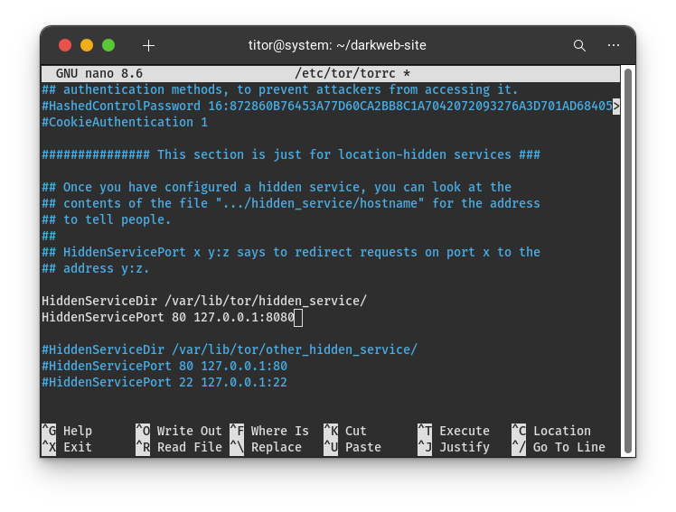
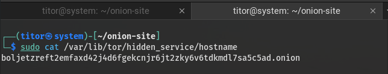
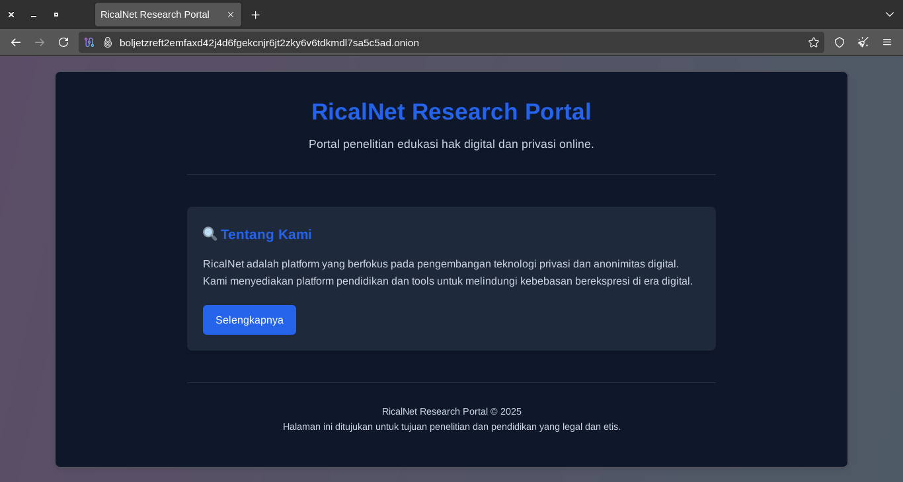

## Laporan Investigasi Teknis

> **Peringatan Keamanan**: Materi ini disusun semata untuk tujuan edukasi dan penelitian keamanan siber. Pembaca bertanggung jawab penuh atas implementasi etis dari pengetahuan ini.
{: .prompt-danger}

> Panduan ini ditujukan secara eksklusif untuk:
- **Aktivis HAM** yang bekerja di lingkungan represif dan membutuhkan komunikasi aman
- **Jurnalis** yang melindungi sumber dan komunikasi sensitif dari pengawasan
- **Peneliti Keamanan Siber** yang mempelajari teknologi privasi dan anonimitas
- **Individu yang peduli dengan privasi digital** dalam konteks hukum yang berlaku
{: .prompt-info}

### Latar Belakang Operasional
Jaringan Tor ([The Onion Router](https://www.torproject.org/about/history/)) menyediakan infrastruktur untuk layanan tersembunyi (`.onion`) yang menawarkan tingkat anonimitas tinggi melalui sistem routing berlapis. Panduan ini menyajikan metodologi untuk membangun platform `.onion` menggunakan distribusi Kali Linux.

---

## FASE 1: PENYIAPAN INFRASTRUKTUR DASAR

### 1.1. Pembaruan Sistem Operasi
```bash
sudo apt update && sudo apt upgrade -y
```
**Konteks Teknis**: Perintah ini memperbarui database paket dan meningkatkan semua aplikasi terinstal ke versi terbaru, memastikan kompatibilitas dan penutupan kerentanan keamanan.

### 1.2. Instalasi Paket Tor
```bash
sudo apt install tor -y
```
**Analisis Sistem**: Tor package menyediakan daemon yang diperlukan untuk routing onion dan layanan tersembunyi. Flag `-y` mengotomatisasi konfirmasi instalasi.

---

## FASE 2: KONFIGURASI LAYANAN TOR

### 2.1. Backup Konfigurasi Original
```bash
sudo cp /etc/tor/torrc /etc/tor/torrc.backup
```
**Strategi Keamanan**: Membuat cadangan konfigurasi original memungkinkan pemulihan cepat jika terjadi kesalahan konfigurasi.

### 2.2. Modifikasi File Konfigurasi
```bash
sudo nano /etc/tor/torrc
```
**Panduan Editor**: Gunakan tombol panah untuk navigasi, tambahkan konfigurasi pada section yang ditentukan, lalu simpan dengan `Ctrl+X → Y → Enter`.

### 2.3. Implementasi Hidden Service
Tambahkan konfigurasi berikut pada section yang sesuai:
```
HiddenServiceDir /var/lib/tor/hidden_service/
HiddenServicePort 80 127.0.0.1:8080
```


_torrc Configuration_

**Arsitektur Jaringan**: Konfigurasi ini mengarahkan traffic port 80 onion address ke port 8080 localhost, memungkinkan hosting web tanpa konfigurasi DNS.

---

## FASE 3: IMPLEMENTASI SISTEM KEAMANAN

### 3.1. Konfigurasi Permission Directory
```bash
sudo mkdir -p /var/lib/tor/hidden_service/
```
```bash
sudo chown -R debian-tor:debian-tor /var/lib/tor/hidden_service/
```
```bash
sudo chmod -R 700 /var/lib/tor/hidden_service/
```
**Privilege Management**: Pengaturan ownership dan permission ini membatasi akses hanya untuk user `debian-tor`, meningkatkan keamanan kriptografi onion service.

### 3.2. Restart dan Aktivasi Layanan
```bash
sudo systemctl restart tor
```
```bash
sudo systemctl enable tor
```
```bash
sudo systemctl status tor
```
**Manajemen Layanan**: Sequence ini me-restart daemon Tor, mengaktifkannya pada boot, dan memverifikasi status operasional.

---

## FASE 4: DEVELOPMENT PLATFORM WEB

### 4.1. Penyiapan Environment Development
```bash
mkdir ~/onion-site
```
```bash
cd ~/onion-site
```
```bash
nano index.html
```
**Struktur Projek**: Direktori khusus mengisolasi konten website dan memudahkan management versi.

### 4.2. Konten HTML Dasar
Implementasi kode HTML dengan consideration security headers dan minimal metadata:
```html
<!DOCTYPE html>
<html lang="id">
<head>
    <meta charset="UTF-8">
    <meta name="viewport" content="width=device-width, initial-scale=1.0">
    <title>Ricalnet Research Portal</title>
    <style>
        :root {
            --primary: #2563eb;
            --dark-bg: #0f172a;
            --card-bg: #1e293b;
            --text-primary: #f8fafc;
            --text-secondary: #cbd5e1;
        }
        
        * {
            margin: 0;
            padding: 0;
            box-sizing: border-box;
        }
        
        body {
            font-family: -apple-system, BlinkMacSystemFont, 'Segoe UI', Roboto, Oxygen, sans-serif;
            background-color: var(--dark-bg);
            color: var(--text-primary);
            line-height: 1.6;
            min-height: 100vh;
            padding: 2rem 1rem;
        }
        
        .container {
            max-width: 800px;
            margin: 0 auto;
        }
        
        header {
            text-align: center;
            margin-bottom: 3rem;
            padding-bottom: 2rem;
            border-bottom: 1px solid rgba(255, 255, 255, 0.1);
        }
        
        .logo {
            font-size: 2.2rem;
            font-weight: 700;
            margin-bottom: 0.5rem;
            color: var(--primary);
        }
        
        .tagline {
            color: var(--text-secondary);
            font-size: 1.1rem;
            max-width: 500px;
            margin: 0 auto;
        }
        
        .main-content {
            display: flex;
            flex-direction: column;
            gap: 1.5rem;
            margin-bottom: 3rem;
        }
        
        .card {
            background-color: var(--card-bg);
            border-radius: 8px;
            padding: 1.5rem;
            box-shadow: 0 4px 6px rgba(0, 0, 0, 0.1);
        }
        
        .card-title {
            font-size: 1.3rem;
            font-weight: 600;
            margin-bottom: 1rem;
            color: var(--primary);
            display: flex;
            align-items: center;
            gap: 0.5rem;
        }
        
        .card-content {
            color: var(--text-secondary);
            margin-bottom: 1.5rem;
        }
        
        .btn {
            display: inline-block;
            background-color: var(--primary);
            color: white;
            padding: 0.6rem 1.2rem;
            border-radius: 6px;
            text-decoration: none;
            font-weight: 500;
            transition: opacity 0.2s ease;
        }
        
        .btn:hover {
            opacity: 0.9;
        }
        
        footer {
            text-align: center;
            padding-top: 2rem;
            color: var(--text-secondary);
            font-size: 0.9rem;
            border-top: 1px solid rgba(255, 255, 255, 0.1);
        }
        
        @media (max-width: 640px) {
            body {
                padding: 1rem;
            }
            
            .logo {
                font-size: 1.8rem;
            }
            
            .tagline {
                font-size: 1rem;
            }
        }
    </style>
</head>
<body>
    <div class="container">
        <header>
            <div class="logo">Ricalnet Research Portal</div>
            <p class="tagline">Portal penelitian edukasi hak digital dan privasi online.</p>
        </header>
        
        <div class="main-content">
            <div class="card">
                <h2 class="card-title">🔍 Tentang Kami</h2>
                <p class="card-content">Ricalnet adalah platform yang berfokus pada pengembangan teknologi privasi dan anonimitas digital. Kami menyediakan platform pendidikan dan tools untuk melindungi kebebasan berekspresi di era digital.</p>
                <a href="https://ricalnet.github.io" class="btn">Selengkapnya</a>
            </div>
        </div>
        
        <footer>
            <p>Ricalnet Research Portal © 2025</p>
            <p>Halaman ini ditujukan untuk tujuan penelitian dan pendidikan yang legal dan etis.</p>
        </footer>
    </div>
</body>
</html>
```

---

## FASE 5: DEPLOYMENT DAN TESTING

### 5.1. Aktivasi Web Server
```bash
cd ~/onion-site
```
```bash
python3 -m http.server 8080
```
**Infrastruktur Serving**: Python HTTP server memberikan lightweight solution untuk testing tanpa overhead software kompleks.

### 5.2. Ekstraksi Onion Address
Buka terminal baru dan jalankan perintah berikut:
```bash
sudo cat /var/lib/tor/hidden_service/hostname
```


_Onion Address_

**Kriptografi Operasional**: Perintah ini menampilkan onion address yang di-generate secara otomatis oleh sistem kriptografi Tor.

### 5.3. Verifikasi Akses
Akses melalui Tor Browser dengan pattern:
```
http://[onion_address].onion
```
**Validation Protocol**: Success indicator berupa loading konten HTML yang telah disiapkan.


_Tor Browser_

---

## FASE 6: PROTOKOL KEAMANAN LANJUTAN

### 6.1. Hardening Server Headers
Implementasi custom Python script untuk menyembunyikan server signature:
```python
import http.server
import socketserver

class SecuredHTTPHandler(http.server.SimpleHTTPRequestHandler):
    def end_headers(self):
        self.send_header("Server", "Research Server")
        super().end_headers()

PORT = 8080
with socketserver.TCPServer(("", PORT), SecuredHTTPHandler) as httpd:
    httpd.serve_forever()
```

### 6.2. Network Security Configuration
```bash
sudo apt install ufw
sudo ufw enable
sudo ufw allow 22/tcp
sudo ufw deny 8080/tcp
```
**Firewall Strategy**: Membatasi akses eksternal sambil mempertahankan SSH access untuk management.

---

## ANALISIS RISIKO DAN MITIGASI

### Pertimbangan Operasional
1. Traffic analysis tetap memungkinkan oleh adversary dengan resources cukup
2. Konfigurasi default dapat mengungkapkan karakteristik sistem
3. Correlation attacks dapat membahayakan anonimitas

### Rekomendasi Keamanan
- Implementasi regular security updates
- Monitoring continuous terhadap log sistem
- Consideration menggunakan bridge relays untuk additional obscurity

---

## PENUTUP

Implementasi onion service memerlukan pemahaman mendalam tentang principles keamanan jaringan dan kriptografi. Platform yang dibangun dengan metodologi ini memberikan foundation untuk penelitian anonimitas digital yang bertanggung jawab.

> Teknologi ini tidak memberikan anonimitas mutlak. Lembaga penegak hukum yang berkualitas dapat melacak aktivitas ilegal bahkan di jaringan Tor.
{: .prompt-warning}

> **Disclaimer Legal**: Seluruh aktivitas harus mematuhi kerangka hukum yang berlaku dan standard etika penelitian keamanan siber.
{: .prompt-info}

---

*Panduan teknis ini disusun untuk tujuan edukasi dalam bidang keamanan siber dan penelitian jaringan anonim.*