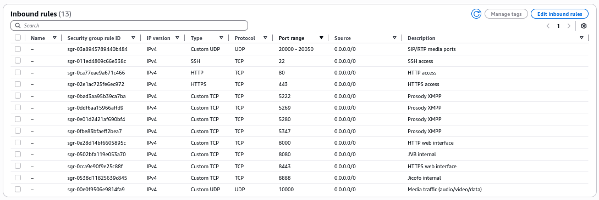

## 1. Pendahuluan

[WeeBeeTalk](https://ricaldocs.github.io/posts/weebeetalk/) merupakan arsitektur telekomunikasi hybrid berorientasi privasi yang dirancang khusus untuk memenuhi kebutuhan konferensi enterprise melalui integrasi tumpukan teknologi sumber terbuka. Solusi ini dikembangkan oleh [Risnanda Pascal](https://ricaldocs.github.io/posts/risnanda-pascal/) & [Gineng B. Pamungkas](https://astarajingga.github.io) sebagai respons terhadap tantangan kontemporer dalam komunikasi bisnis modern, terutama menyangkut kerahasiaan data, interoperabilitas sistem, dan kontrol infrastruktur mandiri.

Dalam konteks lingkungan korporat yang semakin terdigitalisasi, kebutuhan akan platform konferensi yang mampu menjamin keamanan end-to-end tanpa mengorbankan fungsionalitas menjadi krusial. Arsitektur hybrid [WeeBeeTalk](https://ricaldocs.github.io/posts/weebeetalk/) memadukan teknologi berbasis IP ([Rocket.Chat](https://www.rocket.chat/)), komunikasi real-time berbasis WebRTC ([Jitsi](https://jitsi.org/)), dan teleponi tradisional ([Asterisk](https://www.asterisk.org/)) dalam satu ekosistem terintegrasi. Pendekatan ini memungkinkan organisasi untuk:
1. Mempertahankan kedaulatan data melalui implementasi on-premise
2. Mengurangi ketergantungan pada penyedia layanan cloud pihak ketiga
3. Menerapkan kebijakan enkripsi dan otentikasi yang konsisten
4. Menjaga interoperabilitas dengan infrastruktur telekomunikasi yang sudah ada

Inti arsitektur ini terletak pada integrasi strategis tiga komponen utama:
- [Rocket.Chat](https://www.rocket.chat/) sebagai platform kolaborasi berbasis pesan instan
- [Jitsi Meet](https://jitsi.org/) sebagai engine konferensi video WebRTC
- [Asterisk](https://www.asterisk.org/) sebagai gateway teleponi berbasis IP-PBX


_Arsitektur WeeBeeTalk_

Implementasi [WeeBeeTalk](https://ricaldocs.github.io/posts/weebeetalk/) mengadopsi paradigma "privacy by design" dengan menerapkan enkripsi end-to-end pada semua lapisan komunikasi (data-at-rest dan data-in-transit), Role-Based Access Control (RBAC), serta mekanisme autentikasi multi-faktor.

## 2. Lingkungan Sistem dan Prasyarat
[WeeBeeTalk](https://ricaldocs.github.io/posts/weebeetalk/) diimplementasikan pada lingkungan sistem operasi [Debian GNU/Linux](https://www.debian.org/) (versi stabil terkini) sebagai platform dasar, dipilih karena stabilitas jangka panjang (LTS), ekosistem paket yang komprehensif, dan kompatibilitas optimal dengan tumpukan teknologi open-source yang digunakan. Implementasi ini mengasumsikan lingkungan server Debian minimal dengan konfigurasi berikut:

### 2.1. Spesifikasi Sistem Minimum
- **Sistem Operasi**: Debian 12 (Bookworm) x86_64
- **CPU**: 4 core (arsitektur x64)
- **RAM**: 8 GB
- **Storage**: 50 GB (SSD direkomendasikan)
- **Jaringan**: Alamat IP publik statis/DNS yang terkonfigurasi

### 2.2. Prasyarat Khusus Debian
```bash
sudo apt update && sudo apt upgrade -y && sudo apt autoremove -y
```

```bash
sudo apt install -y apt-transport-https ca-certificates gnupg2 curl software-properties-common
```

## 3. Konfigurasi Rocket.Chat via Docker
### 3.1 Mengambil Konfigurasi Docker Compose Rocket.Chat

Konfigurasi yang diperlukan untuk penerapan Rocket.Chat melalui Docker tersedia dalam repositori resmi `rocketchat-compose`{: .filepath}.

1.  Kloning repositori resmi `rocketchat-compose`{: .filepath} menggunakan Git dengan perintah berikut:
    ```bash
    git clone --depth 1 https://github.com/RocketChat/rocketchat-compose.git
    ```
    Opsi `--depth 1` digunakan untuk hanya mengunduh riwayat commit terakhir, sehingga proses lebih cepat.

2.  Masuk ke direktori yang telah dikloning:
    ```bash
    cd rocketchat-compose
    ```
    Direktori ini berisi berkas `compose.yml`{: .filepath}, `.env.example`{: .filepath}, serta berkas konfigurasi lain yang diperlukan untuk menyiapkan instansi Rocket.Chat.

3.  Salin berkas `.env.example`{: .filepath} untuk membuat berkas `.env`{: .filepath}:
    ```bash
    cp .env.example .env
    ```
    Berkas `.env`{: .filepath} ini digunakan untuk mendefinisikan konfigurasi penerapan, seperti versi Rocket.Chat, URL workspace, dan konfigurasi HTTPS opsional, tanpa perlu menyunting langsung berkas `compose.yml`{: .filepath}.

### 3.2 Mengonfigurasi Rocket.Chat

Sebelum meluncurkan workspace Rocket.Chat, beberapa variabel kunci harus dikonfigurasi dalam berkas `.env`{: .filepath}.

1.  Buka berkas `.env`{: .filepath} dengan editor teks pilihan Anda, misalnya:
    ```bash
    nano .env
    ```

2.  Atur variabel `RELEASE` ke versi Rocket.Chat yang diinginkan. Untuk lingkungan produksi, sangat disarankan untuk tidak menggunakan `latest` dan menentukan versi tertentu (contoh: `7.10.0`) untuk memastikan stabilitas.
    ```plaintext
    RELEASE=7.10.0
    ```
    > Versi tersedia dapat dilihat di [Rilis Rocket.Chat](https://github.com/RocketChat/Rocket.Chat/releases).
    {: .prompt-info}

### 3.3 Menjalankan Rocket.Chat

Setelah berkas `.env`{: .filepath} dikonfigurasi dan disimpan, siap untuk memulai workspace Rocket.Chat.

1.  Jalankan perintah berikut untuk mengunduh image Docker yang diperlukan dan memulai kontainer Rocket.Chat beserta layanan pendukungnya:
    ```bash
    docker compose -f compose.database.yml -f compose.monitoring.yml -f compose.traefik.yml -f compose.yml up -d
    ```

2.  Periksa status semua kontainer yang berjalan dengan perintah:
    ```bash
    docker ps
    ```

#### 3.4 Penyesuaian Penerapan

Penerapan dapat disesuaikan dengan hanya menyertakan layanan yang diperlukan. Sebagai contoh, jika pemantauan atau reverse proxy Traefik tidak digunakan, berkas `.yml`{: .filepath} terkait dapat dihilangkan dari perintah.

Contoh perintah tanpa pemantauan dan Traefik:
```bash
docker compose -f compose.database.yml -f compose.yml up -d
```

### 3.4 Mengakses Workspace Rocket.Chat

Setelah instance Rocket.Chat diterapkan, dapat diakses melalui browser.

*   Untuk pengujian lokal: Buka `http://localhost:3000`.
*   Untuk lingkungan produksi: Akses `ROOT_URL` yang telah dikonfigurasi di berkas `.env`{: .filepath} (contoh: `https://nama-domain.com`). 

## 4. Integrasi dengan WebRTC (Jitsi)

### 4.1 Langkah-langkah Instalasi

#### 4.1.1 Unduh dan Ekstrak Rilis Terbaru

> Jangan clone repository git. Untuk versi stabil, gunakan rilis resmi.
{: .prompt-warning}

```bash
wget $(wget -q -O - https://api.github.com/repos/jitsi/docker-jitsi-meet/releases/latest | grep zip | cut -d\" -f4)
```

Ekstrak paket yang telah diunduh:

```bash
unzip <nama-file>
```

#### 4.1.2 Konfigurasi Environment

Salin file environment contoh dan sesuaikan sesuai kebutuhan:

```bash
cp env.example .env
```

Generate password yang kuat untuk bagian keamanan:

```bash
./gen-passwords.sh
```

#### 4.1.3 Buat Direktori Konfigurasi

```bash
mkdir -p ~/.jitsi-meet-cfg/{web,transcripts,prosody/config,prosody/prosody-plugins-custom,jicofo,jvb,jigasi,jibri}
```

#### 4.1.4 Menjalankan Jitsi Meet

```bash
docker compose up -d
```

#### 4.1.5 Akses Antarmuka Web

Akses aplikasi melalui: `https://localhost:8443`

**Catatan Penting:**
- Port HTTPS default: 8443 (dapat diubah di file `.env`)
- HTTP tersedia pada port 8000 (default), namun hanya untuk setup reverse proxy
- Akses langsung via HTTP (bukan HTTPS) akan menyebabkan error WebRTC

### 4.2 Konfigurasi Tambahan

#### 4.2.1 PUBLIC_URL

> Untuk deployment production, atur variabel environment `PUBLIC_URL` dengan domain aktual tempat setup dijalankan.
{: .prompt-info}

#### 4.2.2 Integrasi Jigasi (SIP Gateway)

1. Konfigurasi kredensial SIP di file `.env`
2. Jalankan dengan perintah:

```bash
docker compose -f docker-compose.yml -f jigasi.yml up
```

#### 4.2.3 Integrasi Etherpad (Document Sharing)

1. Konfigurasi Etherpad di file `.env`
2. Jalankan dengan perintah:

```bash
docker compose -f docker-compose.yml -f etherpad.yml up
```

#### 4.2.4 Integrasi Jibri (Recording & Streaming)

1. Konfigurasi host sesuai panduan Jitsi Broadcasting Infrastructure
2. Jalankan dengan perintah:

```bash
docker compose -f docker-compose.yml -f jibri.yml up -d
```

#### 4.2.5 Dengan Jigasi dan Jibri:

```bash
docker compose -f docker-compose.yml -f jigasi.yml -f jibri.yml up -d
```

#### 4.2.6 Integrasi Transcriber

```bash
docker compose -f docker-compose.yml -f transcriber.yml up -d
```

#### 4.2.7 Semua Komponen Bersamaan:

```bash
docker compose -f docker-compose.yml -f transcriber.yml -f jigasi.yml -f jibri.yml up -d
```

#### 4.2.8 Log Analysis dengan Grafana

```bash
docker-compose -f docker-compose.yml -f log-analyser.yml -f grafana.yml up -d
```

### 4.3 Proses Update

Untuk memperbarui instalasi, unduh rilis terbaru:

```bash
wget $(wget -q -O - https://api.github.com/repos/jitsi/docker-jitsi-meet/releases/latest | grep zip | cut -d\" -f4)
```

Ekstrak dan timpa file yang ada:
```bash
unzip <nama-file>
```

### 4.4 Testing Development Builds

Untuk menguji versi development/unstable, clone repository:

```bash
git clone https://github.com/jitsi/docker-jitsi-meet && cd docker-jitsi-meet
```

**CATATAN:** 
- Kode di branch `master` dirancang untuk bekerja dengan image unstable
- Jangan gunakan dengan image rilis stabil
- Image unstable baru diupload setiap hari

Jalankan seperti biasa:
```bash
docker compose up
```
### 4.5 Troubleshooting

#### 4.5.1 Error Media Devices
Jika mengalami error:
- `Failed to access your microphone/camera`
- `Cannot read property 'getUserMedia' of undefined`
- `navigator.mediaDevices is undefined`

Pastikan mengakses via HTTPS, bukan HTTP.

#### 4.5.2 Security Group Rules



## 5. Integrasi dengan Asterisk
Lihat dokumentasi tentang [Membangun VoIP Server](https://ricaldocs.github.io/posts/membangun-voip-server/) menggunakan Asterisk.

## Pranala Luar
- [Deploy Rocket.Chat](https://docs.rocket.chat/docs/deploy-with-docker-docker-compose)
- [Asterisk Manager Interface AMI](https://docs.asterisk.org/Configuration/Interfaces/Asterisk-Manager-Interface-AMI/)
- [Jitsi Meet Handbook](https://jitsi.github.io/handbook/docs/intro)