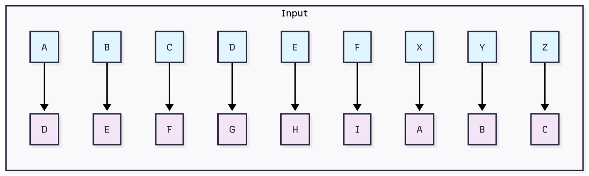
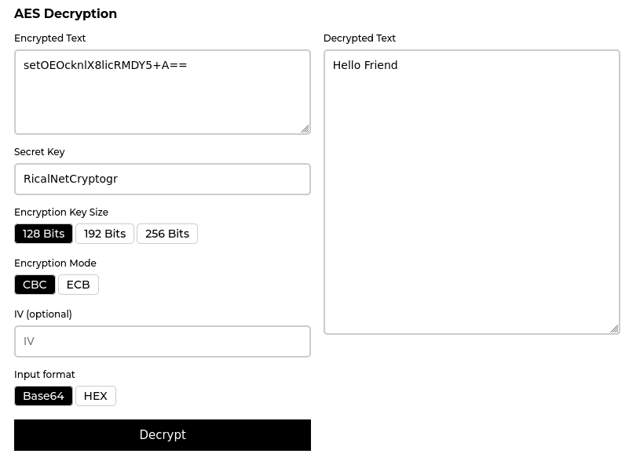

## Pendahuluan
Kriptografi merupakan disiplin ilmu yang mempelajari teknik pengamanan informasi melalui metode transformasi data. Dokumen ini menguraikan tiga konsep inti beserta analisis studi kasus:
1. [Encoding](#1-encoding): Transformasi data ke format berbeda yang bersifat reversibel
2. [Hashing vs. Enkripsi](#2-hashing-vs-enkripsi): Perbedaan fundamental antara fungsi unidirectional dan bidirectional
3. [Steganografi](#3-steganografi): Teknik penyembunyian data dalam media digital
4. [Studi Kasus Kriptografi](#4-studi-kasus-kriptografi-lanjutan): Analisis mendalam implementasi teknik kriptografi modern

## 1. Encoding
Encoding merupakan proses konversi data ke format spesifik menggunakan skema terstandarisasi yang memungkinkan rekonsiliasi data ke bentuk semula tanpa kehilangan informasi.

### Implementasi Metode

#### Caesar Cipher
Caesar Cipher merupakan algoritma kriptografi klasik yang melakukan substitusi karakter dengan pergeseran posisi tetap dalam alfabet. Metode ini bersifat reversibel dan menjadi landasan perkembangan kriptografi modern sejak digunakan Julius Caesar (~100 SM) untuk komunikasi militer Romawi.

Contoh implementasi pergeseran 3 posisi:



  1. Proses Enkripsi (Shift +3):
     ```bash
     echo "TEXT_ASLI" | tr 'A-Za-z' 'D-ZA-Cd-za-c'
     ```
     Contoh eksekusi:
     ```bash
     echo "cipher" | tr 'A-Za-z' 'D-ZA-Cd-za-c'
     # Output: flskhu
     ```

  2. Proses Dekripsi (Shift -3):
     ```bash
     echo "TEXT_ENKRIPSI" | tr 'D-ZA-Cd-za-c' 'A-Za-z'
     ```
     Contoh eksekusi:
     ```bash
     echo "flskhu" | tr 'D-ZA-Cd-za-c' 'A-Za-z'
     # Output: cipher
     ```

     > Proses transformasi ini hanya mengubah karakter alfabet (huruf A-Z dan a-z). Karakter lain seperti angka dan simbol akan dibiarkan apa adanya. Jika nilai pergeserannya adalah 26 atau lebih, maka nilainya akan "berputar" (wrap-around). Sebagai contoh, melakukan pergeseran sebesar 27 akan memberikan hasil yang sama dengan pergeseran sebesar 1.
     {: .prompt-info}

#### Base64 (Linux)
Base64 merupakan skema encoding biner-ke-teks yang mengkonversi data biner menjadi representasi ASCII menggunakan 64 karakter dasar, memungkinkan transmisi data melalui medium yang terbatas pada teks.

1. Encoding:
  ```bash
  echo "encoding" | base64  # Output: ZW5jb2RpbmcK
  ```

2. Decoding:
  ```bash
  echo "ZW5jb2RpbmcK" | base64 -d  # Output: encoding
  ```

## 2. Hashing vs. Enkripsi


*Representasi Visual Perbandingan Hashing dan Enkripsi*

### a. Hashing (Fungsi Unidirectional)
Proses transformasi plaintext menjadi nilai hash unik yang tidak dapat direkonsiliasi ke bentuk semula. Digunakan primarily untuk verifikasi integritas data.

- Contoh implementasi MD5:
  ```bash
  echo "teks" | md5sum  # Output: c71448894eaaadb0217e6d4e92b44ef7
  ```  
  
  > MD5 tidak direkomendasikan untuk aplikasi kriptografi modern due to vulnerability terhadap collision attacks.
  {: .prompt-warning}

### b. Enkripsi (Fungsi Bidirectional)
Proses konversi plaintext menjadi ciphertext menggunakan kriptografi kunci-simetris/asimetris, yang dapat dikembalikan ke bentuk semula dengan kunci dekripsi yang sesuai.

- Implementasi OpenSSL AES-256-CBC:
  1. Enkripsi
     ```bash
     echo "teks" | openssl aes-256-cbc -a -pass pass:changeme -pbkdf2
     # Output: U2FsdGVkX188ZcetEtbc5uRwnzPC0XyXccmRWxoWWYc=
     ```

  2. Dekripsi
     ```bash
     echo "U2FsdGVkX188ZcetEtbc5uRwnzPC0XyXccmRWxoWWYc=" | openssl aes-256-cbc -d -a -pass pass:changeme -pbkdf2
     # Output: teks
     ```  

  > **Parameter Konfigurasi**:  
  - `-a`: Mengaktifkan encoding/decode Base64
  - `-d`: Mode dekripsi
  - `-pass pass:<password>`: Spesifikasi passphrase untuk key derivation
  - `-pbkdf2`: Menggunakan Password-Based Key Derivation Function 2 (meningkatkan security melalui salted iteration)
  {: .prompt-info}  

## 3. Steganografi
Steganografi (Greek: steganos "tersembunyi" + graphein "menulis") merupakan praktik penyembunyian informasi dalam media digital carrier (gambar, audio, video) untuk mengaburkan eksistensi komunikasi rahasia. Berbeda dengan kriptografi yang fokus pada pengacakan konten, steganografi menitikberatkan pada penyamaran keberadaan pesan.

[Steghide](https://www.kali.org/tools/steghide/) merupakan software steganografi open-source berlisensi GPL yang didesain untuk embedding data dalam file gambar (JPEG, BMP) dan audio (WAV, AU). Menggunakan algoritma kompresi dan enkripsi opsional berbasis passphrase, Steghide memastikan:

### a. Instalasi Steghide
```bash
sudo apt update && sudo apt install -y steghide
```  

### b. Persiapan File
- Buat file teks payload (`touch pesan-rahasia.txt`)
- Siapkan carrier image format JPG/JPEG (`gambar.jpg`)

### c. Embedding Pesan
```bash
steghide embed -cf gambar.jpg -ef pesan-rahasia.txt
```  
>
- Sistem akan meminta input passphrase
- File output (`gambar.jpg`) kini mengandung embedded data
{: .prompt-info}

### d. Ekstraksi Pesan
```bash
steghide extract -sf gambar.jpg -xf pesan-ekstrak.txt
```  
>
- Diperlukan passphrase identik untuk proses dekripsi
- Payload terekonstruksi dalam `pesan-ekstrak.txt`
{: .prompt-info}

### e. Verifikasi Integritas
Lakukan komparasi checksum atau konten antara `pesan-rahasia.txt` dan `pesan-ekstrak.txt` untuk memvalidasi integritas data.

## 4. Studi Kasus Kriptografi Lanjutan

### 4.1. Analisis Caesar Cipher dengan Shift 3

#### Deskripsi
Studi kasus menerapkan Caesar Cipher dengan shift value 3 terhadap string "ricalnet" untuk menganalisis karakteristik algoritma substitusi klasik.

#### Implementasi Teknis
```bash
# Enkripsi
echo "ricalnet" | tr 'A-Za-z' 'D-ZA-Cd-za-c'
# Output: ulfdoqhw

# Dekripsi  
echo "ulfdoqhw" | tr 'D-ZA-Cd-za-c' 'A-Za-z'
# Output: ricalnet
```

#### Hasil dan Validasi
- **Plaintext**: ricalnet
- **Ciphertext**: ulfdoqhw
- **Verifikasi**: Proses dekripsi berhasil mengembalikan teks asli
- **Konfirmasi Integritas**: Round-trip encryption-decryption terverifikasi

### 4.2. Dekripsi AES dengan External Tool

#### Spesifikasi Input
Ciphertext AES dalam format Base64:
```
setOEOcknlX8licRMDY5+A==
```

#### Metodologi Dekripsi
Memanfaatkan layanan kriptografi [anycript.com](https://anycript.com/crypto) untuk proses dekripsi AES dengan asumsi pengetahuan sebelumnya mengenai key dan initialization vector.

#### Hasil Dekripsi
- **Plaintext Terdekripsi**: Hello Friend
- **Status Proses**: Dekripsi berhasil tanpa menimbulkan exception atau error
- **Validasi Output**: Format teks terbaca dan semantically correct
  

### 4.3. Analisis Integritas Data dengan SHA-256

#### Deskripsi Eksperimen
Membandingkan integritas dua file melalui perhitungan cryptographic hash function SHA-256. Variasi minimal pada konten file digunakan untuk mendemonstrasikan sifat avalanche effect.

#### Spesifikasi Data Uji
File `fbi.txt`:
```
"Ini merupakan data rahasia dari FBI, jaga keutuhan data ini!!!"
```

File `fbi_modified.txt`:
```
"Ini merupakan data rahasia dari FBI, jaga keutuhan data ini!!!!"
```

#### Implementasi Hash Computation
```bash
# Original file hash calculation
echo "Hash asli: $(sha256sum fbi.txt)"
# Output: 2b912f3d7005165f0cf2812637ce67f636271c3f28961936e562217c0781bc2a

# Modified file hash calculation  
echo "Hash modified: $(sha256sum fbi_modified.txt)"
# Output: 6ad620719d659d91b87a8226a27b38bbf82500dd5e72c0bb65b9dc00e1688898
```

#### Analisis Kriptografi
Perubahan satu karakter tambahan ('!') menghasilkan perbedaan hash yang completely divergent, membuktikan properti avalanche effect pada algoritma SHA-256. Sensitivitas tinggi terhadap perubahan data menjadikan SHA-256 optimal untuk aplikasi verifikasi integritas digital.

### 4.4. Custom Caesar Cipher Decoder

#### Spesifikasi Algoritma
Dikembangkan decoder khusus untuk Caesar Cipher dengan parameter:
- Ciphertext: "Bjqhtrj Mtrj"
- Shift value: 5 (dekripsi)
- Direction: Left shift untuk dekripsi

#### Implementasi Python
```bash
echo "Bjqhtrj Mtrj" | python3 -c "
cipher = input().strip()
result = ''
for char in cipher:
    if char.isalpha():
        if char.islower():
            result += chr((ord(char) - ord('a') - 5) % 26 + ord('a'))
        else:
            result += chr((ord(char) - ord('A') - 5) % 26 + ord('A'))
    else:
        result += char
print(f'Cipher: {cipher}')
print(f'Plain: {result}')
"
```

> Ubah `-5` menjadi `+5` untuk melakukan enkripsi.
{: .prompt-tip}

#### Hasil Dekripsi
- **Ciphertext Input**: Bjqhtrj Mtrj
- **Plaintext Output**: Welcome Home

## 5. Kesimpulan Umum

Studi komparatif ini berhasil mendemonstrasikan:

1. **Caesar Cipher** efektif untuk enkripsi sederhana dengan kompleksitas rendah namun rentan terhadap brute-force attack
2. **AES-256-CBC** memberikan keamanan tinggi untuk aplikasi modern dengan properti cryptographic yang kuat
3. **SHA-256** menunjukkan sensitivitas optimal untuk deteksi perubahan data melalui avalanche effect
4. **Steganografi dengan Steghide** efektif untuk penyembunyian data tanpa menimbulkan kecurigaan
5. **Custom Implementation** membuktikan fleksibilitas dalam mengembangkan solusi kriptografi spesifik

Semua metode mengkonfirmasi prinsip dasar kriptografi modern dan dapat diimplementasikan dalam berbagai skenario keamanan data sesuai requirement yang dibutuhkan. Pemilihan teknik yang tepat bergantung pada trade-off antara keamanan, kinerja, dan kompleksitas implementasi.

## Pranala Luar
- [Quantum Hasher](https://ricalnet.github.io/apps/QuantumHasher/index.html)