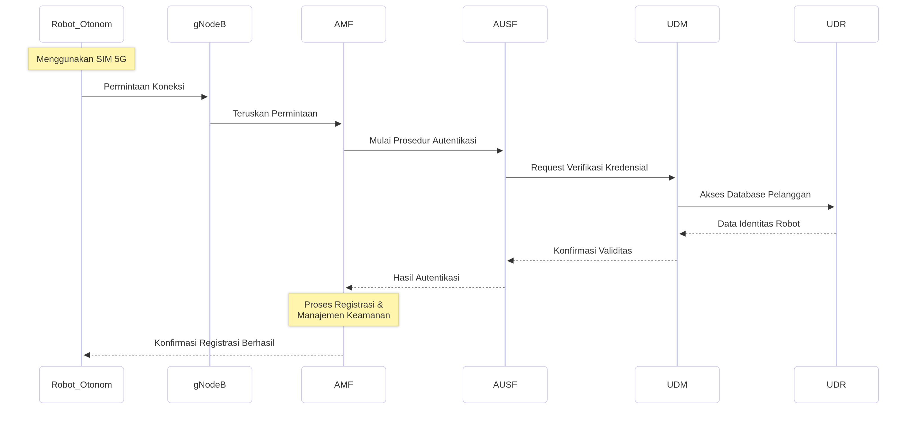
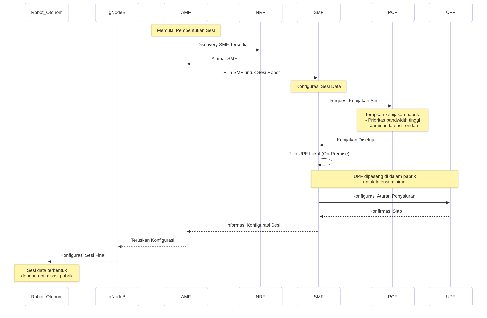
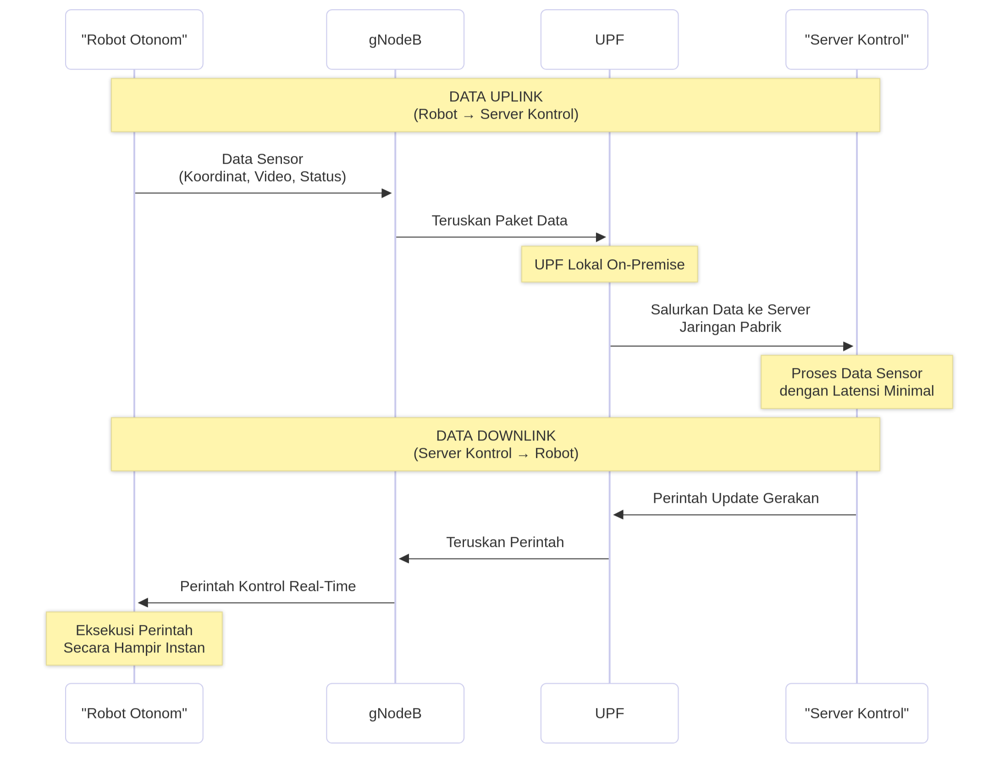
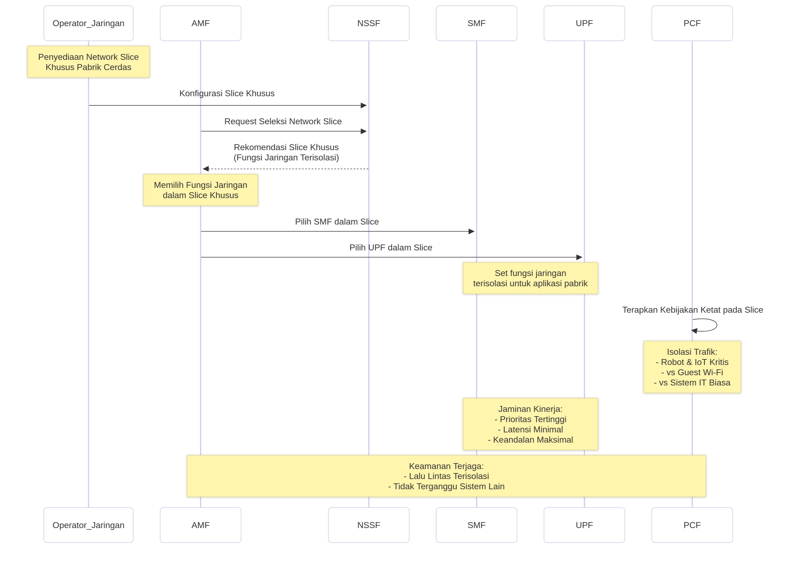
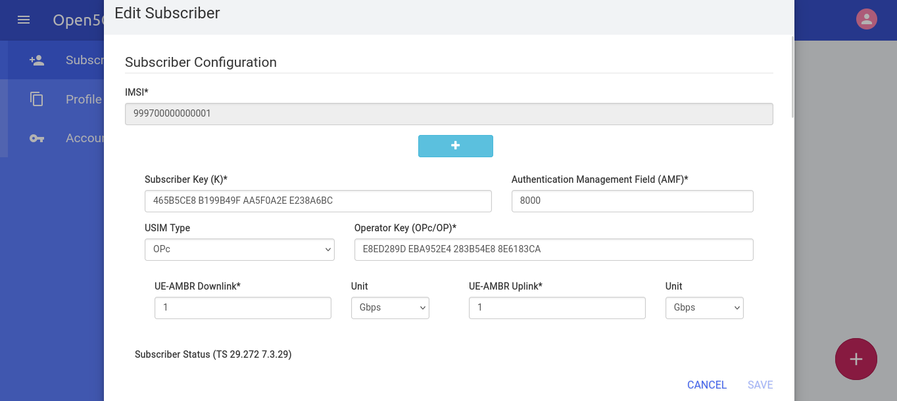
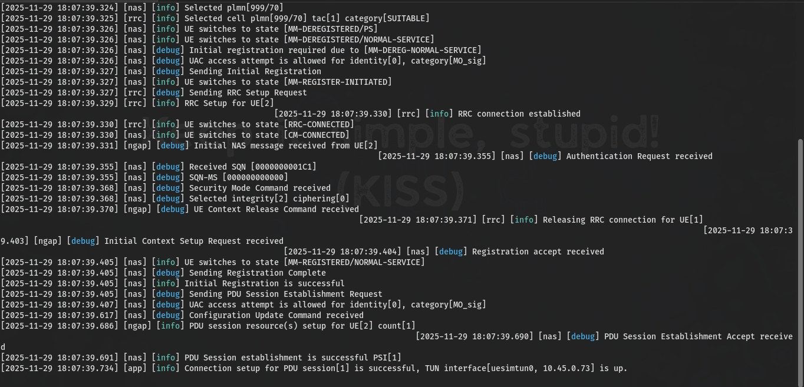
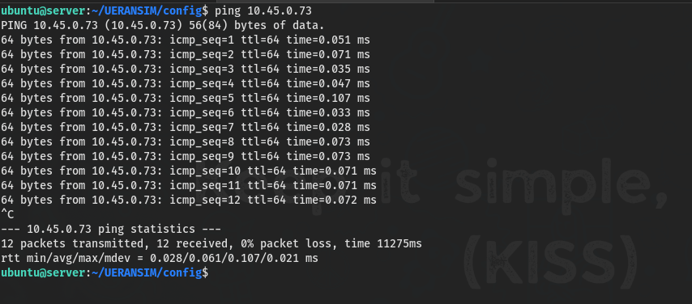

## Daftar Isi
- [Pengantar](https://ricaldocs.github.io/posts/open5gs-and-ueransim/#pengantar)
- [Contoh Penggunaan Jaringan 5G Standalone (SA) Core di Smart Factory](https://ricaldocs.github.io/posts/open5gs-and-ueransim/#contoh-penggunaan-jaringan-5g-standalone-sa-core-di-smart-factory)
- [Panduan Open5GS dan UERANSIM untuk Jaringan 5G Standalone](https://ricaldocs.github.io/posts/open5gs-and-ueransim/#panduan-open5gs-dan-ueransim-untuk-jaringan-5g-standalone)
- [Pranala Luar](https://ricaldocs.github.io/posts/open5gs-and-ueransim/#pranala-luar)

## Pengantar

Open5GS adalah sebuah implementasi open source dari inti jaringan (core network) 4G EPC (Evolved Packet Core) dan 5G NGC (Next Generation Core). Perangkat lunak ini terdiri dari serangkaian komponen perangkat lunak dan fungsi jaringan yang mengimplementasikan fungsi inti untuk 4G, 5G dalam mode NSA (Non-Standalone), dan 5G dalam mode SA (Standalone).


_Open5GS CUPS_

### Core 4G / 5G NSA

Core 4G/5G NSA Open5GS mengandung komponen-komponen berikut:

*   **MME** (Mobility Management Entity)
*   **HSS** (Home Subscriber Server)
*   **PCRF** (Policy and Charging Rules Function)
*   **SGWC** (Serving Gateway Control Plane)
*   **SGWU** (Serving Gateway User Plane)
*   **PGWC/SMF** (Packet Gateway Control Plane / komponen yang terkandung dalam SMF Open5GS)
*   **PGWU/UPF** (Packet Gateway User Plane / komponen yang terkandung dalam UPF Open5GS)

Core ini memiliki dua bidang utama: control plane (bidang kendali) dan user plane (bidang pengguna). Keduanya dipisahkan secara fisik dalam Open5GS karena mengimplementasikan CUPS (Control and User Plane Separation).

#### Control Plane (Bidang Kendali)

*   **MME** berperan sebagai pusat kendali utama dari core. Fungsi utamanya adalah mengelola sesi, mobilitas, paging, dan bearer. MME terhubung ke:
    *   **HSS**, yang menghasilkan vektor autentikasi SIM dan menyimpan profil pelanggan.
    *   **SGWC** dan **PGWC/SMF**, yang merupakan bidang kendali dari server gateway.
*   Semua eNB (E-UTRAN NodeB atau stasiun basis 4G) dalam jaringan bergerak terhubung ke MME.
*   **PCRF** merupakan elemen akhir dari control plane yang berada di antara PGWC/SMF dan HSS. Fungsinya adalah menangani penagihan (charging) dan menerapkan kebijakan (policy) pelanggan.

#### User Plane (Bidang Pengguna)

*   User plane membawa paket data pengguna antara eNB/gNB NSA (stasiun basis 5G NSA) dan WAN eksternal.
*   Dua komponen inti pada user plane adalah **SGWU** dan **PGWU/UPF**. Masing-masing komponen terhubung kembali ke rekan control plane-nya.
*   eNB/gNB NSA terhubung ke SGWU, yang kemudian terhubung ke PGWU/UPF, dan seterusnya ke WAN.
*   Pemisahan fisik antara control dan user plane memungkinkan penerapan beberapa server user plane di lapangan (misalnya, di lokasi dengan koneksi Internet berkecepatan tinggi) sambil menjaga fungsi kendali tetap terpusat. Hal ini mendukung penggunaan kasus seperti MEC (Multi-access Edge Computing).

Setiap komponen Open5GS ini memiliki berkas konfigurasi. Setiap berkas konfigurasi berisi alamat IP/interface lokal yang digunakan komponen untuk binding dan alamat IP/nama DNS dari komponen lain yang perlu dihubungi.

### Core 5G SA

Core 5G SA Open5GS mengandung fungsi-fungsi berikut berdasarkan arsitektur 3GPP:


_The 5GS Architecture_

*   **NRF** (NF Repository Function)
*   **SCP** (Service Communication Proxy)
*   **SEPP** (Security Edge Protection Proxy)
*   **AMF** (Access and Mobility Management Function)
*   **SMF** (Session Management Function)
*   **UPF** (User Plane Function)
*   **AUSF** (Authentication Server Function)
*   **UDM** (Unified Data Management)
*   **UDR** (Unified Data Repository)
*   **PCF** (Policy and Charging Function)
*   **NSSF** (Network Slice Selection Function)
*   **BSF** (Binding Support Function)

Core 5G SA bekerja dengan cara yang berbeda dari inti 4G—ia menggunakan SBA (Service Based Architecture).

#### Service-Based Architecture (SBA)

*   Fungsi-fungsi control plane dikonfigurasi untuk mendaftar ke **NRF**. NRF kemudian membantu mereka menemukan (discover) fungsi inti lainnya.
*   **AMF** menangani manajemen koneksi dan mobilitas (sebagian dari tugas MME 4G). gNB (stasiun basis 5G) terhubung ke AMF.
*   **UDM**, **AUSF**, dan **UDR** melakukan operasi yang mirip dengan HSS 4G, yaitu menghasilkan vektor autentikasi SIM dan menyimpan profil pelanggan.
*   Manajemen sesi sepenuhnya ditangani oleh **SMF** (sebelumnya menjadi tanggung jawab MME/SGWC/PGWC 4G).
*   **NSSF** menyediakan mekanisme untuk memilih network slice.
*   **PCF** digunakan untuk penagihan dan penerapan kebijakan pelanggan.
*   **SEPP** merupakan bagian dari arsitektur keamanan roaming.
*   **SCP** memungkinkan komunikasi tidak langsung antar fungsi jaringan.

#### User Plane 5G SA

*   User plane pada core 5G SA jauh lebih sederhana karena hanya terdiri dari satu fungsi, yaitu **UPF**.
*   UPF membawa paket data pengguna antara gNB dan WAN eksternal. UPF juga terhubung kembali ke SMF.

Dengan pengecualian SMF dan UPF, semua berkas konfigurasi untuk fungsi core 5G SA hanya berisi alamat IP/interface lokal untuk binding dan alamat IP/nama DNS dari NRF.


## Contoh Penggunaan Jaringan 5G Standalone (SA) Core di Smart Factory

### Gambaran Umum

Sebuah pabrik manufaktur cerdas (smart factory) menerapkan jaringan 5G Standalone (SA) untuk menghubungkan ratusan perangkat Internet of Things (IoT), robot otonom, dan sistem real-time. Penerapan ini memanfaatkan keunggulan core 5G SA, seperti **latensi sangat rendah (<10ms)**, **keandalan tinggi (99.999%)**, dan **network slicing**.

### Arsitektur dan Alur Komunikasi

#### 1. Registrasi dan Autentikasi Awal



*   Robot Otonom (dengan SIM 5G) → **gNodeB** (Stasiun Basis 5G)
*   **gNodeB** menerima permintaan koneksi dan meneruskannya ke **AMF** (Access and Mobility Management Function).
*   **AMF** memulai prosedur autentikasi dengan menghubungi **AUSF** (Authentication Server Function).
*   **AUSF** bekerja sama dengan **UDM** (Unified Data Management) yang mengakses database pelanggan di **UDR** (Unified Data Repository) untuk memverifikasi identitas dan kredensial robot.
*   Setelah terautentikasi, **AMF** mengelola proses registrasi dan keamanan untuk robot.

#### 2. Pembentukan Sesi Data



*   **AMF** memilih **SMF** (Session Management Function) yang sesuai untuk mengelola sesi data robot. **AMF** menemukan alamat **SMF** yang tersedia melalui **NRF** (NF Repository Function).
*   **SMF** yang terpilih kemudian:
    *   Berkomunikasi dengan **PCF** (Policy Control Function) untuk menerapkan kebijakan khusus pabrik, seperti prioritas bandwidth tinggi dan jaminan latensi untuk lalu lintas robot.
    *   Memilih **UPF** (User Plane Function) yang sesuai. Dalam skenario ini, **UPF** dipasang secara lokal (on-premise) di dalam pabrik untuk memastikan data diproses dengan latensi serendah mungkin dan tidak perlu keluar ke internet publik.
    *   Mengonfigurasi **UPF** dengan aturan penyaluran (forwarding rules) untuk sesi robot.
*   **SMF** mengirimkan informasi konfigurasi sesi akhir kembali ke perangkat (melalui **AMF** dan **gNodeB**).

#### 3. Pertukaran Data Real-Time



*   **Data Uplink (Dari Robot ke Server Kontrol):**
    *   Robot mengirimkan data sensor (misalnya, koordinat, video umpan kamera, status sistem) ke **gNodeB**.
    *   **gNodeB** meneruskan paket data tersebut ke **UPF** lokal yang telah dikonfigurasi.
    *   **UPF** langsung menyalurkan data ke server aplikasi kontrol yang juga berada di dalam jaringan pabrik, meminimalkan latensi.

*   **Data Downlink (Perintah ke Robot):**
    *   Server kontrol mengirimkan perintah update gerakan baru ke **UPF**.
    *   **UPF** meneruskan perintah ini melalui **gNodeB** kepada robot secara hampir instan.

#### 4. Network Slicing untuk Isolasi dan Kinerja



*   Operator jaringan menyediakan **Network Slice** khusus untuk aplikasi pabrik cerdas.
*   **NSSF** (Network Slice Selection Function) membantu **AMF** dalam memilih set fungsi jaringan (seperti **SMF**, **UPF**) yang merupakan bagian dari slice khusus ini.
*   **PCF** menerapkan kebijakan yang ketat pada slice ini. Lalu lintas robot dan perangkat IoT kritis lainnya diisolasi sepenuhnya dari lalu lintas guest Wi-Fi karyawan atau sistem IT biasa, menjamin kinerja, keamanan, dan keandalan yang tidak terganggu.

### Manfaat yang Diperoleh dari 5G SA Core

1.  **Latensi Ultra-Rendah:** Komunikasi real-time antara robot dan sistem kontrol dimungkinkan oleh lokalisasi **UPF** dan efisiensi protokol 5G, memungkinkan koordinasi robot yang aman dan presisi.
2.  **Keandalan Tinggi:** Arsitektur berbasis layanan (SBA) dan mekanisme redundansi dalam inti 5G SA memastikan koneksi yang stabil dan hampir tanpa downtime.
3.  **Fleksibilitas dan Optimasi:** Network slicing memungkinkan pabrik untuk menjalankan berbagai layanan (IoT, robotika, video monitoring berkualitas tinggi) pada infrastruktur fisik yang sama, masing-masing dengan karakteristik kinerja yang dijamin dan terisolasi.
4.  **Keamanan:** Autentikasi yang kuat oleh **AUSF**/**UDM** dan isolasi *slice* melindungi sistem operasi kritis dari ancaman eksternal dan internal.

## Panduan Open5GS dan UERANSIM untuk Jaringan 5G Standalone

### Prasyarat Sistem
Sebelum melakukan instalasi, pastikan sistem memenuhi persyaratan berikut:
- Ubuntu 22.04 LTS (Jammy Jellyfish)
- Akses pengguna dengan hak istimewa `sudo`
- Koneksi internet yang stabil untuk mengunduh paket dan dependensi
- Sumber Daya Hardware:
  - Memori RAM minimal 4 GB (8 GB atau lebih sangat disarankan)
  - Ruang penyimpanan disk minimal 10 GB

### Instalasi MongoDB
MongoDB berfungsi sebagai basis data untuk menyimpan informasi pelanggan (subscriber), data sesi, dan informasi manajemen jaringan lainnya dalam core Open5GS.

1. Perbarui indeks paket dan instal alat manajemen kunci GPG:
   ```bash
   sudo apt update && sudo apt install -y gnupg
   ```

2. Impor kunci GPG repositori MongoDB resmi:
   ```bash
   curl -fsSL https://pgp.mongodb.com/server-8.0.asc | sudo gpg -o /usr/share/keyrings/mongodb-server-8.0.gpg --dearmor
   ```

3. Tambahkan repositori MongoDB ke sumber APT:
   ```bash
   echo "deb [ arch=amd64,arm64 signed-by=/usr/share/keyrings/mongodb-server-8.0.gpg] https://repo.mongodb.org/apt/ubuntu jammy/mongodb-org/8.0 multiverse" | sudo tee /etc/apt/sources.list.d/mongodb-org-8.0.list
   ```

4. Instal MongoDB dan mulai layanannya:
   ```bash
   sudo apt update && sudo apt install -y mongodb-org
   sudo systemctl start mongod
   sudo systemctl enable mongod
   sudo systemctl status mongod
   ```

### Instalasi Open5GS
Open5GS menyediakan implementasi komponen 5G Core Network (5GC) sesuai standar 3GPP, termasuk Access and Mobility Management Function (AMF), Session Management Function (SMF), Unified Data Management (UDM), dan Authentication Server Function (AUSF).

1. Tambahkan repositori paket Open5GS:
   ```bash
   sudo add-apt-repository ppa:open5gs/latest
   ```

2. Instal paket Open5GS:
   ```bash
   sudo apt update && sudo apt install -y open5gs
   ```

3. Verifikasi status semua layanan Open5GS:
   ```bash
   sudo service open5gs-* status
   ```

### Instalasi WebUI Open5GS
Web-based User Interface (WebUI) menyediakan antarmuka grafis untuk mengelola pelanggan, melacak sesi, dan memantau kesehatan serta kinerja jaringan.

1. Perbarui sistem dan instal dependensi yang diperlukan:
   ```bash
   sudo apt update && sudo apt install -y ca-certificates curl gnupg
   ```

2. Buat direktori untuk kunci APT:
   ```bash
   sudo mkdir -p /etc/apt/keyrings
   ```

3. Impor kunci GPG dari NodeSource:
   ```bash
   curl -fsSL https://deb.nodesource.com/gpgkey/nodesource-repo.gpg.key | sudo gpg --dearmor -o /etc/apt/keyrings/nodesource.gpg
   ```

4. Tambahkan repositori Node.js:
   ```bash
   NODE_MAJOR=20
   echo "deb [signed-by=/etc/apt/keyrings/nodesource.gpg] https://deb.nodesource.com/node_$NODE_MAJOR.x nodistro main" | sudo tee /etc/apt/sources.list.d/nodesource.list
   ```

5. Instal Node.js dan Open5GS WebUI:
   ```bash
   sudo apt update && sudo apt install nodejs -y
   ```
   ```bash
   curl -fsSL https://open5gs.org/open5gs/assets/webui/install | sudo -E bash -
   ```

   > Akses WebUI: Buka `http://localhost:9999` di browser. Masuk menggunakan kredensial bawaan:
   - Nama Pengguna: `admin`
   - Kata Sandi: `1423`
   {: .prompt-tip}

### Instalasi UERANSIM
UERANSIM (UE & RAN Simulator) mensimulasikan gNodeB (stasiun basis 5G) dan User Equipment (perangkat pengguna) untuk keperluan pengujian dan validasi jaringan.

1. Instal dependensi kompilasi dan protokol SCTP:
   ```bash
   sudo apt install -y make gcc g++ libsctp-dev lksctp-tools iproute2 git
   ```

2. Instal CMake melalui Snap:
   ```bash
   sudo snap install cmake --classic
   ```

3. Clone repositori UERANSIM dan kompilasi:
   ```bash
   git clone https://github.com/aligungr/UERANSIM && cd UERANSIM
   ```
   ```bash
   make
   ```

4. Jalankan gNB untuk pengujian konfigurasi dasar:
   ```bash
   cd config
   ```
   ```bash
   ../build/nr-gnb -c open5gs-gnb.yaml
   ```

   Keluaran yang Diharapkan:
   ```
   UERANSIM v3.2.7
   [sctp] [info] Trying to establish SCTP connection... (127.0.0.5:38412)
   [sctp] [info] SCTP connection established (127.0.0.5:38412)
   [sctp] [debug] SCTP association setup ascId[9]
   [ngap] [debug] Sending NG Setup Request
   [ngap] [debug] NG Setup Response received
   [ngap] [info] NG Setup procedure is successful
   ```

### Konfigurasi SCTP & NGAP

#### Konfigurasi AMF
Stream Control Transmission Protocol (SCTP) dan Next Generation Application Protocol (NGAP) adalah protokol inti yang digunakan untuk komunikasi antara gNB dan AMF.

1. Edit berkas konfigurasi AMF:
   ```bash
   sudo nano /etc/open5gs/amf.yaml
   ```

2. Pastikan parameter berikut dalam konfigurasi AMF sesuai dengan konfigurasi gNB:
   - Alamat IP untuk mendengarkan koneksi N2
   - Kode Mobile Country Code (MCC) dan Mobile Network Code (MNC)
   - Tracking Area Code (TAC)

#### Konfigurasi gNB
Buat dan sesuaikan berkas konfigurasi untuk gNB simulasi.

1. Salin dan buat konfigurasi gNB baru:
   ```bash
   cp open5gs-gnb.yaml gnb1.yaml
   ```
   ```bash
   nano gnb1.yaml
   ```

2. Parameter konfigurasi gNB yang penting:

   ```yaml
   mcc: '999'            # Mobile Country Code value
   mnc: '70'             # Mobile Network Code value (2 or 3 digits)

   nci: '0x000000010'    # NR Cell Identity (36-bit)
   idLength: 32          # NR gNB ID length in bits [22...32]
   tac: 1                # Tracking Area Code

   linkIp: 127.0.0.101   # gNB's local IP address for Radio Link Simulation (Usually same with local IP)
   ngapIp: 127.0.0.100   # gNB's local IP address for N2 Interface (Usually same with local IP)
   gtpIp: 127.0.0.200    # gNB's local IP address for N3 Interface (Usually same with local IP)

   # List of AMF address information
   amfConfigs:
     - address: 127.0.0.5
       port: 38412

   # List of supported S-NSSAIs by this gNB
   slices:
     - sst: 1

   # Indicates whether or not SCTP stream number errors should be ignored.
   ignoreStreamIds: true
   ```

#### Konfigurasi UE
Buat dan sesuaikan berkas konfigurasi untuk UE (User Equipment) simulasi.

1. Salin dan buat konfigurasi UE baru:
   ```bash
   cp open5gs-ue.yaml ue1.yaml
   ```
   ```bash
   nano ue1.yaml
   ```

2. Parameter konfigurasi UE yang penting:
   
   ```yaml
   # IMSI number of the UE. IMSI = [MCC|MNC|MSISDN] (In total 15 digits)
   supi: 'imsi-999700000000001'
   # Mobile Country Code value of HPLMN
   mcc: '999'
   # Mobile Network Code value of HPLMN (2 or 3 digits)
   mnc: '70'
   # SUCI Protection Scheme : 0 for Null-scheme, 1 for Profile A and 2 for Profile B
   protectionScheme: 0
   # Home Network Public Key for protecting with SUCI Profile A
   homeNetworkPublicKey: '5a8d38864820197c3394b92613b20b91633cbd897119273bf8e4a6f4eec0a650'
   # Home Network Public Key ID for protecting with SUCI Profile A
   homeNetworkPublicKeyId: 1
   # Routing Indicator
   routingIndicator: '0000'

   # Permanent subscription key
   key: '465B5CE8B199B49FAA5F0A2EE238A6BC'
   # Operator code (OP or OPC) of the UE
   op: 'E8ED289DEBA952E4283B54E88E6183CA'
   # This value specifies the OP type and it can be either 'OP' or 'OPC'
   opType: 'OPC'
   # Authentication Management Field (AMF) value
   amf: '8000'
   # IMEI number of the device. It is used if no SUPI is provided
   imei: '356938035643803'
   # IMEISV number of the device. It is used if no SUPI and IMEI is provided
   imeiSv: '4370816125816151'

   # Network mask used for the UE's TUN interface to define the subnet size  
   tunNetmask: '255.255.255.0'

   # List of gNB IP addresses for Radio Link Simulation
   gnbSearchList:
     - 127.0.0.101

   # UAC Access Identities Configuration
   uacAic:
     mps: false
     mcs: false

   # UAC Access Control Class
   uacAcc:
     normalClass: 0
     class11: false
     class12: false
     class13: false
     class14: false
     class15: false

   # Initial PDU sessions to be established
   sessions:
     - type: 'IPv4'
       apn: 'internet'
       slice:
         sst: 1

   # Configured NSSAI for this UE by HPLMN
   configured-nssai:
     - sst: 1

   # Default Configured NSSAI for this UE
   default-nssai:
     - sst: 1
       sd: 1

   # Supported integrity algorithms by this UE
   integrity:
     IA1: true
     IA2: true
     IA3: true

   # Supported encryption algorithms by this UE
   ciphering:
     EA1: true
     EA2: true
     EA3: true

   # Integrity protection maximum data rate for user plane
   integrityMaxRate:
     uplink: 'full'
     downlink: 'full'
   ```

### Konfigurasi RRC dengan UERANSIM dan Open5GS

1. Verifikasi konsistensi konfigurasi gNB dan UE:
   ```bash
   cat ~/UERANSIM/config/gnb1.yaml | grep -E "mcc|mnc|tac"
   cat ~/UERANSIM/config/ue1.yaml | grep -E "mcc|mnc"
   ```

2. Verifikasi alamat IP:
   ```bash
   cat ~/UERANSIM/config/gnb1.yaml | grep -E "linkIp|ngapIp"
   cat ~/UERANSIM/config/ue1.yaml | grep "gnbSearchList"
   ```

3. Tambahkan data subscriber ke Open5GS via WebUI:
   - Akses `http://localhost:9999`
   - Masuk dengan kredensial `admin` / `1423`
   - Tambahkan subscriber baru dengan data IMSI, Kunci (K), OPc, dan AMF yang sesuai dengan konfigurasi `ue1.yaml`.
   - Pastikan slice (SST) yang dikonfigurasi untuk subscriber sesuai dengan yang didefinisikan dalam konfigurasi gNB dan UE.
   
   _Antarmuka untuk mengedit data subscriber pada Open5GS WebUI_

   > 
   1. Pastikan MCC, MNC, dan TAC pada konfigurasi gNB dan UE identik dengan yang dikonfigurasi di Open5GS core.
   2. Pastikan alamat IP yang dikonfigurasi pada gNB (`linkIp`, `ngapIp`) dapat dijangkau oleh UE dan AMF.
   3. Pastikan data autentikasi subscriber (IMSI, K, OPc, AMF) yang dimasukkan di WebUI sama persis dengan yang ada di berkas konfigurasi UE.
   {: .prompt-info}

### Menjalankan dan Menguji Jaringan

1. Buat skrip otomatis untuk menjalankan seluruh jaringan:
   ```bash
   nano start_5g.sh
   ```

   Isi skrip:
   ```bash
   #!/bin/bash
   echo "Memulai layanan Open5GS..."
   sudo systemctl start open5gs-amfd open5gs-smfd open5gs-udmd open5gs-ausfd open5gs-upfd
   echo "Menunggu layanan untuk dimulai..."
   sleep 3
   echo "Memulai gNB..."
   cd ~/UERANSIM
   ./build/nr-gnb -c config/gnb1.yaml &
   echo "Menunggu gNB untuk terhubung..."
   sleep 5
   echo "Memulai UE..."
   sudo ./build/nr-ue -c config/ue1.yaml
   ```

2. Beri izin eksekusi dan jalankan skrip:
   ```bash
   chmod +x start_5g.sh
   ```
   ```bash
   ./start_5g.sh
   ```

3. Verifikasi:
   - Pantau terminal untuk melihat proses inisialisasi, attachment UE, dan pembentukan sesi PDU.
     

     

   - Di WebUI, periksa status subscriber dan data sesi yang aktif.

## Pranala Luar
- [5G System Overview](https://www.3gpp.org/technologies/5g-system-overview)
- [Open5GS: Quickstart](https://open5gs.org/open5gs/docs/guide/01-quickstart/)