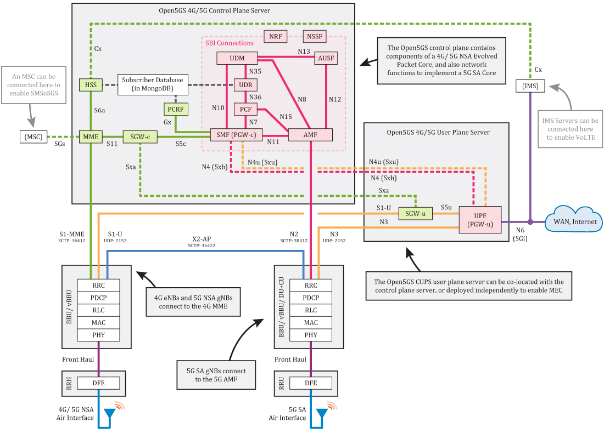
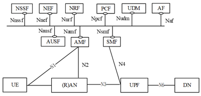
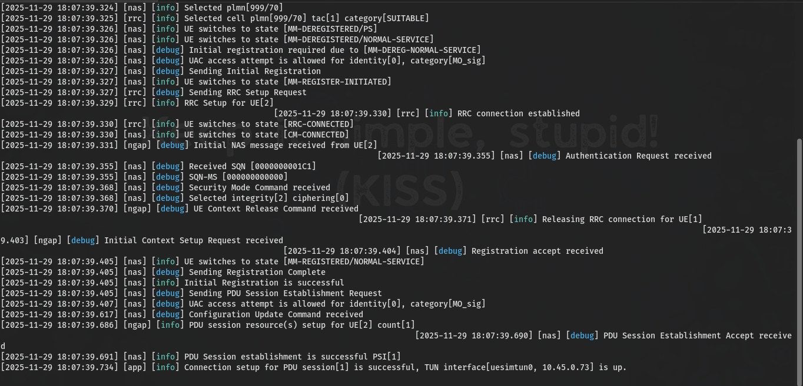
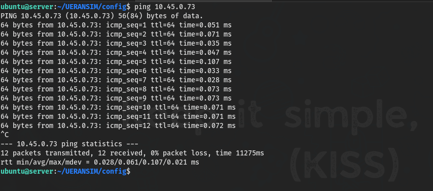

## Pengantar

Open5GS adalah implementasi open source dari inti jaringan (core network) 4G EPC dan 5G NGC. Software ini terdiri dari komponen-komponen yang mengimplementasikan fungsi inti untuk 4G, 5G NSA, dan 5G SA.


_Open5GS CUPS. Sumber: Introduction to Open5GS_

### Core 4G / 5G NSA

Core 4G/5G NSA Open5GS terdiri dari komponen berikut:

Control Plane (Bidang Kendali):
- MME (Mobility Management Entity): Pusat kendali utama. Mengelola sesi, mobilitas, paging, dan bearer. Terhubung ke HSS, SGWC, dan PGWC/SMF.
- HSS (Home Subscriber Server): Menghasilkan vektor autentikasi SIM dan menyimpan profil pelanggan.
- PCRF (Policy and Charging Rules Function): Menangani penagihan dan kebijakan pelanggan.
- SGWC & PGWC/SMF: Bidang kendali dari server gateway.

User Plane (Bidang Pengguna):
- SGWU & PGWU/UPF: Mengangkut paket data pengguna antara eNB/gNB NSA dan WAN eksternal.
- Pemisahan CUPS (Control and User Plane Separation): Memungkinkan penempatan server user plane di lokasi terpisah (misal, dekat pengguna untuk MEC).

> Dengan memisahkan kontrol dan data, operator bisa menempatkan server user plane di lokasi dengan koneksi internet cepat, sementara kontrol tetap terpusat. Ini mendukung edge computing dan mengurangi latensi.
{: .prompt-info}

Setiap komponen punya file konfigurasi sendiri yang berisi alamat IP lokal dan alamat IP/DNS komponen lain yang harus dihubungi.

### Core 5G SA

Core 5G SA Open5GS mengimplementasikan arsitektur 3GPP:


*Arsitektur 5GS*

Komponen core 5G SA:
- NRF (NF Repository Function): Registry layanan. Semua fungsi jaringan mendaftar ke sini.
- SCP (Service Communication Proxy): Proxy komunikasi antar fungsi.
- AMF (Access and Mobility Management Function): Manajemen koneksi dan mobilitas (pengganti sebagian fungsi MME 4G). gNB terhubung ke AMF.
- SMF (Session Management Function): Manajemen sesi (sebelumnya ditangani oleh MME/SGWC/PGWC 4G).
- UPF (User Plane Function): Fungsi user plane tunggal. Mengangkut data antara gNB dan WAN.
- AUSF (Authentication Server Function) + UDM (Unified Data Management) + UDR (Unified Data Repository): Autentikasi dan profil pelanggan (pengganti HSS 4G).
- PCF (Policy and Charging Function): Kebijakan dan penagihan.
- NSSF (Network Slice Selection Function): Pemilihan network slice.
- SEPP (Security Edge Protection Proxy): Keamanan roaming.

Service-Based Architecture (SBA):
- Fungsi kontrol plane mendaftar ke NRF.
- NRF membantu mereka menemukan fungsi lain yang dibutuhkan.
- Semua komunikasi antar fungsi melalui antarmuka berbasis layanan.

Mengapa SBA? Arsitektur berbasis layanan membuat core lebih fleksibel, scalable, dan mudah di-upgrade. Menambah fungsi baru tidak perlu mengubah seluruh sistem.

User Plane 5G SA:
- Hanya satu fungsi: UPF.
- UPF terhubung ke SMF untuk kontrol, dan ke gNB serta internet untuk data.

Perbedaan utama dengan 4G:
- 4G: Kontrol dan data dipisah (CUPS) dengan banyak fungsi.
- 5G SA: Kontrol menggunakan SBA (terdaftar di NRF), data hanya melalui UPF.

## Contoh Penggunaan Jaringan 5G Standalone (SA) Core di Ibu Kota Nusantara (IKN)

Pembangunan Ibu Kota Nusantara (IKN) di Kalimantan Timur dirancang sebagai smart city dengan teknologi digital sebagai tulang punggungnya. Salah satu tonggak penting adalah pemanfaatan jaringan 5G Standalone (SA) untuk mendukung berbagai layanan canggih, termasuk siaran langsung (live broadcast) berkualitas tinggi, yang menjadi perhatian publik saat perayaan Hari Kemerdekaan Republik Indonesia pertama di IKN. Telkomsel, sebagai operator, berkolaborasi dengan Ericsson untuk mewujudkan ini, memanfaatkan kemampuan inti 5G SA.

### Arsitektur dan Alur Komunikasi

#### 1. Registrasi dan Autentikasi Perangkat

- Kamera dan perangkat siaran (yang dilengkapi modul 5G SA) terhubung ke gNodeB (stasiun basis 5G) di IKN.
- Permintaan koneksi diteruskan ke AMF.
- AMF memulai autentikasi melalui AUSF dan UDM/ UDR untuk memverifikasi identitas dan kredensial perangkat siaran.
- Setelah terautentikasi, AMF mengelola proses registrasi dan keamanan untuk perangkat siaran.

#### 2. Pembentukan Sesi Data dengan Network Slicing Khusus

Ini adalah inti dari solusi 5G SA untuk siaran langsung. Network Slicing memungkinkan operator membuat "jalur cepat" virtual yang terisolasi di dalam jaringan fisik yang sama.

- AMF memilih SMF (Session Management Function) yang sesuai (ditemukan melalui NRF).
- SMF berkomunikasi dengan PCF untuk menerapkan kebijakan jaringan Network Slice khusus. Slice ini dioptimalkan untuk uplink (UL) traffic dengan prioritas tinggi dan jaminan bandwidth, karena siaran langsung mengirimkan data video besar dari lokasi ke pusat.
- SMF memilih UPF yang sesuai dan mengonfigurasinya dengan aturan forwarding khusus untuk sesi siaran ini.
- Dengan Network Slicing, lalu lintas video dari kamera siaran mendapat jaminan kualitas (QoS) yang berbeda dari lalu lintas pengguna biasa, memastikan siaran bebas dari buffering atau penurunan kualitas.

#### 3. Pertukaran Data Siaran Langsung (Real-Time)

- Data Uplink: Kamera siaran mengirimkan video dengan resolusi tinggi (hingga 4K) ke gNodeB, yang kemudian diteruskan ke UPF melalui jalur slice khusus.
- Data Downlink: UPF menyalurkan video tersebut ke stasiun televisi atau platform streaming.
- Hasilnya, siaran langsung berkualitas tinggi dari IKN dapat dinikmati oleh seluruh masyarakat Indonesia tanpa hambatan.

#### 4. Penggunaan Smart Glasses dan IoT

Selain live broadcast, jaringan 5G SA di IKN juga mendukung berbagai use case smart city lainnya, seperti:
- Smart Glasses: Petugas atau pengunjung menggunakan kacamata pintar yang terhubung ke jaringan 5G SA untuk mengirimkan video dan foto ke pusat komando secara real-time.
- Robot AI (BellaBot): Robot pengantar makanan/minuman yang beroperasi di Rumah Teknologi Nusantara, menunjukkan konektivitas IoT yang stabil dan latensi rendah untuk aplikasi robotika.

### Manfaat yang Diperoleh dari 5G SA Core

1. Network Slicing menjamin bandwidth dan prioritas untuk video uplink, memastikan siaran langsung berjalan lancar di tengah padatnya jaringan di IKN.
2.  Latensi Ultra-Rendah: Koneksi yang sangat responsif mendukung aplikasi real-time seperti smart glasses dan kontrol robot.
3. Lalu lintas dari aplikasi kritis (seperti siaran langsung dan operasi smart city) diisolasi dari lalu lintas publik, meningkatkan keamanan data dan keandalan.
4. Infrastruktur 5G SA yang fleksibel memungkinkan IKN dengan cepat mengimplementasikan berbagai macam layanan digital masa depan, mulai dari e-government hingga transportasi pintar. 

## Panduan Open5GS dan UERANSIM untuk Jaringan 5G Standalone

### Prasyarat Sistem

Jangan coba-coba install di laptop kantoran tanpa izin. Ini kebutuhan minimum:

| Komponen  | Spesifikasi                        |
| --------- | ---------------------------------- |
| OS        | Ubuntu 22.04 LTS (Jammy Jellyfish) |
| Hak Akses | `sudo`                             |
| RAM       | Minimal 4 GB (8 GB+ lebih baik)    |
| Storage   | Minimal 10 GB                      |
| Internet  | Stabil (untuk download dependensi) |

Mengapa Ubuntu 22.04? Open5GS dan dependensinya (MongoDB, Node.js) punya dukungan resmi dan stabilitas terbaik di versi ini. Versi lebih baru atau lebih tua mungkin bermasalah.

### Instalasi MongoDB

MongoDB menyimpan data pelanggan, sesi, dan informasi manajemen jaringan.

```bash
# Update dan install gnupg
sudo apt update && sudo apt install -y gnupg

# Import GPG key MongoDB
curl -fsSL https://pgp.mongodb.com/server-8.0.asc | sudo gpg -o /usr/share/keyrings/mongodb-server-8.0.gpg --dearmor

# Tambahkan repository MongoDB
echo "deb [ arch=amd64,arm64 signed-by=/usr/share/keyrings/mongodb-server-8.0.gpg] https://repo.mongodb.org/apt/ubuntu jammy/mongodb-org/8.0 multiverse" | sudo tee /etc/apt/sources.list.d/mongodb-org-8.0.list

# Install dan start MongoDB
sudo apt update && sudo apt install -y mongodb-org
sudo systemctl start mongod
sudo systemctl enable mongod
sudo systemctl status mongod
```

Open5GS menggunakan MongoDB sebagai database karena fleksibilitas schema-nya (document-based) cocok untuk data pelanggan yang bisa berubah, dan performa baca/tulisnya cepat untuk kebutuhan core network.

### Instalasi Open5GS

```bash
# Tambahkan repository Open5GS
sudo add-apt-repository ppa:open5gs/latest

# Install Open5GS
sudo apt update && sudo apt install -y open5gs

# Verifikasi semua service
sudo service open5gs-* status
```

Setelah instalasi, semua service Open5GS berjalan. Service-service ini adalah fungsi jaringan yang sudah dibahas: AMF, SMF, UPF, UDM, AUSF, NRF, dll.

> Setiap service adalah fungsi spesifik di 5G core. Mereka bekerja bersama: AMF untuk mobilitas, SMF untuk sesi, UPF untuk data, UDM/AUSF untuk autentikasi, NRF untuk discovery. Tidak ada yang bisa di-skip.
{: .prompt-info}

### Instalasi WebUI Open5GS

WebUI adalah antarmuka grafis untuk manajemen pelanggan dan monitoring.

```bash
# Install dependensi
sudo apt update && sudo apt install -y ca-certificates curl gnupg

# Setup Node.js repository
sudo mkdir -p /etc/apt/keyrings
curl -fsSL https://deb.nodesource.com/gpgkey/nodesource-repo.gpg.key | sudo gpg --dearmor -o /etc/apt/keyrings/nodesource.gpg
NODE_MAJOR=20
echo "deb [signed-by=/etc/apt/keyrings/nodesource.gpg] https://deb.nodesource.com/node_$NODE_MAJOR.x nodistro main" | sudo tee /etc/apt/sources.list.d/nodesource.list

# Install Node.js dan WebUI
sudo apt update && sudo apt install nodejs -y
curl -fsSL https://open5gs.org/open5gs/assets/webui/install | sudo -E bash -
```

> WebUI Open5GS dibangun dengan framework JavaScript (Node.js). Node 20 adalah versi LTS yang stabil dan didukung.
{: .prompt-info}

Akses WebUI:
- Buka `http://localhost:9999`
- Login: `admin` / `1423`

### Instalasi UERANSIM

UERANSIM mensimulasikan gNB (stasiun basis 5G) dan UE (perangkat pengguna) untuk pengujian.

```bash
# Install dependensi
sudo apt install -y make gcc g++ libsctp-dev lksctp-tools iproute2 git

# Install CMake via Snap
sudo snap install cmake --classic

# Clone dan build UERANSIM
git clone https://github.com/aligungr/UERANSIM && cd UERANSIM
make

# Tes gNB dengan config default
cd config
../build/nr-gnb -c open5gs-gnb.yaml
```

> 5G menggunakan SCTP (Stream Control Transmission Protocol) untuk komunikasi N2 antara gNB dan AMF, bukan TCP. SCTP mendukung multi-streaming dan lebih andal untuk signaling.
{: .prompt-info}

Output yang diharapkan:
```
UERANSIM v3.2.7
[sctp] [info] Trying to establish SCTP connection... (127.0.0.5:38412)
[sctp] [info] SCTP connection established (127.0.0.5:38412)
[ngap] [debug] Sending NG Setup Request
[ngap] [debug] NG Setup Response received
[ngap] [info] NG Setup procedure is successful
```

### Konfigurasi SCTP & NGAP

#### Konfigurasi AMF

```bash
sudo nano /etc/open5gs/amf.yaml
```

Parameter penting di AMF:
- Alamat IP untuk N2 listening
- MCC (Mobile Country Code)
- MNC (Mobile Network Code)
- TAC (Tracking Area Code)

#### Konfigurasi gNB

Buat konfigurasi gNB sendiri:

```bash
cp open5gs-gnb.yaml gnb1.yaml
nano gnb1.yaml
```

Parameter:
```yaml
mcc: '999'            # Mobile Country Code value
mnc: '70'             # Mobile Network Code value (2 or 3 digits)

nci: '0x000000010'    # NR Cell Identity (36-bit)
idLength: 32          # NR gNB ID length in bits [22...32]
tac: 1                # Tracking Area Code

linkIp: 127.0.0.101   # gNB's local IP address for Radio Link Simulation (Usually same with local IP)
ngapIp: 127.0.0.100   # gNB's local IP address for N2 Interface (Usually same with local IP)
gtpIp: 127.0.0.200    # gNB's local IP address for N3 Interface (Usually same with local IP)

# List of AMF address information
amfConfigs:
  - address: 127.0.0.5
    port: 38412

# List of supported S-NSSAIs by this gNB
slices:
  - sst: 1

# Indicates whether or not SCTP stream number errors should be ignored.
ignoreStreamIds: true
```

> Mengapa MCC/MNC/TAC harus sama? MCC/MNC mengidentifikasi operator dan negara. TAC mengidentifikasi area pelacakan. Jika berbeda antara gNB, UE, dan AMF, registrasi akan gagal karena dianggap di jaringan berbeda.
{: .prompt-info}

#### Konfigurasi UE

```bash
cp open5gs-ue.yaml ue1.yaml
nano ue1.yaml
```

Parameter:
```yaml
# IMSI number of the UE. IMSI = [MCC|MNC|MSISDN] (In total 15 digits)
supi: 'imsi-999700000000001'
# Mobile Country Code value of HPLMN
mcc: '999'
# Mobile Network Code value of HPLMN (2 or 3 digits)
mnc: '70'
# SUCI Protection Scheme : 0 for Null-scheme, 1 for Profile A and 2 for Profile B
protectionScheme: 0
# Home Network Public Key for protecting with SUCI Profile A
homeNetworkPublicKey: '5a8d38864820197c3394b92613b20b91633cbd897119273bf8e4a6f4eec0a650'
# Home Network Public Key ID for protecting with SUCI Profile A
homeNetworkPublicKeyId: 1
# Routing Indicator
routingIndicator: '0000'

# Permanent subscription key
key: '465B5CE8B199B49FAA5F0A2EE238A6BC'
# Operator code (OP or OPC) of the UE
op: 'E8ED289DEBA952E4283B54E88E6183CA'
# This value specifies the OP type and it can be either 'OP' or 'OPC'
opType: 'OPC'
# Authentication Management Field (AMF) value
amf: '8000'
# IMEI number of the device. It is used if no SUPI is provided
imei: '356938035643803'
# IMEISV number of the device. It is used if no SUPI and IMEI is provided
imeiSv: '4370816125816151'

# Network mask used for the UE's TUN interface to define the subnet size  
tunNetmask: '255.255.255.0'

# List of gNB IP addresses for Radio Link Simulation
gnbSearchList:
  - 127.0.0.101

# UAC Access Identities Configuration
uacAic:
  mps: false
  mcs: false

# UAC Access Control Class
uacAcc:
  normalClass: 0
  class11: false
  class12: false
  class13: false
  class14: false
  class15: false

# Initial PDU sessions to be established
sessions:
  - type: 'IPv4'
    apn: 'internet'
    slice:
      sst: 1

# Configured NSSAI for this UE by HPLMN
configured-nssai:
  - sst: 1

# Default Configured NSSAI for this UE
default-nssai:
  - sst: 1
    sd: 1

# Supported integrity algorithms by this UE
integrity:
  IA1: true
  IA2: true
  IA3: true

# Supported encryption algorithms by this UE
ciphering:
  EA1: true
  EA2: true
  EA3: true

# Integrity protection maximum data rate for user plane
integrityMaxRate:
  uplink: 'full'
  downlink: 'full'
```

Mengapa key/op/amf harus sama? Ini adalah kredensial autentikasi. UE menggunakan key dan op untuk menghitung vektor autentikasi. AMF menggunakan data yang sama (disimpan di UDM/UDR via WebUI). Jika berbeda, autentikasi gagal.

### Konfigurasi RRC dengan UERANSIM dan Open5GS

Langkah 1: Verifikasi konsistensi konfigurasi

```bash
cat ~/UERANSIM/config/gnb1.yaml | grep -E "mcc|mnc|tac"
cat ~/UERANSIM/config/ue1.yaml | grep -E "mcc|mnc"
```

Langkah 2: Verifikasi alamat IP

```bash
cat ~/UERANSIM/config/gnb1.yaml | grep -E "linkIp|ngapIp"
cat ~/UERANSIM/config/ue1.yaml | grep "gnbSearchList"
```

Langkah 3: Tambahkan subscriber via WebUI

1. Buka `http://localhost:9999`
2. Login: `admin` / `1423`
3. Tambahkan subscriber baru:
   - IMSI: `999700000000001` (dari `supi` di ue1.yaml, tanpa prefix `imsi-`)
   - K: `465B5CE8B199B49FAA5F0A2EE238A6BC`
   - OPc: `E8ED289DEBA952E4283B54E88E6183CA`
   - AMF: `8000`
   - Slice (SST): `1`


> Open5GS menggunakan database MongoDB untuk menyimpan data pelanggan. WebUI adalah cara termudah untuk memasukkan data. AMF/UDM akan membaca data ini dari MongoDB saat autentikasi.
{: .prompt-info}

Checklist penting:
- MCC/MNC/TAC sama di gNB, UE, dan AMF
- IP gNB (linkIp) bisa dijangkau oleh UE
- Data subscriber (IMSI, K, OPc, AMF) sama persis di WebUI dan konfigurasi UE
- Slice SST sama di gNB, UE, dan subscriber

### Menjalankan dan Menguji Jaringan

Buat skrip otomatis:

```bash
nano start_5g.sh
```

Isi:
```bash
#!/bin/bash
echo "Memulai layanan Open5GS..."
sudo systemctl start open5gs-amfd open5gs-smfd open5gs-udmd open5gs-ausfd open5gs-upfd
echo "Menunggu layanan..."
sleep 3
echo "Memulai gNB..."
cd ~/UERANSIM
./build/nr-gnb -c config/gnb1.yaml &
echo "Menunggu gNB connect..."
sleep 5
echo "Memulai UE..."
sudo ./build/nr-ue -c config/ue1.yaml
```

Jalankan:
```bash
chmod +x start_5g.sh
./start_5g.sh
```

Verifikasi:
- Terminal menunjukkan proses inisialisasi, attachment UE, dan PDU session
- Cek WebUI untuk status subscriber aktif




> Core (Open5GS) harus berjalan dulu sebelum gNB mencoba koneksi N2. gNB harus berjalan sebelum UE mencoba attach. Jika urutan salah, koneksi gagal.
{: .prompt-tip}

Troubleshooting cepat:
- Gagal attach? Periksa data subscriber di WebUI dan konfigurasi UE
- gNB gagal connect? Periksa IP AMF di konfigurasi gNB dan pastikan AMF running
- UE tidak dapat ping? Periksa apakah UPF running dan routing sudah benar

## Referensi dan Sumber Daya Tambahan

- [Uji Ketahanan 5G Core terhadap Serangan DDoS dengan Open5GS dan UERANSIM](https://ricaldocs.github.io/posts/uji-ketahanan-5g-core-terhadap-serangan-ddos-dengan-open5gs-dan-ueransim)
- [5G System Overview - 3GPP](https://www.3gpp.org/technologies/5g-system-overview)
- [Open5GS Quickstart Guide](https://open5gs.org/open5gs/docs/guide/01-quickstart/)
- [UERANSIM GitHub Repository](https://github.com/aligungr/UERANSIM)