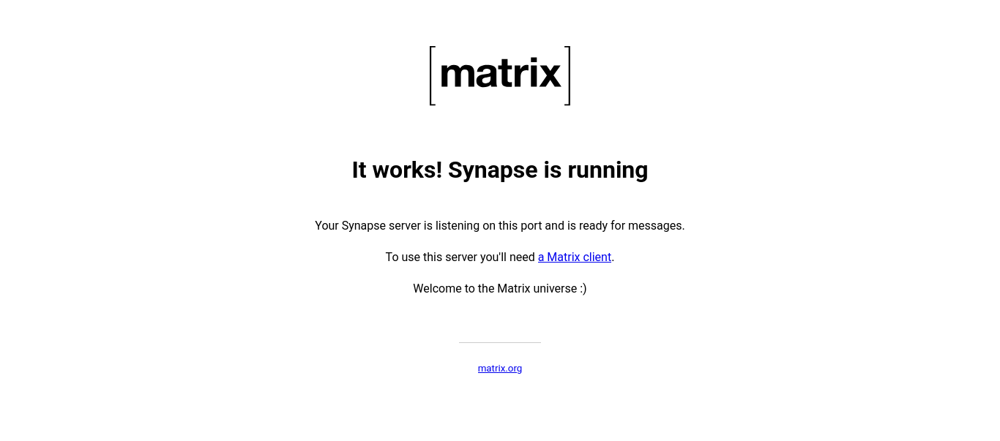
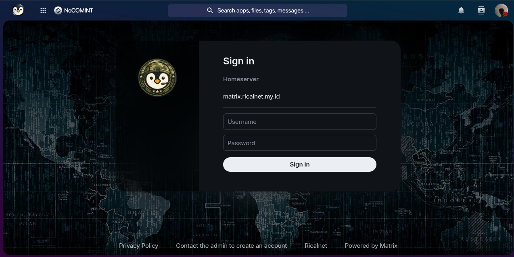

## Pendahuluan

Matrix adalah protokol komunikasi open-source yang dirancang untuk interoperabilitas dan privasi. Dengan self-hosting Synapse (homeserver Matrix), Anda mendapatkan kendali penuh atas data komunikasi Anda, bebas dari ketergantungan pada penyedia pihak ketiga. Artikel ini akan memandu Anda menginstal dan mengonfigurasi Matrix Synapse dengan PostgreSQL serta mengintegrasikannya dengan Element Web Client menggunakan Docker dan Docker Compose.

> Docker menyediakan isolasi lingkungan yang sempurna untuk Synapse. Dengan kontainer, Anda mendapatkan konsistensi di semua sistem, bebas konflik aplikasi, kemudahan pembaruan, dan kemampuan rollback instan.
{: .prompt-info }

## 1. Instalasi Docker

Docker adalah prerequisite mutlak sebelum menjalankan Synapse. Script instalasi otomatis dari Ricalnet telah teruji di berbagai distribusi Linux.

### Clone Repository dan Instalasi Otomatis

```bash
git clone https://github.com/ricalnet/digital-independence.git
cd digital-independence
```

### Instalasi Docker Engine

**Untuk Debian:**
```bash
./install-docker-engine-on-debian.sh
```

**Untuk Ubuntu:**
```bash
./install-docker-engine-on-ubuntu.sh
```

#### Apa yang Dilakukan Script Instalasi?
Script ini mengotomatiskan proses yang biasanya memakan waktu dan rawan kesalahan:
1. Update package repository sistem
2. Install dependencies (`ca-certificates`, `curl`, `gnupg`, `lsb-release`)
3. Tambahkan GPG key resmi Docker untuk verifikasi keamanan
4. Konfigurasi repository Docker agar menggunakan paket resmi
5. Install Docker Engine, CLI, dan Containerd
6. Tambahkan user saat ini ke group docker (menghindari penggunaan `sudo` setiap kali)

## 2. Persiapan Direktori dan Environment

Masuk ke direktori `synapse` dan sesuaikan variabel `.env`.

```bash
cd synapse
cp .env.example .env
nano .env
```

### Membuat Password Database

Sebelum menjalankan container, buat password yang aman untuk PostgreSQL:

```bash
openssl rand --hex 32
```

Salin output-nya, lalu tempelkan sebagai nilai di file `.env`. Contoh:

```yaml
SYNAPSE_POSTGRES_PASSWORD=a1b2c3d4e5f67890abcdef1234567890
```

> Password yang kuat sangat penting untuk keamanan database Anda. Gunakan `openssl rand --hex 32` untuk menghasilkan password acak yang aman.
{: .prompt-warning }

## 3. Generate Konfigurasi Awal Synapse

Generate file konfigurasi awal menggunakan image Docker Synapse:

```bash
docker run -it --rm \
  -v "$(pwd)/synapse-data:/data" \
  -e SYNAPSE_SERVER_NAME=your-domain.com \
  -e SYNAPSE_REPORT_STATS=no \
  matrixdotorg/synapse:latest generate
```

Perintah ini akan:
1. Menjalankan container Synapse secara interaktif (`-it`)
2. Menghapus container setelah selesai (`--rm`)
3. Mount volume `synapse-data` untuk menyimpan data persisten
4. Menghasilkan file `homeserver.yaml` dan key signing

## 4. Konfigurasi Database PostgreSQL

Synapse menggunakan SQLite secara default, namun untuk produksi, **PostgreSQL** sangat direkomendasikan karena performa dan skalabilitasnya yang lebih baik.

### Edit File Konfigurasi

```bash
sudo nano synapse-data/homeserver.yaml
```

Cari bagian `database` dan ubah dari SQLite ke PostgreSQL:

```yaml
# =============================================================================
# DATABASE
# =============================================================================
database:
  name: psycopg2
  args:
    user: synapse
    password: a1b2c3d4e5f67890abcdef1234567890  # Ganti dengan password Anda
    database: synapse
    host: postgres
    port: 5432
    cp_min: 5
    cp_max: 10
```

**Penjelasan Parameter:**
- `name: psycopg2`: Driver Python untuk PostgreSQL
- `cp_min` / `cp_max`: Jumlah koneksi database minimum dan maksimum untuk koneksi pooling
- `host: postgres`: Mengacu pada service postgres di docker-compose

> Lihat contoh konfigurasi lengkap di [homeserver.example.yaml](https://github.com/ricalnet/digital-independence/blob/main/synapse/homeserver.example.yaml).
{: .prompt-tip }

### Buat Network dan Jalankan Container

```bash
docker network create matrix-network
docker compose up -d
docker compose logs -f
```

### Verifikasi

Untuk memverifikasi bahwa Synapse berjalan dengan benar:

1. Akses `http://127.0.0.1:8008`
   - Seharusnya menampilkan pesan default Synapse

   
   _Synapse is running_

2. Periksa log container:
   ```bash
   docker logs synapse
   ```
   - Log harus menunjukkan proses startup yang berhasil tanpa error kritis

3. Periksa status container:
   ```bash
   docker ps -f name=synapse
   ```
   - Container harus dalam status "Up"
    ```
    CONTAINER ID   IMAGE                         COMMAND                  CREATED         STATUS                   PORTS                                                                              NAMES
    4900d7d1f7f0   matrixdotorg/synapse:latest   "/start.py"              2 minutes ago   Up 2 minutes (healthy)   127.0.0.1:8008->8008/tcp, 0.0.0.0:8448->8448/tcp, [::]:8448->8448/tcp, 19090/tcp   synapse
    fa5fd00c51bc   postgres:15-alpine            "docker-entrypoint.s…"   2 minutes ago   Up 2 minutes (healthy)   5432/tcp                                                                           synapse-postgres
    ```

## Konfigurasi dan Penggunaan Element

### Opsi 1: Menggunakan Element Web (Rekomendasi)

1. Buka [https://chat.ricalnet.my.id](https://chat.ricalnet.my.id) di browser
2. Klik "Create Account"
3. Klik "Edit" dan Masukkan URL homeserver: `http://127.0.0.1:8008`
4. Masukkan kredensial dan klik "Register"


_Log in to NoCOMINT_

> Pesan kesalahan `"Registration has been disabled on this homeserver"` muncul ketika pengguna mencoba mendaftar melalui klien Matrix (seperti Element) yang terhubung ke instans Synapse dengan pendaftaran dinonaktifkan. Konfigurasi ini diatur dalam file `homeserver.yaml`{: .filepath} melalui parameter `enable_registration` (Lihat [Modifikasi Konfigurasi Synapse](https://github.com/ricalnet/digital-independence/blob/main/synapse/homeserver.example.yaml)).
{: .prompt-info}

### Opsi 2: Menggunakan Element Desktop

1. Download dan install Element Desktop dari [https://element.io/download](https://element.io/download)
2. Masukkan URL homeserver: `http://127.0.0.1:8008`

## Mengaktifkan Pendaftaran Pengguna di Synapse

### Modifikasi Konfigurasi Synapse

#### Langkah 1: Edit File Konfigurasi
Edit file konfigurasi utama Synapse:
```bash
sudo nano synapse-data/homeserver.yaml
```
> Gunakan editor teks seperti `vim` atau `nano` sesuai preferensi. Path `/data/`{: .filepath} adalah volume Docker yang umum digunakan untuk menyimpan data persisten.
{: .prompt-tip}

#### Langkah 2: Modifikasi Parameter Pendaftaran
Temukan atau tambahkan parameter berikut dalam `homeserver.yaml`{: .filepath}:
```yaml
# Mengaktifkan pendaftaran pengguna melalui antarmuka web
enable_registration: true  # CHANGE: Set to true to allow registration

# Izinkan pendaftaran tanpa verifikasi email (untuk lingkungan testing)
enable_registration_without_verification: true

# registrations_require_3pid: []  # CHANGE: Add 3PID requirements (e.g., email, msisdn)
# registration_requires_token: false  # CHANGE: Set to true to require registration tokens
# allow_guest_access: false
```
Penjelasan Parameter:
- `enable_registration`: Mengizinkan pengguna mendaftar secara mandiri.
- `enable_registration_without_verification`: Melewati verifikasi email (tidak disarankan untuk produksi).
- `registrations_require_3pid`: Memverifikasi identitas melalui email atau nomor telepon.
- `registration_requires_token`: Membatasi pendaftaran hanya dengan token undangan.

#### Langkah 3: Simpan dan Keluar
Simpan perubahan dan keluar dari editor (untuk `nano`: `Ctrl+X` > `Y` > `Enter`).

#### Langkah 6: Restart Docker Compose
Restart untuk menerapkan perubahan:
```bash
docker compose down
docker compose up -d
```

> Restart diperlukan untuk memuat ulang konfigurasi. Pastikan tidak ada interupsi layanan kritis selama proses restart.
{: .prompt-info}

### Alternatif: Membuat Pengguna melalui Command-Line

Jika pendaftaran publik tidak diinginkan, gunakan skrip `register_new_matrix_user` yang disertakan dalam Synapse:

#### Membuat Akun Admin
```bash
docker exec -it synapse register_new_matrix_user \
  -c /data/homeserver.yaml \
  http://localhost:8008 \
  -u admin -p passwordadmin -a
```
Opsi `-a` memberikan hak administrator kepada pengguna.

#### Membuat Akun Pengguna Biasa
```bash
docker exec -it synapse register_new_matrix_user \
  -c /data/homeserver.yaml \
  http://localhost:8008 \
  -u user1 -p passworduser
```

### Verifikasi Pendaftaran

Setelah mengaktifkan pendaftaran, uji melalui [klien Matrix](https://ricaldocs.github.io/posts/matrix-protocol-with-synapse-and-element/#opsi-1-menggunakan-element-web-rekomendasi).

## Troubleshooting

### Masalah Umum dan Solusi

#### Port Sudah Digunakan
Error `"Address already in use"` menunjukkan konflik port, periksa proses yang menggunakan port 8008 atau 8448:
```bash
sudo netstat -tulpn | grep :8008
```

> - Hentikan proses yang menggunakan port tersebut
- Atau ubah port yang digunakan Synapse dalam konfigurasi
{: .prompt-tip}

#### Container Tidak Berjalan
Periksa log:
```bash
docker compose logs -f synapse
```

## Keamanan dan Pertimbangan untuk Produksi

### Konfigurasi Keamanan

#### Manajemen Pengguna
Nonaktifkan pendaftaran publik di lingkungan produksi:
```yaml
enable_registration: false
registration_requires_token: true
```

#### Firewall dan Jaringan
Batasi akses ke port Synapse:
```bash
ufw allow 8008/tcp  # Client access
ufw allow 8448/tcp  # Federation
ufw deny 8008/udp   # Blok UDP yang tidak diperlukan
```

### Monitoring dan Logging

#### Aktifkan Logging Terstruktur
Dalam `homeserver.yaml`{: .filepath}:
```yaml
log_config: "/data/log.config"

# File log.config
version: 1
formatters:
  precise:
    format: '%(asctime)s - %(name)s - %(lineno)d - %(levelname)s - %(request)s - %(message)s'
```

#### Monitoring Kesehatan
Health check endpoint:
```bash
curl -f http://localhost:8008/health
```

## Bridges
- [Implementasi Mautrix-Telegram Bridge dengan Docker](https://ricaldocs.github.io/posts/implementasi-mautrix-telegram-bridge-dengan-docker/)
- [Implementasi Mautrix-WhatsApp Bridge dengan Docker](https://ricaldocs.github.io/posts/implementasi-mautrix-whatsapp-bridge-dengan-docker/)

## Pranala Terkait
- [Instalasi Element Web Client dengan Docker untuk Self-Hosted Matrix](https://ricaldocs.github.io/posts/instalasi-element-web-client-dengan-docker-untuk-self-hosted-matrix/)
- [Digital Independence](https://github.com/ricalnet/digital-independence)
- [Panduan Implementasi Hidden Service Tor](https://docs.ricalnet.my.id/posts/panduan-implementasi-hidden-service-tor/)

## Pranala Luar

- [Dokumentasi Resmi Synapse](https://element-hq.github.io/synapse/latest/)
- [Repositori GitHub Synapse](https://github.com/element-hq/synapse)
- [Dokumentasi Element](https://docs.element.io/latest/)
- [Matrix Specification](https://matrix.org/docs/spec/)
