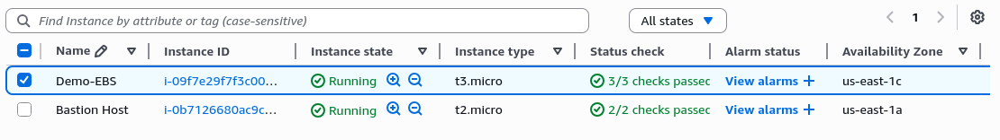

## 1. Pendahuluan

### 1.1. Tujuan
Dokumen ini memberikan panduan teknis lengkap untuk membuat, melampirkan, mengonfigurasi, dan mengelola Amazon Elastic Block Store (EBS) pada instance Amazon EC2. Prosedur mencakup pembuatan volume, pembuatan file system, pembuatan snapshot, dan proses pemulihan data.

### 1.2. Gambaran Umum Amazon EBS
Amazon Elastic Block Store (EBS) menyediakan penyimpanan blok persisten untuk instance Amazon EC2. Volume EBS bersifat redundan secara lokal dan dapat diattach ke instance EC2 manapun dalam Availability Zone yang sama.

## 2. Prasyarat
- Akses ke AWS Management Console dengan izin yang sesuai
- Instance EC2 yang berjalan
- Pengetahuan dasar tentang sistem file Linux dan perintah command line

## 3. Membuat Volume EBS Baru

### 3.1. Akses Konsol EC2
1. Login ke **AWS Management Console**
2. Pada bilah pencarian di samping **Layanan**, cari dan pilih **EC2**
3. Pastikan instance **Demo-EBS** telah diluncurkan dan berstatus running

### 3.2. Identifikasi Availability Zone
1. Di panel navigasi kiri, pilih **Instances**
2. Pilih instance **Demo-EBS**
3. **Catat Availability Zone** instance tersebut (contoh: `us-east-1c`)
  

### 3.3. Membuat Volume EBS
1. Di panel navigasi kiri, pilih **Volumes**
2. Perhatikan volume existing berukuran 8 GiB (volume root instance)
  

3. Pilih **Create volume** dan konfigurasikan parameter berikut:
   - **Volume Type**: General Purpose SSD (gp3)
   - **Size (GiB)**: 1
   - **Availability Zone**: Pilih availability zone yang sama dengan instance EC2
    

4. Pilih **Create Volume**
5. Tunggu status volume berubah dari **Creating** menjadi **Available** (gunakan tombol refresh jika diperlukan)
  

## 4. Melampirkan Volume ke Instance

### 4.1. Proses Pelampiran Volume
1. Pilih volume baru (**My Volume**) dari daftar volumes
2. Dari menu **Actions**, pilih **Attach volume**
  

3. Konfigurasikan parameter pelampiran:
   - **Instance**: Pilih instance **Demo-EBS**
   - **Device name**: `/dev/sdf` (default)

    **Catatan Teknis**: Kernel Linux modern dapat mengubah nama perangkat secara internal menjadi `/dev/xvdf` hingga `/dev/xvdp`, meskipun yang ditampilkan adalah `/dev/sdf` hingga `/dev/sdp`.
    

4. Pilih **Attach volume**
5. Verifikasi status volume berubah menjadi **In-use**
  

## 5. Menghubungkan ke Instance Amazon EC2

### 5.1. Koneksi via EC2 Instance Connect
1. Di AWS Management Console, cari dan pilih **EC2**
2. Pilih **Instances**
3. Pilih instance **Demo-EBS**, lalu pilih **Connect**
4. Pada tab **EC2 Instance Connect**, pilih **Connect**
5. Terminal session akan terbuka dengan prompt `$`

## 6. Membuat dan Mengonfigurasi File System

### 6.1. Verifikasi Storage yang Tersedia
```bash
df -h
```
**Output yang Diharapkan:**
```
Filesystem       Size  Used Avail Use% Mounted on
/dev/root        6.8G  1.8G  5.0G  27% /
tmpfs            458M     0  458M   0% /dev/shm
tmpfs            183M  896K  182M   1% /run
tmpfs            5.0M     0  5.0M   0% /run/lock
efivarfs         128K  3.6K  120K   3% /sys/firmware/efi/efivars
/dev/nvme0n1p16  881M   87M  733M  11% /boot
/dev/nvme0n1p15  105M  6.2M   99M   6% /boot/efi
tmpfs             92M   12K   92M   1% /run/user/1000
```

### 6.2. Identifikasi Device Volume Baru
```bash
lsblk
```
**Output yang Diharapkan:**
```
NAME         MAJ:MIN RM  SIZE RO TYPE MOUNTPOINTS
loop0          7:0    0 27.6M  1 loop /snap/amazon-ssm-agent/11797
loop1          7:1    0 73.9M  1 loop /snap/core22/2045
loop2          7:2    0 49.3M  1 loop /snap/snapd/24792
nvme0n1      259:0    0    8G  0 disk 
├─nvme0n1p1  259:1    0    7G  0 part /
├─nvme0n1p14 259:2    0    4M  0 part 
├─nvme0n1p15 259:3    0  106M  0 part /boot/efi
└─nvme0n1p16 259:4    0  913M  0 part /boot
nvme1n1      259:5    0    1G  0 disk
```

### 6.3. Membuat File System ext4
```bash
sudo mkfs -t ext4 /dev/nvme1n1
```
**Output yang Diharapkan:**
```
mke2fs 1.47.0 (5-Feb-2023)
Creating filesystem with 262144 4k blocks and 65536 inodes
Filesystem UUID: a19be8c8-339e-4848-b2d4-d9a55c559561
Superblock backups stored on blocks: 
  32768, 98304, 163840, 229376

Allocating group tables: done                            
Writing inode tables: done                            
Creating journal (8192 blocks): done
Writing superblocks and filesystem accounting information: done
```

### 6.4. Membuat Direktori Mount Point
```bash
sudo mkdir /mnt/data-store
```

### 6.5. Mount Volume dan Konfigurasi Persistent
```bash
# Mount volume secara manual
sudo mount /dev/nvme1n1 /mnt/data-store

# Konfigurasi mount otomatis pada boot
echo "/dev/nvme1n1   /mnt/data-store ext4 defaults,noatime 1 2" | sudo tee -a /etc/fstab
```

### 6.6. Verifikasi Konfigurasi fstab
```bash
cat /etc/fstab
```
**Output yang Diharapkan:**
```
LABEL=cloudimg-rootfs	/	 ext4	discard,commit=30,errors=remount-ro	0 1
LABEL=BOOT	/boot	ext4	defaults	0 2
LABEL=UEFI	/boot/efi	vfat	umask=0077	0 1
/dev/nvme1n1   /mnt/data-store ext4 defaults,noatime 1 2
```

### 6.7. Verifikasi Mount Point Berhasil
```bash
df -h
```
**Output yang Diharapkan:**
```
Filesystem       Size  Used Avail Use% Mounted on
/dev/root        6.8G  1.8G  5.0G  27% /
...
/dev/nvme1n1     974M   24K  907M   1% /mnt/data-store
```

### 6.8. Testing Write dan Read Operations
```bash
# Menulis data ke volume
sudo sh -c "echo some text has been written > /mnt/data-store/file.txt"

# Verifikasi data tertulis
cat /mnt/data-store/file.txt
```

## 7. Membuat Snapshot Amazon EBS

### 7.1. Proses Pembuatan Snapshot
1. Di Konsol EC2, pilih **Volumes** dan pilih **My Volume**
2. Dari menu **Actions**, pilih **Create snapshot**
  
  

3. Tambahkan tag identifikasi:
   - **Key**: `Name`
   - **Value**: `My Snapshot`
    

4. Pilih **Create snapshot**
5. Di panel navigasi kiri, pilih **Snapshots**
6. Tunggu status berubah dari **Pending** menjadi **Completed**
  

### 7.2. Hapus Data untuk Demonstrasi Pemulihan
```bash
# Hapus file dari volume
sudo rm /mnt/data-store/file.txt

# Verifikasi file telah dihapus
ls /mnt/data-store/
```

## 8. Memulihkan Snapshot Amazon EBS

### 8.1. Membuat Volume dari Snapshot
1. Di konsol EC2, pilih **Snapshots**
2. Dari menu **Actions**, pilih **Create volume from snapshot**
  

3. Konfigurasikan parameter volume:
   - **Availability Zone**: Pilih availability zone yang sama dengan instance
    
    
   - **Tags**: 
     - **Key**: `Name`
     - **Value**: `Restored Volume`
      

4. Pilih **Create volume**

### 8.2. Melampirkan Volume yang Dipulihkan
1. Di panel navigasi kiri, pilih **Volumes**
2. Pilih **Restored Volume**
3. Dari menu **Actions**, pilih **Attach volume**
  

4. Konfigurasikan:
   - **Instance**: Pilih instance **Demo-EBS**
   - **Device**: `/dev/sdg` (default)
    

5. Pilih **Attach volume**
6. Verifikasi status **in-use**
  

### 8.3. Mount dan Verifikasi Volume yang Dipulihkan
```bash
# Identifikasi device baru
lsblk
```

**Output yang Diharapkan:**
```
NAME         MAJ:MIN RM  SIZE RO TYPE MOUNTPOINTS
...
nvme1n1      259:5    0    1G  0 disk /mnt/data-store
nvme2n1      259:6    0    1G  0 disk
```

```bash
# Buat direktori mount point
sudo mkdir /mnt/data-store2

# Mount volume
sudo mount /dev/nvme2n1 /mnt/data-store2

# Verifikasi data telah dipulihkan
ls /mnt/data-store2/
```

## 9. Informasi Teknis Tambahan

### 9.1. Best Practices
- Selalu pilih Availability Zone yang sama dengan instance EC2
- Gunakan tag yang konsisten untuk memudahkan manajemen
- Backup data penting secara reguler menggunakan snapshot
- Monitor performa volume menggunakan Amazon CloudWatch

### 9.2. Pertimbangan Keamanan
- Volume EBS dienkripsi secara default pada region tertentu
- Gunakan EBS Encryption untuk data sensitif
- Terapkan kebijakan IAM yang sesuai untuk mengontrol akses

### 9.3. Troubleshooting
- Pastikan instance dan volume berada di Availability Zone yang sama
- Verifikasi device name yang benar menggunakan `lsblk`
- Periksa syslog untuk error messages terkait mount

## 10. Kesimpulan
Dokumen ini telah menjelaskan prosedur lengkap untuk mengelola Amazon EBS, mulai dari pembuatan volume, konfigurasi file system, pembuatan snapshot, hingga proses pemulihan data. Implementasi yang tepat memastikan ketersediaan dan keamanan data pada lingkungan AWS EC2.