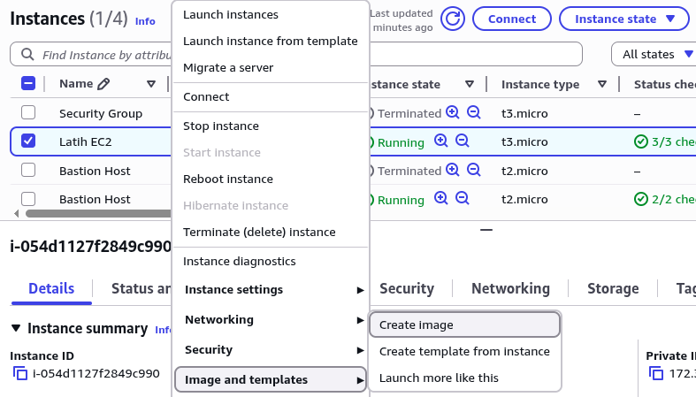
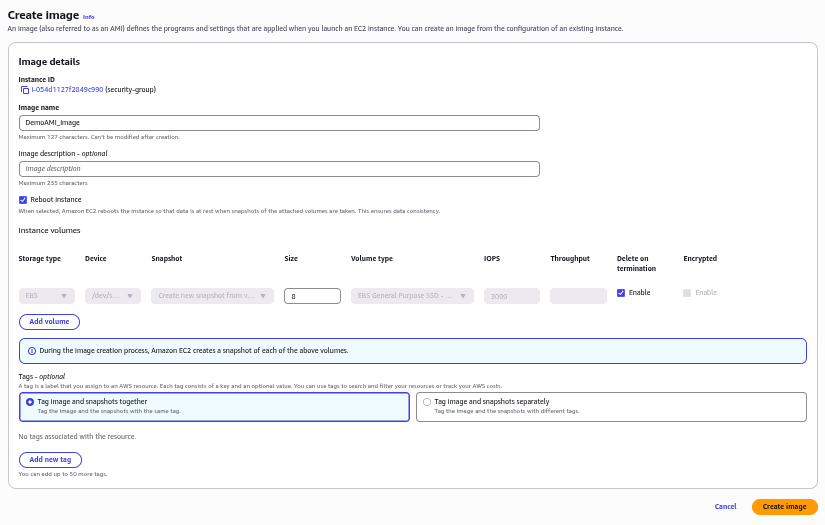
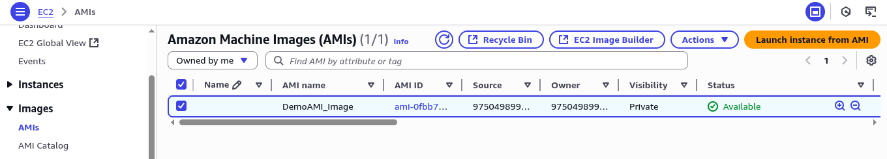
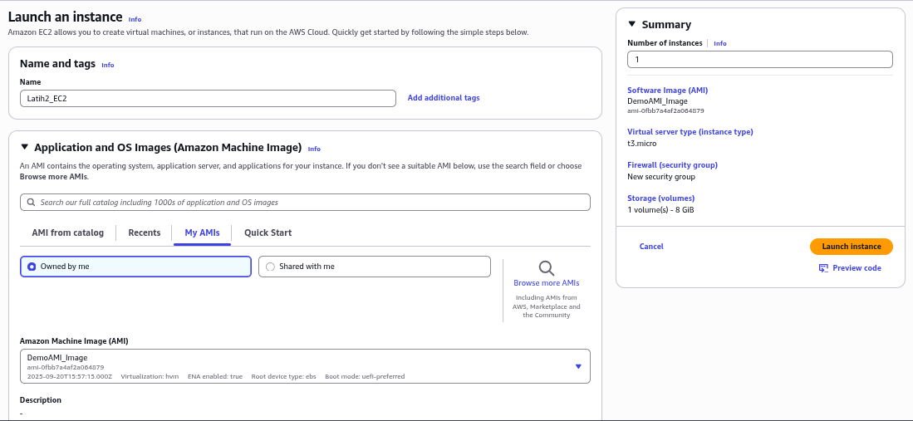
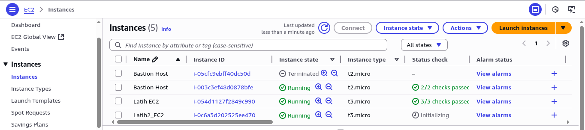

## Pendahuluan

Amazon Machine Image (AMI) adalah template dasar yang digunakan oleh Amazon Elastic Compute Cloud (EC2) untuk membuat virtual machine (disebut instance) di lingkungan cloud. Setiap AMI berisi informasi yang diperlukan untuk meluncurkan instance, termasuk:

-   Template untuk root volume (misalnya, sistem operasi, server aplikasi, dan aplikasi)
-   Hak izin luncur yang mengontrol akun AWS mana yang dapat menggunakan AMI tersebut
-   Pemetaan block device yang menentukan volume yang akan dilampirkan ke instance saat diluncurkan

AMI mendukung berbagai sistem operasi, termasuk distribusi Linux (seperti Amazon Linux, Ubuntu, dan Red Hat Enterprise Linux) serta versi Microsoft Windows Server.

## Proses Pembuatan AMI

### 1. Persiapan Instance Sumber
Sebelum membuat AMI, pengguna harus mempersiapkan sebuah instance EC2 sebagai sumber. instance ini dikonfigurasi sesuai dengan kebutuhan, seperti menginstal perangkat lunak, mengatur konfigurasi, dan memastikan layanan yang diperlukan (seperti web server) telah berjalan dengan benar (Lihat: [Security Group dalam Cloud Computing](https://ricaldocs.github.io/posts/security-group-dalam-cloud-computing/)).

_Persiapan Instance EC2_

### 2. Membuat Image
Setelah instance sumber siap, pengguna dapat membuat AMI baru melalui konsol manajemen AWS:
- Klik kanan pada instance yang aktif di dalam konsol EC2.
- Pilih opsi **Image and templates** > **Create image**.

_Membuat Image dari Instance_

### 3. Konfigurasi AMI
Pada langkah ini, pengguna diminta untuk mengisi detail AMI, seperti:
- **Nama Image**: Nama yang deskriptif dan unik untuk identifikasi.
- **Deskripsi Image** (opsional): Penjelasan mengenai tujuan atau konfigurasi AMI.

_Konfigurasi Nama AMI_

### 4. Ketersediaan AMI
Proses pembuatan AMI akan memerlukan waktu beberapa menit. Status AMI dapat dipantau di konsol AWS hingga berubah menjadi **`available`**.

_Status AMI Tersedia_

## Meluncurkan Instance dari AMI

Setelah status AMI tersedia (available), pengguna dapat meluncurkan instance EC2 baru menggunakan AMI tersebut. Proses ini memungkinkan replikasi lingkungan komputasi yang konsisten dan identik dengan instance sumber dalam beberapa klik.

_Meluncurkan Instance dari AMI_

Sebagai contoh, sebuah instance baru yang diluncurkan dari AMI yang telah berisi web server yang telah dikonfigurasi akan langsung dapat melayani traffic web tanpa perlu instalasi atau konfigurasi ulang. Gambar di bawah menunjukkan dua instance yang berjalan, di mana instance kedua merupakan replika dari AMI yang dibuat.

_Dua Instance Berjalan_

_Web Server pada Instance Baru_

## Manfaat dan Penggunaan

-   **Konsistensi**: Memastikan setiap instance baru memiliki konfigurasi yang identik, mengurangi risiko drift konfigurasi.
-   **Kecepatan dan Otomasi**: Mempercepat penyebaran infrastruktur dan dapat diintegrasikan dalam pipeline CI/CD serta alat orchestration seperti AWS CloudFormation dan Terraform.
-   **Keandalan**: Digunakan untuk membuat golden image yang telah di-harden dari segi keamanan dan performa.
-   **Pencadangan dan Pemulihan Bencana**: AMI dapat berfungsi sebagai titik pemulihan (*recovery point*) untuk keperluan backup dan disaster recovery.