## Pendahuluan

Amazon Elastic Compute Cloud (EC2) adalah layanan web yang menyediakan kapasitas komputasi yang aman dan dapat disesuaikan ukurannya di cloud. Salah satu fitur powerful EC2 adalah **User Data**, yang memungkinkan pengguna untuk menjalankan skrip otomatisasi secara otomatis saat sebuah instance diluncurkan untuk pertama kalinya. Fitur ini sering digunakan untuk instalasi perangkat lunak, konfigurasi lingkungan, dan penerapan kode aplikasi, yang pada dasarnya berfungsi sebagai mekanisme **bootstrapping** untuk server.

Artikel ini memberikan panduan langkah demi langkah untuk meluncurkan sebuah instance EC2 dengan skrip User Data yang menginstal dan mengonfigurasi server web **Nginx**.

## Prosedur Peluncuran Instance

### 1. Mengakses Layanan EC2 dan Memulai Peluncuran

Langkah pertama adalah membuka konsol manajemen AWS dan menavigasi ke layanan EC2. Dari dashboard EC2, pilih opsi **"Launch Instance"** untuk memulai proses pembuatan instance virtual machine baru.

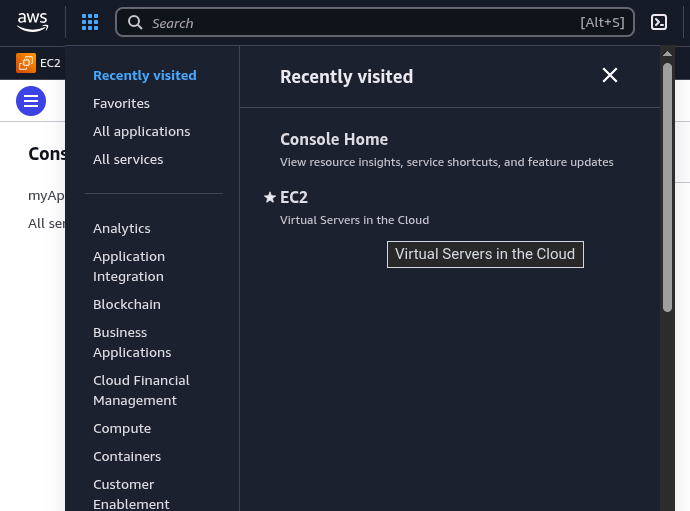
*Gambar 1: Dashboard layanan Amazon EC2 di Konsol Manajemen AWS.*

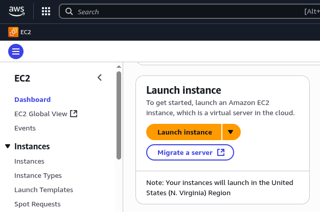
*Gambar 2: Tombol 'Launch Instance' untuk memulai wizard pembuatan instance baru.*

### 2. Konfigurasi Dasar: Penamaan dan Sistem Operasi

Pada langkah ini, berikan **Name and Tags** yang deskriptif untuk isntance guna memudahkan identifikasi dan manajemen. Selanjutnya, pilih **Amazon Machine Image (AMI)** yang diinginkan. Untuk panduan ini, AMI berbasis **Ubuntu Server** digunakan. Pemilihan AMI menentukan sistem operasi dan konfigurasi perangkat lunak awal untuk instance Anda.

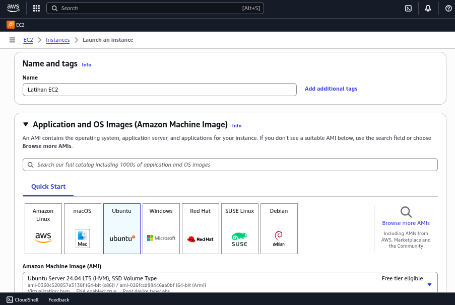
*Gambar 3: Langkah konfigurasi untuk memberikan nama dan memilih Amazon Machine Image (AMI).*

### 3. Pembuatan dan Pengunduhan Key Pair

Akses aman ke instance EC2 yang terpapar internet publik bergantung pada **key pair** kriptografi. Buat key pair baru atau pilih yang sudah ada. Key pair terdiri dari kunci publik (yang disimpan AWS) dan kunci privat (yang diunduh pengguna). Kunci privat (`.pem` atau `.ppk`) ini **harus disimpan dengan aman** karena diperlukan untuk setiap koneksi SSH ke instance.

- `.pem`: Format yang digunakan dengan [klien SSH](https://ricaldocs.github.io/posts/panduan-lengkap-openssh-server-linux-untuk-remote-akses-aman/) pada sistem operasi Linux dan macOS.
- `.ppk`: Format yang diperlukan oleh klien SSH seperti PuTTY pada sistem operasi Windows.

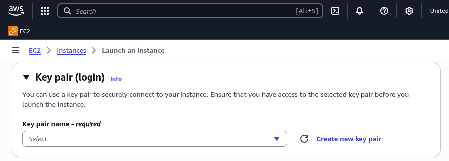
*Gambar 4: Menu untuk membuat atau memilih key pair yang akan digunakan untuk autentikasi.*

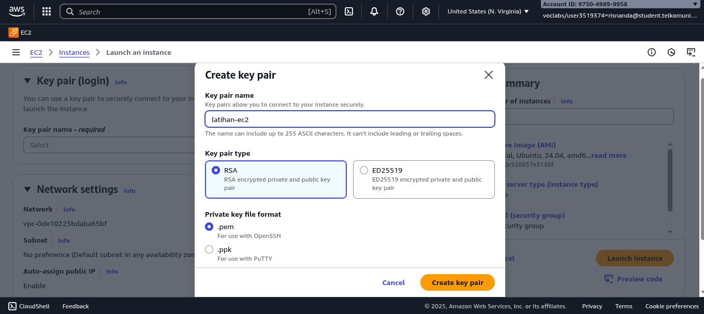
*Gambar 5: Pemberian nama dan pemilihan format file untuk key pair.*

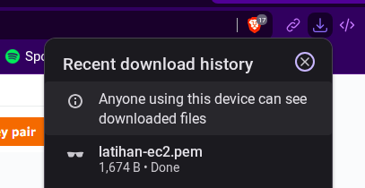
*Gambar 6: Penting untuk mengunduh dan menyimpan file key pair secara aman setelah dibuat.*

### 4. Konfigurasi Jaringan (Network Settings)

Konfigurasi jaringan menentukan bagaimana instance berkomunikasi. Pastikan pengaturan berikut:
- **VPC**: Biarkan default atau pilih Virtual Private Cloud yang sesuai.
- **Subnet**: Pilih subnet untuk menempatkan instance.
- **Firewall (Security Groups)**: Buat atau pilih security group yang mengizinkan lalu lintas. Untuk contoh server web ini, buka port **80 (HTTP)** untuk mengizinkan akses publik ke server web. Port **22 (SSH)** juga harus dibuka untuk mengelola server dari jarak jauh.

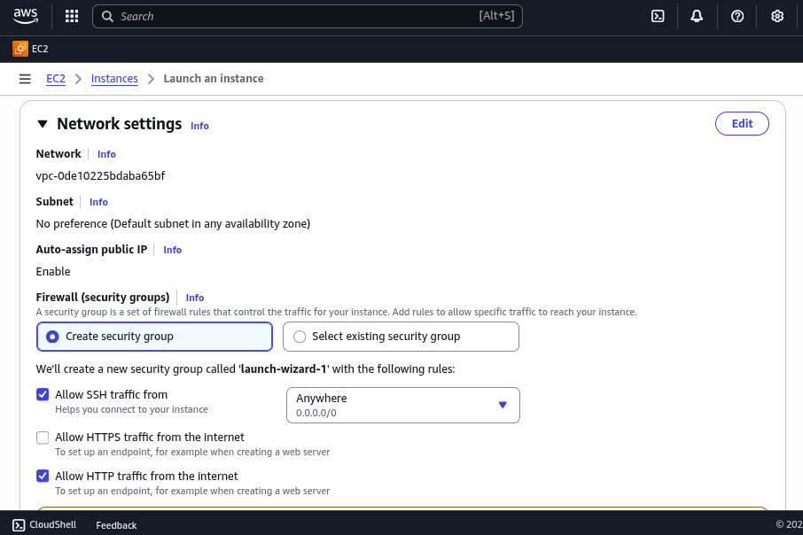
*Gambar 7: Konfigurasi pengaturan jaringan dan security group untuk instance.*

### 5. Konfigurasi Penyimpanan (Storage)

AWS EC2 menyediakan penyimpanan elastis menggunakan **Amazon Elastic Block Store (EBS)**. Untuk kebanyakan kasus penggunaan, volume root default (biasanya 8 GiB tipe gp2/gp3) sudah memadai. Ukuran dan tipe volume dapat disesuaikan berdasarkan kebutuhan performa dan kapasitas aplikasi.

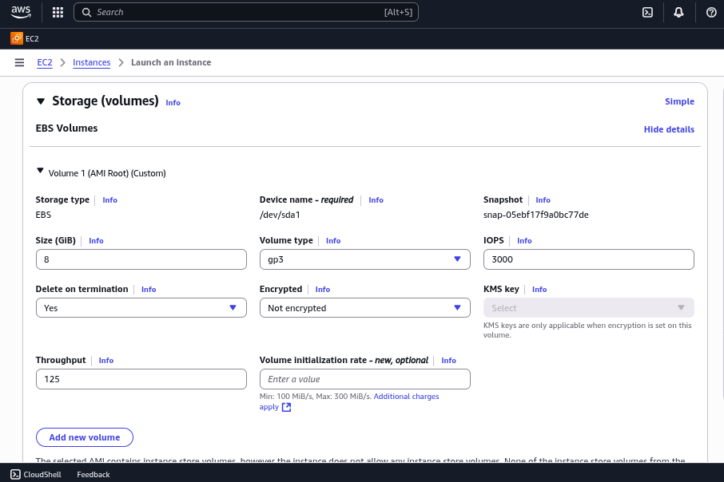
*Gambar 8: Konfigurasi volume penyimpanan EBS untuk instance.*

### 6. Konfigurasi User Data untuk Bootstrapping

Bagian **Advanced details** menyediakan bidang untuk **User Data**. Di sinilah skrip bootstrapping dimasukkan. Skrip di bawah ini, yang ditulis dalam **Bash**, akan dieksekusi sekali saat instance pertama kali boot. Skrip ini akan:
1. Memperbarui indeks paket pada sistem operasi Ubuntu.
2. Menginstal paket server web Nginx.
3. Mengonfigurasi Nginx untuk berjalan secara otomatis pada boot.
4. Membuat halaman web sederhana yang menampilkan hostname instance.
5. Me-restart layanan Nginx untuk menerapkan perubahan.

```bash
#!/bin/bash
# Skrip User Data untuk instalasi dan konfigurasi Nginx otomatis pada Ubuntu

# Perbarui repositori dan tingkatkan paket yang terinstal
apt-get update -y
apt-get upgrade -y

# Instal paket Nginx
apt-get install -y nginx

# Aktifkan dan jalankan layanan Nginx
systemctl enable nginx
systemctl start nginx

# Buat halaman index.html kustom
echo "<h1>Hello World from $(hostname -f)</h1>" > /var/www/html/index.html

# Restart Nginx untuk memastikan perubahan berlaku
systemctl restart nginx
```

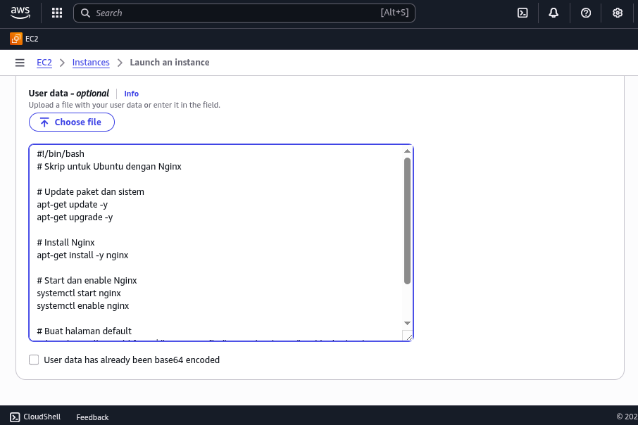
*Gambar 9: Bidang input User Data pada bagian Advanced details untuk memasukkan skrip bootstrapping.*

### 7. Ringkasan dan Peluncuran

Tinjau semua konfigurasi yang telah dipilih pada halaman ringkasan. Jika semua sudah benar, pilih **"Launch Instance"** untuk menerapkan dan meluncurkan instance virtual server.

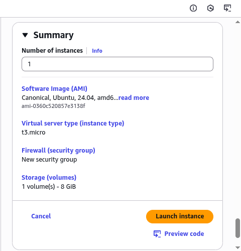
*Gambar 10: Halaman ringkasan konfigurasi sebelum akhirnya meluncurkan instance.*

### 8. Memantau Status Instance

Setelah diluncurkan, instance akan muncul di konsol EC2 dengan status **`pending`** sebelum berubah menjadi **`running`**. Tunggu hingga **Status Check** menunjukkan **"2/2 checks passed"**, yang menandakan bahwa instance telah menyelesaikan booting awal dan telah menjalankan skrip User Data.

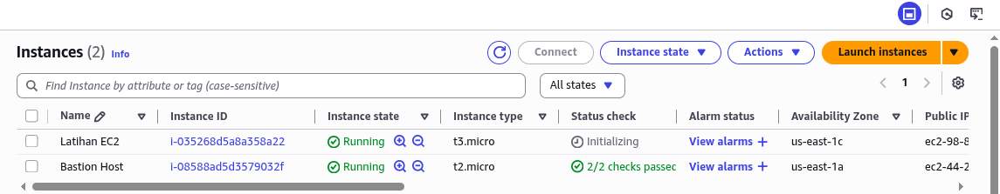
*Gambar 11: Status instance dan status check di konsol EC2.*

### 9. Mengakses Server Web

Setelah instance berjalan, salin **Alamat IP Publik**-nya dari konsol. Tempel alamat IP tersebut ke bilah alamat peramban web. Karena skrip User Data telah mengonfigurasi Nginx, peramban akan menampilkan halaman "Hello World" yang disertai hostname instance, mengonfirmasi bahwa otomatisasi berhasil.

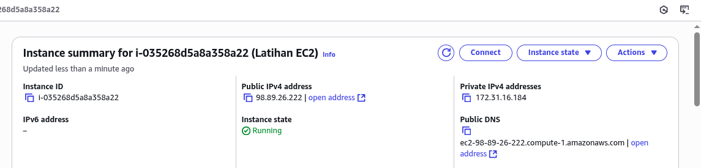
*Gambar 12: Informasi alamat IP publik dari instance yang berjalan.*

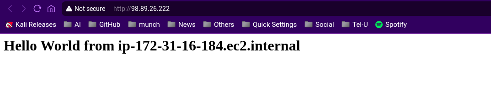
*Gambar 13: Halaman web default yang dihasilkan oleh skrip User Data, yang dapat diakses via HTTP.*

### 10. Terminasi Instance (Pembersihan)

Untuk menghindari biaya yang tidak direncanakan, **terminate** instance setelah selesai digunakan. Tindakan ini akan mematikan instance dan melepaskan semua sumber daya komputasi serta penyimpanan elastis yang terkait (kecuali volume EBS yang dikonfigurasi untuk dipertahankan).

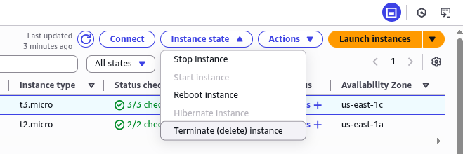
*Gambar 14: Menu untuk menghentikan atau mengakhiri (terminate) instance.*

## Kesimpulan

Penggunaan **User Data** pada Amazon EC2 memberikan metode yang powerful dan efisien untuk mengotomatisasi penyiapan dan konfigurasi server, menerapkan prinsip **Infrastructure as Code (IaC)** secara dasar. Panduan ini mendemonstrasikan cara membuat instance EC2 yang secara otomatis menginstal dan mengonfigurasi Nginx saat booting pertama, menyederhanakan proses deployment dan memastikan konsistensi lingkungan.