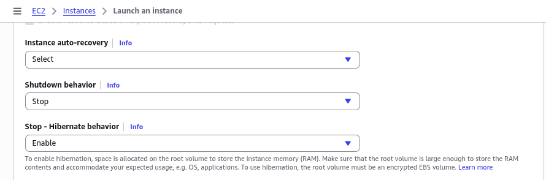
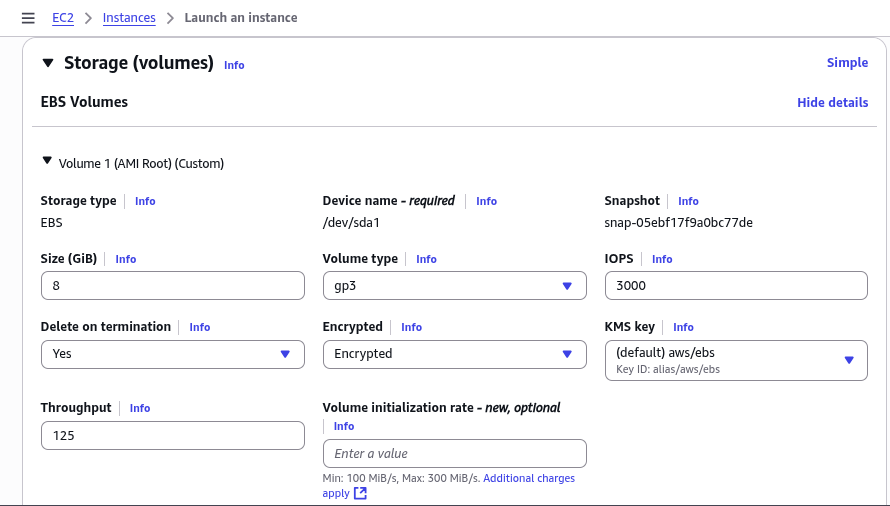
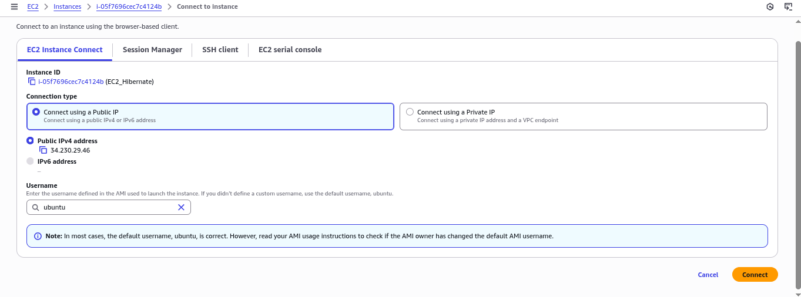
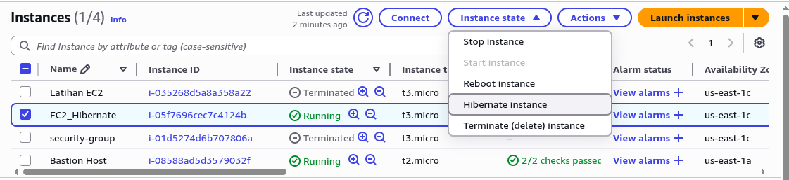
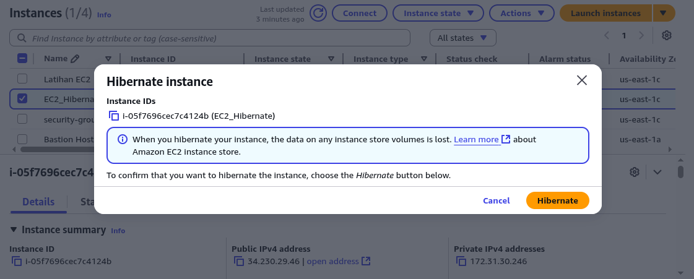
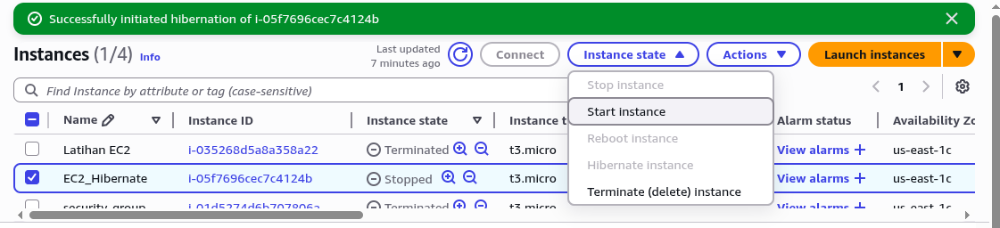

## Pendahuluan
EC2 Hibernate merupakan sebuah fitur pada layanan Amazon Elastic Compute Cloud (EC2) yang memungkinkan instance EC2 untuk memasuki status hibernasi, sehingga mempertahankan keadaan sistem operasi dan aplikasi yang sedang berjalan pada memori (RAM) ke penyimpanan persisten (Amazon EBS). Saat instance dihidupkan kembali, keadaan sebelumnya dipulihkan sepenuhnya, memungkinkan kelanjutan pekerjaan tanpa perlu melakukan boot ulang atau memulai ulang aplikasi.

## Prasyarat dan Konfigurasi
Sebelum mengaktifkan hibernasi, beberapa persyaratan harus dipenuhi:

1.  **Tipe Instance**: Hibernasi didukung pada instance berbasis Nitro dengan sumber daya yang memadai. Instance keluarga umum seperti M5, C5, R5, dan T3 umumnya mendukung fitur ini.
2.  **Sistem Operasi**: AMI yang digunakan harus kompatibel dengan hibernasi. Amazon Linux 2 dan versi tertentu dari Ubuntu Server merupakan contoh yang mendukung.
3.  **Ukuran Memori (RAM)**: Ruang pada volume root EBS harus cukup besar untuk menampung seluruh isi RAM. Ukuran yang disarankan adalah volume root sebesar `Ukuran RAM + Ukuran Ruang Swap + 10 GB Overhead sistem`.
4.  **Enkripsi**: Volume root instance **harus dienkripsi** untuk keamanan data yang disimpan dari memori. Ini dapat dilakukan menggunakan enkripsi default EBS atau kunci KMS milik pelanggan.

## Langkah-Langkah Konfigurasi dan Penggunaan

### 1. Meluncurkan Instance dengan Hibernasi Diaktifkan
Pada konsol AWS Management Console, proses peluncuran instance EC2 (Launch Instance) dilakukan seperti biasa. Pada langkah **Configure Advanced Details**, pilihan **Stop - Hibernate behavior** harus diaktifkan (Enable).


_Antarmuka Advanced Details dengan opsi Enable Stop-Hibernate_

### 2. Konfigurasi Penyimpanan yang Dienkripsi
Pada langkah **Storage (Volumes)**, volume root instance harus memiliki enkripsi yang diaktifkan. Pengguna dapat memilih enkripsi default dari EBS atau menentukan kunci KMS spesifik.


_Antarmuka Storage (Volumes) dengan enkripsi diaktifkan_

### 3. Meluncurkan Instance
Setelah konfigurasi selesai, instance diluncurkan (Launch).


_Antarmuka EC2 Instance Connect_

Setelah instance berjalan (`running`), dapat dilakukan pengujian konektivitas untuk memverifikasi statusnya.

Perintah `uptime` menunjukkan instance telah aktif selama 3 menit.
```
ubuntu@ip-172-31-30-246:~$ uptime
 13:05:49 up 3 min,  1 user,  load average: 0.11, 0.13, 0.06
```

### 4. Melakukan Hibernasi pada Instance
Untuk melakukan hibernasi, pada bagian **Instance State** dengan memilih opsi **Hibernate instance** pada konsol AWS. Tindakan ini akan menyimpan keadaan memori ke volume root EBS yang terenkripsi sebelum instance dimatikan.


_Instance State_


_Menu stop instance dengan pilihan hibernasi_

### 5. Menghidupkan Kembali Instance
Instance yang di-hibernate dapat dihidupkan kembali (**Start instance**) dari konsol AWS. Proses boot akan memulihkan keadaan sistem yang tersimpan secara persis seperti sebelum di-hibernate, termasuk semua aplikasi dan data yang reside di memori.


_Memulai instance kembali_

Perintah `uptime` setelah dihidupkan kembali membuktikan kelanjutan keadaan sistem. Waktu aktif (uptime) yang ditampilkan adalah kelanjutan dari sebelum hibernasi, bukan direset.
```
ubuntu@ip-172-31-30-246:~$ uptime
 13:13:27 up 10 min,  2 users,  load average: 0.08, 0.07, 0.04
```

## Manfaat dan Kegunaan
-   Ideal untuk aplikasi jangka panjang dan proses batch yang mahal untuk dimulai ulang.
-   Menghindari proses booting dan inisialisasi aplikasi dari awal, sehingga instance siap bekerja lebih cepat.
-   Memungkinkan penghentian instance tanpa kehilangan progres, mengoptimalkan penggunaan sumber daya dan biaya.

## Batasan
-   Tidak semua keluarga instance mendukung hibernasi.
-   Mengonsumsi ruang penyimpanan EBS tambahan yang sebanding dengan ukuran RAM.
-   Waktu untuk melakukan hibernasi dan resume bergantung pada ukuran RAM instance.
-   Instance yang di-hibernate tetap dikenakan biaya penyimpanan untuk volume EBS-nya, meskipun biaya komputasi tidak lagi dikenakan.