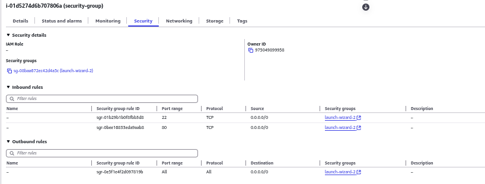
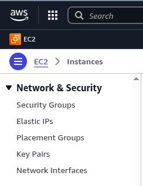
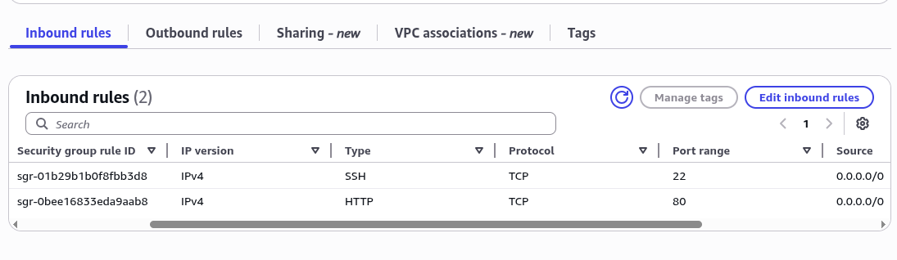
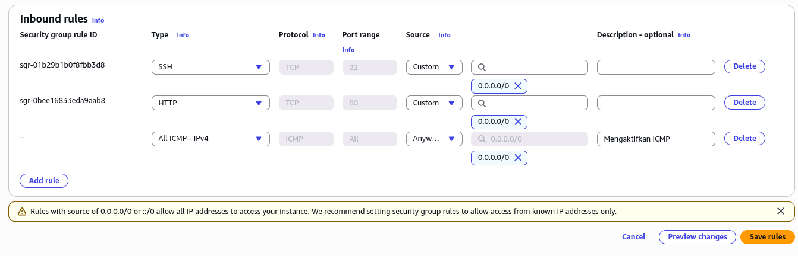

## Security Group dalam Amazon EC2

Security Group dalam Amazon Elastic Compute Cloud (EC2) merupakan mekanisme keamanan jaringan yang berfungsi sebagai **firewall virtual** pada tingkat instance. Setiap security group berisi **Rules** yang mengontrol lalu lintas jaringan yang diizinkan untuk mencapai instance EC2. Secara default, semua lalu lintas masuk (**inbound traffic**) diblokir, sementara lalu lintas keluar (**outbound traffic**) diizinkan.

### Konfigurasi Dasar Security Group

Sebelum melakukan modifikasi aturan keamanan, pengguna harus terlebih dahulu membuat instance EC2. Panduan pembuatan instance EC2 dengan user data untuk otomatisasi penyiapan server dapat diakses pada [tautan berikut](https://ricaldocs.github.io/posts/membuat-instance-amazon-ec2-dengan-user-data-untuk-mengotomatisasi-penyiapan-server/).

Setelah instance berjalan, verifikasi akses ke web server menggunakan protokol HTTP. Konfigurasi security group awal biasanya hanya mengizinkan akses HTTP (port 80) dan SSH (port 22), sementara akses melalui HTTPS (port 443) dan protokol lainnya akan diblokir hingga ditambahkan aturan secara manual.


_Web Server Berjalan_

### Melihat dan Memodifikasi Security Group

#### Melalui Tab Security Instance
Pengguna dapat memeriksa security group yang terasosiasi dengan instance EC2 dengan memilih instance yang dimaksud, kemudian navigasi ke tab **Security**. Tab ini menampilkan detail security group dan aturan protokol yang aktif.


_Tab Security Instance_

#### Melalui Menu Security Groups
Alternatif lainnya adalah dengan mengakses layanan **EC2**, navigasi ke kategori **Network & Security**, dan pilih **Security Groups**. Menu ini memberikan gambaran menyeluruh tentang semua security group yang ada dalam region tersebut.


_Menu Network & Security_

### Menambahkan Aturan Inbound Baru

Untuk mengizinkan jenis lalu lintas baru, seperti protokol ICMP (Internet Control Message Protocol) yang digunakan perintah `ping`, pengguna perlu memodifikasi **inbound rules** pada security group yang relevan.

1.  Pilih security group yang ingin dimodifikasi.
2.  Buka tab **Inbound rules**.
3.  Klik tombol **Edit inbound rules**.
4.  Tambahkan aturan baru:
    -   **Type**: Pilih "All ICMP - IPv4" dari dropdown.
    -   **Source**: Tentukan rentang alamat IP yang diizinkan (contoh: `0.0.0.0/0` untuk semua host, atau IP spesifik untuk keamanan yang lebih ketat).
5.  Simpan aturan.


*Antarmuka untuk mengedit aturan inbound traffic pada security group.*


*Menambahkan aturan untuk mengizinkan semua traffic ICMP IPv4.*

### Verifikasi Konfigurasi

Efektivitas perubahan aturan dapat diverifikasi dengan menggunakan utilitas `ping` dari komputer lokal.

**Sebelum menambahkan aturan ICMP:**
Permintaan ping akan gagal (100% packet loss) karena lalu lintas ICMP diblokir oleh security group.
```bash
└─$ ping 34.229.57.151
PING 34.229.57.151 (34.229.57.151) 56(84) bytes of data.
^C
--- 34.229.57.151 ping statistics ---
106 packets transmitted, 0 received, 100% packet loss, time 107515ms
```

**Setelah menambahkan aturan ICMP:**
Permintaan ping sekarang berhasil, menunjukkan bahwa lalu lintas ICMP dapat mencapai instance EC2.
```bash
└─$ ping 34.229.57.151
PING 34.229.57.151 (34.229.57.151) 56(84) bytes of data.
64 bytes from 34.229.57.151: icmp_seq=1 ttl=50 time=251 ms
64 bytes from 34.229.57.151: icmp_seq=2 ttl=50 time=250 ms
64 bytes from 34.229.57.151: icmp_seq=3 ttl=50 time=250 ms
...
--- 34.229.57.151 ping statistics ---
6 packets transmitted, 6 received, 0% packet loss, time 5004ms
rtt min/avg/max/mdev = 249.831/250.497/250.995/0.445 ms
```

### Informasi Tambahan

-   **Stateful Nature**: Security Group bersifat stateful. Jika Anda mengizinkan lalu lintas masuk (inbound) untuk sebuah protokol, lalu lintas balik (outbound) untuk protokol yang sama secara otomatis diizinkan, dan berlaku sebaliknya.
-   **Association**: Satu security group dapat dikaitkan dengan banyak instance, dan satu instance dapat memiliki beberapa security group yang terasosiasi.
-   **Best Practice**: Prinsip least privilege sangat dianjurkan. Selalu batasi izin akses hanya pada protokol, port, dan alamat IP sumber yang benar-benar diperlukan untuk operasi aplikasi.