## Pendahuluan

Amazon Simple Storage Service (Amazon S3) adalah layanan penyimpanan objek yang dapat diskalakan yang ditawarkan oleh Amazon Web Services (AWS). Layanan ini menyediakan penyimpanan data yang sangat andal, aman, dan dapat diskalakan untuk berbagai use case seperti backup dan pemulihan bencana, hosting konten web statis, big data analytics, dan banyak lagi. 

## Membuat Bucket S3

Sebuah bucket S3 adalah wadah untuk menyimpan objek (file) di Amazon S3. Setiap bucket harus memiliki nama yang unik secara global di seluruh AWS.

### 1. Akses Konsol Amazon S3

Masuk ke AWS Management Console dan navigasikan ke layanan S3 menggunakan bilah pencarian layanan.

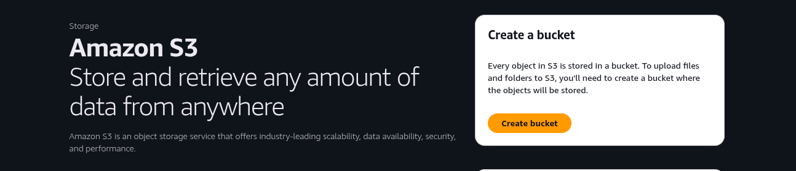
_Layanan Amazon S3 di dalam AWS Management Console._

### 2. Buat Bucket Baru

Klik tombol "Create bucket" untuk menginisiasi proses pembuatan bucket baru.

### 3. Konfigurasi Bucket

Berikan nama unik untuk bucket dan pilih Region AWS tempat bucket akan ditempatkan. Untuk keperluan panduan ini, konfigurasi lainnya dapat dibiarkan pada setelan default untuk kesederhanaan.

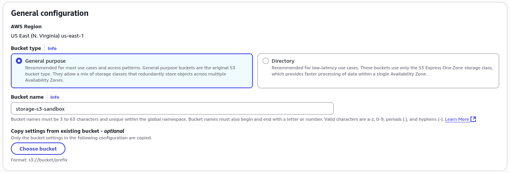
_Konfigurasi general untuk memulai proses pembuatan bucket baru._
    
### 4. Bucket Berhasil Dibuat

etelah proses selesai, bucket baru akan muncul di daftar bucket S3 Anda.

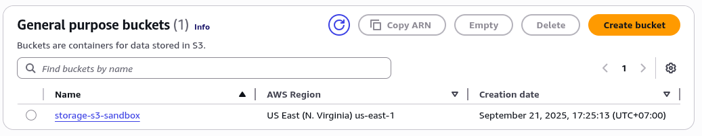
_Bucket yang baru dibuat muncul dalam daftar bucket S3 pengguna._

## Mengunggah Objek ke dalam Bucket

Setelah bucket dibuat, Anda dapat mulai mengunggah file (objek) ke dalamnya.

### 1. Masuk ke Bucket

Klik pada nama bucket yang diinginkan untuk membukanya.

### 2. Mulai Proses Unggah

Klik tombol "Upload" untuk menambahkan file ke dalam bucket.

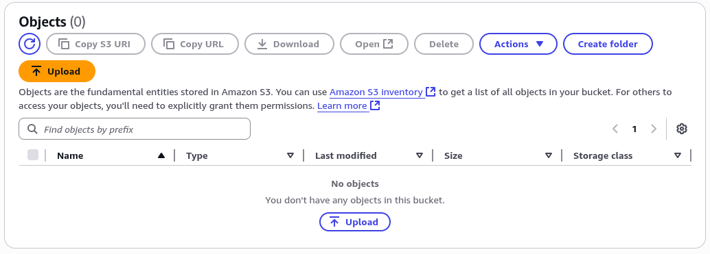
_Tombol Upload untuk menambahkan objek baru ke dalam bucket._

### 3. Pilih File

Pada dialog unggah, klik "Add files" atau "Add folder" untuk memilih file dari komputer lokal Anda yang akan diunggah.

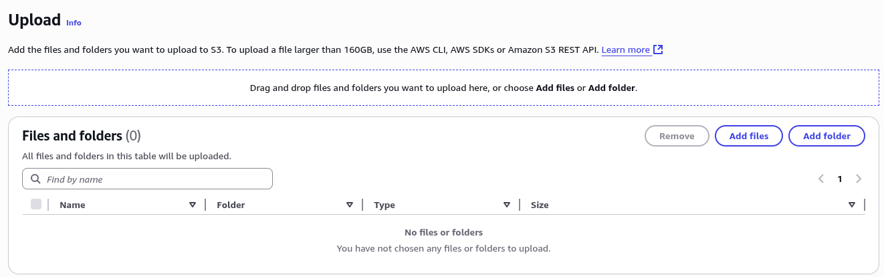
_Antarmuka untuk memilih file dari perangkat lokal untuk diunggah._

### 4. Mulai Unggah

Setelah file dipilih, klik tombol "Upload" di bagian bawah dialog untuk memulai proses transfer data.

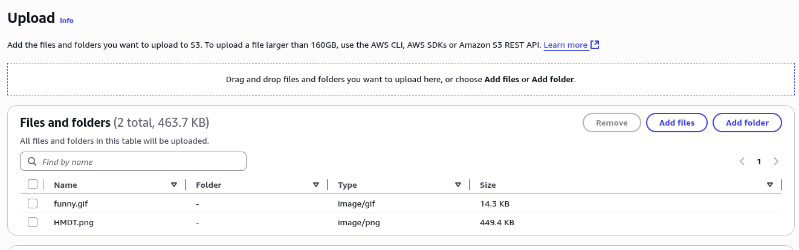
_Konfirmasi akhir untuk memulai proses pengunggahan objek._

### 5. Konfirmasi Status Unggah

Konsol S3 akan menampilkan status pengunggahan, yang menunjukkan keberhasilan atau kegagalan proses.

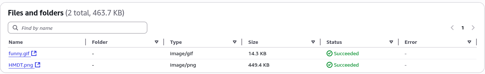
_Panel status yang mengonfirmasi bahwa objek telah berhasil diunggah._

## Mengelola Objek dan Izin

Secara default, semua objek yang diunggah ke bucket S3 baru adalah privat. Izin akses dapat dikonfigurasi pada tingkat bucket dan objek.

### 1. Properti Objek

Setelah diunggah, klik pada nama objek untuk melihat detailnya.

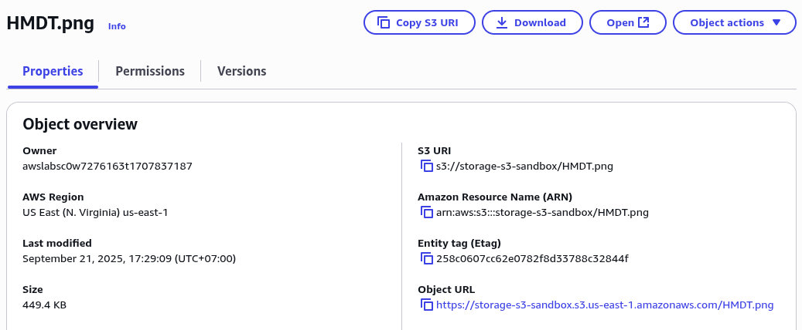
_Halaman properti objek yang menampilkan metadata seperti ukuran dan jenis file._

### 2. Melihat Objek yang Diunggah

Objek yang telah berhasil diunggah akan terdaftar di dalam bucket.

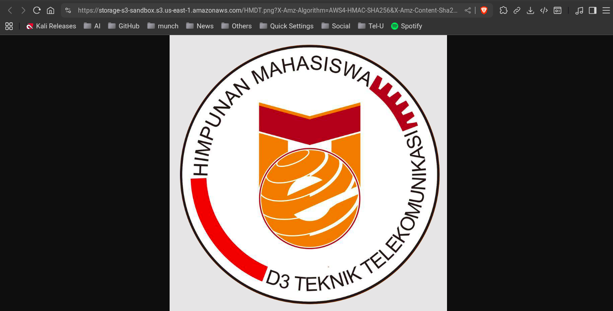
_Objek yang tersimpan di dalam bucket S3._

### 3. Izin Akses Objek

Tab "Permissions" pada halaman objek memungkinkan Anda mengonfigurasi kontrol akses. Dalam setelan default, status akses objek akan ditampilkan sebagai "AccessDenied".

    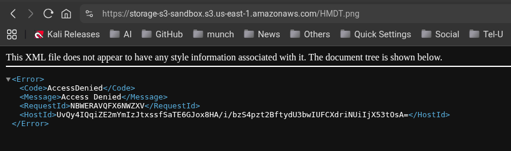
    _Pengaturan izin default pada objek S3 yang membatasi akses publik._

## Menghapus Objek

Anda dapat menghapus objek yang tidak diperlukan lagi untuk mengoptimalkan biaya penyimpanan.

### 1. Pilih dan Hapus Objek

Centang kotak di sebelah objek yang ingin dihapus, lalu klik tombol "Delete".

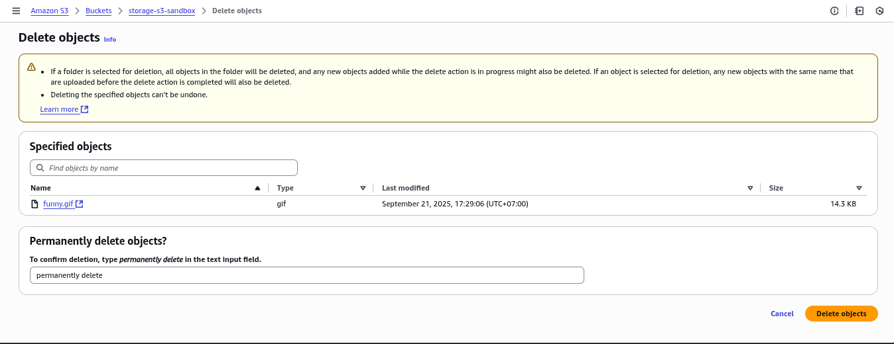
_Antarmuka untuk memilih dan menghapus satu atau beberapa objek dari bucket._

### 2. Konfirmasi Penghapusan

Sebuah dialog konfirmasi akan muncul. Ketik `permanently delete` untuk mengonfirmasi dan selesaikan penghapusan.

## Konfigurasi Bucket AWS S3 untuk Akses Publik

### 1. Identifikasi Masalah Akses Ditolak

Saat mencoba mengakses objek dalam bucket S3, pengguna mungkin mengalami error "Access Denied" yang menunjukkan bahwa kebijakan akses bucket saat ini membatasi akses publik.

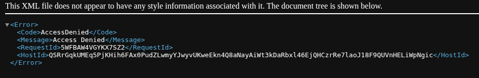
_Tampilan kesalahan "Access Denied" saat mencoba mengakses objek dalam bucket S3_

### 2. Mengubah Izin Bucket

Navigasi ke bagian **Permissions** pada konsol manajemen S3 untuk memodifikasi setelan akses bucket.

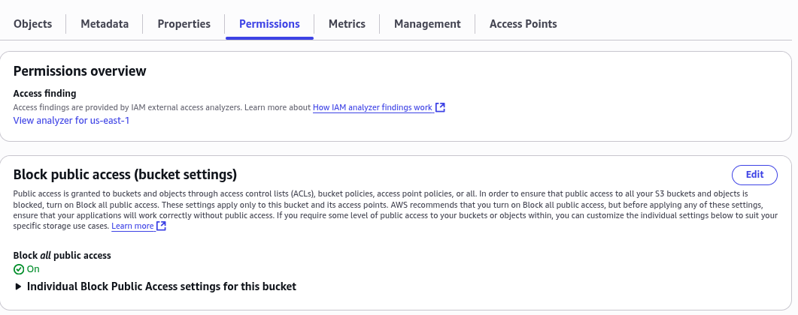
_Antarmuka konfigurasi izin bucket S3 pada konsol AWS_

### 3. Menonaktifkan Pemblokiran Akses Publik

Pada bagian **Block Public Access**, hapus centang pada semua opsi pemblokiran akses publik. Langkah ini diperlukan untuk mengizinkan konfigurasi kebijakan akses publik.

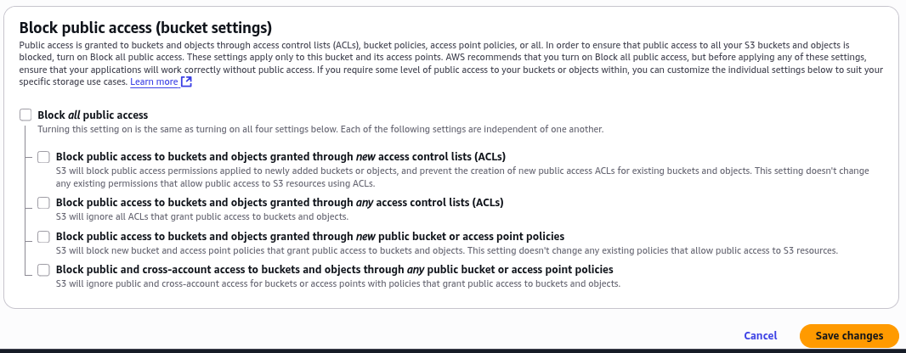
_Antarmuka pengaturan Block Public Access dengan opsi yang dinonaktifkan_

### 4. Mengedit Kebijakan Bucket

Akses editor kebijakan bucket melalui bagian **Bucket Policy** untuk menerapkan kebijakan akses yang baru.

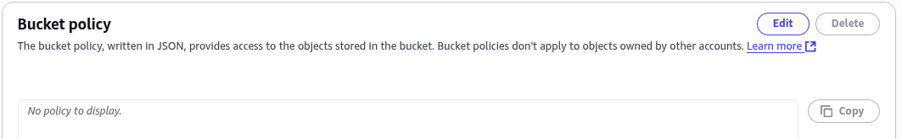
_Editor kebijakan bucket untuk memasukkan dokumen JSON kebijakan akses_

### 5. Menggunakan Contoh Kebijakan

AWS menyediakan contoh kebijakan yang telah terverifikasi untuk berbagai skenario akses. Pilih contoh yang sesuai dengan kebutuhan akses publik Anda.

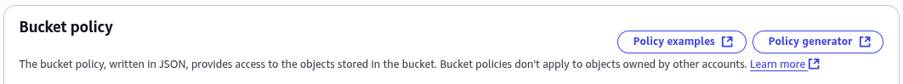
_Koleksi contoh kebijakan bucket yang disediakan AWS_

### 6. Generator Kebijakan S3

Gunakan **Policy Generator** untuk membuat kebijakan akses yang disesuaikan dengan kebutuhan spesifik. Alat ini menyediakan antarmuka intuitif untuk mengonfigurasi izin.

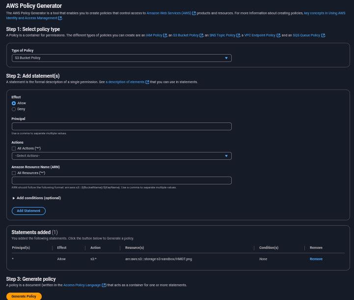
_Antarmuka Policy Generator untuk membuat kebijakan akses terkustomisasi_

### 7. Dokumen Kebijakan JSON

Hasil dari generator kebijakan adalah dokumen JSON yang berisi pernyataan izin yang diperlukan untuk mengaktifkan akses publik.

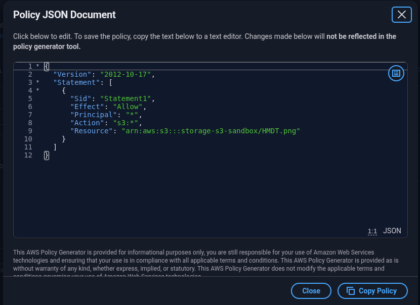
_Dokumen JSON yang berisi kebijakan akses yang telah dibuat_

### 8. Menerapkan Kebijakan Bucket

Salin dan tempel dokumen JSON kebijakan ke editor kebijakan bucket, lalu simpan perubahan untuk menerapkan kebijakan baru.

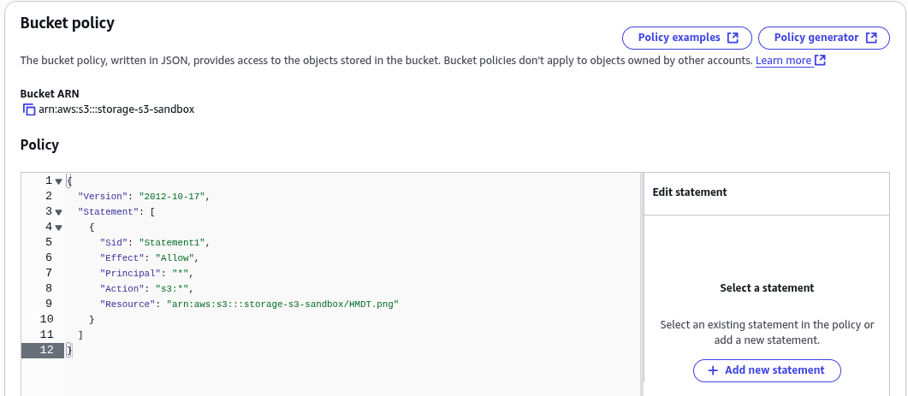
_Editor kebijakan bucket dengan dokumen JSON yang telah ditempelkan_

### 9. Verifikasi Akses Publik

Setelah kebijakan diterapkan, status bucket akan berubah menunjukkan bahwa bucket sekarang mengizinkan akses publik. Objek dalam bucket sekarang dapat diakses secara publik.

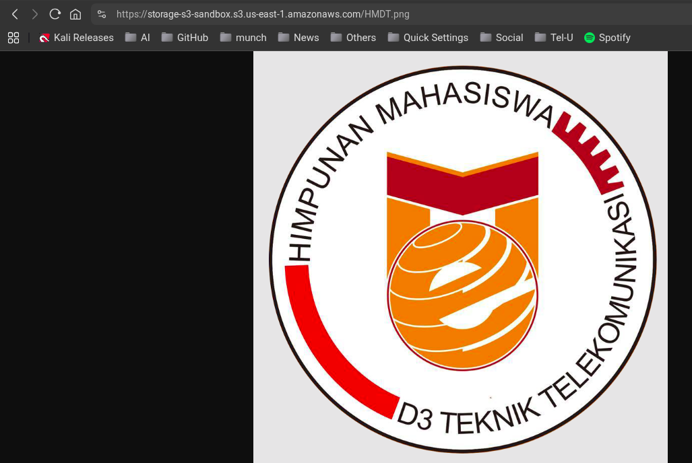
_Tampilan bucket S3 yang telah dikonfigurasi untuk akses publik_

### Catatan Keamanan

- Akses publik ke bucket S3 harus dikonfigurasi dengan hati-hati untuk menghindari paparan data yang tidak diinginkan
- Selalu tinjau kebijakan akses secara berkala untuk memastikan hanya data yang dimaksudkan yang dapat diakses publik
- Pertimbangkan menggunakan CloudFront dan signed URLs untuk skenario yang memerlukan akses terkontrol ke konten publik

## Membuat Website Statis dengan Amazon S3

Amazon Simple Storage Service (S3) menyediakan kemampuan hosting website statis yang mudah dikonfigurasi dan skalabel. Berikut adalah panduan langkah demi langkah untuk mengonfigurasi bucket S3 sebagai website statis.

### Langkah 1: Konfigurasi Bucket S3 untuk Akses Publik

Sebelum memulai, pastikan Anda telah mengonfigurasi bucket S3 untuk akses publik dengan mengikuti [panduan berikut](https://docs.ricalnet.my.id/posts/amazon-s3/#konfigurasi-bucket-aws-s3-untuk-akses-publik).

### Langkah 2: Mengaktifkan Static Website Hosting

1. **Masuk ke Properties Bucket**
   Navigasi ke konsol AWS S3, pilih bucket yang ingin dikonfigurasi, dan buka tab **Properties**.

   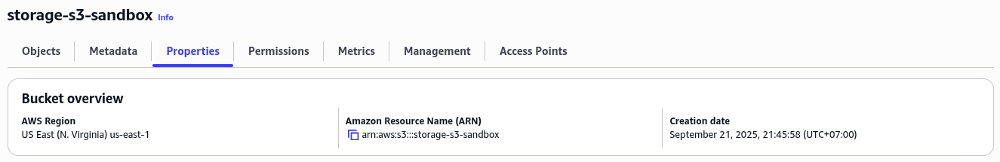
   _Menu Properties pada bucket S3_

2. **Aktifkan Static Website Hosting**
   Scroll ke bagian bawah halaman properties dan cari opsi **Static website hosting**. Klik tombol **Edit** untuk mengonfigurasi pengaturan.

3. **Konfigurasi Endpoint Website**
   - Pilih opsi **Enable**
   - Tentukan nama file index document (default: index.html)
   - Opsional: tentukan nama file error document
   - Simpan perubahan

   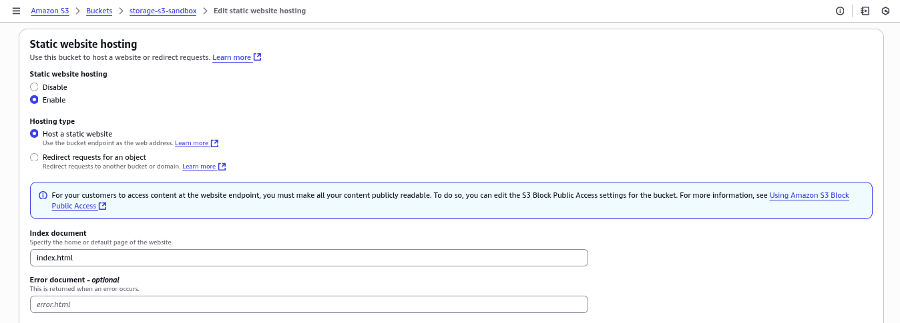
   _Opsi Static website hosting pada Properties bucket_

   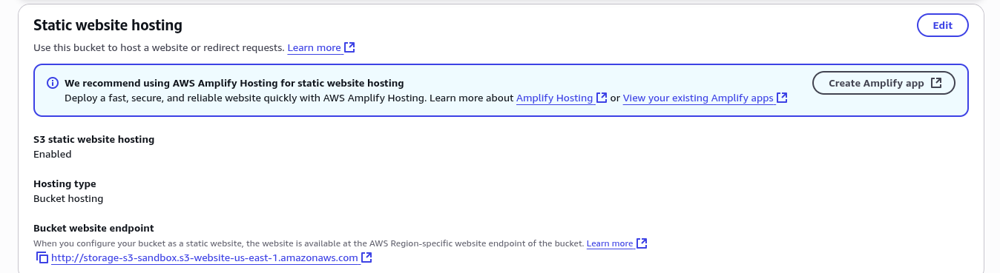
   _Bucket website endpoint yang dihasilkan setelah konfigurasi_

### Langkah 3: Membuat File Website

Buat file `index.html` di lokal komputer Anda dengan konten berikut:

```html
<html>
    <head>
        <title>Website Pertama Saya di S3</title>
        <meta charset="UTF-8">
        <meta name="description" content="Website statis hosting di Amazon S3">
    </head>
    <body>
        <h1>Logo HMDT</h1>
        <p>Selamat datang di website statis pertama yang dihosting di Amazon S3</p>
    </body>

    
</html>
```

> Pastikan nama file pada atribut `src` di tag `` sesuai dengan nama file yang akan diunggah ke bucket S3.
{: .prompt-info}

### Langkah 4: Mengunggah File ke Bucket S3

1. Unggah file `index.html` dan `HMDT.png` ke bucket S3
2. Pastikan kedua file berada pada level direktori yang sama (root bucket)

   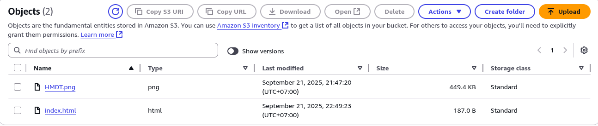
   _File index.html dan HMDT.png berada di root bucket S3_

### Langkah 5: Mengakses Website

Akses website melalui URL endpoint yang ditampilkan pada bagian Static website hosting. URL akan mengikuti format:

```
http://[nama-bucket].s3-website-[region].amazonaws.com
```

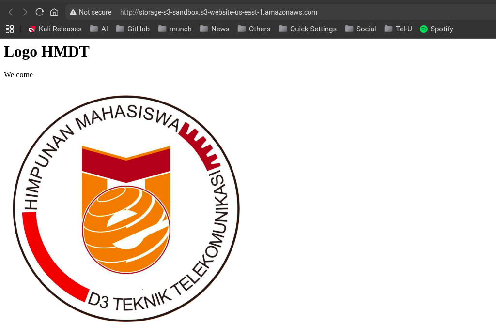
_Tampilan website yang diakses melalui S3 website endpoint_

### Pertimbangan Keamanan

- Pastikan kebijakan IAM dan bucket policy dikonfigurasi dengan benar untuk mengontrol akses
- Pertimbangkan menggunakan CloudFront untuk distribusi konten yang lebih aman dan cepat
- Gunakan S3 Block Public Access features sesuai kebutuhan keamanan Anda