## Pendahuluan
Application Load Balancer (ALB) merupakan layanan penyeimbang beban tingkat aplikasi yang disediakan oleh Amazon Web Services (AWS). Layanan ini beroperasi pada lapisan ketujuh model OSI dan dirancang untuk mendistribusikan lalu lintas aplikasi web secara dinamis across multiple target, seperti instance Amazon EC2, kontainer, dan alamat IP.

## Konfigurasi Instance EC2

### Pembuatan Instance Ganda
Proses dimulai dengan membuat dua instance EC2 secara simultan melalui AWS Management Console. Konfigurasi ini memastikan ketersediaan tinggi dan mendukung arsitektur fault-tolerant.

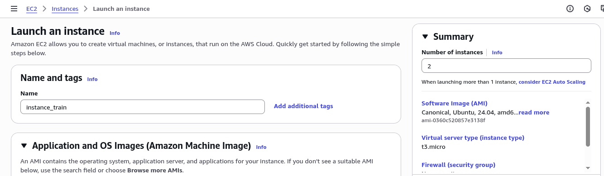
_Antarmuka pembuatan instance EC2 pada AWS Management Console_

### Pengaturan Jaringan dan Key Pair
Pada tahap konfigurasi jaringan, penting untuk memastikan instance terletak dalam Virtual Private Cloud (VPC) yang sesuai dengan pengaturan keamanan yang diperlukan. Pemilihan key pair yang tepat diperlukan untuk mengamankan akses SSH.

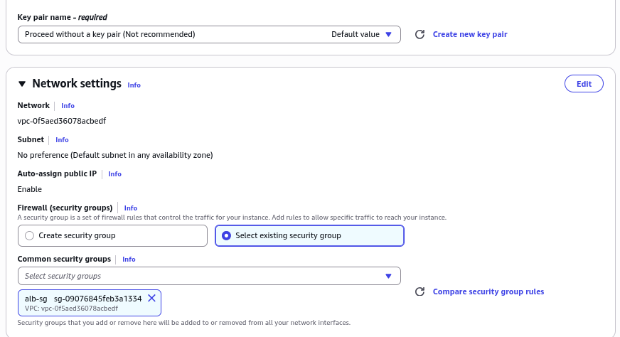
_Konfigurasi pengaturan jaringan dan pemilihan key pair_

### Konfigurasi Data Pengguna
User data digunakan untuk melakukan otomatisasi konfigurasi instance saat proses boot. Skrip berikut menginstal dan mengonfigurasi server web Apache:

```bash
#!/bin/bash

apt-get update -y
apt-get upgrade -y

apt-get install -y apache2

systemctl enable apache2
systemctl start apache2

echo "<h1>Hello World from $(hostname -f)</h1>" > /var/www/html/index.html

systemctl restart apache2
```

### Penamaan dan Pengelompokan Instance
Pemberian nama yang deskriptif pada setiap instance memudahkan identifikasi dan manajemen dalam lingkungan dengan banyak sumber daya.

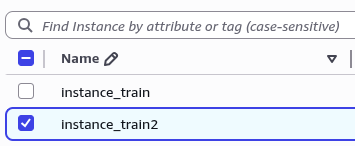
_Proses pemberian nama pada instance EC2_

### Konfigurasi Security Group
Security Group harus dikonfigurasi untuk mengizinkan lalu lintas HTTP pada port 80 guna memastikan akses web yang tepat.

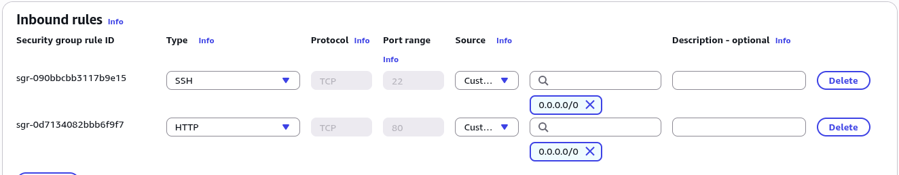
_Konfigurasi aturan masuk untuk lalu lintas HTTP_

## Implementasi Application Load Balancer

### Inisiasi Load Balancer
ALB dibuat melalui konsol AWS dengan memilih layanan Load Balancer.

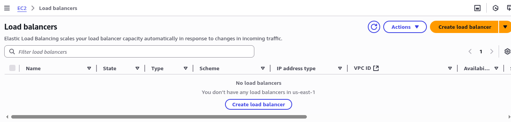
_Antarmuka konsol Load Balancer_

### Seleksi Tipe Load Balancer
Application Load Balancer dipilih karena kemampuannya menangani lalu lintas HTTP/HTTPS dan mendukung fitur advanced routing.

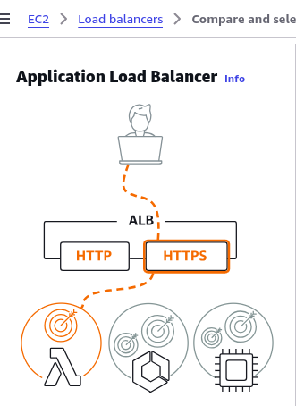
_Antarmuka pemilihan jenis load balancer pada AWS_

### Penamaan dan Zona Ketersediaan
ALB memerlukan penamaan yang unik dan harus diletakkan pada minimal dua Availability Zone (AZ) berbeda untuk memastikan redundansi dan ketersediaan tinggi.

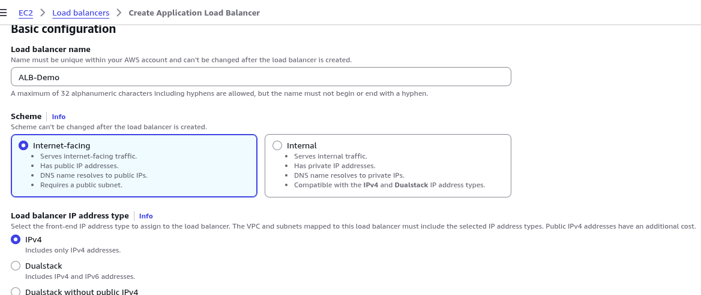
_Proses penamaan ALB_

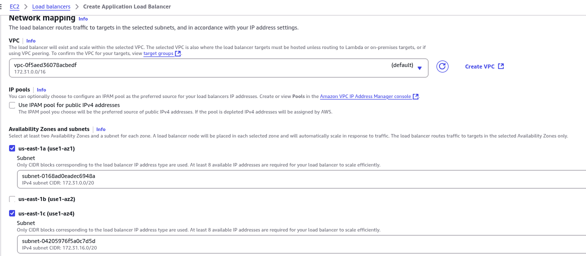
_Seleksi Availability Zone_


### Konfigurasi Security Group untuk ALB
Security Group khusus dibuat untuk ALB guna mengontrol lalu lintas yang diizinkan mengakses load balancer.

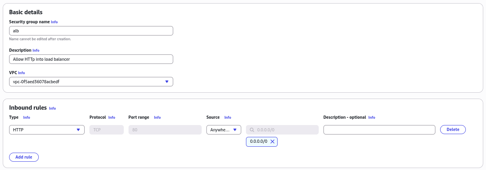
_Pembuatan Security Group khusus untuk Application Load Balancer_

### Pembuatan Target Group
Target Group berfungsi sebagai kelompok tujuan yang menerima lalu lintas dari ALB. Konfigurasi meliputi penentuan protokol, port, dan pemeriksaan kesehatan.

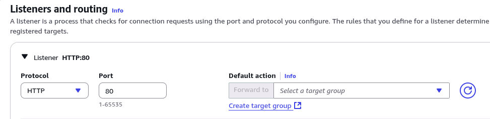
_Antarmuka konfigurasi Listeners and routing_

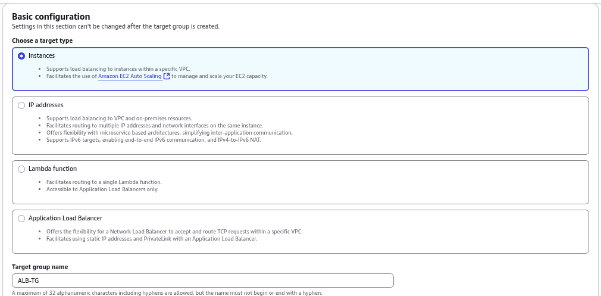
_Antarmuka konfigurasi Target Group_

### Registrasi Target
Instance EC2 yang telah dibuat didaftarkan sebagai target dalam Target Group.

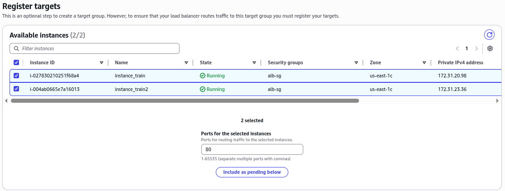
_Proses registrasi instance EC2 sebagai target dalam Target Group_

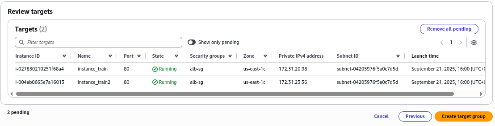
_Proses registrasi instance EC2 sebagai target dalam Target Group_

### Penyelesaian Konfigurasi ALB
Setelah Target Group berhasil dibuat, ALB dikonfigurasi untuk mengarahkan lalu lintas ke target group tersebut.

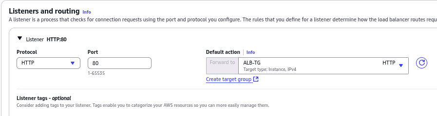
_Penyelesaian konfigurasi dengan menghubungkan ALB ke Target Group_

## Validasi dan Pengujian

### DNS Endpoint ALB
Setelah berhasil dibuat, ALB menyediakan endpoint DNS yang digunakan untuk mengakses aplikasi. Endpoint ini akan secara otomatis mendistribusikan lalu lintas ke instance yang sehat.

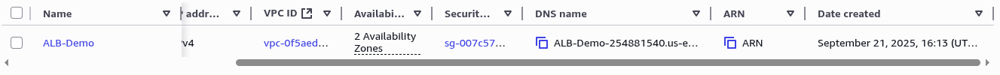
_Endpoint DNS yang dihasilkan untuk mengakses Application Load Balancer_

### Pengujian Load Balancing
Akses berulang ke endpoint DNS akan menunjukkan respons dari instance, membuktikan bahwa lalu lintas didistribusikan secara acak (round-robin).

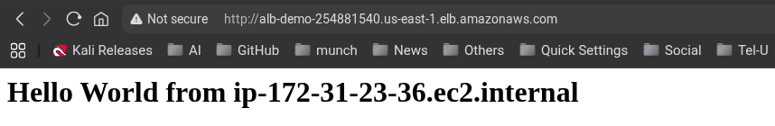
_Hasil akses yang menunjukkan respons dari hostname instance_

### Uji Ketersediaan Tinggi
Untuk menguji kemampuan failover, salah satu instance dihentikan. ALB secara otomatis mendeteksi perubahan status kesehatan dan mengalihkan lalu lintas ke instance yang masih berjalan.

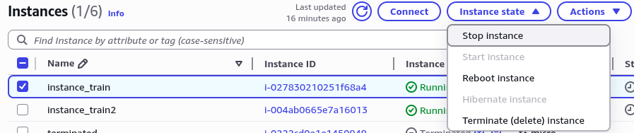
_Proses penghentian (stop) salah satu instance EC2_

### Monitoring Status Kesehatan
Target Group secara kontinu memantau status kesehatan target. instance yang dihentikan akan menunjukkan status tidak digunakan (Unused), sementara instance lain tetap melayani lalu lintas.

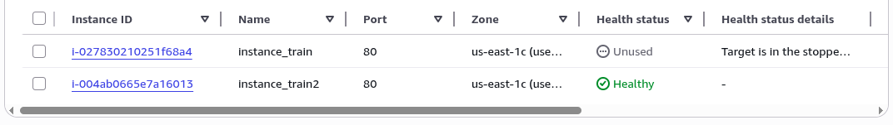
_Tampilan status kesehatan target dalam Target Group_

## Pemulihan dan Kesimpulan
Setelah instance yang dihentikan diaktifkan kembali, ALB secara otomatis akan mendeteksi pemulihan status kesehatan dan kembali memasukkan instance tersebut ke dalam rotasi layanan. Mekanisme ini menunjukkan kemampuan ALB dalam menjaga ketersediaan layanan secara otomatis tanpa intervensi manual.

## ACF Lab: Scale and Load Balance Your Architecture

### Arsitektur awal

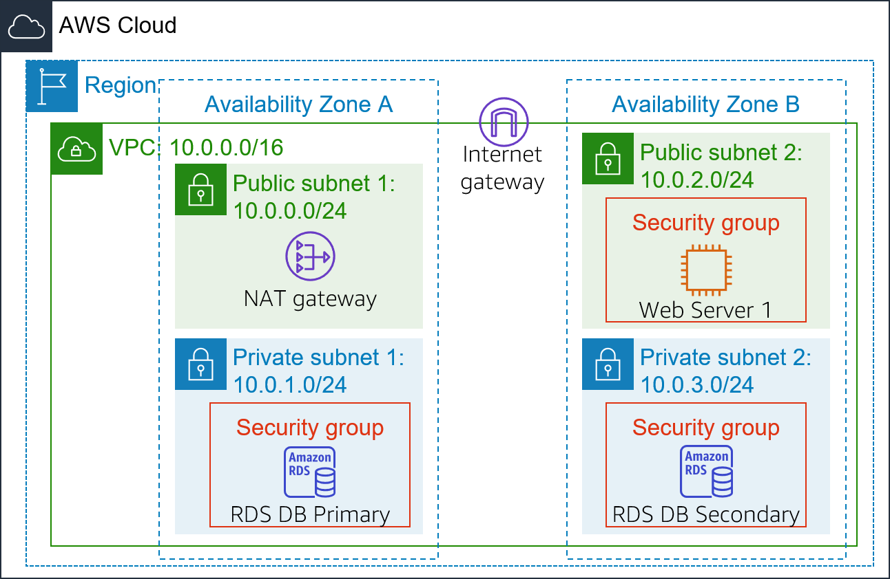

### Arsitektur akhir

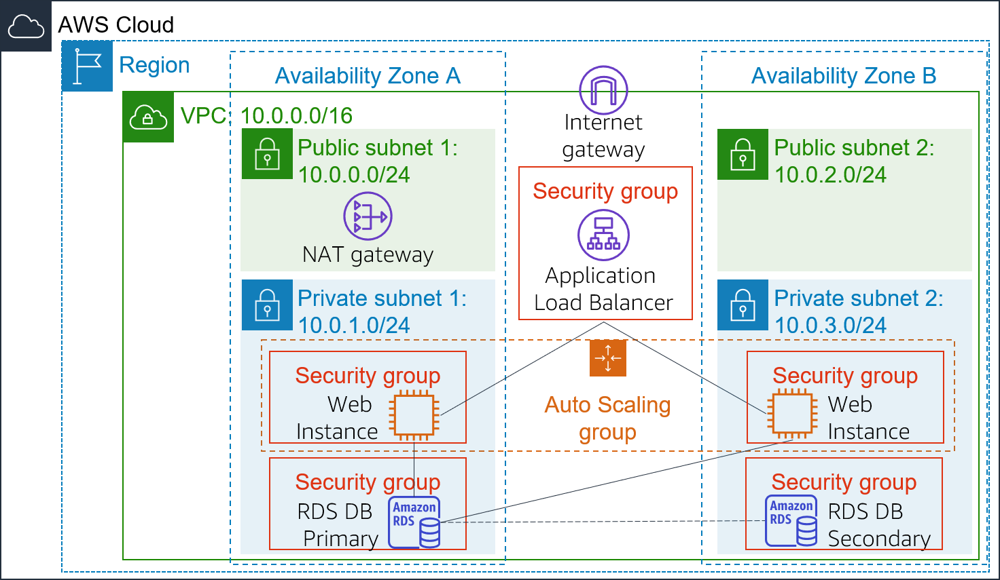

### Tugas 1: Membuat AMI untuk Auto Scaling

Dalam tugas ini, Anda akan membuat AMI dari Web Server 1 yang sudah ada. Ini akan menyimpan konten disk boot sehingga instance baru dapat diluncurkan dengan konten yang identik.

1.  Di Konsol Manajemen AWS, pada kotak pencarian di samping **Services**, cari dan pilih **EC2**.
2.  Di panel navigasi kiri, pilih **Instances**.
3.  Pertama, Anda akan memastikan bahwa instance sedang berjalan.

    >  Tunggu hingga **Status Checks** untuk Web Server 1 menampilkan **2/2 checks passed**. Jika perlu, pilih **refresh** untuk memperbarui status. Anda sekarang akan membuat AMI berdasarkan instance ini.
    {: .prompt-info}

4.  Pilih **Web Server 1**.
5.  Pada menu **Actions**, pilih **Image and templates** > **Create image**, lalu konfigurasikan:
    *   **Image name**: `WebServerAMI`
    *   **Image description**: `Lab AMI for Web Server`
        
        
        

6.  Pilih **Create image**
7.  Spanduk konfirmasi akan menampilkan ID AMI untuk AMI baru Anda.
    

8.  Anda akan menggunakan AMI ini saat meluncurkan grup Auto Scaling nanti di lab.

### Tugas 2: Membuat Load Balancer

Dalam tugas ini, Anda pertama akan membuat target group dan kemudian membuat load balancer yang dapat menyeimbangkan lalu lintas di beberapa instance EC2 dan Availability Zone.

1.  Di panel navigasi kiri, pilih **Target Groups**.

    > Target Group mendefinisikan ke mana lalu lintas yang masuk ke Load Balancer akan dikirim. Application Load Balancer dapat mengirim lalu lintas ke beberapa Target Group berdasarkan URL permintaan yang masuk, seperti mengirim permintaan dari aplikasi seluler ke set server yang berbeda. Aplikasi web Anda akan menggunakan satu Target Group.
    {: .prompt-info}

2.  Pilih **Create target group**
3.  Konfigurasikan:
    *   **Target type**: **Instances**
    *   **Target group name**, masukkan: `LabGroup`
        

    *   Pilih **Lab VPC** dari menu drop-down VPC.
        

4.  Pilih **Next**. Layar **Register targets** akan muncul.

    > Target adalah instance individu yang akan merespons permintaan dari Load Balancer.
    {: .prompt-info}

    > Anda belum memiliki instance aplikasi web, jadi langkah ini dapat dilewati.
    {: .prompt-tip}

5.  Tinjau pengaturan dan pilih **Create target group**
6.  Di panel navigasi kiri, pilih **Load Balancers**.
7.  Di bagian atas layar, pilih **Create load balancer**.
    
    > Beberapa jenis load balancer ditampilkan. Anda akan menggunakan Application Load Balancer yang beroperasi pada tingkat permintaan (layer 7), mengarahkan lalu lintas ke target — instance EC2, container, alamat IP, dan fungsi Lambda — berdasarkan konten permintaan.
    {: .prompt-info}

    

8.  Di bawah **Application Load Balancer**, pilih **Create**
9.  Di bawah **Load balancer name**, masukkan: `LabELB`
10. Gulir ke bawah ke bagian **Network mapping**, lalu:
    *   Untuk **VPC**, pilih **Lab VPC**
    
        > Anda akan menentukan subnet mana yang akan digunakan Load Balancer. Load balancer akan bersifat internet facing, jadi Anda akan memilih kedua **Public Subnet**.
        {: .prompt-tip}

    *   Pilih Availability Zone pertama yang ditampilkan, lalu pilih **Public Subnet 1** dari menu drop-down **Subnet** yang muncul di bawahnya.
    *   Pilih Availability Zone kedua yang ditampilkan, lalu pilih **Public Subnet 2** dari menu drop-down **Subnet** yang muncul di bawahnya.

    *   Anda sekarang seharusnya memiliki dua subnet yang dipilih: **Public Subnet 1** dan **Public Subnet 2**.

        

11. Di bagian **Security groups**:
    *   Pilih menu drop-down **Security groups** dan pilih **Web Security Group**.
    *   Di bawah menu drop-down, pilih **X** di sebelah security group default untuk menghapusnya.
    *   Security group **Web Security Group** sekarang seharusnya satu-satunya yang muncul.
        
  
12. Untuk baris **Listener HTTP:80**, atur **Default action** menjadi **forward to LabGroup**.
    

13. Gulir ke bawah dan pilih **Create load balancer**
    > Load balancer berhasil dibuat.
    {: .prompt-info}

14. Pilih **View load balancer**
    > Load balancer akan menampilkan status **provisioning**. Tidak perlu menunggu hingga siap. Silakan lanjutkan dengan tugas berikutnya.
    {: .prompt-tip}

### Tugas 3: Membuat Launch Template dan Auto Scaling Group

Dalam tugas ini, Anda akan membuat launch template untuk grup Auto Scaling Anda. Launch template adalah template yang digunakan grup Auto Scaling untuk meluncurkan instance EC2. Saat membuat launch template, Anda menentukan informasi untuk instance seperti AMI, tipe instance, key pair, dan security group.

1.  Di panel navigasi kiri, pilih **Launch Templates**.
2.  Pilih **Create launch template**
3.  Konfigurasikan pengaturan launch template dan buat:
    *   **Launch template name**: `LabConfig`
    *   Di bawah **Auto Scaling guidance**, pilih **Provide guidance to help me set up a template that I can use with EC2 Auto Scaling**.
        
  
    *   Di area **Application and OS Images (Amazon Machine Image)**, pilih **My AMIs**.
    *   **Amazon Machine Image (AMI)**: pilih **WebServerAMI**.
        

    *   **Instance type**: pilih **t2.micro**.
    *   **Key pair name**: pilih **vockey**.
        

    *   **Firewall (security groups)**: pilih **Select existing security group**.
    *   **Security groups**: pilih **Web Security Group**.
        
  
    *   Gulir ke bawah ke area **Advanced details** dan perluas.
    *   Gulir ke bawah ke pengaturan **Detailed CloudWatch monitoring**. Pilih **Enable**.
        

        > Ini akan memungkinkan Auto Scaling bereaksi cepat terhadap perubahan utilisasi.
        {: .prompt-info}

    *   Pilih **Create launch template**
    *   Selanjutnya, Anda akan membuat grup Auto Scaling yang menggunakan launch template ini.
4.  Dalam dialog **Success**, pilih launch template **LabConfig**.
5.  Dari menu **Actions**, pilih **Create Auto Scaling group**
    

6.  Konfigurasikan detail di **Langkah 1 (Choose launch template)**:
    *   **Auto Scaling group name**: `Lab Auto Scaling Group`
    *   **Launch template**: konfirmasi bahwa template **LabConfig** yang baru saja Anda buat dipilih.
        

    *   Pilih **Next**
7.  Konfigurasikan detail di **Langkah 2 (Choose instance launch options)**:
    *   **VPC**: pilih **Lab VPC**
    *   **Availability Zones and subnets**: Pilih **Private Subnet 1** dan kemudian **Private Subnet 2**.
        

    *   Pilih **Next**
8.  Konfigurasikan detail di **Langkah 3 (Configure advanced options)**:
    *   Pilih **Attach to an existing load balancer**
        *   **Existing load balancer target groups**: pilih **LabGroup**.
            

    *   Di panel **Additional settings**:
        *   Pilih **Enable group metrics collection within CloudWatch**
            

            > Ini akan menangkap metrik pada interval 1-menit, yang memungkinkan Auto Scaling bereaksi cepat terhadap pola penggunaan yang berubah.
            {: .prompt-info}

    *   Pilih **Next**
9.  Konfigurasikan detail di **Langkah 4 (Configure group size and scaling policies - optional)**:
    *   Di bawah **Group size**, konfigurasikan:
        *   **Desired capacity**: `2`
        *   **Minimum capacity**: `2`
        *   **Maximum capacity**: `6`
            

            > Ini akan memungkinkan Auto Scaling secara otomatis menambah/menghapus instance, selalu menjaga antara 2 hingga 6 instance yang berjalan.
            {: .prompt-info}

    *   Di bawah **Scaling policies**, pilih **Target tracking scaling policy** dan konfigurasikan:
        *   **Scaling policy name**: `LabScalingPolicy`
        *   **Metric type**: **Average CPU Utilization**
        *   **Target value**: `60`
            

            > Ini memberi tahu Auto Scaling untuk mempertahankan utilisasi CPU rata-rata di semua instance pada 60%. Auto Scaling akan secara otomatis menambah atau mengurangi kapasitas sesuai kebutuhan untuk menjaga metrik pada atau mendekati nilai target yang ditentukan. Ini menyesuaikan dengan fluktuasi dalam metrik karena pola beban yang berfluktuasi.
            {: .prompt-info}

    *   Pilih **Next**
10. Konfigurasikan detail di **Langkah 5 (Add notifications - optional)**:
    
    > Auto Scaling dapat mengirim notifikasi ketika peristiwa scaling terjadi. Anda akan menggunakan pengaturan default.
    {: .prompt-info}

    *   Pilih **Next**
11. Konfigurasikan detail di **Langkah 6 (Add tags - optional)**:
    
    > Tag yang diterapkan pada grup Auto Scaling akan secara otomatis disebarkan ke instance yang diluncurkan.
    {: .prompt-info}

    *   Pilih **Add tag** dan Konfigurasikan berikut:
        *   **Key**: `Name`
        *   **Value**: `Lab Instance`
            

    *   Pilih **Next**
12. Konfigurasikan detail di **Langkah 6 (Review)**:
    *   Tinjau detail grup Auto Scaling Anda.
    *   Pilih **Create Auto Scaling group**

        > Grup Auto Scaling Anda awalnya akan menampilkan jumlah instance nol, tetapi instance baru akan diluncurkan untuk mencapai **Desired count** sebanyak 2 instance.
        {: .prompt-info}

### Tugas 4: Verifikasi bahwa Load Balancing Berfungsi

Dalam tugas ini, Anda akan memverifikasi bahwa Load Balancing berfungsi dengan benar.

1.  Di panel navigasi kiri, pilih **Instances**.
    
    > Anda akan melihat dua instance baru bernama **Lab Instance**. Ini diluncurkan oleh Auto Scaling.
    {: .prompt-info}

    > Jika instance atau nama tidak ditampilkan, tunggu 30 detik dan pilih **refresh** di kanan atas.
    {: .prompt-tip}

    
  
2.  Selanjutnya, Anda akan memastikan bahwa instance baru telah lulus **Health Check** mereka.
3.  Di panel navigasi kiri, pilih **Target Groups**.
4.  Pilih **LabGroup**
5.  Pilih tab **Targets**.

    > Dua instance target bernama **Lab Instance** harus terdaftar dalam target group.
    {: .prompt-info}

6.  Tunggu hingga **Status** kedua instance berubah menjadi **healthy**.
    *   Pilih **Refresh** di kanan atas untuk memeriksa pembaruan jika perlu.
    *   **Healthy** menunjukkan bahwa instance telah lulus health check Load Balancer. Ini berarti Load Balancer akan mengirim lalu lintas ke instance.
        

7.  Anda sekarang dapat mengakses grup Auto Scaling melalui Load Balancer.
8.  Di panel navigasi kiri, pilih **Load Balancers**.
9.  Pilih load balancer **LabELB**.
10. Di panel **Details**, salin **DNS name** load balancer, pastikan untuk menghilangkan "(A Record)".
    *   Seharusnya terlihat seperti: `labelb-480774025.us-east-1.elb.amazonaws.com`
11. Buka tab browser web baru, tempel **DNS Name** yang baru saja disalin, dan tekan **Enter**.

    > Aplikasi akan muncul di browser Anda. Ini menunjukkan bahwa Load Balancer menerima permintaan, mengirimkannya ke salah satu instance EC2, lalu mengembalikan hasilnya.
    {: .prompt-info}

    

### Tugas 5: Menguji Auto Scaling

Anda membuat grup Auto Scaling dengan minimum dua instance dan maksimum enam instance. Saat ini dua instance sedang berjalan karena ukuran minimum adalah dua dan grup saat ini tidak di bawah beban apa pun. Anda sekarang akan meningkatkan beban untuk menyebabkan Auto Scaling menambah instance tambahan.

1.  Kembali ke Konsol Manajemen AWS.
  
    > Jangan tutup tab aplikasi — Anda akan kembali segera.
    {: .prompt-tip}

2.  Pada kotak pencarian di samping **Layanan**, cari dan pilih **CloudWatch**.
    

1.  Di panel navigasi kiri, pilih **All alarms**.
    
    > Dua alarm akan ditampilkan. Ini dibuat secara otomatis oleh grup Auto Scaling. Mereka akan secara otomatis menjaga beban CPU rata-rata mendekati 60% sambil tetap berada dalam batasan memiliki dua hingga enam instance.
    {: .prompt-info}    

    

    *   **Catatan**: Silakan ikuti langkah-langkah ini hanya jika Anda tidak melihat alarm dalam 60 detik.
        *   Pada menu **Layanan**, pilih **EC2**.
        *   Di panel navigasi kiri, pilih **Auto Scaling Groups**.
        *   Pilih **Lab Auto Scaling Group**.
        *   Di bagian bawah halaman, pilih tab **Automatic Scaling**.
        *   Pilih **LabScalingPolicy**.
        *   Pilih **Actions** dan **Edit**.
        *   Ubah **Target Value** menjadi `50`.
        *   Pilih **Update**
        *   Pada menu **Layanan**, pilih **CloudWatch**.
        *   Di panel navigasi kiri, pilih **All alarms** dan verifikasi Anda melihat dua alarm.
2.  Pilih alarm **OK**, yang memiliki **AlarmHigh** dalam namanya.
    

    > Jika tidak ada alarm yang menunjukkan **OK**, tunggu satu menit lalu pilih **refresh** di kanan atas hingga status alarm berubah.
    {: .prompt-tip}

    > **OK** menunjukkan bahwa alarm belum terpicu. Ini adalah alarm untuk **CPU Utilization > 60**, yang akan menambah instance ketika CPU rata-rata tinggi. Grafik seharusnya menunjukkan tingkat CPU yang sangat rendah saat ini.
    {: .prompt-info}

3.  Anda sekarang akan memerintahkan aplikasi untuk melakukan kalkulasi yang seharusnya meningkatkan tingkat CPU.
4.  Kembali ke tab browser dengan aplikasi web.
5.  Pilih **Load Test** di samping logo AWS.
    

    > Ini akan menyebabkan aplikasi menghasilkan beban tinggi. Halaman browser akan secara otomatis menyegarkan sehingga semua instance dalam grup Auto Scaling akan menghasilkan beban.
    {: .prompt-info}

    > Jangan tutup tab ini.
    {: .prompt-tip}

6.  Kembali ke tab browser dengan konsol CloudWatch.

    > Dalam kurang dari 5 menit, alarm **AlarmLow** harus berubah menjadi **OK** dan status alarm **AlarmHigh** harus berubah menjadi **In alarm**.
    {: .prompt-info}

    > Anda dapat memilih **Refresh** di kanan atas setiap 60 detik untuk memperbarui tampilan.
    {: .prompt-tip}

    > Anda akan melihat grafik **AlarmHigh** yang menunjukkan peningkatan persentase CPU. Setelah melewati garis 60% selama lebih dari 3 menit, itu akan memicu Auto Scaling untuk menambah instance tambahan.
    {: .prompt-info}

7.  Tunggu hingga alarm **AlarmHigh** memasuki status **In alarm**.
    

8.  Pada kotak pencarian di samping **Services**, cari dan pilih **EC2**.
9.  Di panel navigasi kiri, pilih **Instances**.
    
    > Lebih dari dua instance berlabel **Lab Instance** sekarang seharusnya berjalan. Instance baru dibuat oleh Auto Scaling sebagai respons terhadap alarm CloudWatch.
    {: .prompt-info}

### Tugas 6: Menghentikan Web Server 1

Dalam tugas ini, Anda akan menghentikan Web Server 1. Instance ini digunakan untuk membuat AMI yang digunakan oleh grup Auto Scaling Anda, tetapi sudah tidak diperlukan lagi.

1.  Pilih **Web Server 1** (dan pastikan itu adalah satu-satunya instance yang dipilih).
2.  Pada menu **Instance state**, pilih **Instance State** > **Terminate Instance**.
3.  Pilih **Terminate**
    