## Pendahuluan

Amazon Relational Database Service (Amazon RDS) adalah layanan web yang memudahkan penyiapan, pengoperasian, dan penskalaan database relasional di cloud. Layanan ini menyediakan kapasitas yang hemat biaya dan dapat diatur skalanya sambil mengotomatiskan tugas-tugas administrasi yang memakan waktu, seperti pengerahan perangkat keras, setup database, patch, dan backup.

## Pembuatan Instance Database

### Akses Konsol Amazon RDS
Pengguna dapat mengakses layanan Amazon RDS melalui konsol manajemen AWS. Dari halaman layanan, pilih "Aurora and RDS" untuk masuk ke dashboard database.

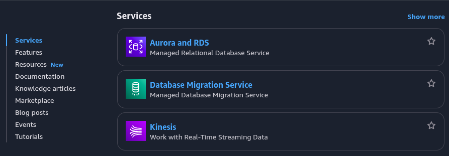
_Halaman layanan AWS untuk memilih Amazon RDS_

### Inisiasi Proses Pembuatan Database
Pada dashboard RDS, pilih opsi "Create database" untuk memulai proses konfigurasi instance database baru.

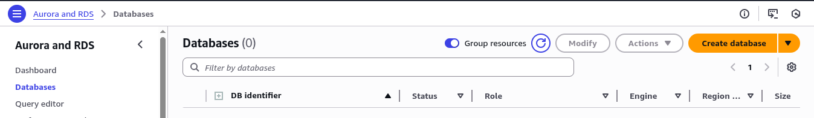
_Dashboard Amazon RDS dengan opsi Create Database_

### Pemilihan Mesin Database
Langkah ini melibatkan pemilihan jenis mesin database (engine) yang diinginkan, seperti MySQL, PostgreSQL, MariaDB, Oracle, atau Microsoft SQL Server. Setiap engine memiliki karakteristik dan versi yang berbeda.

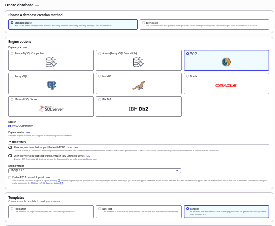
_Formulir pembuatan database dengan pilihan engine database_

### Pengaturan Kredensial
Konfigurasi kredensial akses utama untuk database wajib dilakukan. Tentukan nama pengguna (master username) dan kata sandi (master password) yang kuat. Kredensial ini digunakan untuk otentikasi akses administratif ke database.

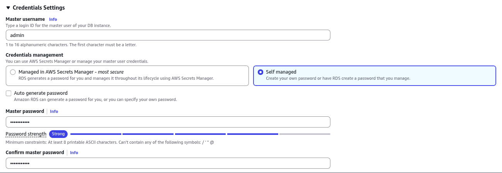
_Pengaturan kredensial master username dan password_

### Konfigurasi Jaringan dan Keamanan
Pada bagian konfigurasi konektivitas, tentukan pengaturan jaringan virtual.
- **DB subnet group:** Disarankan untuk mengatur akses publik (public access) sesuai kebutuhan. Mengizinkan akses publik memungkinkan koneksi dari internet, yang memerlukan pertimbangan keamanan tambahan.
- **VPC security group (firewall):** Buat security group baru atau pilih yang sudah ada untuk mengontrol lalu lintas yang diizinkan mengakses instance database. Security group berfungsi sebagai firewall virtual.

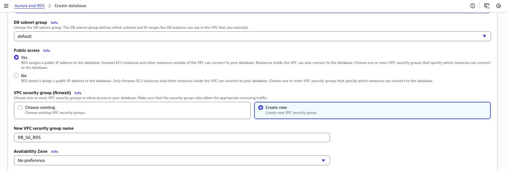
_Konfigurasi konektivitas jaringan dan security group_

Setelah konfigurasi selesai, pilih "Create database" untuk memulai proses pengerahan instance. Penyediaan instance database biasanya memerlukan waktu beberapa menit.

### Instance Database yang Berhasil Dibuat
Setelah proses selesai, instance database baru akan ditampilkan dalam status "Available". Detail instance, termasuk endpoint koneksi, akan tersedia untuk digunakan.

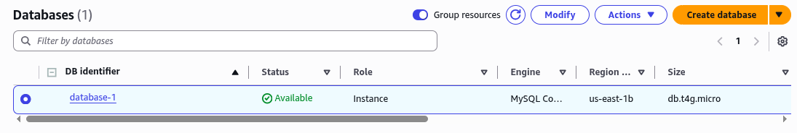
_Instance database berhasil dibuat dengan status Available_

Informasi konektivitas dan keamanan, seperti endpoint dan security group yang terasosiasi, dapat dilihat pada bagian "Connectivity & security". Endpoint ini diperlukan oleh aplikasi untuk terhubung ke database.

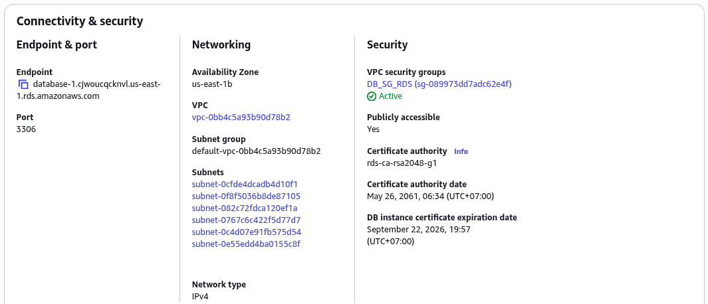
_Detail informasi konektivitas dan keamanan database_

### Konfigurasi Security Group
Untuk mengizinkan koneksi, aturan inbound pada security group yang terasosiasi harus dikonfigurasi. Misalnya, menambahkan aturan yang mengizinkan koneksi TCP pada port database (default: 3306 untuk MySQL) dari alamat IP tertentu atau rentang IP yang diizinkan.

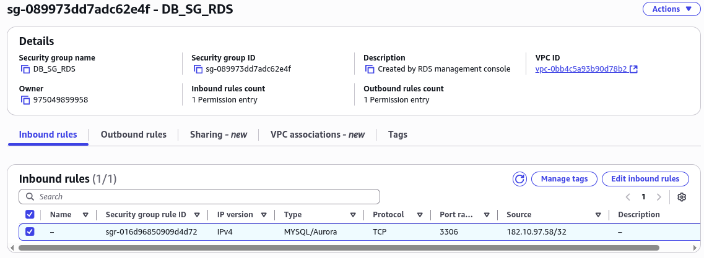
_Konfigurasi inbound rules pada security group untuk akses database_

## Pembuatan Snapshot Database

### Inisiasi Snapshot Manual
Amazon RDS memungkinkan pembuatan snapshot database secara manual. Snapshot adalah cadangan dari instance database pada titik waktu tertentu. Dari detail instance, pilih "Actions" lalu "Take snapshot".

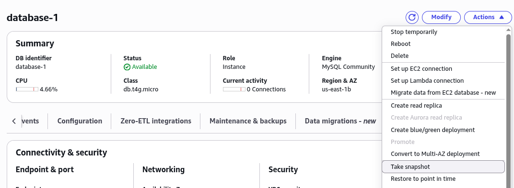
_Menu Actions untuk membuat snapshot manual_

### Penamaan Snapshot
Berikan nama yang deskriptif untuk snapshot yang akan dibuat. Nama ini membantu dalam mengidentifikasi snapshot di kemudian hari.

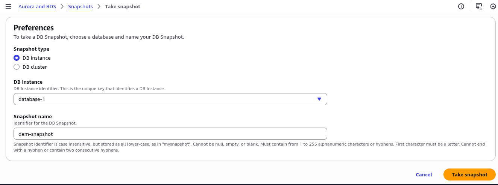
_Form penamaan snapshot database_

### Snapshot yang Berhasil Dibuat
Setelah proses selesai, snapshot akan muncul dalam daftar snapshot dengan status "Available". Snapshot ini disimpan secara mandiri dan dapat digunakan untuk memulihkan (restore) database ke keadaan saat snapshot dibuat.

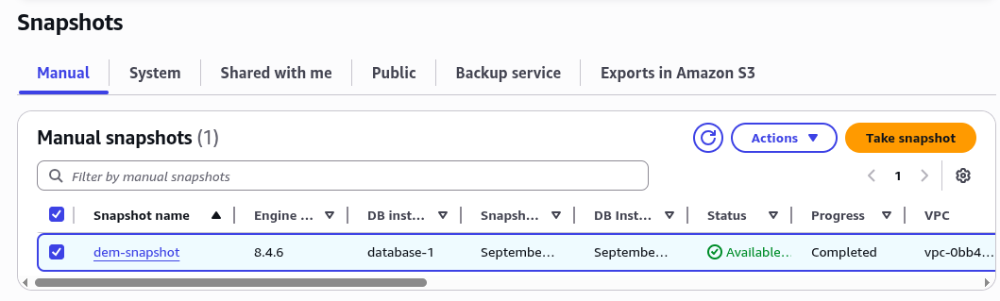
_Snapshot berhasil dibuat dengan status Available_

Snapshot yang telah dibuat dapat dilihat dan dikelola melalui bagian "Snapshots" di konsol RDS. Setiap snapshot menyimpan seluruh data dan objek database pada saat pembuatannya.

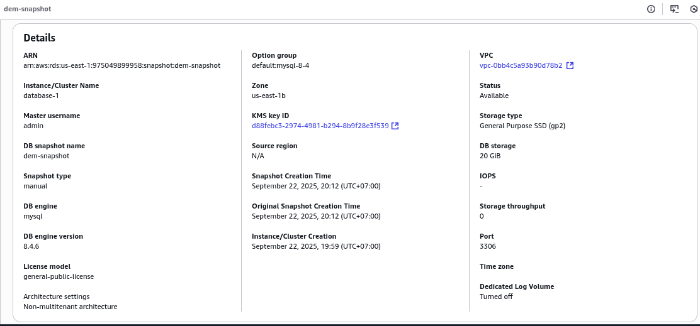
_Daftar snapshot yang tersedia untuk database instance_