## Pembuatan Amazon VPC

### Mengakses Layanan VPC

Proses konfigurasi dimulai dengan mengakses konsol layanan Amazon VPC melalui AWS Management Console. Pengguna dapat membuat VPC baru dengan menentukan parameter jaringan sesuai kebutuhan.

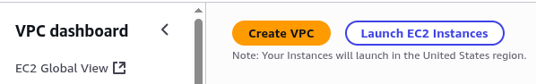

### Konfigurasi Blok CIDR

Blok CIDR (Classless Inter-Domain Routing) menentukan rentang alamat IP privat yang akan digunakan dalam VPC. AWS mendukung blok CIDR antara /16 hingga /28, dengan /16 menyediakan hingga 65.536 alamat IP. **Pakar keamanan merekomendasikan** penggunaan rentang IP privat RFC 1918 (10.0.0.0/8, 172.16.0.0/12, 192.168.0.0/16).

> [**IP Address Guide**](https://www.ipaddressguide.com/cidr)

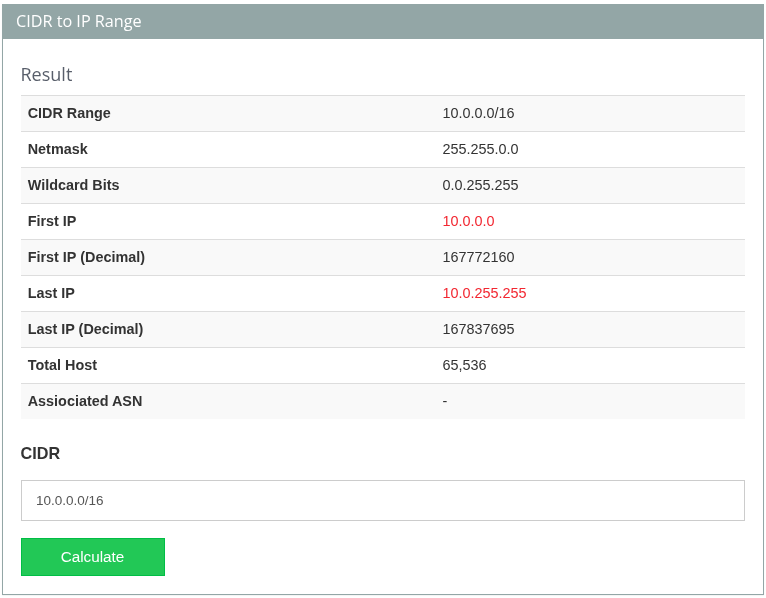

### Pengaturan VPC

Pada tahap konfigurasi, pengguna menentukan nama VPC dan blok CIDR yang diinginkan. Opsi tambahan termasuk penyediaan alamat IPV6 CIDR dan penentuan tenancy - default untuk shared hardware atau dedicated untuk isolasi penuh.

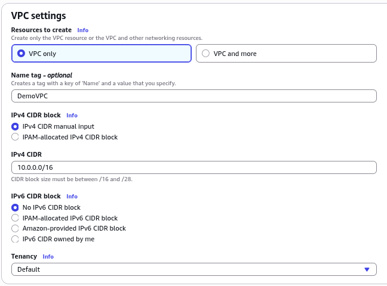

### Detail VPC yang Dibuat

Setelah proses pembuatan selesai, sistem menampilkan detail VPC termasuk VPC ID, status, dan blok CIDR yang terkait. **VPC ini berfungsi sebagai container logis** untuk semua sumber daya jaringan.

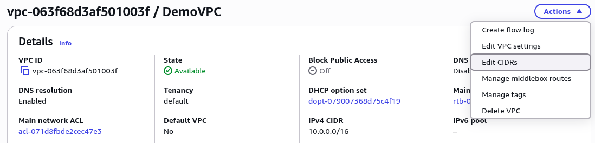

### Modifikasi Blok CIDR

Fleksibilitas VPC memungkinkan penambahan blok CIDR tambahan setelah pembuatan melalui opsi edit CIDRs, memungkinkan perluasan ruang alamat IP jika diperlukan tanpa mengganggu operasi yang berjalan.

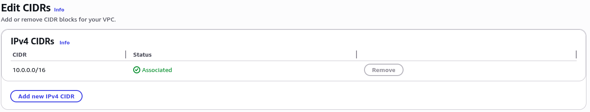

## Konfigurasi Subnet

### Mengakses Menu Subnet

Subnet merupakan segmen jaringan dalam VPC yang mengelompokkan sumber daya berdasarkan kebutuhan keamanan dan fungsi. Untuk membuat subnet, akses menu Subnets dalam layanan VPC.

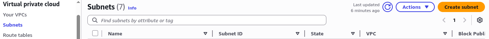

### Membuat Subnet Baru

Pilih VPC target yang telah dibuat sebelumnya, kemudian tentukan nama subnet, Availability Zone, dan blok CIDR yang merupakan subset dari blok CIDR VPC. **Setiap subnet harus berada dalam satu Availability Zone**.

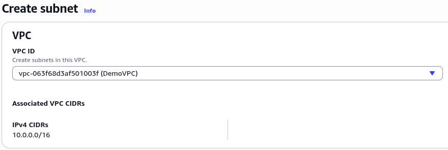

### Arsitektur Subnet yang Direkomendasikan

Desain jaringan yang optimal mengikuti prinsip **high availability** dengan minimal empat subnet yang disebar across dua Availability Zone:

- **Public Subnet A**: Untuk resources yang memerlukan akses internet langsung di AZ A
- **Public Subnet B**: Untuk resources yang memerlukan akses internet langsung di AZ B
- **Private Subnet A**: Untuk resources backend yang terisolasi di AZ A
- **Private Subnet B**: Untuk resources backend yang terisolasi di AZ B

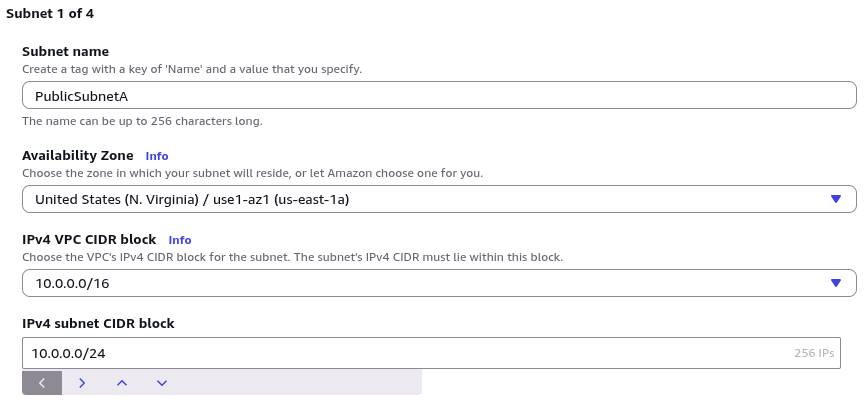
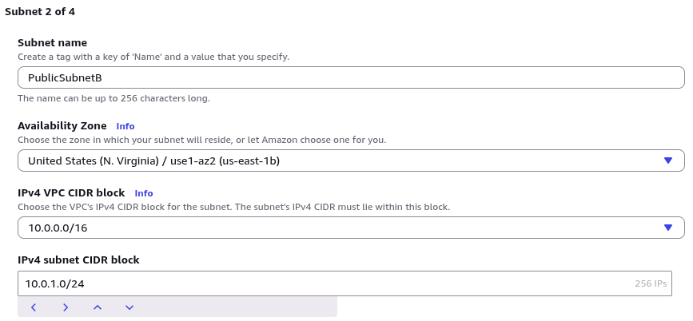
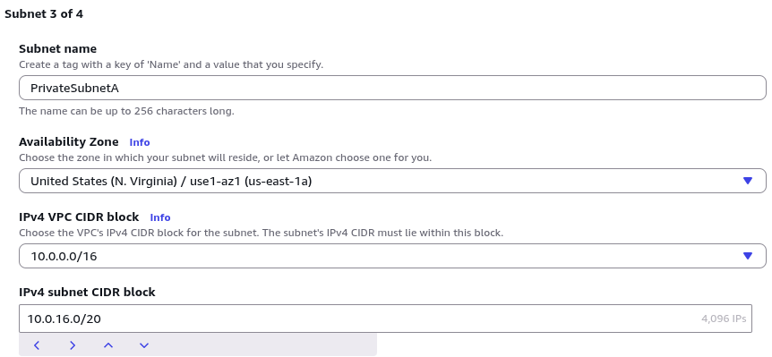
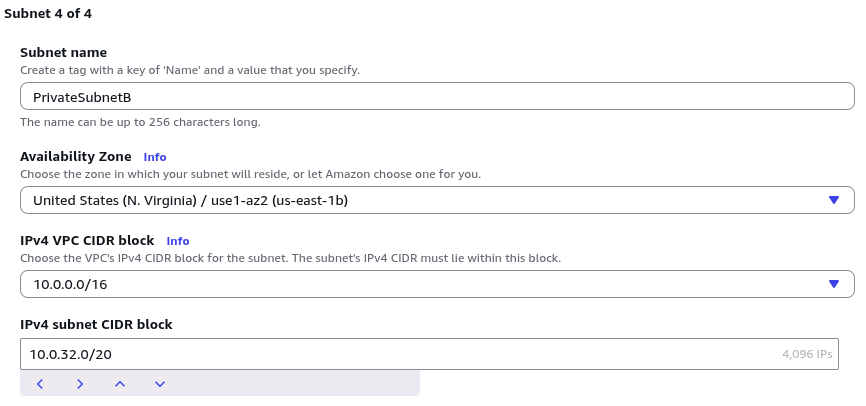

### Hasil Konfigurasi Subnet

Setelah proses selesai, sistem menampilkan daftar semua subnet yang telah dibuat dalam VPC. **Infrastruktur multi-AZ ini memastikan ketahanan terhadap kegagalan satu availability zone**.

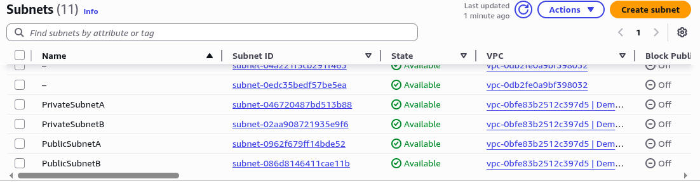

## Internet Gateway dan Tabel Rute

### Persiapan Instance EC2

Untuk menguji konfigurasi jaringan, buat instance EC2 baru dengan memilih VPC dan subnet yang sesuai. **Security group harus dikonfigurasi dengan prinsip least privilege** - hanya mengizinkan akses inbound sesuai protokol yang diperlukan.

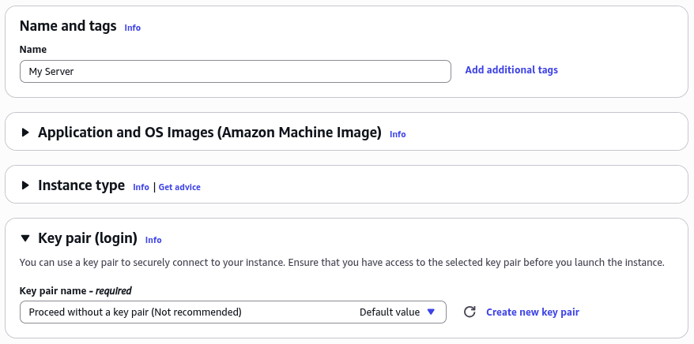
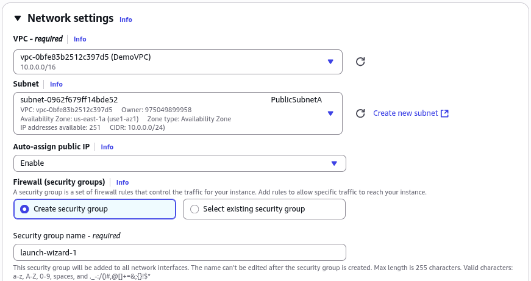
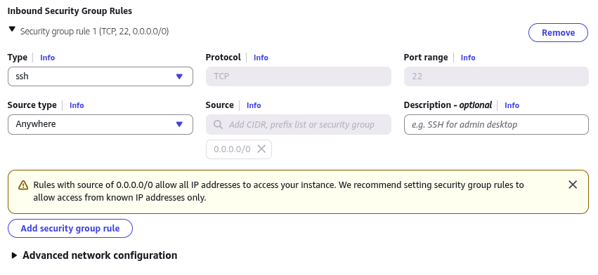

### Mengaktifkan Auto-assign IP Publik

Pada subnet publik, aktifkan opsi "Enable auto-assign public IPv4 address" untuk memberikan alamat IP publik secara otomatis kepada instance yang diluncurkan. **Fitur ini krusial untuk resources yang memerlukan akses inbound dari internet**.

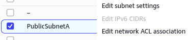
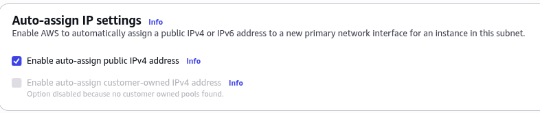

> Implementasikan prosedur serupa untuk PublicSubnetB untuk konsistensi konfigurasi.
{: .prompt-tip}

Pada keluaran yang dihasilkan, tampak bahwa instance telah diprovisi dengan alamat IP publik, namun konektivitas masih terhambat.

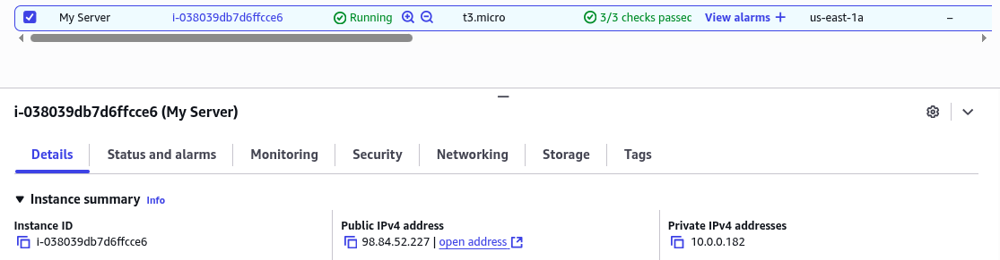

> **Troubleshooting Required**: Upaya koneksi ke server menggunakan layanan EC2 Instance Connect tidak berhasil. Investigasi mengungkapkan akar masalah - Internet Gateway belum terpasang pada VPC, mengisolasi jaringan dari internet.
{: .prompt-info}

### Konfigurasi Internet Gateway

Internet Gateway (IGW) merupakan komponen VPC horizontal yang scalable dan highly available, memungkinkan komunikasi antara instance dalam VPC dan internet. **Setiap VPC hanya mendukung satu IGW**.

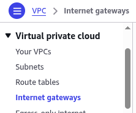
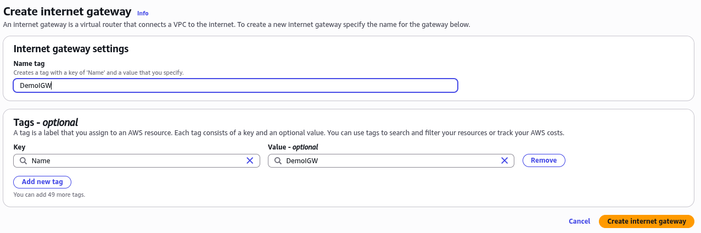
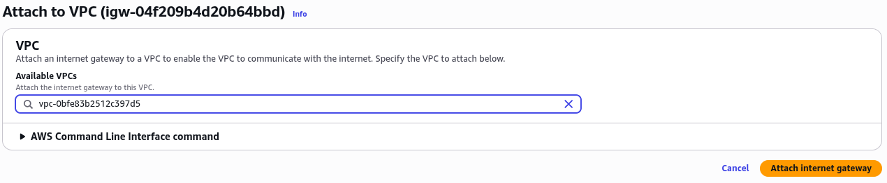
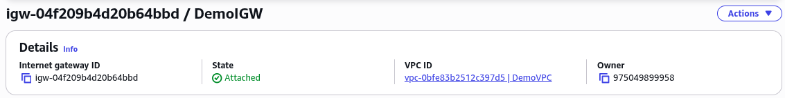

### Konfigurasi Tabel Rute

Tabel rute mengandung set rules (routes) yang menentukan kemana lalu lintas jaringan diarahkan. **Pisahkan tabel rute untuk subnet publik dan privat** untuk kontrol granuler atas routing traffic.

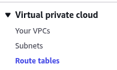
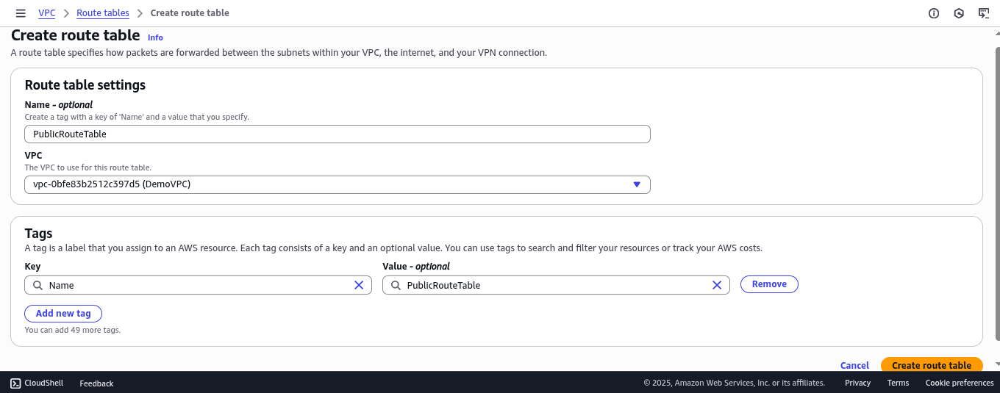
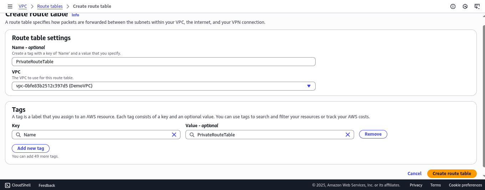

### Asosiasi Subnet dengan Tabel Rute

Asosiasikan subnet publik dengan tabel rute publik, dan subnet privat dengan tabel rute privat. **Setiap subnet hanya bisa terkait dengan satu route table**, namun satu route table bisa terkait multiple subnets.

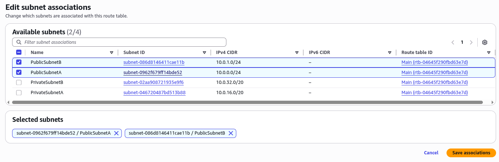
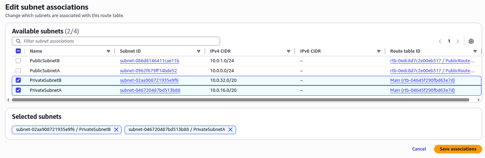
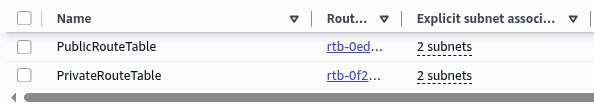

### Konfigurasi Rute ke Internet

Pada tabel rute publik, tambahkan rute yang mengarahkan lalu lintas internet (0.0.0.0/0) ke Internet Gateway. **Route ini yang memberdayakan konektivitas outbound ke internet**.

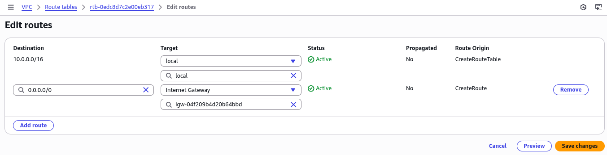

### Verifikasi Konektivitas

Setelah konfigurasi lengkap, instance EC2 dalam subnet publik berhasil terhubung ke internet melalui EC2 Instance Connect. **Infrastruktur sekarang fully operational dengan konektivitas terkontrol**.

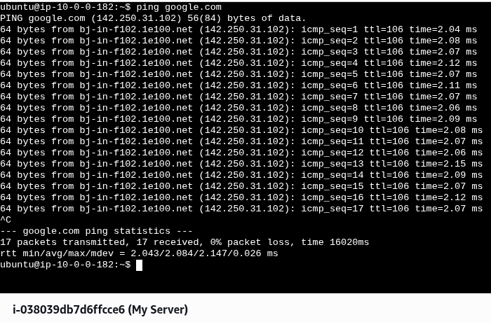

> Dengan menyelesaikan langkah-langkah di atas, pengguna berhasil membangun infrastruktur jaringan AWS yang aman, terisolasi, dan highly available dengan konektivitas internet yang terkontrol melalui Amazon VPC, subnet, Internet Gateway, dan tabel rute. Arsitektur ini memberikan fondasi robust untuk deployment aplikasi production dengan resilience terhadap kegagalan zona availability.

## Implementasi Bastion Host

### Konfigurasi Awal Bastion Host

Instance EC2 yang sebelumnya bernama "MyServer" diubah menjadi "BastionHost" sebagai titik akses terkontrol yang menjadi satu-satunya gerbang menuju "PrivateInstance" dalam VPC.

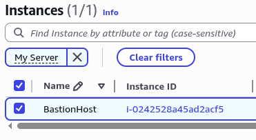

### Pembuatan Key Pair

Dibuat key pair khusus berformat `.pem` untuk otentikasi aman ke PrivateInstance. Kunci RSA ini menjadi kunci digital yang harus dijaga kerahasiaannya.

> Format `.pem` khusus untuk sistem operasi Linux, sementara Windows menggunakan format `.ppk`
{: .prompt-info}

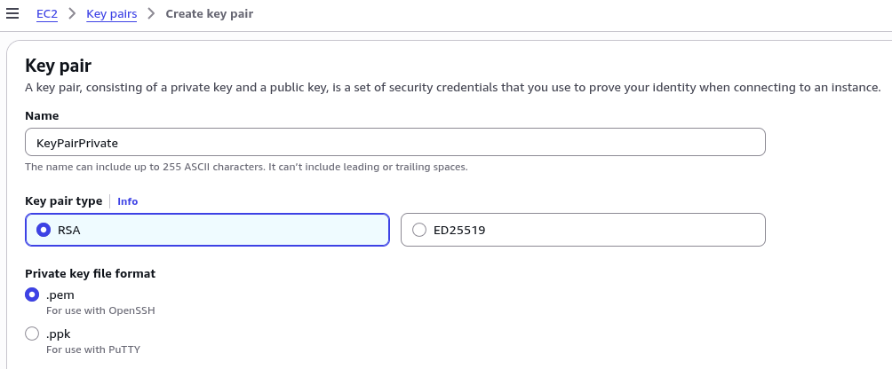

### Pembuatan Private Instance

PrivateInstance dibuat tanpa alamat IP publik, mengisolasi sepenuhnya dari internet. **Strategi zero-trust ini memastikan** tidak ada akses langsung dari luar VPC.

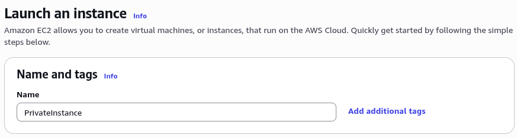

### Penetapan Key Pair

Key pair yang telah dibuat ditautkan ke PrivateInstance, menerapkan **model otentikasi berbasis kriptografi asimetris** yang lebih aman daripada password.

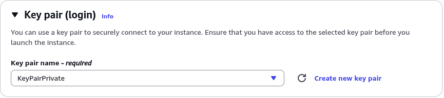

### Konfigurasi Jaringan

Instance dikonfigurasi berada dalam subnet privat dengan routing terbatas. **Arsitektur ini memastikan** semua traffic harus melalui BastionHost yang berfungsi sebagai jump server.

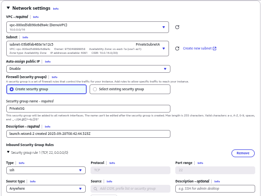

### Verifikasi Konfigurasi

PrivateInstance terbukti tidak memiliki IP publik, mengonfirmasi isolasi jaringan yang berhasil. **Hanya koneksi internal VPC** yang diperbolehkan.

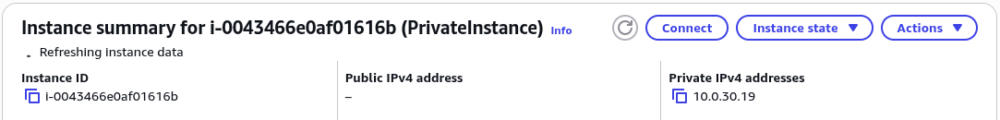

### Inisiasi Koneksi

Akses BastionHost dilakukan melalui EC2 Instance Connect, menyediakan **antarmuka berbasis browser** yang aman tanpa perlu software SSH tambahan.

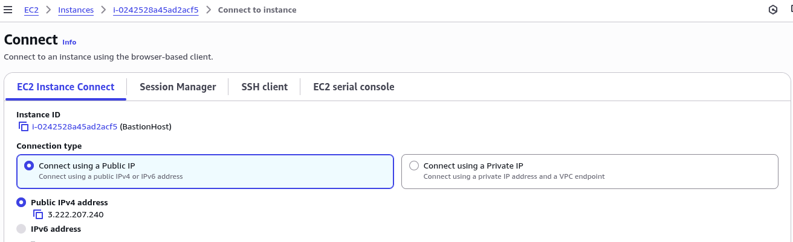

### Proses Autentikasi

Upaya koneksi SSH langsung ke PrivateInstance ditolak sistem keamanan:

```
ssh ubuntu@10.0.30.19
// Respons: Permission denied (publickey)
```

> Penolakan akses mengonfirmasi efektivitas konfigurasi keamanan. PrivateInstance benar-benar terisolasi tanpa kunci yang tepat.
{: .prompt-info}

### Penyiapan Kunci Akses

File kunci privat dipersiapkan di BastionHost dengan langkah-langkah keamanan ketat:

```bash
nano KeyPairPrivate.pem
# Salin konten kunci yang didownload
chmod 400 KeyPairPrivate.pem  # Batasi izin file
```

**Pembatasan izin 400 memastikan** hanya pemilik yang dapat membaca file kunci.

### Koneksi Berhasil

Akses ke PrivateInstance berhasil dengan spesifikasi kunci pribadi:

```
ssh ubuntu@10.0.30.19 -i KeyPairPrivate.pem
// Respons: Welcome to Ubuntu 24.04.3 LTS
```

## NAT Gateway: Memberdayakan Instance Privat dengan Akses Internet Terkontrol

PrivateInstance dalam VPC Amazon Web Services (AWS) telah terisolasi dengan baik melalui bastion host, namun **menghadapi keterbatasan kritis** - tidak dapat mengakses internet untuk update keamanan dan download package.

### Langkah Konfigurasi NAT Gateway

#### Akses Layanan VPC

Dashboard layanan VPC diakses melalui konsol AWS, dengan navigasi ke menu NAT gateways untuk memulai konfigurasi.

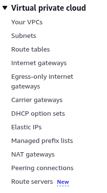

#### Pembuatan NAT Gateway

Tombol **Create NAT Gateway** diaktifkan untuk memulai proses deployment gateway baru. **NAT Gateway berfungsi sebagai translator** yang memungkinkan instance privat menginisiasi koneksi keluar.

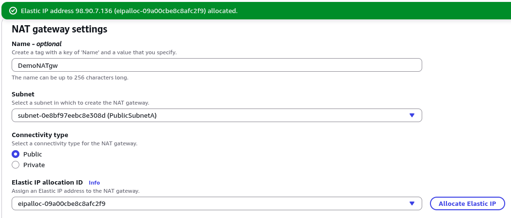

#### Verifikasi Status

Status **Available** mengonfirmasi NAT Gateway siap beroperasi. **Komponen highly available** ini di-deploy secara redundan dalam Availability Zone.

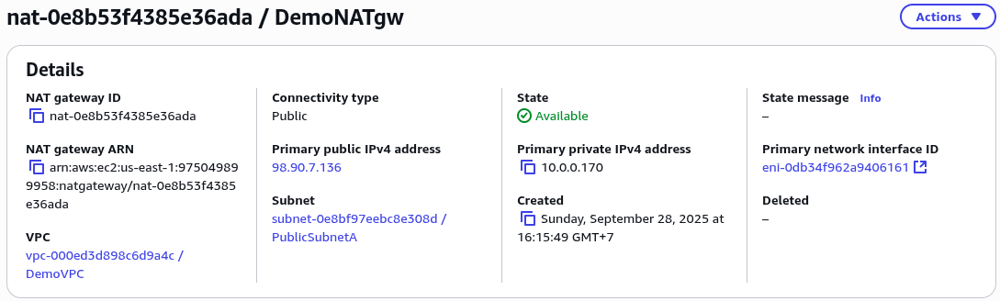

#### Konfigurasi Routing

Tabel rute privat diedit untuk mengintegrasikan NAT Gateway:

- Pilih **Route Tables**
- Pilih **PrivateRouteTable**
- Klik **Edit routes**

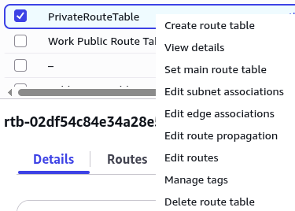

#### Penambahan Rute Internet

Entri rute baru ditambahkan yang mengarahkan traffic internet (0.0.0.0/0) ke NAT Gateway. **Konfigurasi ini memberdayakan** PrivateInstance mengakses internet tanpa exposure langsung.

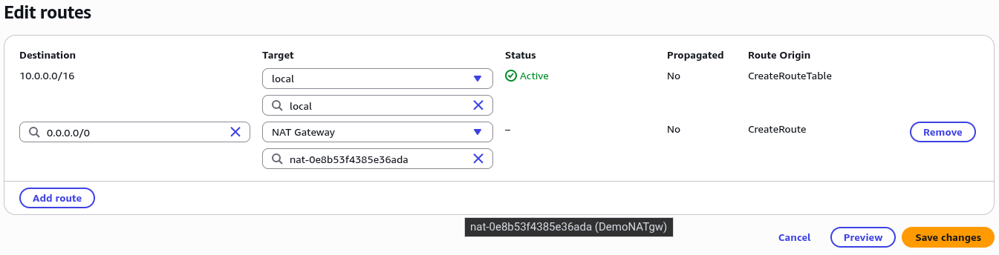

### Hasil Verifikasi Konektivitas

Setelah konfigurasi selesai, PrivateInstance berhasil terhubung ke internet dengan latency optimal:

```
ubuntu@ip-10-0-30-19:~$ ping google.com
PING google.com (172.253.115.113) 56(84) bytes of data.
64 bytes from bg-in-f113.1e100.net (172.253.115.113): icmp_seq=1 ttl=105 time=2.36 ms
64 bytes from bg-in-f113.1e100.net (172.253.115.113): icmp_seq=2 ttl=105 time=1.86 ms
--- google.com ping statistics ---
4 packets transmitted, 4 received, 0% packet loss, time 3006ms
rtt min/avg/max/mdev = 1.858/1.983/2.356/0.214 ms
```

## NACL dan Security Group: Pertahanan Berlapis untuk Bastion Host

### Konfigurasi Keamanan Multi-Layer

#### Persiapan Awal

Pastikan BastionHost terhubung ke internet sebelum memulai konfigurasi keamanan berlapis.

#### Audit Security Group

Instance BastionHost diperiksa dan Security Group (SG) yang terkait diidentifikasi. **Security Group berfungsi sebagai firewall tingkat instance** yang stateful.

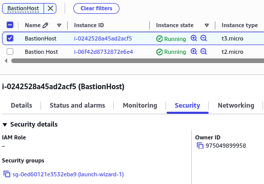

#### Penambahan Rule HTTP

Security Group diperbarui dengan menambahkan protokol HTTP (port 80) pada inbound rules. **Port 80 diperlukan** untuk layanan web Apache2.

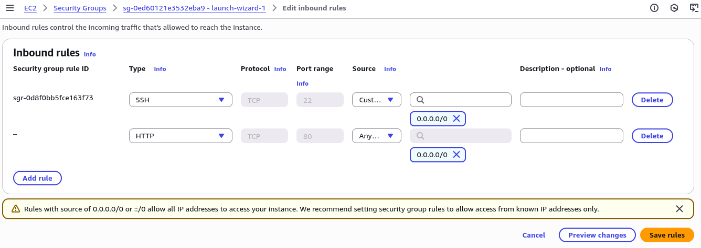

#### Deployment Apache2

Web server Apache2 diinstal pada BastionHost menggunakan perintah:
```bash
sudo apt update && sudo apt install -y apache2
```

#### Aktivasi Layanan

Apache2 diaktifkan dan dimulai sebagai service:
```bash
sudo systemctl enable apache2 && sudo systemctl start apache2
```

#### Kustomisasi Halaman Web

Halaman default Apache dimodifikasi untuk identifikasi:
```bash
sudo su
echo "Welcome to Ricalnet" > /var/www/html/index.html
```

#### Verifikasi Akses Web

Akses web berhasil diverifikasi melalui browser menggunakan alamat IP public BastionHost.

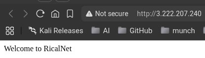

#### Konfigurasi Network ACL

Network Access Control List (NACL) dikonfigurasi sebagai **firewall stateless tingkat subnet**:

- Ubah nama NACL untuk identifikasi jelas  
   
- Tambahkan aturan penolakan HTTP (port 80) pada DefaultNACL  
   

#### Testing Blokir NACL

Akses web gagal akibat aturan NACL yang memblokir HTTP, **membuktikan efektivitas NACL** sebagai lapisan keamanan tambahan.

#### Penyesuaian Ururan Rule

Urutan aturan NACL disesuaikan dengan mengubah rule number ke nilai lebih tinggi, memanfaatkan **mekanisme evaluasi berurutan NACL**.

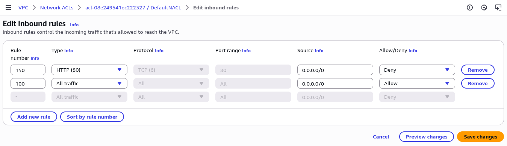

#### Verifikasi Akhir

Website kembali dapat diakses karena NACL mengevaluasi aturan berdasarkan nomor terkecil terlebih dahulu.


> **Arsitektur Keamanan Berlapis**: Kombinasi Security Group (stateful, instance-level) dan NACL (stateless, subnet-level) menciptakan defense-in-depth. Security Group mengizinkan HTTP, sementara NACL dapat memblokirnya berdasarkan urutan rule number.
{: .prompt-info}

## VPC Peering: Menghubungkan Dunia Terisolasi dengan Aman

### Persiapan Infrastruktur Jaringan

#### Standardisasi Penamaan VPC

Dashboard VPC diakses melalui konsol AWS. VPC default diubah namanya menjadi "DefaultVPC" untuk konsistensi penamaan.

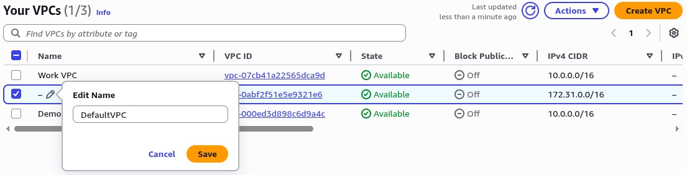

### Deployment Instance Baru

Instance baru diluncurkan dalam DefaultVPC dengan konfigurasi spesifik:

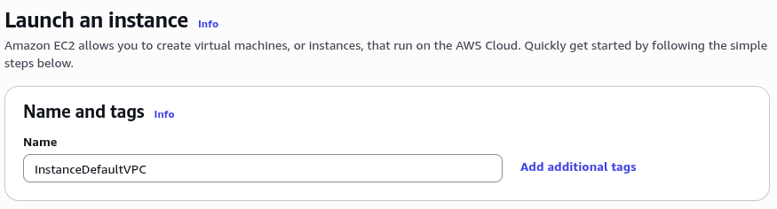

- **Key Pair**: Dipilih key pair yang sesuai untuk otentikasi

   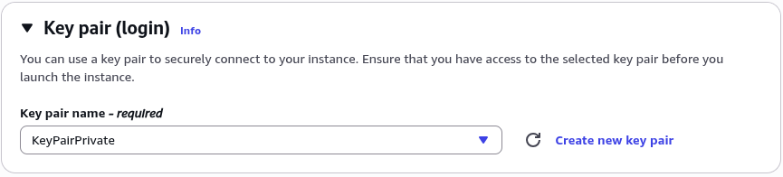

- **Network Settings**: Dipastikan memilih DefaultVPC untuk isolasi jaringan

   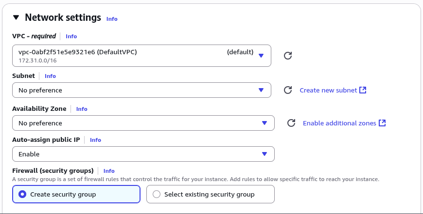

### Verifikasi Konektivitas Awal

#### Testing Lokal Bastion Host

Koneksi lokal BastionHost diuji menggunakan curl:

```
ubuntu@ip-10-0-0-183:~$ curl 10.0.0.183:80
// Response: Welcome to RicalNet 
```

### Testing Cross-VPC Awal

Dari InstanceDefaultVPC, akses ke BastionHost di VPC lain diuji:

```
ubuntu@ip-172-31-18-213:~$ curl 10.0.0.183:80
```

> **Diagnosis Jaringan**: Koneksi cross-VPC belum berhasil, mengonfirmasi isolasi jaringan antara VPC yang berbeda sebelum peering
{: .prompt-info}

### Membangun Jembatan VPC Peering

#### Inisiasi Koneksi Peering

Layanan VPC → Peering Connections → Create Peering Connection diakses untuk memulai proses.

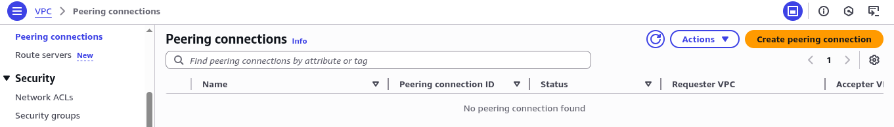

#### Konfigurasi Peering

Pengaturan koneksi dikonfigurasi:

- **Requester VPC**: DemoVPC
- **Accepter VPC**: DefaultVPC

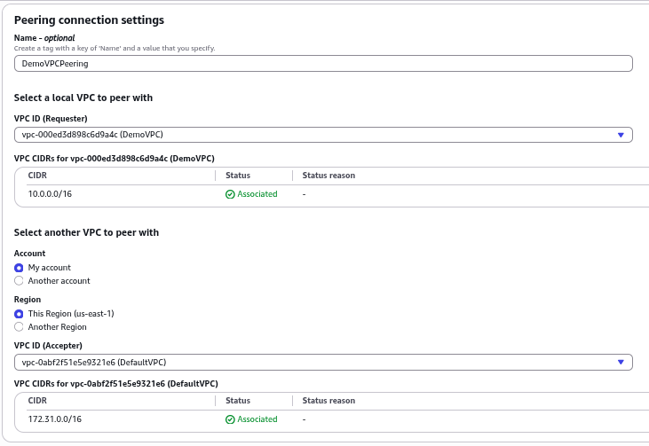

#### Penyelesaian Koneksi

Request koneksi di-accept untuk menyelesaikan proses pembangunan jembatan jaringan.

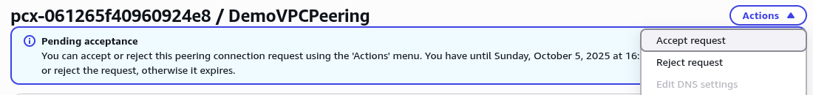

### Konfigurasi Routing Terpadu

#### Standardisasi Tabel Rute

Nama tabel rute VPC default diubah untuk identifikasi yang lebih jelas.

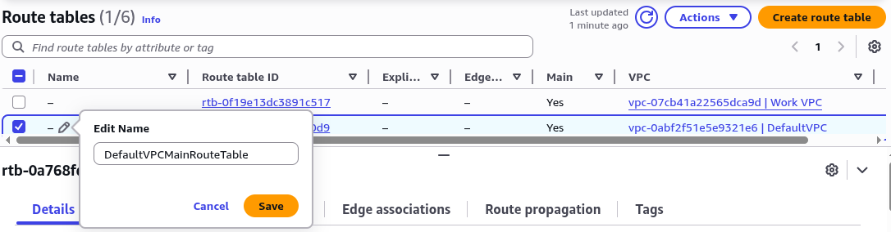

> **Pentingnya Dokumentasi CIDR**: Informasi CIDR setiap VPC harus dicatat untuk perencanaan routing dan menghindari conflict alamat IP.
{: .prompt-info}

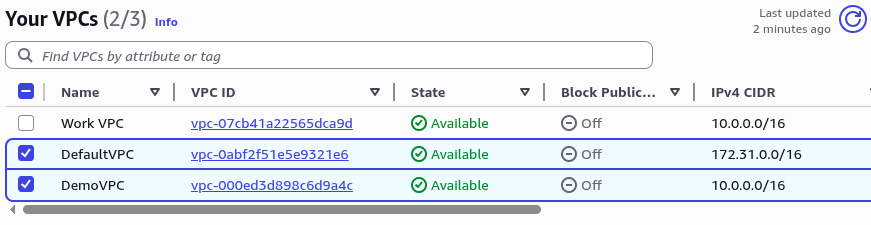

#### PublicRouteTable DemoVPC

- Edit rute existing
- Tambahkan rute ke CIDR DefaultVPC (172.31.0.0/16) melalui koneksi peering
   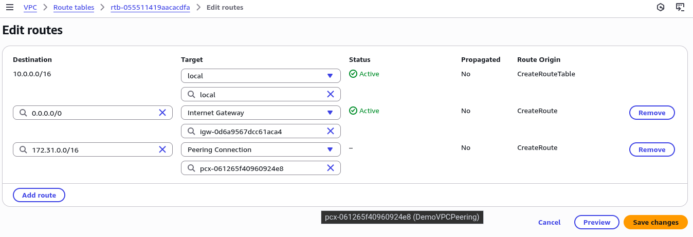

#### DefaultVPCMainRouteTable

- Edit rute default
- Tambahkan rute ke CIDR DemoVPC (10.0.0.0/16) melalui koneksi peering
   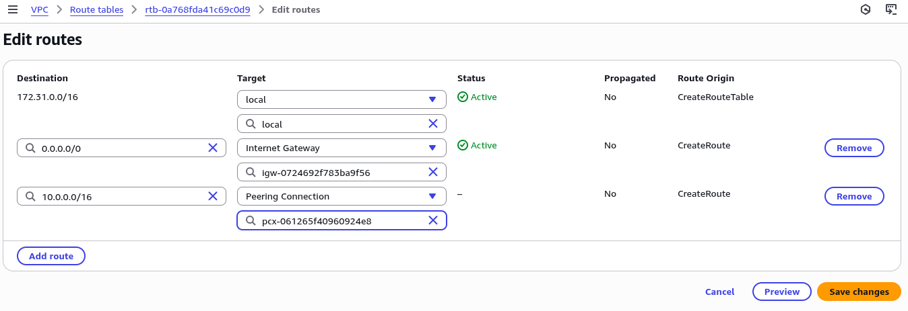

### Verifikasi Keberhasilan Integrasi

Koneksi akhir dari InstanceDefaultVPC berhasil:

```
ubuntu@ip-172-31-18-213:~$ curl 10.0.0.183:80
// Response: Welcome to RicalNet
```

> **Pencapaian Arsitektur**: VPC Peering berhasil menghubungkan dua VPC yang terisolasi, memungkinkan komunikasi langsung menggunakan IP private antar instance di VPC berbeda tanpa traversing internet.

## IPv6: Melangkah Menuju Masa Depan Internet dengan Dual-Stack

### Alokasi Blok IPv6 untuk VPC

#### Assessment Kesiapan IPv6

Dashboard layanan VPC dibuka dan VPC target dipilih. Monitoring menunjukkan **IPv6 belum aktif**, mengindikasikan ketergantungan penuh pada IPv4.

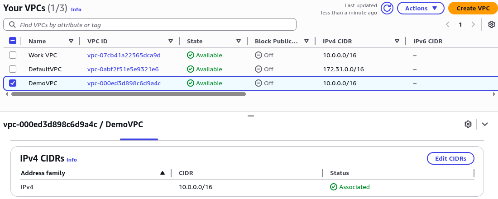

#### Inisiasi Alokasi IPv6

Opsi "Edit CIDRs" dipilih dari menu untuk memulai proses alokasi IPv6.

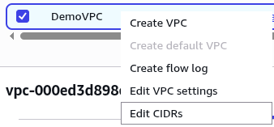

#### Penyediaan Blok IPv6

"Add IPv6 CIDR" diaktifkan, dan AWS secara otomatis menyediakan blok alamat IPv6 /56 untuk VPC. **Blok /56 menyediakan 256 subnet IPv6**, kapasitas yang sangat besar untuk pertumbuhan masa depan.

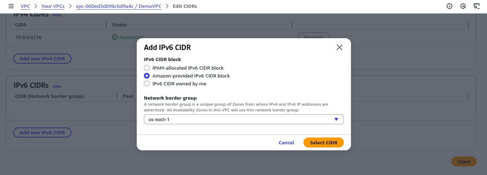

#### Konfirmasi Dual-Stack

VPC kini memiliki kedua blok alamat, IPv4 dan IPv6, mengimplementasikan **arsitektur dual-stack** yang memungkinkan transisi seamless.

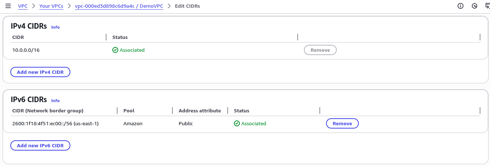

### Distribusi IPv6 ke Subnet

#### Navigasi ke Subnet

Menu "Subnets" diakses dari layanan VPC untuk distribusi alamat IPv6 ke level subnet.

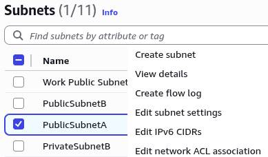

#### Alokasi CIDR IPv6 Subnet

Subnet target dipilih dan "Edit IPv6 CIDRs" diaktifkan untuk alokasi blok IPv6 khusus subnet.

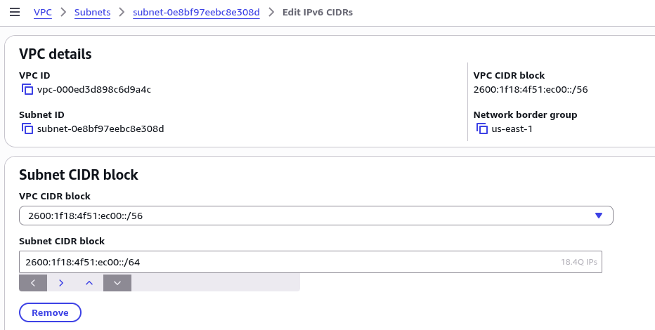

Blok CIDR IPv6 yang telah dialokasikan sebelumnya ditambahkan ke pengaturan subnet.

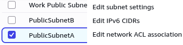

### Aktivasi Auto-Assignment IPv6

#### Enable Automatic Addressing

Opsi "Enable auto-assign IPv6 address" diaktifkan pada pengaturan subnet. **Fitur ini memastikan** instance baru secara otomatis mendapatkan alamat IPv6 saat diluncurkan.

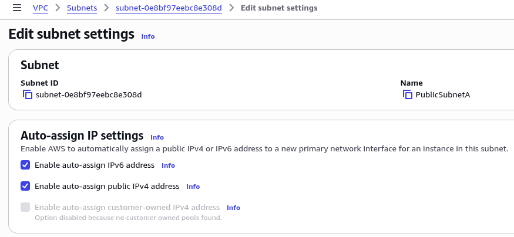

### Aktualisasi IPv6 pada BastionHost

#### Management IP Address

Instance "BastionHost" yang berjalan diperbarui melalui tab "Networking" dengan memilih "Manage IP addresses".

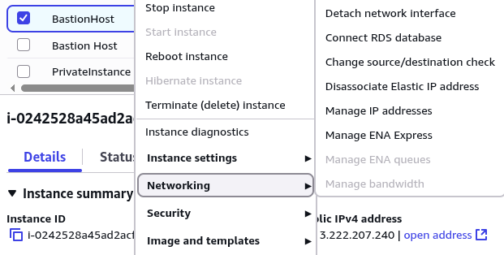

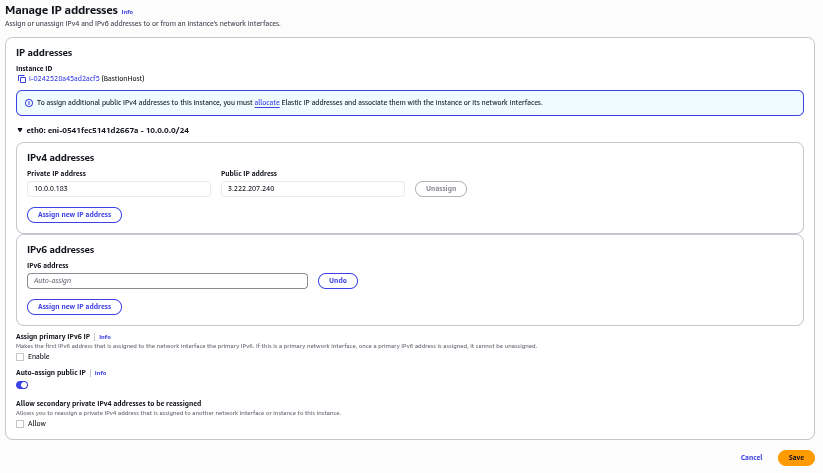

#### Verifikasi Alamat IPv6

Instance BastionHost berhasil mendapatkan alamat IPv6 publik baru, **melengkapi konektivitas dengan dual-stack capability**.

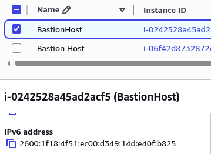

### Penyempurnaan Keamanan IPv6

#### Audit Security Group

"Security Groups" yang terkait dengan instance BastionHost dibuka untuk penyesuaian aturan keamanan.

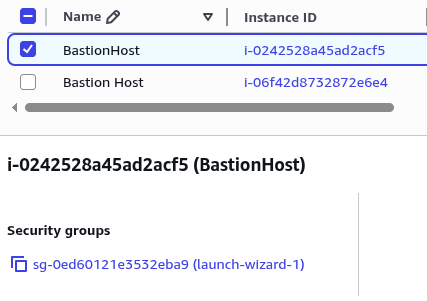

#### Ekstensi Aturan Keamanan

Aturan masuk (inbound rules) diperbarui untuk mencerminkan izin yang sama yang sebelumnya hanya berlaku untuk IPv4, sekarang diperluas untuk protokol IPv6.

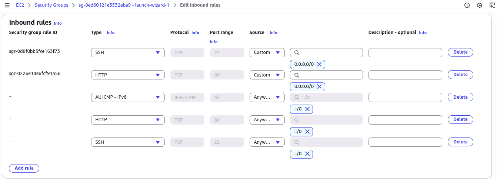

Aturan masuk yang telah diperbarui menunjukkan koneksi SSH yang diizinkan baik dari IPv4 maupun IPv6.

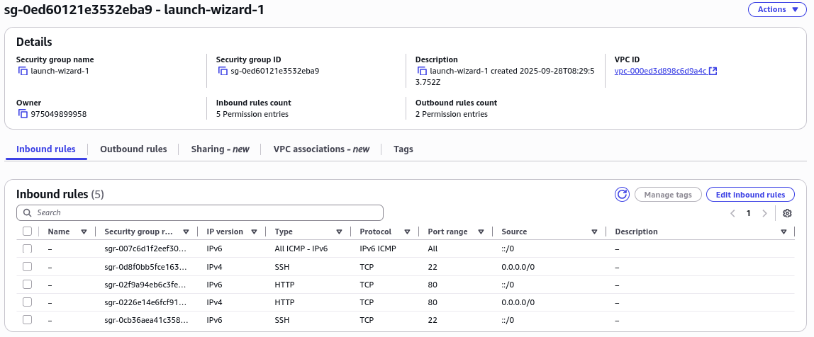

> **Transformasi Lengkap**: Dengan menyelesaikan seluruh langkah di atas, infrastruktur cloud telah bertransformasi menjadi arsitektur dual-stack (IPv4 dan IPv6) yang siap menghadapi masa depan internet dan memenuhi persyaratan compliance modern.