## Pendahuluan

Oracle Cloud Infrastructure (OCI) menyediakan layanan komputasi elastis yang memungkinkan pengguna untuk menyebarkan dan mengelola server virtual. Tutorial ini akan memandu Anda dalam membuat Virtual Cloud Network (VCN) dan compute instance, kemudian mengonfigurasi web server Apache di lingkungan OCI.

**Tujuan Pembelajaran:**
- Memahami konsep Virtual Cloud Network (VCN) di OCI
- Mampu membuat dan mengonfigurasi compute instance
- Dapat menginstal dan mengonfigurasi web server Apache
- Memahami konfigurasi keamanan jaringan di OCI

**Prasyarat:**
- Akun OCI (Free Tier atau berbayar)
- Akses ke Oracle Cloud Console
- Pengetahuan dasar tentang jaringan dan Linux

## 1. Membuat Virtual Cloud Network (VCN)

### 1.1 Mengakses Dashboard VCN

Navigasi ke layanan VCN di konsol OCI untuk memulai proses pembuatan jaringan virtual.

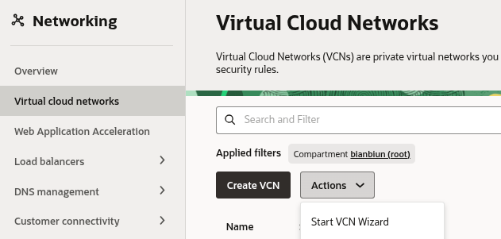

**Langkah Akses:**
1. Login ke Oracle Cloud Console
2. Buka menu navigation dan pilih "Networking"
3. Klik "Virtual cloud networks"
4. Pilih "Start VCN Wizard"

### 1.2 Memulai VCN Wizard

Pilih opsi "Create VCN with Internet Connectivity" untuk membuat VCN dengan konfigurasi jaringan yang sudah teroptimasi untuk konektivitas internet.

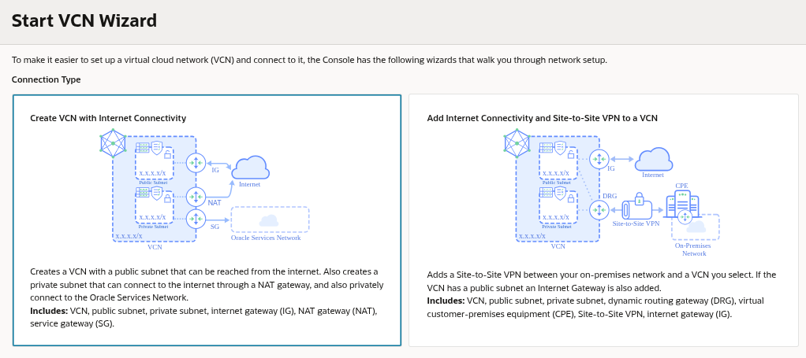

Opsi ini secara otomatis akan mengonfigurasi:
- Internet Gateway (IGW) untuk konektivitas internet outbound
- Route table dengan aturan routing ke internet
- Network Security Group (NSG) dengan aturan keamanan dasar
- Public dan private subnet dalam availability domain yang berbeda

**Keuntungan:** Menghemat waktu konfigurasi manual dan mengurangi risiko kesalahan konfigurasi jaringan.

### 1.3 Konfigurasi Informasi Dasar VCN

Isi informasi dasar VCN yang meliputi:
- **Nama VCN**: Identifikasi unik untuk VCN Anda
- **CIDR Block**: Rentang alamat IP untuk VCN (contoh: 10.0.0.0/16)

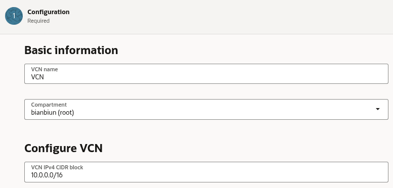

**Catatan:** 
- **CIDR (Classless Inter-Domain Routing)** block menentukan rentang alamat IP privat yang akan digunakan dalam VCN
- Pilih blok CIDR yang tidak tumpang tindih dengan jaringan on-premise atau cloud lainnya
- Untuk skala kecil, /16 (65,536 alamat IP) biasanya cukup
- Hindari menggunakan blok 172.17.0.0/16 yang biasa digunakan Docker

### 1.4 Konfigurasi Public dan Private Subnet

Konfigurasikan subnet publik dan privat sesuai kebutuhan arsitektur jaringan Anda.

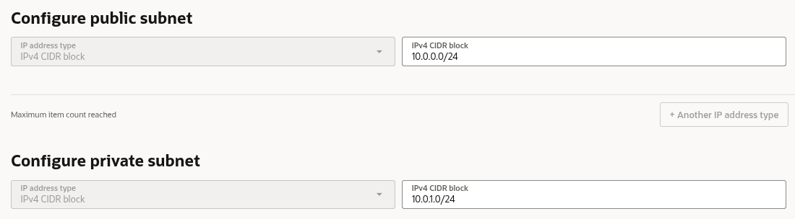

**Public Subnet:**
- Memungkinkan instance untuk memiliki alamat IP publik yang dapat diakses dari internet
- Cocok untuk load balancer, NAT gateway, bastion host
- Route table-nya termasuk route ke internet gateway

**Private Subnet:**
- Hanya dapat diakses dari within VCN atau melalui gateway NAT
- Ideal untuk database servers, application servers, backend services
- Lebih aman karena tidak terpapar langsung ke internet

> Gunakan arsitektur multi-tier dengan memisahkan layer application dan database di subnet yang berbeda.
{: .prompt-tip}

## 2. Membuat Compute Instance

### 2.1 Mengakses Layanan Compute

Navigasi ke layanan Compute di konsol OCI untuk membuat instance virtual machine.

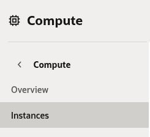

**Langkah Akses:**
1. Dari menu navigation, pilih "Compute"
2. Klik "Instances"
3. Pilih compartment yang diinginkan
4. Klik "Create Instance"

### 2.2 Konfigurasi Informasi Dasar Instance

Isi informasi dasar instance kompute termasuk nama instance dan availability domain.

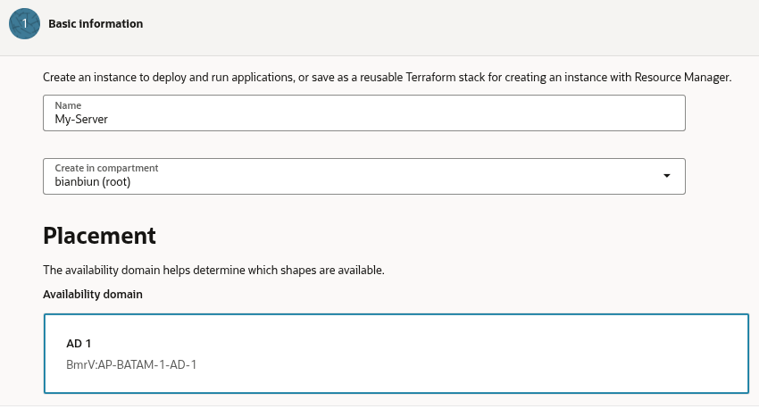

**Keterangan:** 
- **Availability Domain**: Pada akun free tier, biasanya hanya tersedia satu availability domain
- Availability domain merupakan pusat data yang terisolasi dalam region OCI
- Setiap region biasanya memiliki 3 availability domain
- Pilihan availability domain penting untuk high availability

### 2.3 Konfigurasi Kapasitas On-Demand

Pada bagian advanced options, pilih opsi on-demand capacity untuk fleksibilitas alokasi resource.

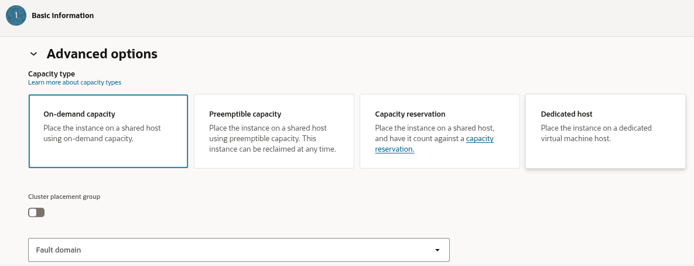

**Keuntungan:**
- Kapasitas on-demand memastikan ketersediaan resource tanpa perlu reservasi sebelumnya
- Fleksibel untuk workload yang berubah-ubah
- Cocok untuk development dan testing environment

**Alternatif:** Untuk production workload yang stabil, pertimbangkan reserved capacity untuk penghematan biaya.

### 2.4 Pemilihan Image Operating System

Pilih image Oracle Linux 10 yang berbasis RHEL (Red Hat Enterprise Linux).

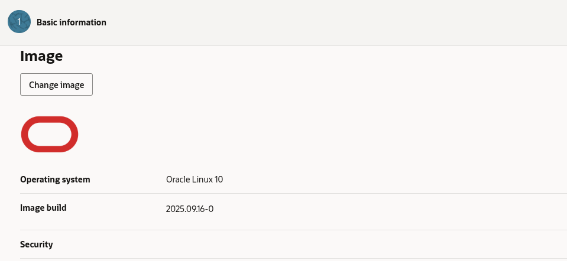

**Alasan Pemilihan:**
- Oracle Linux kompatibel dengan RHEL dan dioptimalkan untuk lingkungan OCI
- Menyediakan performa dan keamanan yang baik
- Gratis untuk digunakan di OCI (tidak ada biaya lisensi)
- Dukungan jangka panjang dan update security teratur
- Kompatibel dengan sebagian besar aplikasi enterprise

### 2.5 Konfigurasi Shape Instance

Pilih shape default yang eligible untuk free tier.

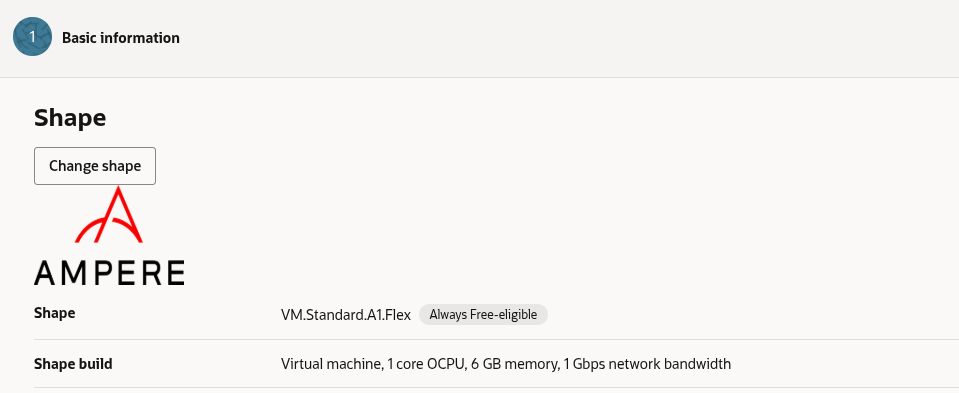

**Informasi:**
- Shape menentukan konfigurasi CPU dan memori instance
- Free tier menyediakan shape VM.Standard.A1.Flex (1 OCPU, 6GB memory)
- Untuk production, pertimbangkan shape yang sesuai dengan workload
- Perhatikan spesifikasi seperti OCPU (Oracle CPU), memory, network bandwidth

### 2.6 Konfigurasi Keamanan Instance

Pertahankan pengaturan keamanan default dengan menonaktifkan shielded instance.

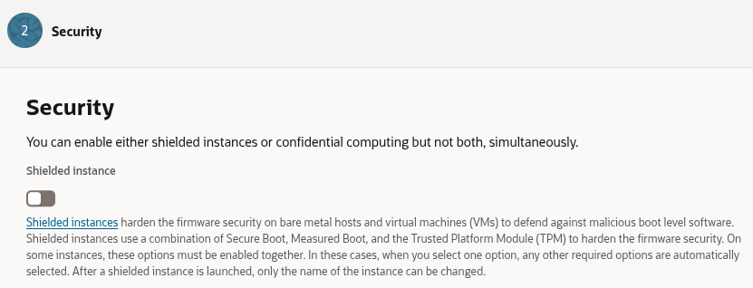

**Pertimbangan:**
- **Shielded instance** menawarkan keamanan tambahan (UEFI secure boot, virtual TPM)
- Untuk lingkungan production, enabledkan shielded instance
- Untuk development/testing, bisa dinonaktifkan untuk menghemat resource

### 2.7 Konfigurasi Jaringan Instance

Pilih VCN yang telah dibuat sebelumnya dan pilih public subnet untuk instance.

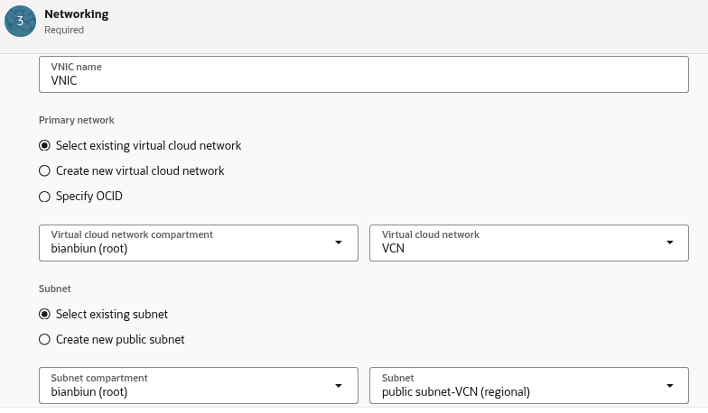

**Strategi Jaringan:**
- Pemilihan public subnet memungkinkan instance untuk memiliki alamat IP publik
- Pilih subnet yang sesuai dengan arsitektur aplikasi
- Pastikan VCN memiliki internet gateway untuk konektivitas outbound

### 2.8 Konfigurasi Alamat IP

Pastikan untuk memilih opsi "Automatically assign public IPv4 address".

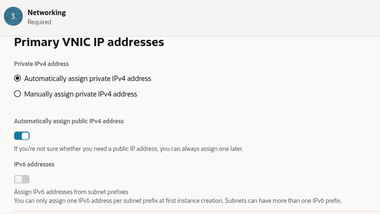

**Penting:**
- Alamat IP publik diperlukan untuk mengakses instance dari internet
- Alamat IP ini bersifat ephemeral (dapat berubah saat instance di-stop/start)
- Untuk alamat IP permanen, gunakan reserved public IP

### 2.9 Konfigurasi SSH Keys

Unduh private dan public key untuk autentikasi SSH.

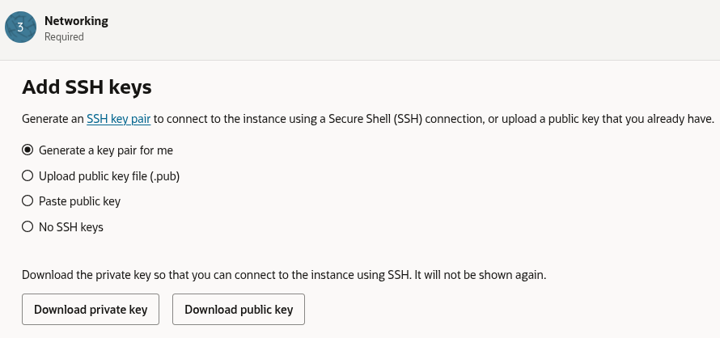

**Keamanan Akses:**
- Key pair SSH digunakan untuk autentikasi yang aman ke instance
- Public key akan diinstall di instance, private key disimpan di local
- Gunakan key strength minimal 2048-bit RSA
- Simpan private key di lokasi yang aman

### 2.10 Konfigurasi Boot Volume

Pertahankan pengaturan default untuk boot volume.

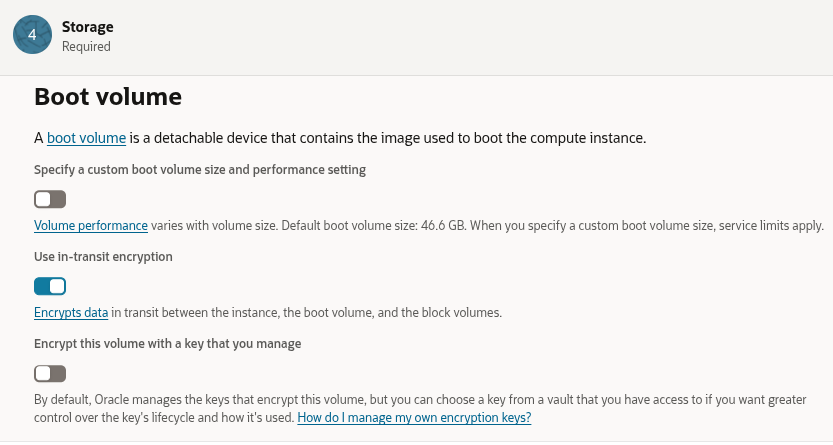

**Kustomisasi:** Untuk workload khusus, bisa menyesuaikan size dan performance (VPU)

### 2.11 Review Estimasi Biaya

Sebelum membuat instance, periksa estimated cost untuk memastikan biaya sesuai dengan anggaran.

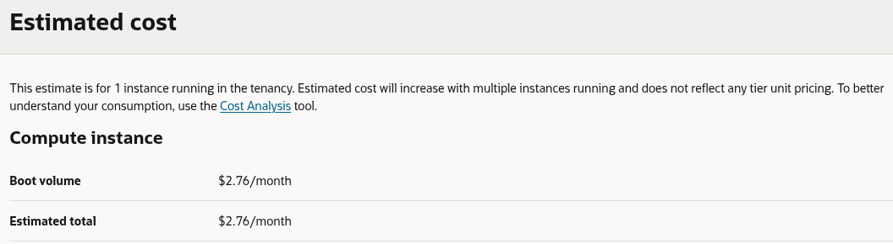

**Best Practice:**
- Selalu review estimasi biaya sebelum membuat resource cloud
- Manfaatkan cost estimator tools di OCI console
- Set up budget dan alert untuk monitoring biaya
- Free tier biasanya memiliki limit tertentu (contoh: 3000 OCPU hours per month)

### 2.12 Membuat Instance

Setelah semua konfigurasi selesai, buat instance dan pastikan status instance berubah menjadi "Running".

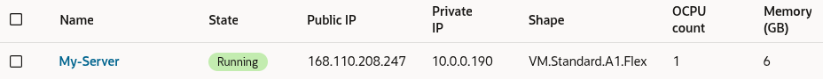

**Provisining Process:**
- Instance akan melalui status "Provisioning" → "Starting" → "Running"
- Waktu provisioning biasanya 1-5 menit
- Catat public IP address untuk koneksi SSH

## 3. Konfigurasi dan Instalasi Web Server

### 3.1 Koneksi SSH ke Instance

Buka terminal di sistem host dan gunakan private key yang telah diunduh untuk terhubung ke instance.

```bash
# Mengubah permission file private key
chmod 400 ssh-key.key

# Koneksi SSH ke instance
ssh -i ssh-key.key opc@168.110.208.247
```

**Penjelasan:**
- Perintah `chmod 400` mengatur permission file private key menjadi read-only untuk owner
- User default untuk Oracle Linux adalah `opc`
- Ganti IP address dengan public IP instance Anda
- Untuk Windows, gunakan Putty atau Windows SSH client

**Troubleshooting Koneksi:**
- Pastikan private key permission benar (600 atau 400)
- Periksa security list rules mengizinkan SSH (port 22)
- Verifikasi instance status "Running"

### 3.2 Instalasi Apache HTTP Server

Update repository dan instal paket Apache HTTP server.

```bash
sudo yum check-update && sudo yum install httpd -y
```

**Fungsi:**
- `yum check-update` - memperbarui repository metadata
- `yum install httpd -y` - menginstal Apache web server
- Apache HTTP Server adalah web server open-source yang powerful dan banyak digunakan

**Alternatif Package Manager:** Untuk Oracle Linux 8+, bisa menggunakan `dnf` sebagai pengganti `yum`

### 3.3 Menjalankan dan Mengonfigurasi Apache

Start service Apache dan konfigurasikan untuk berjalan otomatis saat boot.

```bash
sudo apachectl start && sudo systemctl enable httpd
```

**Penjelasan:**
- `apachectl start` - menjalankan Apache service
- `systemctl enable httpd` - mengonfigurasi service untuk berjalan otomatis saat sistem reboot
- `systemctl` adalah systemd service manager di Linux modern

**Verifikasi Status:**
```bash
sudo systemctl status httpd
```

### 3.4 Verifikasi Konfigurasi Apache

Jalankan tes konfigurasi untuk memastikan tidak ada error dalam konfigurasi Apache.

```bash
sudo apachectl configtest
```

**Output yang Diharapkan:** 
- "Syntax OK" menandakan konfigurasi Apache valid
- Jika ada error, periksa file konfigurasi di `/etc/httpd/conf/httpd.conf`

### 3.5 Konfigurasi Firewall

Buka port HTTP di firewall untuk mengizinkan akses web.

```bash
sudo firewall-cmd --permanent --zone=public --add-service=http
sudo firewall-cmd --reload
```

**Fungsi:**
- `firewall-cmd` adalah utilitas untuk mengelola firewalld
- `--permanent` - menyimpan aturan secara permanen
- `--add-service=http` - menambahkan rule untuk service HTTP (port 80)
- `--reload` - menerapkan perubahan tanpa restart service

**Verifikasi Rules:**
```bash
sudo firewall-cmd --list-all
```

### 3.6 Membuat Halaman Web Default

Buat file index.html sederhana untuk testing web server.

```bash
sudo bash -c 'echo "This is my Web-Server running on Oracle Cloud Infrastructure" >> /var/www/html/index.html'
```

**Struktur Directory:**
- `/var/www/html/` - document root default Apache
- File `index.html` adalah default file yang dilayankan

**Opsional:** Buat halaman HTML yang lebih kompleks:
```bash
sudo cat > /var/www/html/index.html << EOF
<html>
<head><title>OCI Web Server</title></head>
<body>
<h1>Welcome to OCI</h1>
<p>This web server is running on Oracle Cloud Infrastructure</p>
<p>Instance IP: $(hostname -I)</p>
</body>
</html>
EOF
```

## 4. Konfigurasi Keamanan Jaringan

### 4.1 Mengakses Security List VCN

Buka VCN yang telah dibuat dan navigasi ke tab security. Pilih "Default Security List for VCN".

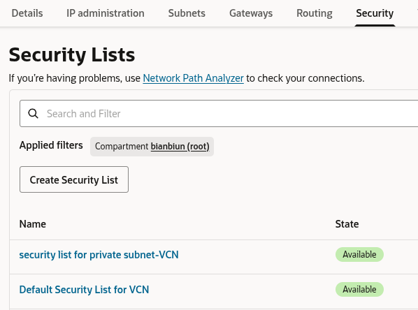

**Konsep:**
- Security List di OCI berfungsi sebagai firewall virtual
- Mengontrol traffic inbound dan outbound pada level subnet
- Setiap VCN memiliki default security list
- Bisa membuat custom security list untuk kontrol lebih granular

### 4.2 Menambahkan Ingress Rules

Tambahkan aturan inbound untuk mengizinkan traffic HTTP.

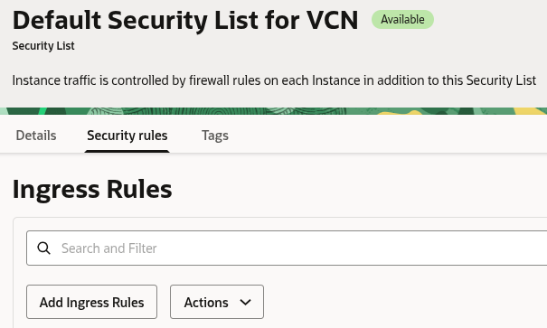

**Default Rules:**
- SSH (port 22) dari mana saja
- ICMP untuk ping
- Aturan stateful (return traffic diizinkan secara otomatis)

### 4.3 Konfigurasi Ingress Rule

Konfigurasikan aturan inbound dengan parameter berikut:

- **Source Type**: CIDR
- **Source CIDR**: 0.0.0.0/0
- **IP Protocol**: TCP
- **Source Port Range**: All
- **Destination Port Range**: 80

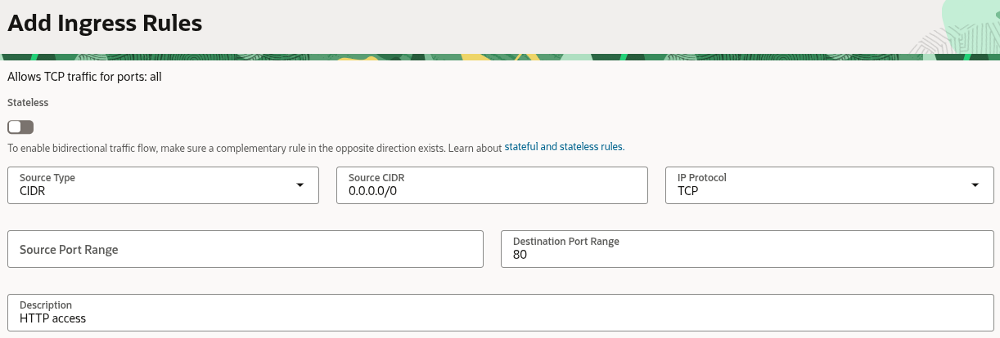

**Penjelasan:**
- **CIDR 0.0.0.0/0** mengizinkan akses dari semua alamat IP di internet
- **Port 80** adalah port default untuk HTTP
- Untuk lingkungan production, disarankan untuk membatasi source CIDR
- Pertimbangkan untuk menambahkan rule HTTPS (port 443) juga

**Best Practice Security:**
- Gunakan Network Security Groups (NSG) untuk kontrol yang lebih granular
- Implementasikan principle of least privilege
- Regular audit security rules

## 5. Verifikasi Web Server

Akses web server melalui browser dengan mengunjungi `http://Public-IPAddress` (ganti dengan alamat IP instance Anda).

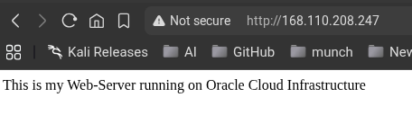

**Testing Steps:**
1. Buka web browser
2. Ketik `http://[PUBLIC_IP]` (contoh: `http://168.110.208.247`)
3. Seharusnya menampilkan halaman "This is my Web-Server running on Oracle Cloud Infrastructure"

**Verifikasi Tambahan:**
```bash
# Test dari command line
curl http://localhost
```

**Kesimpulan:** Web server Apache sekarang berjalan dengan sukses di Oracle Cloud Infrastructure dan dapat diakses dari internet.

## Troubleshooting Tips

### Masalah Umum dan Solusi:

1. **Web server tidak dapat diakses:**
   - Pastikan instance dalam status "Running"
   - Verifikasi security rules telah dikonfigurasi dengan benar (port 80)
   - Cek apakah Apache service berjalan: `sudo systemctl status httpd`
   - Pastikan firewall di instance mengizinkan traffic port 80

2. **SSH connection failed:**
   - Periksa security list rules untuk port 22
   - Verifikasi private key dan permission
   - Pastikan menggunakan user `opc`
   - Cek route table untuk public subnet

3. **Apache tidak jalan:**
   - Start service: `sudo systemctl start httpd`
   - Cek error logs: `sudo tail -f /var/log/httpd/error_log`
   - Verifikasi konfigurasi: `sudo apachectl configtest`

### Monitoring dan Maintenance:

```bash
# Monitor Apache access
sudo tail -f /var/log/httpd/access_log

# Check resource usage
top
htop

# Verify network connectivity
netstat -tulpn | grep :80
```

### Konfigurasi Lanjutan:

Untuk konfigurasi lanjutan, pertimbangkan:
- Mengonfigurasi domain name dan SSL certificate dengan Let's Encrypt
- Mengatur load balancer untuk high availability
- Mengimplementasikan OCI Monitoring dan alerting
- Setup automatic backup menggunakan OCI Block Volume backup
- Konfigurasi instance pool dan auto scaling

### Optimasi Performance:

1. **Apache Configuration:**
   - Edit `/etc/httpd/conf/httpd.conf` untuk optimasi
   - Adjust `KeepAlive`, `MaxKeepAliveRequests`, `KeepAliveTimeout`
   - Consider using `mod_cache` untuk caching

2. **System Optimization:**
   - Enable `httpd` service to start on boot
   - Configure swap space if needed
   - Regular system updates: `sudo yum update`

Dengan mengikuti panduan ini, Anda seharusnya dapat berhasil membuat dan mengonfigurasi web server Apache yang berjalan di Oracle Cloud Infrastructure.