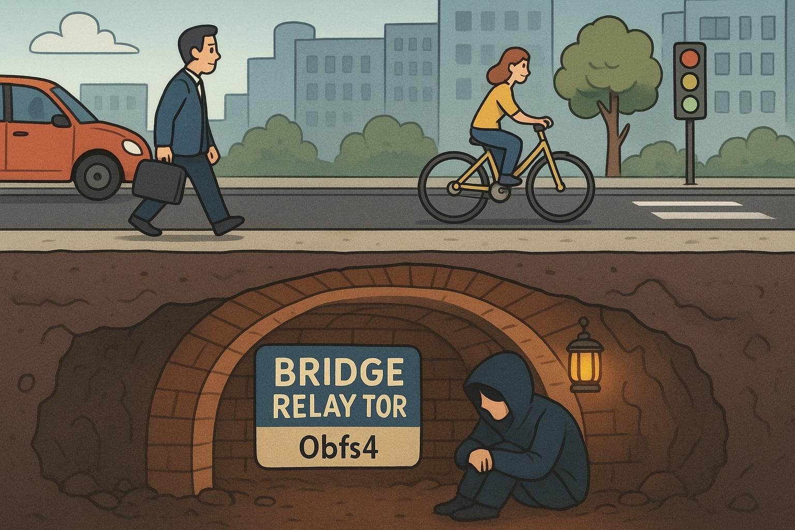
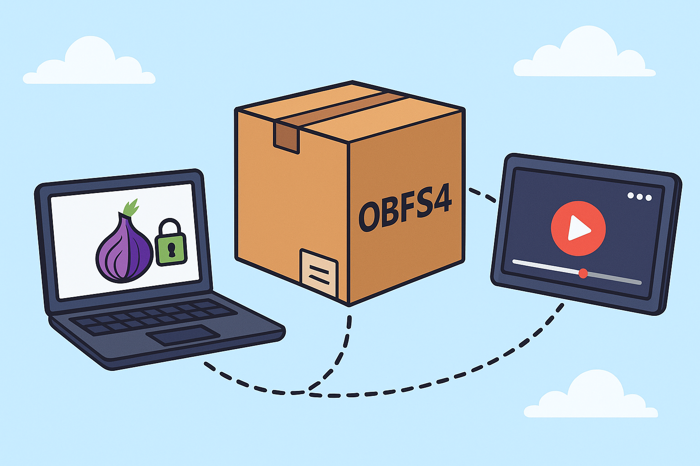
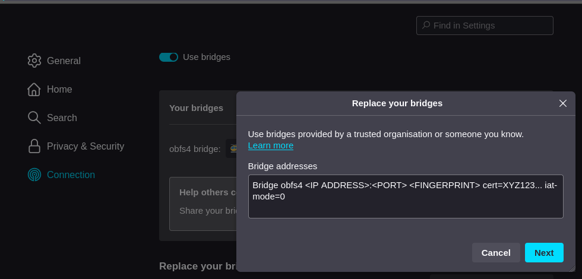
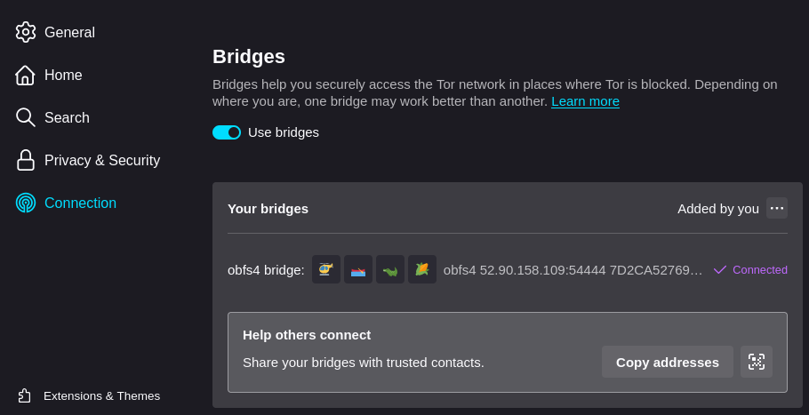
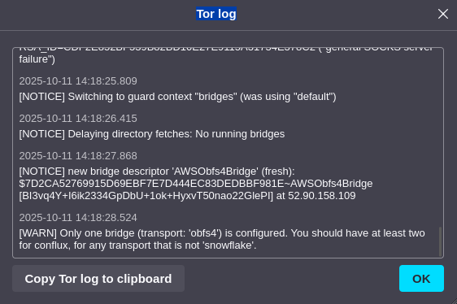

## Pendahuluan

Dalam perlombaan senjata antara sensor dan kebebasan informasi, sebuah teknologi penyamaran muncul sebagai tameng vital bagi yang tertindas. Ini adalah cerita tentang Obfs4, "sulap" digital yang mengubah lalu lintas internet rahasia menjadi hantu yang tak terlihat oleh mata para penjaga gawang.

Bayangkan sebuah terowongan rahasia di bawah jalanan yang ramai. Meski penjaga berjaga di setiap persimpangan, mereka tak pernah menyadari keberadaannya. Di dunia digital, terowongan itu bernama Tor Bridge Relay, dan Obfs4 adalah teknologi yang membuatnya tak terlihat.



Tor (The Onion Router) telah lama menjadi benteng privasi dan penyelamat bagi aktivis, jurnalis, dan warga biasa di negara dengan sensor ketat. Namun, musuhnya semakin pintar. Deep Packet Inspection (DPI), teknologi canggih yang mampu menganalisis dan memfilter lalu lintas internet berdasarkan "sidik jari"-nya, semakin efektif mendeteksi dan memblokir koneksi ke jaringan Tor.

Di sinilah perlunya strategi baru. Bridge Relay, khususnya yang dikonfigurasi dengan Obfs4, adalah jawabannya.

## Apa Itu Obfs4? Sulap di Level Data

Obfs4, kependekan dari Obfuscation4, bukan sekadar enkripsi. Ia adalah ahli penyamaran. Ia bekerja dengan membungkus ulang data yang dikirim melalui Bridge Relay Tor menjadi sesuatu yang sama sekali tidak mencurigakan.

Ibaratnya, Obfs4 mengubah pesan rahasia yang jelas-jelas terbungkus onion routing menjadi sebuah kiriman paket biasa yang terlihat seperti koneksi HTTPS biasa atau bahkan lalu lintas video streaming.



Proses teknisnya disebut pluggable transport. Obfs4 tidak mengubah cara kerja Tor inti, melainkan menjadi "kemasan luarnya". Ia menambahkan lapisan obfuskasi yang:

1.  **Menyamarkan Pola Lalu Lintas:** Pola unik komunikasi Tor, yang bisa dikenali DPI, diacak sehingga mirip dengan koneksi internet biasa.
2.  **Mengacak Handshake Awal:** Proses "handshake" awal antara pengguna dan bridge, yang sering menjadi sasaran deteksi, dibuat menjadi tidak terbaca dan acak.
3.  **Menolak Analisis Statistik:** Bahkan jika dianalisis secara mendalam, lalu lintas Obfs4 dirancang untuk tidak memiliki pola statistik yang konsisten yang bisa dijadikan "sidik jari" untuk diblokir.

## Mengapa Obfs4 Begitu Efektif Melawan DPI?

Kekuatan DPI terletak pada kemampuannya mengenali pola. Tor murni, meski dienkripsi, memiliki karakteristik komunikasi tertentu yang seperti "berteriak" identitasnya di keramaian. Obfs4 membungkamnya. Ia membuat lalu lintas Tor menjadi "warga digital" yang pendiam dan tidak mencolok, menyamar di antara miliaran paket data lain yang mengalir setiap detik.

> DPI yang paling canggih pun akan kesulitan. Mereka dihadapkan pada data yang terlihat sah, mirip koneksi biasa, dan tidak memiliki tanda pengenal yang jelas untuk difilter. Memblokir Obfs4 sering kali berarti memblokir sebagian besar internet, sebuah tindakan yang terlalu mahal dan tidak praktis bagi banyak penyensor.

## Tantangan dan Panggilan untuk Berkontribusi

Keampuhan sistem ini bergantung pada satu hal: ketersediaan Bridge Relay. Semakin banyak bridge, semakin sulit bagi pemerintah untuk memblokir semuanya. Di sinilah komunitas global diharapkan berperan.

Membangun dan menjalankan Bridge Relay Obfs4 adalah aksi nyata untuk mendukung netralitas internet dan kebebasan berakses informasi. Prosesnya relatif sederhana bagi yang memiliki pengetahuan teknis dasar dan koneksi internet yang stabil. Dengan menyumbangkan sedikit bandwidth, seseorang dapat menjadi penyambung nyawa bagi mereka yang terputus dari dunia luar oleh tembok sensor.

## Membangun Tor Bridge Relay dengan Konfigurasi Obfs4 untuk Menembus Pemblokiran Deep Packet Inspection

### 1. Persiapan Sistem dan Instalasi Komponen

#### 1.1 Pembaruan Sistem dan Instalasi Dependensi
```bash
sudo apt update && sudo apt upgrade -y && sudo apt autoremove -y && sudo apt install -y tor obfs4proxy net-tools ufw
```

#### 1.2 Verifikasi Keberhasilan Instalasi Obfs4proxy
```bash
which obfs4proxy
```
Output yang diharapkan: `/usr/bin/obfs4proxy`

### 2. Konfigurasi Tor Bridge Relay

#### 2.1 Backup Konfigurasi Awal
```bash
sudo cp /etc/tor/torrc /etc/tor/torrc.backup
```

#### 2.2 Modifikasi File Konfigurasi torrc
```bash
sudo nano /etc/tor/torrc
```

REPLACE seluruh konten existing dengan konfigurasi berikut:

```
# Basic Configuration
RunAsDaemon 1
DataDirectory /var/lib/tor
Log notice file /var/log/tor/tor.log
Log notice syslog

# Bridge Relay Configuration
BridgeRelay 1
ORPort 443 
ServerTransportPlugin obfs4 exec /usr/bin/obfs4proxy
ServerTransportListenAddr obfs4 0.0.0.0:54444

# Optional: Use standard HTTP/HTTPS ports for better obfuscation
ServerTransportListenAddr obfs4 0.0.0.0:80
ServerTransportListenAddr obfs4 0.0.0.0:443

# Relay Identification
NickName AWSObfs4Bridge
ContactInfo youremail@domain.com

# Bandwidth Management (sesuaikan dengan kapasitas server)
RelayBandwidthRate 10 MB
RelayBandwidthBurst 20 MB

# Security & Performance
ExitPolicy reject *:*
PublishServerDescriptor 0  # Set to 1 if you want to be public

# Additional Security
SafeLogging 1
ProtocolWarnings 1
```

#### 2.3 Analisis Konfigurasi Kritis:
- **BridgeRelay 1**: Mengaktifkan fungsi bridge
- **ORPort 443**: Memanfaatkan port HTTPS untuk menyamarkan traffic
- **ServerTransportPlugin obfs4**: Mengaktifkan teknik obfuscation
- **PublishServerDescriptor 0**: Bridge tidak terdaftar secara publik
- **ExitPolicy reject**: Mencegah fungsi sebagai exit node

### 3. Konfigurasi Keamanan dan Firewall

#### 3.1 Setup Firewall dengan UFW
```bash
sudo ufw reset
```
```bash
sudo ufw default deny incoming
```
```bash
sudo ufw default allow outgoing
```

Buka akses untuk port Tor dan Obfs4
```bash
sudo ufw allow 443/tcp    # ORPort
sudo ufw allow 54444/tcp  # Obfs4 Port
```

Opsional: Untuk penggunaan port 80/443 Obfs4
```bash
sudo ufw allow 80/tcp
sudo ufw allow 443/tcp
```

```bash
sudo ufw enable
```

```bash
sudo ufw status verbose
```

#### 3.2 Penguatan Sistem
Nonaktifkan layanan tidak terpakai
```bash
sudo systemctl stop apache2 nginx 2>/dev/null && sudo systemctl disable apache2 nginx 2>/dev/null
```

Instalasi fail2ban untuk peningkatan keamanan
```bash
sudo apt install -y fail2ban
```

### 4. Setup Permission dan Direktori Sistem

#### 4.1 Konfigurasi Hak Akses
```bash
sudo chown -R debian-tor:debian-tor /var/lib/tor
```

```bash
sudo chmod 700 /var/lib/tor
```

```bash
sudo chown debian-tor:debian-tor /var/log/tor
```

### 5. Generasi Kunci dan Inisiasi Service

#### 5.1 Pembuatan Kunci Obfs4
```bash
sudo systemctl stop tor
```
```bash
sudo -u debian-tor tor --runasdaemon 1
```
```bash
sleep 10
```
```bash
sudo systemctl stop tor
```

#### 5.2 Verifikasi Generasi Kunci
```bash
sudo ls -la /var/lib/tor/
```
Harus muncul direktori: keys, state, cached-certs, dll

### 6. Aktivasi dan Pengujian Bridge Relay

#### 6.1 Menjalankan Service Tor
```bash
sudo systemctl enable tor && sudo systemctl start tor
```
```bash
sudo systemctl status tor
```

#### 6.2 Pemantauan Log Sistem
Monitoring real-time
```bash
sudo tail -f /var/log/tor/tor.log
```

Pemeriksaan pesan sistem
```bash
sudo grep -E "(notice|warn|err)" /var/log/tor/tor.log | tail -20
```

#### 6.3 Output yang Diharapkan dalam Log:

```
Oct 11 13:53:07.000 [notice] Registered server transport 'obfs4' at '[::]:54444'
Oct 11 13:53:08.000 [notice] Bootstrapped 10% (conn_done): Connected to a relay
Oct 11 13:53:08.000 [notice] Bootstrapped 14% (handshake): Handshaking with a relay
Oct 11 13:53:08.000 [notice] Bootstrapped 15% (handshake_done): Handshake with a relay done
Oct 11 13:53:08.000 [notice] Bootstrapped 75% (enough_dirinfo): Loaded enough directory info to build circuits
Oct 11 13:53:08.000 [notice] Bootstrapped 80% (ap_conn): Connecting to a relay to build circuits
Oct 11 13:53:09.000 [notice] Opening Socks listener on /run/tor/socks
Oct 11 13:53:09.000 [notice] Opened Socks listener connection (ready) on /run/tor/socks
Oct 11 13:53:09.000 [notice] Opening Control listener on /run/tor/control
Oct 11 13:53:09.000 [notice] Opened Control listener connection (ready) on /run/tor/control
Oct 11 13:53:09.000 [notice] Unable to find IPv4 address for ORPort 443. You might want to specify IPv6Only to it or set an explicit address or set Address.
Oct 11 13:53:09.000 [notice] Bootstrapped 85% (ap_conn_done): Connected to a relay to build circuits
Oct 11 13:53:09.000 [notice] Bootstrapped 89% (ap_handshake): Finishing handshake with a relay to build circuits
Oct 11 13:53:09.000 [notice] External address seen and suggested by a directory authority: 52.90.158.109
Oct 11 13:53:09.000 [notice] Bootstrapped 90% (ap_handshake_done): Handshake finished with a relay to build circuits
Oct 11 13:53:09.000 [notice] Bootstrapped 95% (circuit_create): Establishing a Tor circuit
Oct 11 13:53:10.000 [notice] Bootstrapped 100% (done): Done
Oct 11 13:54:11.000 [notice] Now checking whether IPv4 ORPort 52.90.158.109:443 is reachable... (this may take up to 20 minutes -- look for log messages indicating success)
Oct 11 13:54:14.000 [notice] Self-testing indicates your ORPort 52.90.158.109:443 is reachable from the outside. Excellent.
Oct 11 13:54:18.000 [notice] Performing bandwidth self-test...done.
```

### 7. Verifikasi Operasional Bridge

#### 7.1 Pemeriksaan Proses dan Port
Monitoring proses Tor
```bash
ps aux | grep tor
```

```
debian-+   14739  3.1 12.8 404700 250832 ?       Ssl  13:53   0:09 /usr/bin/tor --defaults-torrc /usr/share/tor/tor-service-defaults-torrc -f /etc/tor/torrc --RunAsDaemon 0
ubuntu     14775  0.0  0.1   7076  2116 pts/0    S+   13:58   0:00 grep --color=auto tor
```

Pemeriksaan port aktif
```bash
sudo netstat -tlnp | grep -E "(443|54444)"
```

```
tcp        0      0 0.0.0.0:443             0.0.0.0:*               LISTEN      14739/tor           
tcp6       0      0 :::443                  :::*                    LISTEN      14739/tor           
tcp6       0      0 :::54444                :::*                    LISTEN      14740/obfs4proxy
```

#### 7.2 Pengambilan Bridge Descriptor
Tunggu 2-3 menit setelah start, kemudian:
```bash
sudo cat /var/lib/tor/pt_state/obfs4_bridgeline.txt
```

Contoh Output:
```
Bridge obfs4 <IP ADDRESS>:<PORT> <FINGERPRINT> cert=XYZ123... iat-mode=0
```

### 8. Konfigurasi Production Ready

#### 8.1 Optimasi Performa
Edit `/etc/tor/torrc` tambahkan:

```ini
# Performance Tuning
AvoidDiskWrites 1
NumCPUs 2
DisableDebuggerAttachment 1

# Memory Management
MaxMemInQueues 512 MB

# Connection Management
MaxAdvertisedBandwidth 10 MB
```

#### 8.2 Setup Monitoring
Instalasi tools monitoring
```bash
sudo apt install -y htop iotop nethogs
```

Pembuatan script monitoring
```bash
sudo nano /usr/local/bin/monitor-tor.sh
```

Konten script:
```bash
#!/bin/bash
echo "=== Tor Bridge Status ==="
systemctl is-active tor
echo "=== Connections ==="
netstat -tlnp | grep -E "(443|54444)"
echo "=== Bandwidth ==="
nethogs -t -d 5
```

```bash
sudo chmod +x /usr/local/bin/monitor-tor.sh
```

#### 8.3 Konfigurasi Auto-restart
Edit service untuk restart otomatis
```bash
sudo systemctl edit tor
```

Tambahkan:
```ini
[Service]
Restart=always
RestartSec=10
```

### 9. Pemeliharaan dan Monitoring Berkelanjutan

#### 9.1 Cron Jobs untuk Maintenance
```bash
sudo crontab -e
```

Tambahkan:
```
0 4 * * * /bin/systemctl restart tor
0 2 * * 1 /usr/bin/apt update && /usr/bin/apt upgrade -y
*/5 * * * * /bin/systemctl is-active tor || /bin/systemctl start tor
```

#### 9.2 Manajemen Log Rotation
```bash
sudo nano /etc/logrotate.d/tor
```

Tambahkan:
```
/var/log/tor/tor.log {
    daily
    missingok
    rotate 7
    compress
    delaycompress
    notifempty
    copytruncate
}
```

### 10. Finalisasi Keamanan Sistem

#### 10.1 Pembaruan Sistem Otomatis
Aktifkan pembaruan keamanan otomatis
```bash
sudo apt install -y unattended-upgrades
```
```bash
sudo dpkg-reconfigure -plow unattended-upgrades
```

#### 10.2 Penguatan Keamanan Jaringan
Blokir port tidak diperlukan
```bash
sudo ufw deny 22/tcp  # Jika tidak perlu SSH
sudo ufw reload
```

### Pemecahan Masalah Umum

#### Issue: Bridge tidak ter-generate
```bash
sudo systemctl stop tor
```

```bash
sudo rm -rf /var/lib/tor/pt_state/
```

```bash
sudo systemctl start tor
```

#### Issue: Port tidak terbuka
Cek firewall
```bash
sudo ufw status
```

Cek apakah port digunakan proses lain
```bash
sudo lsof -i :54444
```

#### Issue: High Resource Usage
Monitor resource
```bash
htop
```

Adjust bandwidth di `/etc/tor/torrc`: `RelayBandwidthRate`

### Checklist Verifikasi Akhir

- `systemctl status tor` = active (running)
- `netstat -tlnp` menunjukkan port 443 & 54444 listening
- Log tidak ada error messages
- Dapat bridge descriptor dari `/var/lib/tor/obfs4_state/`
- Test koneksi dari client berhasil
- Firewall properly configured
- Monitoring script bekerja

Konfigurasi ini menjadikan Tor bridge Anda mampu membantu pengguna mengatasi pemblokiran DPI dengan efektif dan aman.

## Testing Plan

### A. Pengujian Fungsionalitas Dasar

#### 1. Pengujian Status Layanan

**Test 1: Verifikasi Status Service Tor**
```bash
sudo systemctl status tor
echo "Exit code: $?"
```
**Hasil yang Diharapkan:** `Active: active`

**Test 2: Monitoring Proses**
```bash
ps aux | grep -E "(tor|obfs4)" | grep -v grep
```
**Hasil yang Diharapkan:**
```
debian-+   14739  0.6 14.8 409488 290868 ?       Ssl  13:53   0:12 /usr/bin/tor --defaults-torrc /usr/share/tor/tor-service-defaults-torrc -f /etc/tor/torrc --RunAsDaemon 0
debian-+   14740  0.0  0.4 1822864 8968 ?        Sl   13:53   0:00 /usr/bin/obfs4proxy
```

#### 2. Pengujian Port Listening

**Test 3: Pemeriksaan Ketersediaan Port**
```bash
sudo netstat -tlnp | grep -E "(443|54444|80)"
```
**Hasil yang Diharapkan:**
```
tcp        0      0 0.0.0.0:443             0.0.0.0:*               LISTEN      14739/tor           
tcp6       0      0 :::443                  :::*                    LISTEN      14739/tor           
tcp6       0      0 :::54444                :::*                    LISTEN      14740/obfs4proxy
```

**Test 4: Verifikasi Port Detail**
```bash
sudo ss -tlnp | grep -E ":443|:54444|:80"
```
**Hasil yang Diharapkan:**
```
LISTEN 0      4096         0.0.0.0:443        0.0.0.0:*    users:(("tor",pid=14739,fd=7))                          
LISTEN 0      4096            [::]:443           [::]:*    users:(("tor",pid=14739,fd=8))                          
LISTEN 0      4096               *:54444            *:*    users:(("obfs4proxy",pid=14740,fd=6))
```

#### 3. Analisis Log

**Test 5: Pemindaian Error**
```bash
sudo grep -E "(error|warn|failed)" /var/log/tor/tor.log | tail -10
```
**Hasil yang Diharapkan:** Tidak terdapat error kritis, kemungkinan hanya warning minor

**Test 6: Verifikasi Penyelesaian Bootstrap**
```bash
sudo grep "Bootstrapped 100%" /var/log/tor/tor.log
```
**Hasil yang Diharapkan:** `[notice] Bootstrapped 100% (done): Done`

### B. Pengujian Konfigurasi Bridge

#### 4. Pengujian Generasi Deskriptor Bridge

**Test 7: Pemeriksaan File Deskriptor Bridge**
```bash
sudo find /var/lib/tor -name "*obfs4*" -type f 2>/dev/null
sudo cat /var/lib/tor/pt_state/obfs4_bridgeline.txt 2>/dev/null
```
**Hasil yang Diharapkan:** File tersedia dengan format:
```
Bridge obfs4 <IP_ADDRESS>:<PORT> <FINGERPRINT> cert=XYZ123... iat-mode=0
```

#### 5. Pengujian File Kunci

**Test 8: Verifikasi Kunci Kriptografi**
```bash
sudo ls -la /var/lib/tor/keys/
```
**Hasil yang Diharapkan:**
```
/var/lib/tor/keys
├── ed25519_master_id_public_key
├── ed25519_master_id_secret_key
├── ed25519_signing_cert
├── ed25519_signing_secret_key
├── secret_id_key
├── secret_onion_key
└── secret_onion_key_ntor
```

### C. Pengujian Jaringan dan Konektivitas

#### 6. Pengujian Jangkauan Eksternal

**Test 9: Konektivitas Port Lokal**
```bash
telnet localhost 443
echo "Exit code: $?"
```
**Hasil yang Diharapkan:** Koneksi berhasil, exit code `0`

**Test 10: Pengujian Port Remote (dari mesin berbeda)**
Jalankan pada mesin lain:
```bash
telnet YOUR_SERVER_IP 443
telnet YOUR_SERVER_IP 54444
```

#### 7. Pengujian Bandwidth dan Performa

**Test 11: Pengujian Bandwidth Dasar**
```bash
sudo tail -f /var/log/tor/tor.log | grep -E "(bandwidth|BW)"
```
**Hasil yang Diharapkan:**
```
[notice] Performing bandwidth self-test...done.
```

### D. Pengujian Keamanan

#### 8. Pengujian Aturan Firewall

**Test 12: Verifikasi Status UFW**
```bash
sudo ufw status verbose | grep -E "(443|54444|80)"
```
**Hasil yang Diharapkan:** Port 443, 54444, 80 berstatus `ALLOW IN`

**Test 13: Pengujian Keamanan Port**
```bash
sudo nmap -sS -p 443,54444,80,22 localhost
```
**Hasil yang Diharapkan:** Hanya port yang terkonfigurasi yang dalam keadaan terbuka

### E. Pengujian Integrasi Obfs4

#### 9. Pengujian Spesifik Obfs4

**Test 14: Verifikasi Proses Obfs4**
```bash
pidof obfs4proxy
echo "Obfs4 PID: $(pidof obfs4proxy)"
```
**Hasil yang Diharapkan:**
```
14740
Obfs4 PID: 14740
```

**Test 15: Verifikasi Transport Obfs4**
```bash
sudo grep -E "(obfs4|transport)" /var/log/tor/tor.log | tail -5
```
**Hasil yang Diharapkan:** `[notice] Registered server transport 'obfs4' at '[::]:54444'`

### F. Pengujian dari Perspektif Klien

#### 10. Pengujian Sisi Klien
Instalasi tor dan obfs4 pada mesin klien:
```bash
sudo apt update && sudo apt install -y tor obfs4proxy
```

Konfigurasi torrc klien:
```bash
echo 'UseBridges 1
Bridge obfs4 IP_SERVER:54444 FINGERPRINT cert=... iat-mode=0
ClientTransportPlugin obfs4 exec /usr/bin/obfs4proxy' | sudo tee -a /etc/tor/torrc
```

Restart service tor klien:
```bash
sudo systemctl restart tor
```

Uji Koneksi Obfs4:
```bash
tor --bridge "obfs4 IP:54444 cert=..." --useBridges 1
```

Monitoring koneksi klien:
```bash
sudo tail -f /var/log/tor/tor.log
```

### Prosedur Penambahan Bridge ke Tor Browser

#### A. Persiapan: Pengumpulan Informasi Bridge

##### 1. Mendapatkan Deskriptor Bridge dari Server
Pada server bridge, jalankan perintah:
```bash
sudo cat /var/lib/tor/pt_state/obfs4_bridgeline.txt
```

**Contoh Output:**
```
Bridge obfs4 52.90.158.109:54444 7D2CA52769915D69EBF7E7D444EC83DEDBBF981E cert=XYZ123... iat-mode=0
```

**Informasi yang Harus Disimpan:**
- **Alamat IP:** `52.90.158.109`
- **Port:** `54444`
- **Fingerprint:** `7D2CA52769915D69EBF7E7D444EC83DEDBBF981E`
- **Cert:** `XYZ123...`
- **iat-mode:** `0`

#### B. Metode 1: Konfigurasi Manual di Tor Browser

1. Buka Tor Browser Settings
2. Navigasi ke halaman "Connection"
3. Konfigurasikan bridge sesuai dengan informasi yang telah dikumpulkan

  

#### C. Metode 2: Multiple Bridges (Redundancy)

##### 1. Konfigurasi Multiple Bridges
```bash
UseBridges 1

# Bridge 1 - Server Anda
Bridge obfs4 52.90.158.109:54444 7D2CA52769915D69EBF7E7D444EC83DEDBBF981E cert=XYZ123... iat-mode=0

# Bridge 2 - Public bridge (backup)
Bridge obfs4 <IP_ADDRESS>:<PORT> <FINGERPRINT> cert=XYZ123... iat-mode=0

# Bridge 3 - Another public bridge
Bridge obfs4 <IP_ADDRESS>:<PORT> <FINGERPRINT> cert=XYZ123... iat-mode=0

ClientTransportPlugin obfs4 exec /usr/bin/obfs4proxy
```

#### D. Verifikasi Keberhasilan Koneksi

##### 1. Pemeriksaan Status Koneksi



##### 2. Testing di check.torproject.org
- Akses: [https://check.torproject.org](https://check.torproject.org/)
- Hasil yang Diharapkan: "Congratulations. This browser is configured to use Tor."

##### 3. Pemeriksaan Log Tor Browser (Jika Diperlukan)
- Buka Tor Browser Settings
- Gunakan fitur "Find in Settings"
- Cari "Tor log" untuk analisis lebih lanjut

  