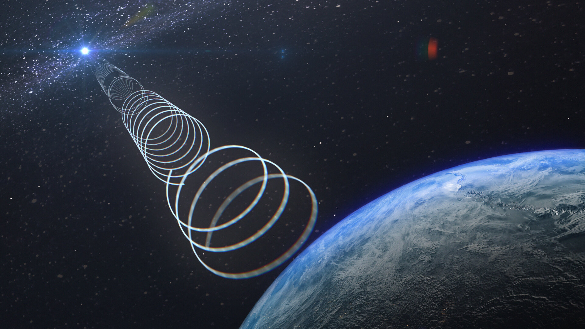
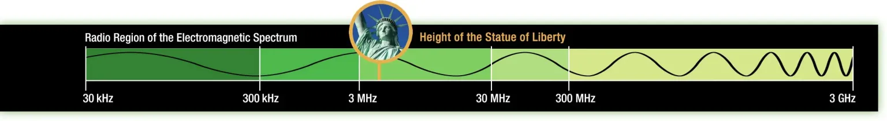

## Fondasi Tak Terlihat Dunia Konektivitas Modern



Dunia telah didominasi oleh serat optik dan satelit, banyak yang menganggap teknologi radio sebagai relik masa lalu. Namun, kenyataannya justru sebaliknya. **Gelombang radio** dan **teknologi radio** yang memanfaatkannya adalah tulang punggung tak terlihat dari peradaban digital kita. Dari mendengarkan musik di mobil hingga streaming video melalui Wi-Fi, semuanya dimungkinkan oleh prinsip-prinsip fundamental yang telah ada selama lebih dari satu abad. Artikel ini akan mengupas secara mendalam tentang apa itu gelombang radio, bagaimana teknologi radio bekerja, dan mengapa ia tetap menjadi pilar kritis di masa kini dan masa depan.

### Bagian 1: Sang Pembawa Pesan Tak Kasat Mata


_Image source: NASA Science_

**Gelombang radio** merupakan salah satu bentuk **radiasi elektromagnetik**, yang bergerak pada kecepatan cahaya. Mereka berada pada spektrum frekuensi yang lebih rendah daripada cahaya tampak, sehingga tidak dapat dilihat oleh mata manusia, namun memiliki kemampuan untuk menembus ruang hampa udara, bangunan, dan awan.

**Karakteristik Fundamental Gelombang Radio**

Untuk memahami bagaimana gelombang radio digunakan, kita perlu mengenal tiga properti utamanya:

1.  **Frekuensi (f):** Menunjukkan jumlah siklus gelombang yang terjadi dalam satu detik, diukur dalam Hertz (Hz). 

    > **Hukum utamanya**: Semakin tinggi frekuensi, semakin besar bandwidth (lebar pita) data yang dapat dibawa, namun jangkauannya lebih pendek dan kemampuan penetrasinya lebih lemah.
    {: .prompt-tip}

2.  **Panjang Gelombang (λ):** Merupakan jarak fisik antara dua titik identik pada gelombang yang berurutan (misalnya, dari puncak ke puncak). Panjang gelombang berbanding terbalik dengan frekuensi, sesuai rumus: **λ = c / f**, di mana **c** adalah kecepatan cahaya.
3.  **Amplitudo:** Merupakan tinggi gelombang, yang mengindikasikan kekuatan atau intensitas sinyal.

**Pita Spektrum Radio dan Alokasi Penggunaannya**

Agar tidak saling mengganggu, gelombang radio dibagi menjadi beberapa pita frekuensi, yang masing-masing dialokasikan untuk aplikasi spesifik.

| Pita Frekuensi                    | Karakteristik Panjang Gelombang | Aplikasi dan Penggunaan Umum                                                |
| :-------------------------------- | :------------------------------ | :-------------------------------------------------------------------------- |
| **ELF (Extremely Low Frequency)** | Sangat Panjang (Ribuan km)      | Komunikasi dengan kapal selam di kedalaman laut                             |
| **LF/MF (Contoh: AM Radio)**      | Panjang (Ratusan meter)         | Siaran radio AM (jangkauan luas, terutama malam hari)                       |
| **HF/VHF (Contoh: FM Radio)**     | Meter                           | Siaran radio FM, televisi analog VHF, radio komunikasi maritim              |
| **UHF**                           | Decimeter                       | Televisi digital, GSM/3G/4G, GPS, Walkie-Talkie, RFID                       |
| **SHF/EHF (Gelombang Mikro)**     | Centimeter / Milimeter          | **Wi-Fi (2.4 & 5 GHz), Bluetooth, 5G, Radar, Satelit TV, Koneksi Backhaul** |

### Bagian 2: Seni Menjinakkan Gelombang

Teknologi radio adalah disiplin ilmu yang memungkinkan kita memanfaatkan gelombang radio untuk membawa informasi. Proses ini, pada intinya, adalah tentang **modulasi** dan **demodulasi**.

**Prinsip Kerja Dasar Sistem Radio**

Proses komunikasi radio dapat disederhanakan menjadi enam langkah kunci:

```
[Microphone] → [Modulation] → [Antenna TX] → [Antenna RX] → [Demodulation] → [Speaker/Screen]
```

1.  **Generasi Sinyal Audio/Data:** Informasi (suara, data digital) diubah menjadi sinyal listrik.
2.  **Modulasi:** Sinyal informasi ini digunakan untuk memodifikasi (memodulasi) gelombang radio pembawa (*carrier wave*) berfrekuensi tinggi.
3.  **Pemancaran:** Sinyal yang telah dimodulasi diperkuat dan dipancarkan ke udara via antena.
4.  **Penerimaan:** Antena penerima menangkap sebagian kecil dari energi gelombang radio ini.
5.  **Demodulasi:** Penerima radio menyaring dan memisahkan informasi asli dari gelombang pembawa.
6.  **Rekonstruksi Output:** Sinyal informasi yang telah dipulihkan diubah kembali menjadi bentuk yang dapat dimengerti, seperti suara melalui speaker atau data di layar ponsel.

**Jenis-Jenis Modulasi: Jantung Teknologi Radio**

Modulasi adalah teknik "menumpangkan" informasi pada gelombang pembawa. Terdapat tiga jenis utama:

1.  **Amplitude Modulation (AM - Modulasi Amplitudo):**
    *   **Cara Kerja:** Amplitudo gelombang pembawa divariasikan sesuai dengan variasi sinyal suara.
    *   **Analogi:** Mengubah-ubah kekuatan dorongan pada ayunan.
    *   **Kelebihan & Kekurangan:** Jangkauan luas dan sederhana, tetapi rentan terhadap gangguan elektromagnetik (noise). Kualitas audio terbatas.
    *   **Aplikasi:** Siaran radio AM, komunikasi penerbangan.

2.  **Frequency Modulation (FM - Modulasi Frekuensi):**
    *   **Cara Kerja:** Frekuensi gelombang pembawa divariasikan, sementara amplitudonya tetap.
    *   **Analogi:** Mengubah-ubah kecepatan ayunan bolak-balik dengan dorongan yang konstan.
    *   **Kelebihan & Kekurangan:** Kualitas audio jernih dan tahan terhadap gangguan amplitudo, tetapi jangkauannya lebih terbatas dan membutuhkan bandwidth lebih lebar.
    *   **Aplikasi:** Siaran radio FM, siaran audio televisi analog.

3.  **Modulasi Digital (Phase Shift Keying, QAM, dll.):**
    *   **Cara Kerja:** Informasi dikodekan dalam bentuk digital (bit 0 dan 1) dengan mengubah fase, amplitudo, atau keduanya pada gelombang pembawa.
    *   **Kelebihan:** Sangat tahan noise, efisien dalam penggunaan bandwidth, dan dapat membawa data dalam jumlah sangat besar.
    *   **Aplikasi:** **Wi-Fi, Bluetooth, Siaran TV Digital, Telepon Seluler (4G/5G), Koneksi Satelit.**

**Komponen Penting dalam Sistem Radio**

*   **Pada Sisi Pemancar (Transmitter):** Terdapat Osilator (pembangkit gelombang pembawa), Modulator (pencampur sinyal), Penguat (amplifier), dan Antena pemancar.
*   **Pada Sisi Penerima (Receiver):** Terdapat Antena penerima, Tuner (penyeleksi frekuensi), Demodulator (pemilah sinyal informasi), Penguat sinyal audio/data, dan Transduser Output (seperti speaker).

## Relevansi Abadi dalam Dunia Modern

Gelombang radio adalah "jalan raya" yang tak terlihat, sementara teknologi radio adalah "kendaraan" yang mengantarkan informasi kita. Klaim bahwa teknologi ini sudah usang adalah sebuah kesalahpahaman besar.

**Teknologi radio justru lebih relevan daripada sebelumnya.** Setiap teknologi nirkabel yang mendefinisikan kehidupan modern, mulai dari **Wi-Fi dan Bluetooth** yang menghubungkan perangkat personal, **jaringan seluler 4G/5G** yang menjaga kita tetap terhubung, **GPS** yang memandu perjalanan, hingga **RFID** yang mengoptimalkan logistik (semuanya dibangun di atas fondasi teknologi radio).

Ke depan, dengan berkembangnya **Internet of Things (IoT), Smart Cities, dan kendaraan otonom**, ketergantungan kita pada gelombang radio yang andal dan efisien hanya akan semakin dalam. Dengan demikian, memahami gelombang dan teknologi radio bukan hanya sekadar mempelajari sejarah, melainkan memahami arsitektur fundamental dari dunia yang terhubung saat ini dan masa yang akan datang.

## Referensi
- [National Aeronautics and Space Administration (NASA)](https://science.nasa.gov/ems/05_radiowaves/)
- [Institute of Electrical and Electronics Engineers (IEEE)](https://www.ieee.org/)