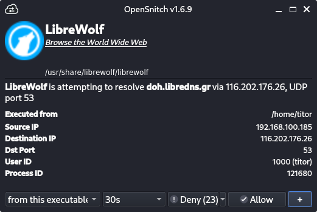
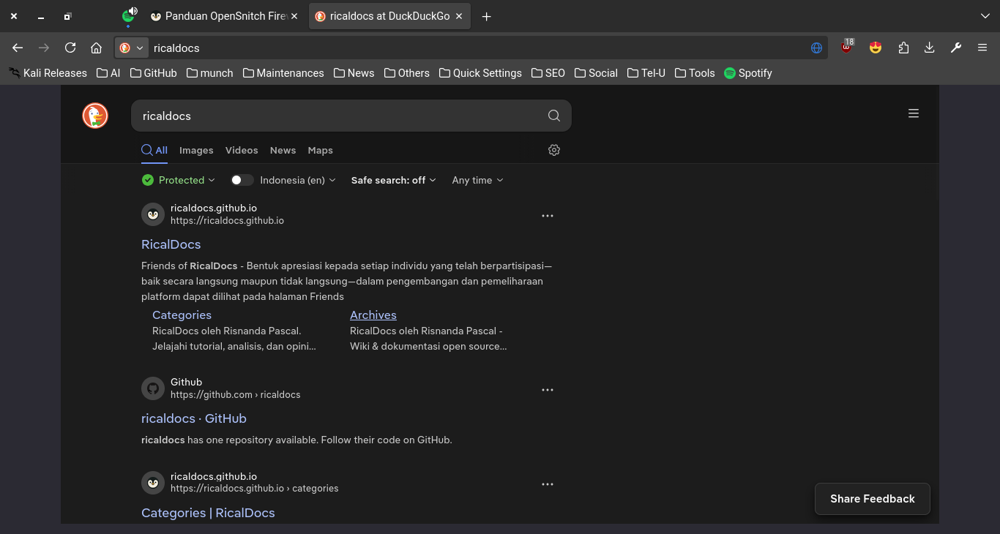
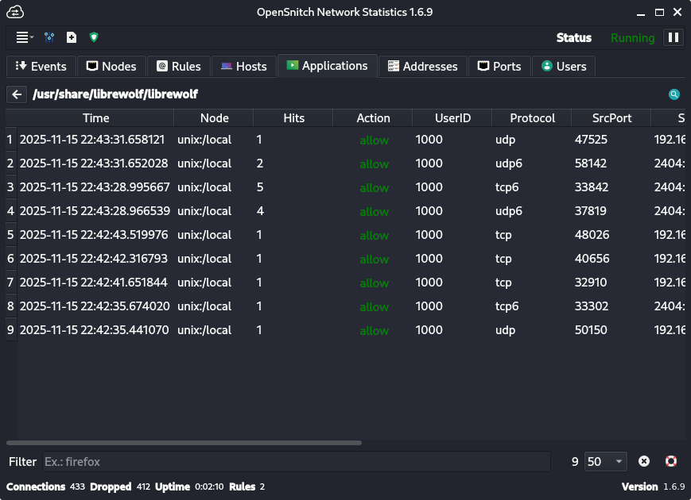
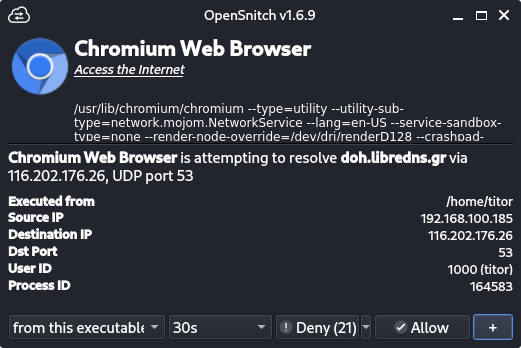
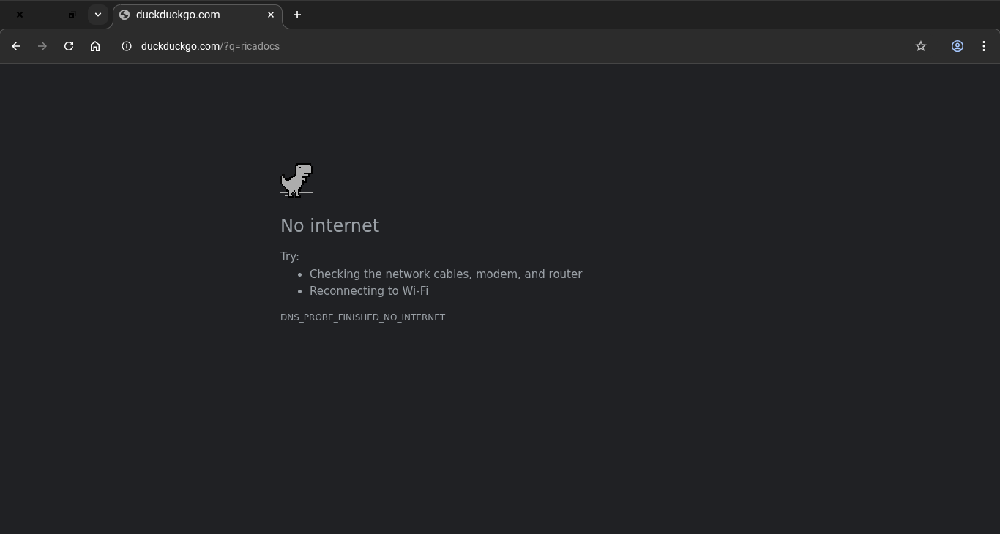
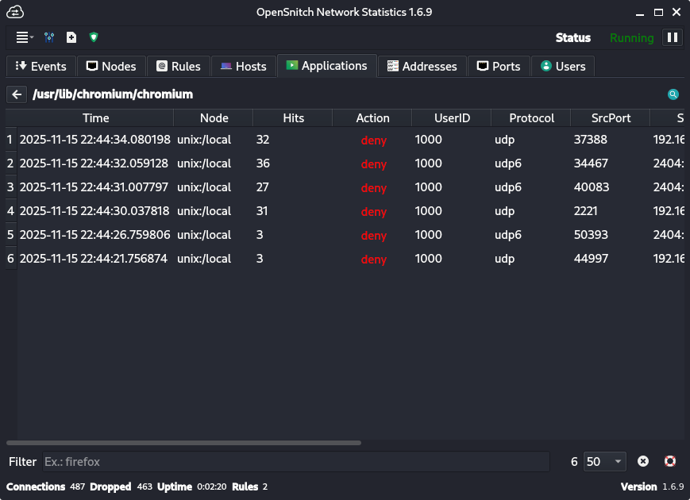
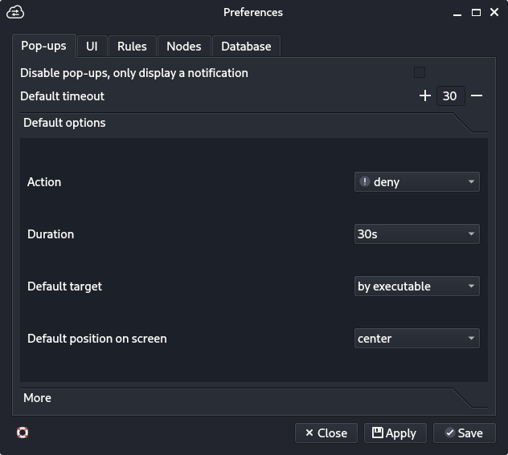

## 1. Pendahuluan

OpenSnitch merupakan solusi host-based firewall yang mengimplementasikan mekanisme application-level filtering berdasarkan permintaan koneksi dari aplikasi. Dalam arsitektur keamanan modern, kontrol akses jaringan pada level aplikasi menjadi kritikal untuk mencegah kebocoran data dan akses tidak sah. OpenSnitch hadir sebagai solusi stateful firewall yang menyediakan mekanisme real-time monitoring dan kontrol granular terhadap koneksi jaringan yang diinisiasi oleh aplikasi.

## 2. Metode Implementasi

### 2.1 Proses Instalasi

Implementasi dimulai dengan instalasi paket OpenSnitch melalui repository sistem:

```bash
sudo apt install -y opensnitch
```

Setelah instalasi berhasil, service OpenSnitch diaktifkan menggunakan systemd:

```bash
sudo systemctl start opensnitch
```

Antarmuka manajemen dijalankan melalui perintah:
```bash
opensnitch-ui
```

### 2.2 Arsitektur Monitoring

Sistem dikonfigurasi dengan arsitektur monitoring komprehensif yang meliputi:

- **Real-time Connection Tracking**: Memantau semua socket connections yang dibuat oleh aplikasi
- **Interactive Popup Notification**: Menampilkan dialog interaktif untuk setiap koneksi baru
- **Dynamic Rule Generation**: Membuat aturan firewall secara dinamis berdasarkan respon pengguna

## 3. Hasil dan Analisis

### 3.1 Skenario Testing: LibreWolf Browser

Pada pengujian pertama, LibreWolf browser diizinkan mengakses jaringan. Proses deteksi OpenSnitch berjalan optimal dengan munculnya popup notifikasi yang menampilkan detail koneksi. 



Ketika pengguna memilih opsi **"Allow"**, sistem menghasilkan aturan persisten yang mengizinkan koneksi outward LibreWolf.

**Hasil**: 



- Status Koneksi: **BERHASIL**
- Browser dapat mengakses internet normal
- Aturan firewall tersimpan dalam database OpenSnitch
  

### 3.2 Skenario Testing: Chromium Browser

Kontras dengan skenario sebelumnya, Chromium sengaja dibatasi akses jaringannya.



Popup OpenSnitch muncul identik, namun kali ini administrator memilih opsi **"Deny"**. Sistem secara otomatis memblokir koneksi dan menyimpan aturan pemblokiran.

**Hasil**:



- Status Koneksi: **TERBLOKIR**
- Browser gagal mengakses internet
- Halaman error "No internet" ditampilkan
- Aturan deny tersimpan dalam konfigurasi
  

### 3.3 Konfigurasi Default Rules



Melalui antarmuka preferences, administrator memiliki kemampuan untuk:

- Mengatur default action (allow/deny) untuk koneksi tidak terdefinisi
- Mengonfigurasi timeout aturan
- Mengelola database rules yang tersimpan
- Mengatur logging verbosity

## 4. Diskusi

Implementasi menunjukkan efektivitas OpenSnitch dalam menerapkan prinsip least privilege pada level aplikasi. Beberapa keunggulan yang teridentifikasi:

1. **Granular Control**: Kontrol akses per-aplikasi dengan detail proses dan user
2. **Transparency**: Notifikasi real-time memberikan visibilitas penuh terhadap aktivitas jaringan
3. **Usability**: Antarmuka intuitif memudahkan administrasi aturan firewall

## 5. Kesimpulan

Kemampuan OpenSnitch dalam melakukan real-time monitoring dan dynamic rule generation memberikan lapisan keamanan defensif yang proaktif. Implementasi ini berhasil mendemonstrasikan kemampuan kontrol akses granular dimana akses jaringan dapat diizinkan atau dibatasi secara selektif berdasarkan kebutuhan keamanan organisasi.