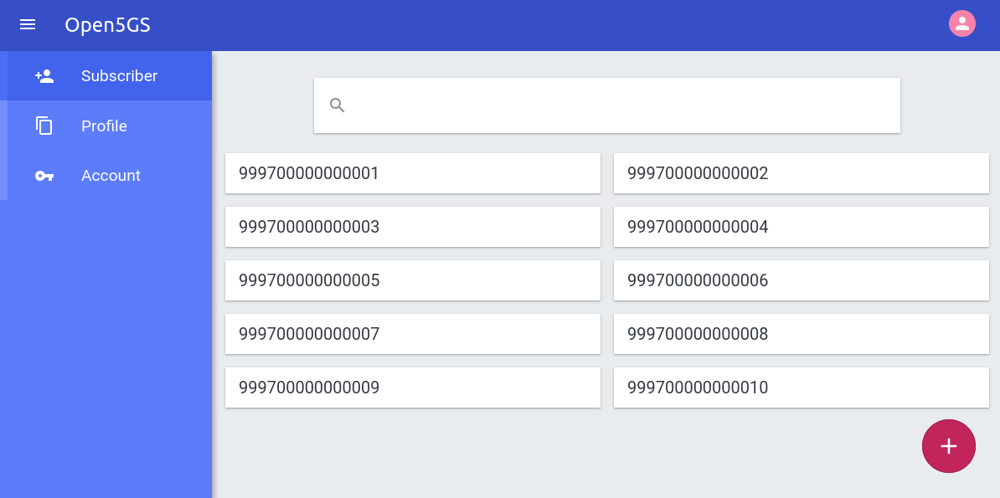
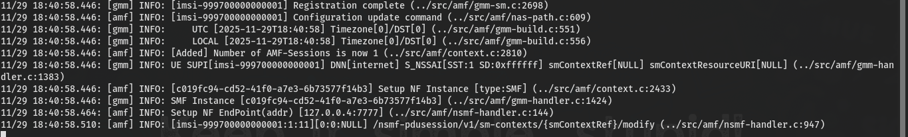
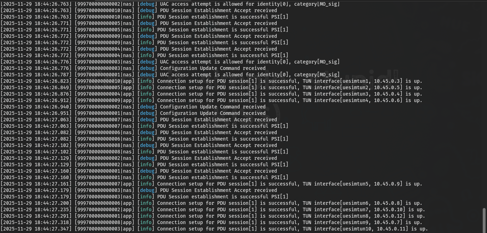
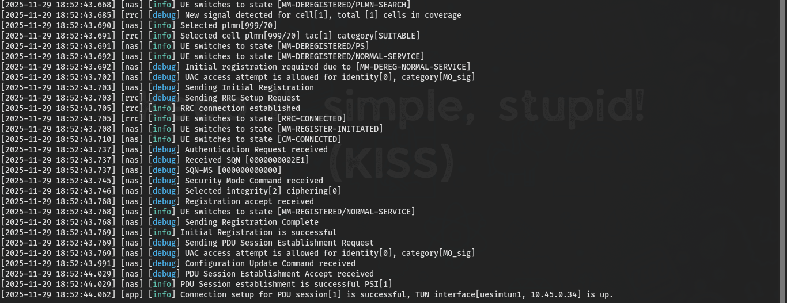

> **Artikel sebelumnya**: [Membangun 5G Core (Standalone) Sendiri Menggunakan Open5GS & UERANSIM](https://ricaldocs.github.io/posts/membangun-5g-core-sendiri-menggunakan-open5gs-dan-ueransim/)

## Pendahuluan

Dalam lingkungan jaringan 5G Standalone (SA), Access and Mobility Management Function (AMF) berperan sebagai komponen kritis yang mengelola prosedur registrasi, autentikasi, dan mobilitas perangkat pengguna (UE). Dokumen ini memberikan panduan teknis untuk mensimulasikan serangan Distributed Denial of Service (DDoS) pada jaringan 5G SA menggunakan Open5GS dan UERANSIM, dengan fokus pada analisis dampak terhadap kinerja sistem dan identifikasi titik kerentanan.

## Konfigurasi Awal dan Persiapan Pengujian

### Persiapan Subscriber untuk Pengujian Skala Besar

Sebelum melakukan simulasi beban tinggi, tambahkan 10 UE melalui WebUI Open5GS untuk memastikan kapasitas subscriber yang memadai.



### Inisialisasi Komponen Jaringan

#### Terminal 1 - Menjalakan gNB
```bash
../build/nr-gnb -c gnb1.yaml 
```

Keluaran yang diharapkan:
```
[2025-11-29 17:49:44.719] [sctp] [info] Trying to establish SCTP connection... (127.0.0.5:38412)
[2025-11-29 17:49:44.736] [sctp] [info] SCTP connection established (127.0.0.5:38412)
[2025-11-29 17:49:44.736] [sctp] [debug] SCTP association setup ascId[13]
[2025-11-29 17:49:44.736] [ngap] [debug] Sending NG Setup Request
[2025-11-29 17:49:44.738] [ngap] [debug] NG Setup Response received
[2025-11-29 17:49:44.738] [ngap] [info] NG Setup procedure is successful
```

#### Terminal 2 - Koneksi UE Tunggal (Baseline)
```bash
sudo ../build/nr-ue -c ue1.yaml
```

Keluaran yang diharapkan:
```
[2025-11-29 17:50:05.358] [nas] [info] UE switches to state [MM-DEREGISTERED/PLMN-SEARCH]
[2025-11-29 17:50:05.632] [nas] [debug] Authentication Request received
[2025-11-29 17:50:05.709] [nas] [info] Initial Registration is successful
[2025-11-29 17:50:06.027] [nas] [info] PDU Session establishment is successful PSI[1]
[2025-11-29 17:50:06.137] [app] [info] Connection setup for PDU session[1] is successful
```


#### Terminal 3 - Monitoring AMF Log
```bash
tail -f /var/log/open5gs/amf.log
```

Keluaran yang diharapkan:
```
11/29 17:50:05.915: [gmm] INFO: [imsi-999700000000001] Registration complete
11/29 17:50:05.917: [amf] INFO: [Added] Number of AMF-Sessions is now 1
11/29 17:50:06.062: [amf] INFO: [imsi-999700000000001:1:11] PDU Session modify
```



#### Terminal 4 - Monitoring Resource System
```bash
htop
```

## Simulasi Beban Tinggi dengan Multiple UE

### Pengujian dengan 10 UE Simultan

#### Terminal 2 - Menjalankan 10 UE Secara Bersamaan
```bash
sudo ../build/nr-ue -c ue1.yaml -n 10
```

Keluaran yang diharapkan:
```
[2025-11-29 17:51:15.918] [999700000000010|nas] [info] UE switches to state [MM-DEREGISTERED/PLMN-SEARCH]
[2025-11-29 17:51:15.919] [999700000000009|nas] [info] UE switches to state [MM-DEREGISTERED/PLMN-SEARCH]
[2025-11-29 17:51:16.340] [999700000000008|nas] [info] Initial Registration is successful
[2025-11-29 17:51:16.365] [999700000000001|nas] [info] Initial Registration is successful
```



### Analisis Proses Autentikasi Massal

Proses simulasi menunjukkan pola khas dalam prosedur autentikasi 5G-AKA:

1. **Initial SQN Synchronization**: Multiple UE mengalami `Authentication Failure due to SQN out of range` pada percobaan pertama
2. **SQN Resynchronization**: Permintaan autentikasi kedua berhasil dengan SQN yang diperbarui
3. **Security Mode Command**: Pembentukan konteks keamanan dengan algoritma integrity dan ciphering
4. **PDU Session Establishment**: Pembentukan sesi data setelah registrasi berhasil

```bash
# Pola khas failure SQN awal
[999700000000008|nas] [debug] Received SQN [000000000000]
[999700000000008|nas] [debug] SQN-MS [000000000000]
[999700000000008|nas] [debug] Sending Authentication Failure due to SQN out of range

# SQN yang diperbaiki pada percobaan kedua  
[999700000000008|nas] [debug] Received SQN [000000000021]
[999700000000008|nas] [debug] SQN-MS [000000000000]
[999700000000008|nas] [debug] Security Mode Command received
```

## Eskalasi Serangan DDoS

### Pengujian dengan 100 UE

Untuk meningkatkan tekanan pada sistem, jalankan simulasi dengan 100 UE simultan:

```bash
sudo ../build/nr-ue -c ue1.yaml -n 100
```


> Monitor peningkatan penggunaan CPU melalui `htop` menunjukkan escalasi resource consumption yang signifikan.
{: .prompt-info}

### Automated Load Testing dengan Script

Buat script otomatis untuk pengujian berulang:

#### Terminal 5 - Pembuatan Load Testing Script
```bash
nano loop.sh
```

Isi script `loop.sh`:
```bash
#!/bin/bash
for i in {1..10}
do
    echo "Cycle $i: Launching 100 UEs"
    sudo ../build/nr-ue -c ue1.yaml -n 100
    sleep 2
done
```

Berikan hak akses eksekusi dan jalankan:
```bash
chmod u+x loop.sh
./loop.sh
```

### Impact Analysis: Segmentation Fault pada AMF

Setelah beberapa siklus pengujian, AMF mengalami crash dengan error:

```
Segmentation fault (core dumped)
```

Verifikasi Status Service:
```bash
sudo systemctl status open5gs-amfd.service
```

Restart gNB setelah failure:
```bash
../build/nr-gnb -c gnb1.yaml 
```

## Pengujian Lanjutan dengan Konfigurasi UE Berbeda

### Konfigurasi UE Alternatif (`ue2.yaml`)

Buat konfigurasi UE kedua untuk variasi pengujian:

```yaml
# IMSI number of the UE. IMSI = [MCC|MNC|MSISDN] (In total 15 digits)
supi: 'imsi-999700000000002'
# Mobile Country Code value of HPLMN
mcc: '999'
# Mobile Network Code value of HPLMN (2 or 3 digits)
mnc: '70'

# SUCI Protection Scheme : 0 for Null-scheme, 1 for Profile A and 2 for Profile B
protectionScheme: 0
# Home Network Public Key for protecting with SUCI Profile A
homeNetworkPublicKey: '5a8d38864820197c3394b92613b20b91633cbd897119273bf8e4a6f4eec0a650'
# Home Network Public Key ID for protecting with SUCI Profile A
homeNetworkPublicKeyId: 1
# Routing Indicator
routingIndicator: '0000'

# Permanent subscription key
key: '465B5CE8B199B49FAA5F0A2EE238A6BC'
# Operator code (OP or OPC) of the UE
op: 'E8ED289DEBA952E4283B54E88E6183CA'
# This value specifies the OP type and it can be either 'OP' or 'OPC'
opType: 'OPC'
# Authentication Management Field (AMF) value
amf: '8000'

# IMEI number of the device. It is used if no SUPI is provided
imei: '356938035643804'
# IMEISV number of the device. It is used if no SUPI and IMEI is provided
imeiSv: '4370816125816152'

# Network mask used for the UE's TUN interface to define the subnet size  
tunNetmask: '255.255.255.0'

# List of gNB IP addresses for Radio Link Simulation
gnbSearchList:
  - 127.0.0.101

# UAC Access Identities Configuration
uacAic:
  mps: false
  mcs: false

# UAC Access Control Class
uacAcc:
  normalClass: 0
  class11: false
  class12: false
  class13: false
  class14: false
  class15: false

# Initial PDU sessions to be established
sessions:
  - type: 'IPv4'
    apn: 'internet'
    slice:
      sst: 1

# Configured NSSAI for this UE by HPLMN
configured-nssai:
  - sst: 1

# Default Configured NSSAI for this UE
default-nssai:
  - sst: 1
    sd: 1

# Supported integrity algorithms by this UE
integrity:
  IA1: true
  IA2: true
  IA3: true

# Supported encryption algorithms by this UE
ciphering:
  EA1: true
  EA2: true
  EA3: true

# Integrity protection maximum data rate for user plane
integrityMaxRate:
  uplink: 'full'
  downlink: 'full'
```

Jalankan UE individual untuk testing connectivity:
```bash
sudo ../build/nr-ue -c ue2.yaml
```



### Eskalasi Ultimate: 400 UE per Iterasi

Modifikasi script untuk tekanan maksimal:

```bash
#!/bin/bash
for i in {1..10}
do
    echo "Cycle $i: Launching 400 UEs"
    sudo ../build/nr-ue -c ue1.yaml -n 400
    sleep 1
done
```

## Analisis dan Rekomendasi Keamanan

### Observations dari Simulasi DDoS

1. AMF mengalami CPU/memory exhaustion sebelum mencapai kapasitas teoritis
2. Mekanisme SQN resynchronization menambah overhead komputasi
3. Keterbatasan dalam menangani koneksi SCTP simultan
4. Kesulitan dalam maintain state untuk ribuan UE bersamaan

### Mitigation Strategies untuk Environment Production

1. Implementasi pembatasan permintaan registrasi per detik
2. Pre-validation subscriber sebelum proses autentikasi penuh
3. Real-time monitoring dengan threshold-based alerting
4. Distribusi beban antar AMF instances
5. AI/ML based detection untuk pola serangan yang tidak biasa

### Rekomendasi untuk Testing Environment

1. Mulai dari 10 UE, kemudian 50, 100, dan seterusnya
2. Gunakan tools seperti `valgrind` untuk identifikasi memory leak
3. Automated parsing log untuk deteksi pola failure
4. Establish baseline performance metrics sebelum testing

## Kesimpulan

Simulasi DDoS pada jaringan 5G Standalone mengungkap kerentanan kritis dalam komponen AMF ketika menghadapi volume permintaan registrasi yang massive. Pengujian ini menyoroti pentingnya implementasi mekanisme proteksi DDoS dan strategi scaling yang robust dalam environment production. Dokumentasi ini memberikan framework metodologis untuk stress testing dan resilience validation infrastruktur 5G core.