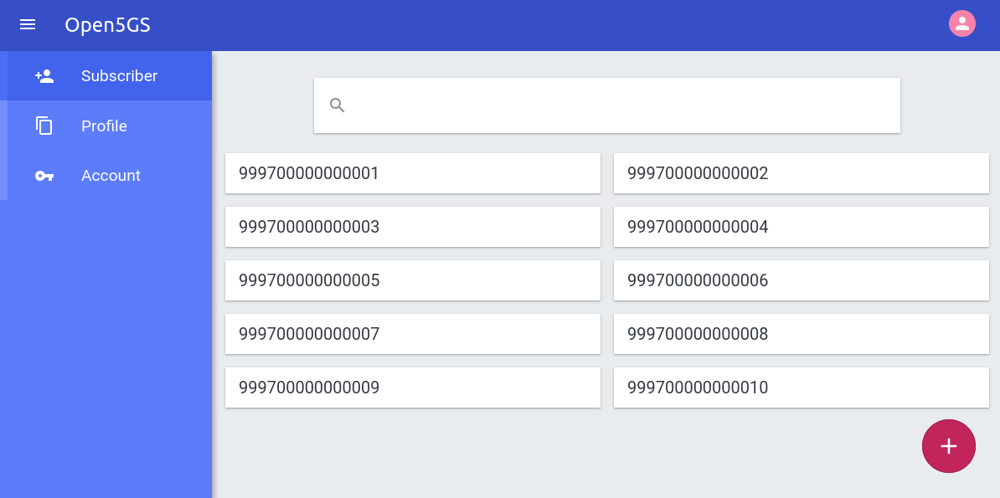
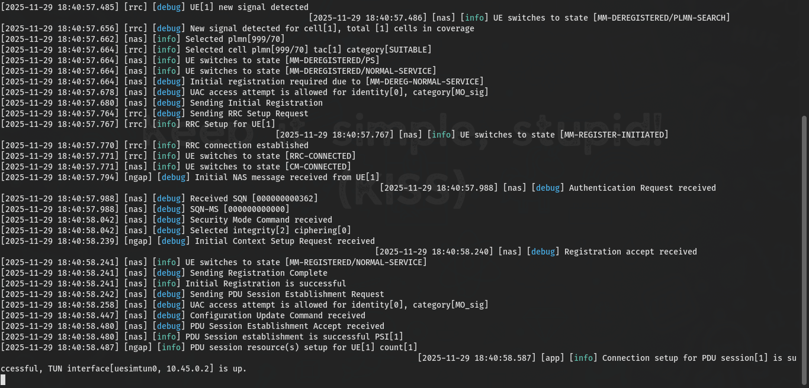
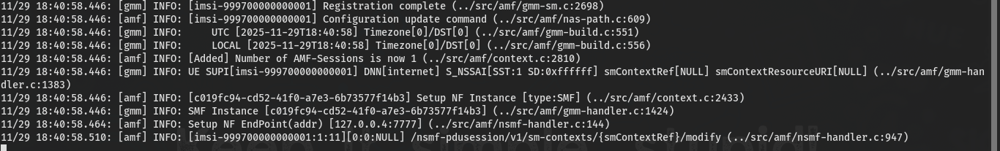
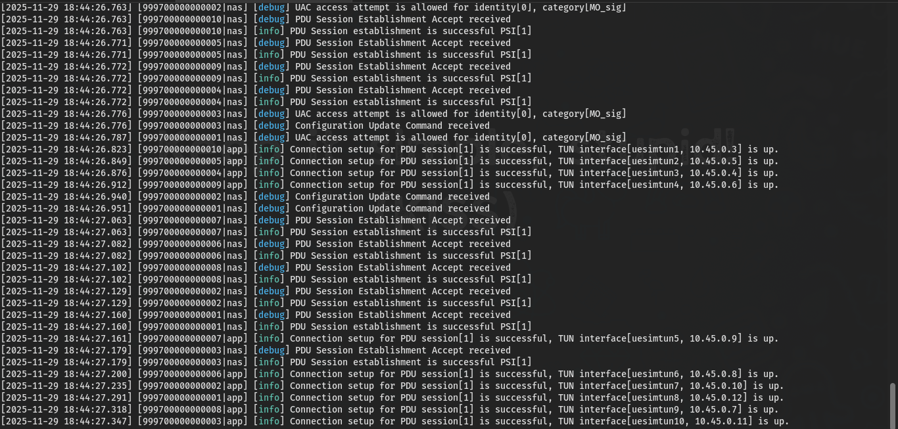
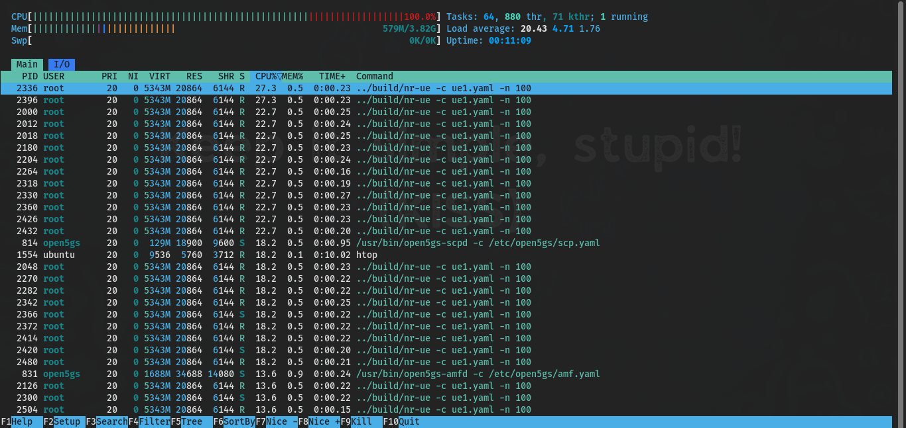

## Prasyarat Wajib

Sebelum melanjutkan panduan ini, Anda HARUS sudah menyelesaikan instalasi dan konfigurasi jaringan 5G SA dasar dari artikel sebelumnya:

👉 [Panduan Membangun 5G Core Sendiri Menggunakan Open5GS dan UERANSIM](https://docs.ricalnet.my.id/posts/panduan-membangun-5g-core-sendiri-menggunakan-open5gs-dan-ueransim/)

Tanpa menyelesaikan artikel sebelumnya, panduan ini TIDAK akan berfungsi karena:
1. Open5GS belum terinstal
2. MongoDB tidak berjalan
3. UERANSIM belum dikompilasi
4. Konfigurasi gNB dan UE dasar belum dibuat
5. Subscriber belum ditambahkan di WebUI

> Pastikan semua komponen dari artikel sebelumnya berjalan normal sebelum mencoba simulasi DDoS.
{: .prompt-info}

## Pendahuluan

Di jaringan 5G Standalone (SA), AMF (Access and Mobility Management Function) adalah komponen paling kritis. AMF menangani registrasi, autentikasi, dan mobilitas semua perangkat. Jika AMF mati, seluruh jaringan mati. Ini seperti pintu masuk utama—kalau macet, semua orang tidak bisa masuk.

Dokumen ini menunjukkan cara mensimulasikan serangan DDoS (Distributed Denial of Service) pada 5G core menggunakan Open5GS dan UERANSIM. Tujuannya: menemukan titik lemah sebelum penjahat siber menemukannya.

Mengapa AMF menjadi target utama DDoS? AMF adalah pintu gerbang semua UE (perangkat pengguna). Setiap UE harus registrasi ke AMF sebelum bisa menggunakan jaringan. Jika penyerang mengirim ribuan permintaan registrasi palsu, AMF kewalahan—CPU/ memory habis, dan UE legitimate tidak bisa masuk.

## Konfigurasi Awal dan Persiapan Pengujian

### Persiapan Subscriber untuk Pengujian Skala Besar

Sebelum simulasi beban tinggi, tambahkan 10 subscriber melalui WebUI Open5GS. Tanpa subscriber, UE tidak bisa autentikasi.



Mengapa harus 10 subscriber? Setiap UE butuh data autentikasi (IMSI, K, OPc) yang valid. Untuk simulasi 100 UE, Anda perlu 100 subscriber. Bisa di-generate massal melalui WebUI atau API.

### Inisialisasi Komponen Jaringan

#### Terminal 1 - Menjalankan gNB (Stasiun Basis 5G)

```bash
../build/nr-gnb -c gnb1.yaml 
```

Output yang diharapkan:
```
[2025-11-29 17:49:44.719] [sctp] [info] Trying to establish SCTP connection... (127.0.0.5:38412)
[2025-11-29 17:49:44.736] [sctp] [info] SCTP connection established (127.0.0.5:38412)
[2025-11-29 17:49:44.736] [ngap] [debug] Sending NG Setup Request
[2025-11-29 17:49:44.738] [ngap] [debug] NG Setup Response received
[2025-11-29 17:49:44.738] [ngap] [info] NG Setup procedure is successful
```

Mengapa gNB harus berjalan dulu? gNB adalah jembatan antara UE dan core. Tanpa gNB, UE tidak bisa berkomunikasi dengan AMF. NG Setup adalah prosedur inisialisasi antara gNB dan AMF melalui protokol NGAP (Next Generation Application Protocol).

#### Terminal 2 - Koneksi UE Tunggal (Baseline)

Sebelum serangan, ukur performa normal dengan 1 UE:

```bash
sudo ../build/nr-ue -c ue1.yaml
```

Output yang diharapkan:
```
[2025-11-29 17:50:05.358] [nas] [info] UE switches to state [MM-DEREGISTERED/PLMN-SEARCH]
[2025-11-29 17:50:05.632] [nas] [debug] Authentication Request received
[2025-11-29 17:50:05.709] [nas] [info] Initial Registration is successful
[2025-11-29 17:50:06.027] [nas] [info] PDU Session establishment is successful PSI[1]
```



> Alur UE attach: PLMN-SEARCH → Authentication Request → Initial Registration → PDU Session Establishment. Ini adalah prosedur lengkap yang akan diulang ribuan kali saat serangan DDoS.
{: .prompt-info}

#### Terminal 3 - Monitoring AMF Log

Pantau aktivitas AMF secara real-time:

```bash
tail -f /var/log/open5gs/amf.log
```

Output yang diharapkan:
```
11/29 17:50:05.915: [gmm] INFO: [imsi-999700000000001] Registration complete
11/29 17:50:05.917: [amf] INFO: [Added] Number of AMF-Sessions is now 1
11/29 17:50:06.062: [amf] INFO: [imsi-999700000000001:1:11] PDU Session modify
```



> Log menunjukkan setiap langkah autentikasi dan sesi. Saat serangan, log akan penuh dengan permintaan dari ratusan UE. Ini adalah data utama untuk analisis dampak.
{: .prompt-info}

#### Terminal 4 - Monitoring Resource System

Pantau CPU, memory, dan load system:

```bash
htop
```

DDoS menyerang resource. htop menunjukkan real-time CPU usage, memory consumption, dan load average. Saat serangan, Anda akan melihat lonjakan drastis.

## Simulasi Beban Tinggi dengan Multiple UE

### Terminal 2 - Pengujian dengan 10 UE Simultan

Mulai dari 10 UE untuk melihat dampak awal:

```bash
sudo ../build/nr-ue -c ue1.yaml -n 10
```

Output yang diharapkan:
```
[2025-11-29 17:51:15.918] [999700000000010|nas] [info] UE switches to state [MM-DEREGISTERED/PLMN-SEARCH]
[2025-11-29 17:51:15.919] [999700000000009|nas] [info] UE switches to state [MM-DEREGISTERED/PLMN-SEARCH]
[2025-11-29 17:51:16.340] [999700000000008|nas] [info] Initial Registration is successful
[2025-11-29 17:51:16.365] [999700000000001|nas] [info] Initial Registration is successful
```



### Analisis Proses Autentikasi Massal

Simulasi menunjukkan pola khas autentikasi 5G-AKA:

1. Kegagalan SQN Awal:
```
[999700000000008|nas] [debug] Received SQN [000000000000]
[999700000000008|nas] [debug] SQN-MS [000000000000]
[999700000000008|nas] [debug] Sending Authentication Failure due to SQN out of range
```

2. Resynchronization SQN (percobaan kedua):
```
[999700000000008|nas] [debug] Received SQN [000000000021]
[999700000000008|nas] [debug] SQN-MS [000000000000]
[999700000000008|nas] [debug] Security Mode Command received
```

SQN (Sequence Number) adalah counter untuk mencegah replay attack. Saat UE baru pertama kali konek, SQN di UE dan di UDM tidak sinkron. Proses resynchronization memperbaiki ini—tapi butuh resource ekstra di AMF dan UDM. Inilah yang dieksploitasi oleh DDoS: memaksa AMF melakukan resynchronization untuk ribuan UE palsu, menghabiskan CPU.

## Eskalasi Serangan DDoS

### Pengujian dengan 100 UE

Tingkatkan ke 100 UE simultan:

```bash
sudo ../build/nr-ue -c ue1.yaml -n 100
```



Pantau htop. CPU usage akan melonjak, memory terpakai meningkat. Jika AMF tidak cukup kuat, service mulai melambat atau crash.
{: .prompt-tip}

### Automated Load Testing dengan Script

Buat script untuk serangan berulang—simulasi serangan DDoS yang terus-menerus:

```bash
nano loop.sh
```

Isi:
```bash
#!/bin/bash
for i in {1..10}
do
    echo "Cycle $i: Launching 100 UEs"
    sudo ../build/nr-ue -c ue1.yaml -n 100
    sleep 2
done
```

Jalankan:
```bash
chmod u+x loop.sh
./loop.sh
```

> Serangan DDoS nyata tidak sekali jalan. Penyerang mengirim gelombang permintaan terus-menerus. Script ini mensimulasikan 10 gelombang, masing-masing 100 UE, dengan jeda 2 detik.
{: .prompt-info}

### Impact Analysis: Segmentation Fault pada AMF

Setelah beberapa siklus, AMF crash:

```
Segmentation fault (core dumped)
```

Verifikasi status:
```bash
sudo systemctl status open5gs-amfd.service
```

Restart gNB setelah crash:
```bash
../build/nr-gnb -c gnb1.yaml 
```

Mengapa AMF crash? 100 UE per gelombang, 10 gelombang = 1000 permintaan registrasi dalam waktu singkat. AMF kehabisan memory (biasanya karena memory leak atau buffer overflow). Ini adalah titik kerentanan yang harus diperbaiki di production.

## Pengujian Lanjutan dengan Konfigurasi UE Berbeda

### Konfigurasi UE Alternatif (`ue2.yaml`)

Buat variasi untuk menguji skenario berbeda (misal, UE dengan IMSI lain):

```yaml
# IMSI number of the UE. IMSI = [MCC|MNC|MSISDN] (In total 15 digits)
supi: 'imsi-999700000000002'
# Mobile Country Code value of HPLMN
mcc: '999'
# Mobile Network Code value of HPLMN (2 or 3 digits)
mnc: '70'

# SUCI Protection Scheme : 0 for Null-scheme, 1 for Profile A and 2 for Profile B
protectionScheme: 0
# Home Network Public Key for protecting with SUCI Profile A
homeNetworkPublicKey: '5a8d38864820197c3394b92613b20b91633cbd897119273bf8e4a6f4eec0a650'
# Home Network Public Key ID for protecting with SUCI Profile A
homeNetworkPublicKeyId: 1
# Routing Indicator
routingIndicator: '0000'

# Permanent subscription key
key: '465B5CE8B199B49FAA5F0A2EE238A6BC'
# Operator code (OP or OPC) of the UE
op: 'E8ED289DEBA952E4283B54E88E6183CA'
# This value specifies the OP type and it can be either 'OP' or 'OPC'
opType: 'OPC'
# Authentication Management Field (AMF) value
amf: '8000'

# IMEI number of the device. It is used if no SUPI is provided
imei: '356938035643804'
# IMEISV number of the device. It is used if no SUPI and IMEI is provided
imeiSv: '4370816125816152'

# Network mask used for the UE's TUN interface to define the subnet size  
tunNetmask: '255.255.255.0'

# List of gNB IP addresses for Radio Link Simulation
gnbSearchList:
  - 127.0.0.101

# UAC Access Identities Configuration
uacAic:
  mps: false
  mcs: false

# UAC Access Control Class
uacAcc:
  normalClass: 0
  class11: false
  class12: false
  class13: false
  class14: false
  class15: false

# Initial PDU sessions to be established
sessions:
  - type: 'IPv4'
    apn: 'internet'
    slice:
      sst: 1

# Configured NSSAI for this UE by HPLMN
configured-nssai:
  - sst: 1

# Default Configured NSSAI for this UE
default-nssai:
  - sst: 1
    sd: 1

# Supported integrity algorithms by this UE
integrity:
  IA1: true
  IA2: true
  IA3: true

# Supported encryption algorithms by this UE
ciphering:
  EA1: true
  EA2: true
  EA3: true

# Integrity protection maximum data rate for user plane
integrityMaxRate:
  uplink: 'full'
  downlink: 'full'
```

Jalankan:
```bash
sudo ../build/nr-ue -c ue2.yaml
```


> Penyerang bisa menggunakan banyak IMSI berbeda. Jika semua UE menggunakan IMSI yang sama, core mungkin mendeteksi anomali dan memblokir. Dengan banyak IMSI, serangan lebih sulit dideteksi.
{: .prompt-info}

### Eskalasi Ultimate: 400 UE per Iterasi

Modifikasi script untuk tekanan maksimal (400 UE per gelombang):

```bash
#!/bin/bash
for i in {1..10}
do
    echo "Cycle $i: Launching 400 UEs"
    sudo ../build/nr-ue -c ue1.yaml -n 400
    sleep 1
done
```

Mengapa 400? Menemukan batas kapasitas AMF. Pada 400 UE per gelombang, AMF akan crash lebih cepat. Ini membantu mengidentifikasi threshold sebelum sistem tidak responsif.

## Analisis dan Rekomendasi Keamanan

### Observations dari Simulasi DDoS

| Temuan                                                         | Implikasi                                                          |
| -------------------------------------------------------------- | ------------------------------------------------------------------ |
| AMF mengalami CPU/memory exhaustion sebelum kapasitas teoritis | Overprovisioning tidak cukup; butuh mekanisme pembatasan           |
| SQN resynchronization menambah overhead komputasi              | Resynchronization adalah serangan amplifikasi                      |
| Keterbatasan SCTP connection handling                          | SCTP punya batas koneksi simultan; ini bisa dieksploitasi          |
| Kesulitan maintain state untuk ribuan UE                       | AMF menyimpan state setiap UE; terlalu banyak state = memory habis |

Mengapa SQN resynchronization menjadi masalah? Setiap UE baru memicu resynchronization yang melibatkan perhitungan kriptografi di AMF dan UDM. Penyerang bisa memanfaatkan ini dengan mengirim banyak UE baru, memaksa AMF melakukan perhitungan berat berulang kali.

### Mitigation Strategies untuk Environment Production

1. Batasi registrasi per IP atau per IMSI
2. Cek keberadaan IMSI di database sebelum autentikasi penuh
3. Alert ketika registrasi rate melewati threshold
4. Distribusi beban ke multiple AMF instances
5. Deteksi pola registrasi anomali AI/ML Based Detection

> Alih-alih menjalankan autentikasi penuh (yang berat), AMF bisa cek dulu apakah IMSI terdaftar di database. Jika tidak, tolak langsung. Ini menghemat resource.
{: .prompt-tip}

### Rekomendasi untuk Testing Environment

1. Mulai dari 10 UE, naikkan bertahap ke 50, 100, 400
2. Gunakan `valgrind` untuk deteksi memory leak:
   ```bash
   valgrind --leak-check=full ../build/nr-ue -c ue1.yaml -n 100
   ```
3. Automatisasi parsing log untuk deteksi pola failure
4. Tetapkan baseline performa sebelum testing (CPU, memory, response time)

## Kesimpulan

Apa yang kita pelajari?
1. AMF adalah single point of failure di 5G core. Jika AMF crash, seluruh jaringan tidak bisa melayani UE baru.
2. SQN resynchronization adalah mekanisme yang bisa dieksploitasi—setiap UE baru memicu proses kriptografi berat.
3. Kapasitas AMF terbatas dan crash terjadi jauh sebelum batas teoritis karena memory leak dan overhead protokol.
4. Mitigasi butuh pendekatan berlapis: rate limiting, pre-validation, load balancing, dan monitoring.

Apa yang harus dilakukan di production?
- Implementasi rate limiting di AMF dan firewall
- Deploy multiple AMF dengan load balancer
- Gunakan edge firewall untuk filter trafik mencurigakan
- Monitoring real-time dengan threshold alert
- Lakukan stress testing rutin untuk mengetahui kapasitas sebenarnya

> Jaringan 5G adalah infrastruktur kritis. Jika tidak diuji ketahanannya, penyerang akan menemukan lubangnya dulu. Lakukan stress testing sekarang, sebelum mereka melakukannya untuk Anda.
{: .prompt-tip}