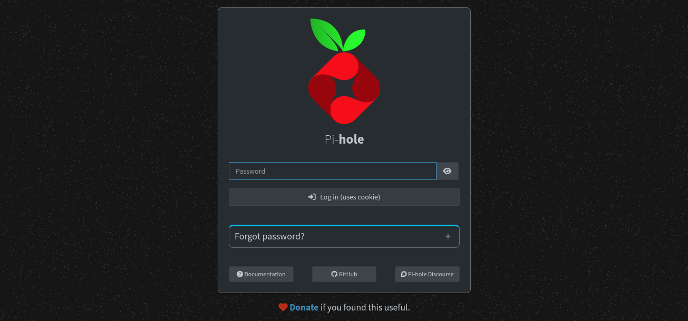
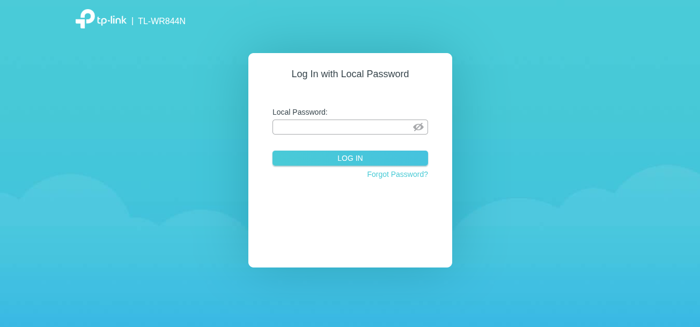
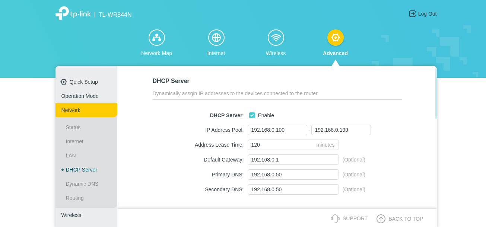
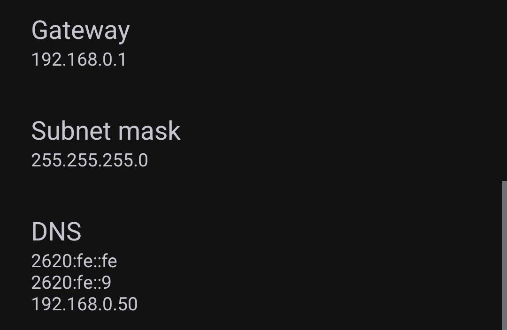
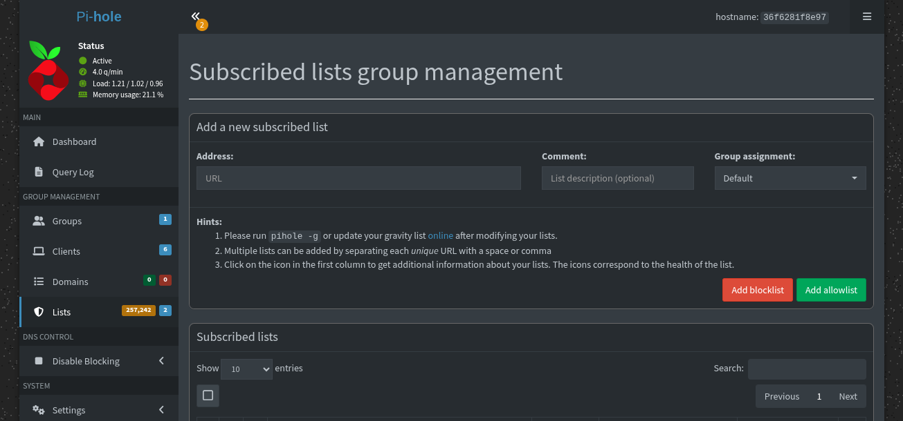
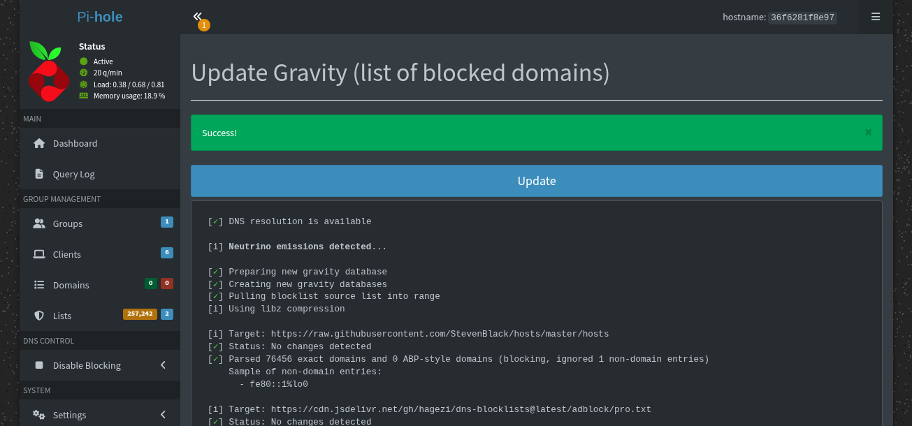
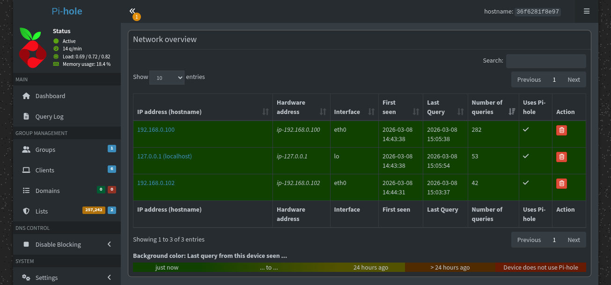

## Apa itu Pi-Hole dan Mengapa Perlu?

Pi-Hole adalah DNS server yang bertindak sebagai penyaring konten di tingkat jaringan. Saat perangkat meminta alamat situs web, Pi-Hole memeriksa apakah domain tersebut ada dalam daftar blokir. Jika ada, permintaan dialihkan ke alamat kosong (0.0.0.0) sehingga iklan atau pelacak tidak pernah termuat.

Keuntungan utama:
- Perlindungan untuk semua perangkat di jaringan (laptop, smartphone, smart TV, dll.) tanpa instalasi aplikasi tambahan
- Menghemat bandwidth karena konten iklan tidak diunduh
- Meningkatkan privasi dengan memblokir pelacak
- Satu titik konfigurasi untuk seluruh jaringan

Dengan pendekatan Docker, instalasi menjadi lebih mudah dikelola, diperbarui, dan diisolasi dari sistem utama.

## Prasyarat

| Komponen  | Keterangan                                                |
| --------- | --------------------------------------------------------- |
| Sistem    | Debian (trixie atau lebih baru) / Ubuntu                  |
| Akses     | Hak `sudo` atau root                                      |
| Router    | Mendukung pengaturan DNS (hampir semua router rumahan)    |
| IP Server | Statis disarankan. Panduan ini menggunakan `192.168.0.50` |
| Port      | 8080 untuk antarmuka web, 53 untuk DNS                    |

> Gunakan IP statis agar konfigurasi router tidak berubah saat server di-restart. Lihat [panduan NetworkManager](https://ricaldocs.github.io/posts/cara-mengatur-ip-statis-di-raspberry-pi-os-dengan-networkmanager/) jika belum tahu caranya.
{: .prompt-tip}

## 1. Clone Repository

```bash
git clone https://github.com/ricalnet/digital-independence.git
cd digital-independence
```

## 2. Instal Docker Engine

Untuk Debian:
```bash
./install-docker-engine-on-debian.sh
```

Untuk Ubuntu:
```bash
./install-docker-engine-on-ubuntu.sh
```

Mengapa Docker? Docker mengemas Pi-Hole dalam container yang terisolasi. Ini berarti:
- Tidak mengganggu layanan lain di server
- Mudah dihapus jika tidak digunakan lagi
- Update hanya dengan menarik image baru

## 3. Konfigurasi Pi-Hole

```bash
cd pi-hole
cp .env.example .env
nano .env
```

Sesuaikan file `.env` dengan kebutuhan Anda.

## 4. Jalankan Pi-Hole

```bash
docker compose up -d
```

Perintah ini:
- `up`: Membuat dan menjalankan container
- `-d`: Berjalan di latar belakang (detached mode)

Lihat log untuk memastikan tidak ada error:
```bash
docker compose logs -f
```

Tekan `Ctrl+C` untuk keluar dari tampilan log.

### Akses Admin Panel

Buka browser dan akses:
```
http://<alamat-ip-server>:8080/admin
```

Contoh: `http://192.168.0.50:8080/admin`

Masukkan password yang sudah Anda atur di file `.env`.



> Konfigurasi ini sudah otomatis menggunakan dnscrypt-proxy untuk mengenkripsi query DNS yang keluar.
{: .prompt-info}

## 5. Atur Router agar Menggunakan Pi-Hole sebagai DNS

Tujuan: Semua perangkat yang terhubung ke WiFi/router akan otomatis menggunakan Pi-Hole tanpa pengaturan manual di setiap perangkat.

Cara kerja: DHCP server di router bertugas memberikan alamat IP ke perangkat client. Salah satu informasi yang diberikan adalah alamat DNS. Dengan mengubah DNS di DHCP menjadi IP Pi-Hole, semua client akan menggunakannya.

Langkah-langkah umum (sesuaikan dengan merek router Anda):

1. Login ke router (biasanya `http://192.168.0.1` atau `http://192.168.1.1`)
   

2. Cari menu DHCP Server (biasanya di bagian Network atau LAN)
3. Atur parameter seperti contoh:
   

   | Parameter          | Nilai                             | Penjelasan                                     |
   | ------------------ | --------------------------------- | ---------------------------------------------- |
   | IP Address Pool    | `192.168.0.100` – `192.168.0.199` | Rentang IP yang diberikan ke perangkat client  |
   | Address Lease Time | `120` menit                       | Berapa lama IP bisa dipakai sebelum diperbarui |
   | Default Gateway    | `192.168.0.1`                     | IP router sebagai jalur keluar internet        |
   | Primary DNS        | `192.168.0.50`                    | IP Pi-Hole → ini yang penting                  |
   | Secondary DNS      | `192.168.0.50`                    | Isi sama agar tetap pakai Pi-Hole              |

4. Simpan pengaturan dan reboot router (jika diperlukan)

### Verifikasi

Setelah router reboot, periksa pengaturan jaringan di perangkat (contoh: smartphone Android):



Pastikan kolom DNS menampilkan alamat IP Pi-Hole (`192.168.0.50`).

## 6. Menambahkan Blocklist

Pi-Hole secara default sudah memiliki daftar domain yang diblokir. Namun untuk perlindungan lebih maksimal, Anda bisa menambahkan blocklist tambahan.

Blocklist adalah kumpulan domain yang diketahui menampilkan iklan, melacak pengguna, atau berbahaya. Pi-Hole akan memblokir permintaan ke domain-domain tersebut.

1. Login ke admin panel Pi-Hole (`http://<ip-server>:8080/admin`)
2. Buka menu Lists → Add a new subscribed list
   

3. Masukkan URL blocklist (satu baris, pisahkan dengan spasi atau koma):
   ```
   https://raw.githubusercontent.com/StevenBlack/hosts/master/hosts https://big.oisd.nl/ https://media.githubusercontent.com/media/zachlagden/Pi-hole-Optimized-Blocklists/main/lists/all_domains.txt https://gitlab.com/hagezi/mirror/-/raw/main/dns-blocklists/adblock/pro.txt
   ```

   Sumber blocklist yang digunakan:

   | URL               | Keterangan                           |
   | ----------------- | ------------------------------------ |
   | StevenBlack/hosts | Blocklist populer & komprehensif     |
   | big.oisd.nl       | OISD (oisd.nl) - fokus pada privasi  |
   | Pi-hole-Optimized | Koleksi blocklist teroptimasi        |
   | HaGeZi - Pro      | Blocklist tingkat lanjut dari HaGeZi |

4. Klik Add blocklist
5. Jalankan Update Gravity (tombol di bagian atas halaman) untuk mengunduh dan memproses daftar baru
   

   Proses ini bisa memakan waktu beberapa menit tergantung kecepatan internet.

> Jika ada situs yang tidak sengaja terblokir, Anda bisa menambahkannya ke Allowlist melalui menu yang sama.
{: .prompt-tip}

## 7. Melihat Statistik dan Query Log

Admin panel Pi-Hole menyediakan dasbor yang informatif:

- Query Log: Riwayat permintaan DNS dari setiap perangkat. Permintaan yang diblokir ditandai merah, yang diizinkan hijau.
- Analytics: Grafik total query, persentase blokir, domain teratas, dan client teratas.

Fitur ini berguna untuk:
- Memantau efektivitas blokir iklan
- Mengetahui perangkat mana yang paling banyak melakukan query
- Mengidentifikasi domain mencurigakan



## 8. Pemeliharaan Rutin

### Menghapus Log Secara Otomatis dengan Cron

Pi-Hole menyimpan log query dalam database. Log ini bisa membesar seiring waktu dan memenuhi ruang disk.

Cron adalah penjadwal tugas di Linux. Kita akan membuat tugas otomatis setiap hari pukul 02.00 dini hari untuk membersihkan log.

```bash
sudo crontab -e
```

Tambahkan baris ini:
```
0 2 * * * docker exec pihole pihole -f
```

Penjelasan perintah:

| Bagian               | Arti                                                  |
| -------------------- | ----------------------------------------------------- |
| `0 2 * * *`          | Jalankan setiap hari jam 02:00                        |
| `docker exec pihole` | Jalankan perintah di dalam container bernama "pihole" |
| `pihole -f`          | Perintah flush log Pi-Hole                            |

### Menghapus Log Secara Manual

Jika ingin membersihkan log saat itu juga:
```bash
docker exec -it pihole bash
pihole flush
```

Output yang diharapkan:
```
  [✓] Flushed /var/log/pihole/pihole.log ...
  [✓] Flushed /var/log/pihole/FTL.log ...
  [✓] Flushed /var/log/pihole/webserver.log ...
  [i] Flushing database, DNS resolution temporarily unavailable ...
  [✓] Deleted queries from long-term query database
```

> Pesan `service: command not found` dapat diabaikan. Ini terjadi karena Pi-Hole berjalan di container tanpa systemd.
{: .prompt-info}

### Memperbarui Image Pi-Hole

Secara berkala, periksa apakah ada versi baru:
```bash
docker compose pull
docker compose up -d
```

Proses ini akan:
1. Mengunduh image terbaru
2. Menghentikan container lama
3. Menjalankan container baru dengan image terbaru

## Kesimpulan

Anda kini memiliki Pi-Hole yang berjalan di Docker sebagai DNS server lokal. Seluruh perangkat di jaringan terlindungi dari iklan dan pelacak tanpa konfigurasi tambahan di masing-masing perangkat.

Ringkasan alur yang sudah Anda lakukan:
1. Instal Docker di Debian/Ubuntu
2. Konfigurasi Pi-Hole melalui file `.env`
3. Jalankan container dengan Docker Compose
4. Atur router agar mengarahkan DNS ke Pi-Hole
5. Tambahkan blocklist untuk proteksi lebih baik
6. Pantau lalu lintas melalui admin panel
7. Jadwalkan pembersihan log otomatis

Dengan infrastruktur ini, Anda tidak hanya memblokir iklan, tetapi juga meningkatkan privasi dan keamanan jaringan rumah.

## Referensi dan Sumber Daya Tambahan
- [Digital Independence](https://github.com/ricalnet/digital-independence)
- [Integrasi Cloudflared DoH dengan Pi-hole di Docker](https://ricaldocs.github.io/posts/integrasi-cloudflared-doh-dengan-pi-hole-di-docker/)
- [DNS List for Security & Privacy](https://ricaldocs.github.io/posts/dns-list-for-security-and-privacy/)
- [Dokumentasi Resmi Pi-Hole](https://docs.pi-hole.net/)
- [Dokumentasi Docker Compose](https://docs.docker.com/compose/)