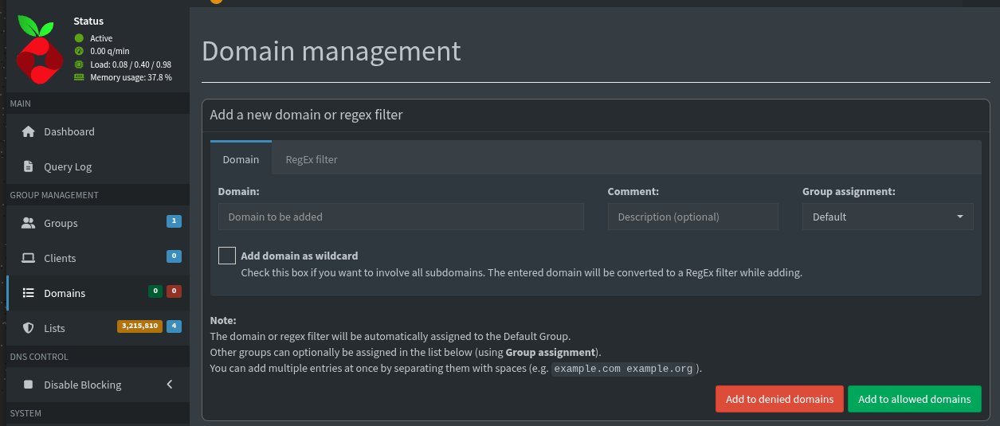

## Apa itu Pi-Hole dan Mengapa Perlu?

### Konsep Dasar DNS Filtering

Pi-Hole adalah DNS server yang bertindak sebagai penyaring konten di tingkat jaringan. Saat perangkat meminta alamat situs web, Pi-Hole memeriksa apakah domain tersebut ada dalam daftar blokir. Jika ada, permintaan dialihkan ke alamat kosong (0.0.0.0) sehingga iklan atau pelacak tidak pernah termuat.

```
┌────────────┐     ┌──────────────┐     ┌──────────────┐
│  Perangkat │────▶│   Pi-Hole    │────▶│  Internet    │
│  (Client)  │     │  (DNS Filter)│     │  (Upstream)  │
└────────────┘     └──────┬───────┘     └──────────────┘
                          │
                          ▼
                   ┌──────────────┐
                   │  Blokir?     │
                   │  ✓ / ✗       │
                   └──────────────┘
```

### Keuntungan Menggunakan Pi-Hole

| Keuntungan                | Penjelasan                                                                                               |
| ------------------------- | -------------------------------------------------------------------------------------------------------- |
| Proteksi Seluruh Jaringan | Perlindungan untuk semua perangkat (laptop, smartphone, smart TV, IoT) tanpa instalasi aplikasi tambahan |
| Hemat Bandwidth           | Konten iklan tidak diunduh, menghemat kuota internet                                                     |
| Privasi Terjaga           | Memblokir pelacak (tracker) yang mengumpulkan data pengguna                                              |
| Satu Titik Konfigurasi    | Pengaturan terpusat, tidak perlu konfigurasi per perangkat                                               |
| Transparansi              | Dashboard visual menunjukkan semua query DNS                                                             |

### Arsitektur dengan Podman

```
┌─────────────────────────────────────────────────────────────┐
│                     Host System                             │
├─────────────────────────────────────────────────────────────┤
│  ┌──────────────────────────────────────────────────────┐   │
│  │                    Container                         │   │
│  │  ┌────────────┐       ┌────────────────────┐         │   │
│  │  │  Pi-Hole   │──────▶│  dnscrypt-proxy    │         │   │
│  │  │  (Port 53) │       │  (Port 5053)       │         │   │
│  │  └────────────┘       └────────────────────┘         │   │
│  │        │                       │                     │   │
│  │        └───────────────────────┘                     │   │
│  │                                                      │   │
│  │  Volumes:                                            │   │
│  │  - pihole_data:/etc/pihole                           │   │
│  │  - dnsmasq_data:/etc/dnsmasq.d                       │   │
│  └──────────────────────────────────────────────────────┘   │
│                            │                                │
│                    ┌───────▼───────┐                        │
│                    │  Port 8080    │                        │
│                    │  (Web Admin)  │                        │
│                    └───────────────┘                        │
└─────────────────────────────────────────────────────────────┘
```

## Prasyarat

### Spesifikasi Sistem

| Komponen  | Minimum                    | Rekomendasi             |
| --------- | -------------------------- | ----------------------- |
| Sistem    | Debian 11+ / Ubuntu 22.04+ | Debian 13+              |
| CPU       | 1 core                     | 2 core                  |
| RAM       | 512 MB                     | 1+ GB                   |
| Storage   | 2 GB                       | 5+ GB                   |
| Podman    | 5.4+                       | Latest                  |
| IP Server | Statis                     | `192.168.0.50` (contoh) |
| Port      | 53 (DNS), 8080 (Web)       | -                       |

> Gunakan IP statis agar konfigurasi router tidak berubah saat server di-restart. Lihat [Cara Mengatur IP Statis di Raspberry Pi OS (Trixie) dengan NetworkManager](https://docs.ricalnet.my.id/posts/cara-mengatur-ip-statis-di-raspberry-pi-os-dengan-networkmanager/) jika belum tahu caranya.
{: .prompt-tip}

## 1. Clone Repository

```bash
git clone https://github.com/ricalnet/digital-independence.git
cd digital-independence
```

Repository ini berisi semua konfigurasi `podman-compose` yang sudah teruji untuk setiap layanan, termasuk Pi-Hole dengan dnscrypt-proxy terintegrasi.

## 2. Instal Podman

### Instalasi Otomatis untuk Debian/Ubuntu

```bash
./install-podman-on-debian.sh
```

Apa yang dilakukan script ini?
- Menginstal Podman dan podman-compose
- Mengkonfigurasi rootless podman
- Menyiapkan alias `dipen`

### Verifikasi Instalasi

```bash
podman --version
podman-compose --version
dipen version
```

## 3. Konfigurasi Pi-Hole

### Membuat File `.env`

```bash
dipen env pi-hole
```

File `.env` akan terbuka di editor. Sesuaikan.

## 4. Konfigurasi dnscrypt-proxy (Opsional)

### Mengapa dnscrypt-proxy?

dnscrypt-proxy mengenkripsi query DNS dari Pi-Hole ke resolver DNS upstream (seperti Cloudflare, Google, Quad9). Ini memberikan:

- Privasi sehingga query DNS tidak bisa dilihat oleh ISP
- Keamanan dalam mencegah DNS spoofing/MITM attack
- Integritas untuk memastikan response DNS tidak dimodifikasi

### Membuat File Konfigurasi

Copy template konfigurasi
```bash
cp pi-hole/dnscrypt-config/dnscrypt-proxy.template.toml pi-hole/dnscrypt-config/dnscrypt-proxy.toml
```

Edit file konfigurasi:

```bash
nano pi-hole/dnscrypt-config/dnscrypt-proxy.toml
```

> Konfigurasi ini sudah otomatis menggunakan dnscrypt-proxy untuk mengenkripsi query DNS yang keluar.
{: .prompt-info}

## 5. Jalankan Pi-Hole

### Start Container

```bash
dipen up pi-hole
```

Apa yang terjadi di balik layar:

1. Podman menarik image `pihole/pihole:latest` dan `klutchell/dnscrypt-proxy:latest`
2. Membuat volume: `pihole_data`, `dnsmasq_data`
3. Membuat network: `pihole_network`
4. Menjalankan container dengan port mapping:
   - DNS (TCP/UDP): `5353:53` → diteruskan dari port 53 dengan iptables
   - Web Admin: `8080:80`

### Verifikasi Log

```bash
dipen logs pi-hole
```

Output yang diharapkan:

```
[✓] DNS resolution is available
[✓] Pi-hole blocking is enabled
[✓] Web interface is available
[NOTICE] Server with the lowest initial latency: quad9-doh-ip4-port443-nofilter-pri (rtt: 4ms), live servers: 338
```

### Cek Status Container

```bash
dipen ps pi-hole
```

Output yang diharapkan:

```
CONTAINER ID  IMAGE                                      COMMAND               CREATED      STATUS                PORTS                                                                                         NAMES
5e16a9bb2c40  docker.io/klutchell/dnscrypt-proxy:latest  -config /config/d...  7 hours ago  Up 7 hours            0.0.0.0:5053->5053/tcp, 0.0.0.0:5053->5053/udp                                                dnscrypt-proxy
ca75c45bf6fe  docker.io/pihole/pihole:latest                                   7 hours ago  Up 7 hours (healthy)  0.0.0.0:5353->53/tcp, 0.0.0.0:5353->53/udp, 127.0.0.1:8080->80/tcp, 443/tcp, 67/udp, 123/udp  pihole
```

### Akses Admin Panel

Buka browser dan akses:

```
http://<IP-Server>:8080/admin
```

Contoh: `http://192.168.0.50:8080/admin`

Masukkan password yang sudah Anda atur di file `.env`.


## 6. Konfigurasi Port Forwarding DNS

### Mengapa Perlu Port Forwarding?

Pi-Hole mendengarkan DNS di port 5353 (bukan port 53 standar). Ini karena Podman berjalan dalam mode rootless (tanpa hak akses root) untuk keamanan maksimal. Container rootless tidak dapat mengikat (bind) port di bawah 1024, termasuk port 53. Ini adalah batasan keamanan yang disengaja untuk mencegah container non-root mengambil alih layanan sistem kritis.

> Gunakan iptables untuk redirect traffic dari port 53 ke port 5353.
{: .prompt-tip}

### Setup Iptables

```bash
# Redirect UDP DNS
sudo iptables -t nat -A PREROUTING -p udp --dport 53 -j REDIRECT --to-port 5353

# Redirect TCP DNS
sudo iptables -t nat -A PREROUTING -p tcp --dport 53 -j REDIRECT --to-port 5353

# Verifikasi rule
sudo iptables -t nat -L -v -n | grep 5353
```

### Persistensi Setelah Reboot

```bash
# Install iptables-persistent
sudo apt update
sudo apt install iptables-persistent -y

# Save rules
sudo netfilter-persistent save

# Verifikasi file rules
ls -la /etc/iptables/rules.v4

# Cek status service
sudo systemctl status netfilter-persistent
sudo systemctl is-enabled netfilter-persistent
```

### Verifikasi Rule Iptables

```bash
sudo cat /etc/iptables/rules.v4

# Output seharusnya ada baris:
# -A PREROUTING -p tcp -m tcp --dport 53 -j REDIRECT --to-ports 5353
# -A PREROUTING -p udp -m udp --dport 53 -j REDIRECT --to-ports 5353
```

## 7. Atur Router Menggunakan Pi-Hole sebagai DNS

### Tujuan

Semua perangkat yang terhubung ke WiFi/router akan otomatis menggunakan Pi-Hole tanpa pengaturan manual di setiap perangkat.

### Cara Kerja

DHCP server di router memberikan alamat IP ke perangkat client. Salah satu informasi yang diberikan adalah alamat DNS. Dengan mengubah DNS di DHCP menjadi IP Pi-Hole, semua client akan menggunakannya.

### Langkah Konfigurasi Router

**Langkah 1:** Login ke router (biasanya `http://192.168.0.1` atau `http://192.168.1.1`)


**Langkah 2:** Cari menu DHCP Server (biasanya di Network → DHCP atau LAN → DHCP Server)

**Langkah 3:** Atur parameter:

| Parameter          | Nilai                             | Penjelasan                                     |
| ------------------ | --------------------------------- | ---------------------------------------------- |
| IP Address Pool    | `192.168.0.100` – `192.168.0.199` | Rentang IP yang diberikan ke perangkat client  |
| Address Lease Time | `120` menit                       | Berapa lama IP bisa dipakai sebelum diperbarui |
| Default Gateway    | `192.168.0.1`                     | IP router sebagai jalur keluar internet        |
| Primary DNS        | `192.168.0.50`                    | IP Pi-Hole → ini yang paling penting           |
| Secondary DNS      | `192.168.0.50`                    | Isi sama agar tetap pakai Pi-Hole              |


**Langkah 4:** Simpan pengaturan dan reboot router (jika diperlukan)

### Verifikasi

Setelah router reboot, periksa pengaturan jaringan di perangkat (contoh: smartphone Android):


Pastikan kolom DNS menampilkan alamat IP Pi-Hole (`192.168.0.50`).

## 8. Menambahkan Blocklist

### Apa itu Blocklist?

Blocklist adalah kumpulan domain yang diketahui menampilkan iklan, melacak pengguna, atau berbahaya. Pi-Hole akan memblokir permintaan ke domain-domain tersebut.

### Blocklist Default vs Tambahan

Pi-Hole secara default sudah memiliki daftar domain yang diblokir. Namun untuk perlindungan lebih maksimal, Anda bisa menambahkan blocklist tambahan.

### Cara Menambahkan Blocklist

**Langkah 1:** Login ke admin panel Pi-Hole (`http://<IP-Server>:8080/admin`)

**Langkah 2:** Buka Lists → Add a new subscribed list


**Langkah 3:** Masukkan URL blocklist (satu baris, pisahkan dengan spasi atau koma):

```
https://raw.githubusercontent.com/StevenBlack/hosts/master/hosts https://big.oisd.nl/ https://media.githubusercontent.com/media/zachlagden/Pi-hole-Optimized-Blocklists/main/lists/all_domains.txt https://gitlab.com/hagezi/mirror/-/raw/main/dns-blocklists/adblock/pro.txt
```

### Sumber Blocklist yang Direkomendasikan

| Nama              | URL                                                                                                            | Fokus                    |
| ----------------- | -------------------------------------------------------------------------------------------------------------- | ------------------------ |
| StevenBlack       | `https://raw.githubusercontent.com/StevenBlack/hosts/master/hosts`                                             | Blocklist komprehensif   |
| OISD              | `https://big.oisd.nl/`                                                                                         | Privasi & keamanan       |
| Pi-hole Optimized | `https://media.githubusercontent.com/media/zachlagden/Pi-hole-Optimized-Blocklists/main/lists/all_domains.txt` | Blocklist teroptimasi    |
| HaGeZi - Pro      | `https://gitlab.com/hagezi/mirror/-/raw/main/dns-blocklists/adblock/pro.txt`                                   | Blocklist tingkat lanjut |

**Langkah 4:** Klik Add blocklist

**Langkah 5:** Jalankan Update Gravity (tombol di bagian atas halaman) untuk mengunduh dan memproses daftar baru


Proses ini bisa memakan waktu beberapa menit tergantung kecepatan internet dan jumlah domain.

### Jika Ada Situs yang Tidak Sengaja Terblokir

Tambahkan ke Allowlist:

1. Buka Domains → Masukkan domain yang ingin diizinkan
2. Klik Add to allowed domains
   

4. Update Gravity

## 9. Melihat Statistik dan Query Log

### Dashboard Overview

Admin panel Pi-Hole menyediakan dasbor yang informatif:

- Jumlah total request DNS
- Jumlah request yang diblokir
- Persentase blokir
- Perangkat dengan query terbanyak
- Domain yang paling sering diakses
- Riwayat request DNS real-time


### Interpretasi Query Log

| Warna  | Arti                      |
| ------ | ------------------------- |
| Hijau  | Query diizinkan (allowed) |
| Merah  | Query diblokir (blocked)  |
| Biru   | Query dari cache          |
| Orange | Query error/timeout       |

### Filter Query Log

- Cari query untuk domain tertentu
- Filter per perangkat (IP)
- Filter allowed/blocked
- Filter per rentang waktu

## 10. Pemeliharaan Rutin

### Menghapus Log Secara Otomatis dengan Cron

Pi-Hole menyimpan log query dalam database. Log ini bisa membesar seiring waktu dan memenuhi ruang disk.

```bash
# Edit crontab user
crontab -e
```

Tambahkan baris ini:

```bash
# Flush Pi-Hole log every day at 2 AM
0 2 * * * podman exec pihole pihole -f
```

Penjelasan perintah:

| Bagian               | Arti                                          |
| -------------------- | --------------------------------------------- |
| `0 2 * * *`          | Jalankan setiap hari jam 02:00                |
| `podman exec pihole` | Jalankan perintah di dalam container "pihole" |
| `pihole -f`          | Perintah flush log Pi-Hole                    |

### Menghapus Log Secara Manual

Jika ingin membersihkan log saat itu juga:

```bash
podman exec -it pihole pihole flush
```

Output yang diharapkan:

```
  [✓] Flushed /var/log/pihole/pihole.log ...
  [✓] Flushed /var/log/pihole/FTL.log ...
  [✓] Flushed /var/log/pihole/webserver.log ...
  [i] Flushing database, DNS resolution temporarily unavailable .../opt/pihole/piholeLogFlush.sh: line 81: service: command not found
/opt/pihole/piholeLogFlush.sh: line 87: service: command not found
  [✓] Deleted  queries from long-term query database
```

> Pesan `service: command not found` dapat diabaikan. Ini terjadi karena Pi-Hole berjalan di container tanpa systemd.
{: .prompt-info}

### Memperbarui Pi-Hole

```bash
dipen update pi-hole
```

Proses ini akan:
1. Mengunduh image terbaru
2. Menghentikan container lama
3. Menjalankan container baru dengan image terbaru

### Cek Versi Pi-Hole

```bash
podman exec -it pihole pihole -v
```

## Kesimpulan

### Manfaat yang Didapatkan

| Manfaat             | Dampak                           |
| ------------------- | -------------------------------- |
| Bebas Iklan         | 20-40% traffic iklan dihilangkan |
| Privasi Terjaga     | Pelacak (tracker) diblokir       |
| Kecepatan Meningkat | Halaman web loading lebih cepat  |
| Keamanan            | Malware domain diblokir          |
| Bandwidth Hemat     | Data iklan tidak terunduh        |
| Kendali Penuh       | Dashboard monitoring transparan  |

## Referensi dan Sumber Daya Tambahan

- [GitHub Repository: Digital Independence](https://github.com/ricalnet/digital-independence)
- [Dokumentasi Resmi Pi-Hole](https://docs.pi-hole.net/)
- [Dokumentasi Resmi Podman](https://podman.io/docs/)