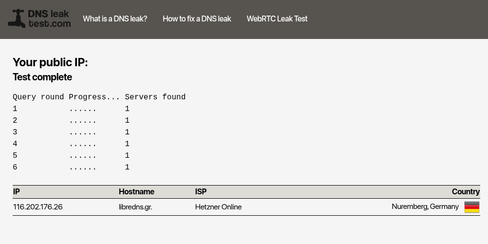
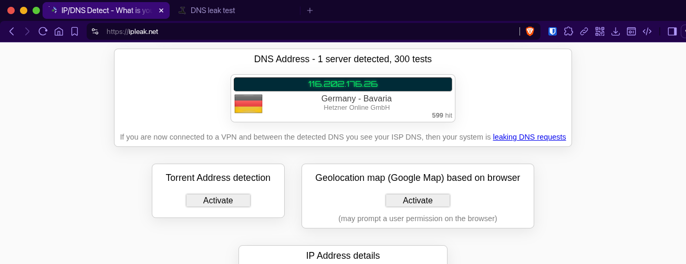

## 1. Pendahuluan

DNS (Domain Name System) adalah salah satu celah terbesar privasi Anda. Setiap kali Anda mengunjungi situs web, permintaan DNS Anda dikirim dalam teks jelas (plaintext) ke server ISP atau penyedia DNS publik. Ini ibarat mengirim peta perjalanan digital Anda tanpa amplop—siapa pun yang mengintai di jaringan (ISP, pemerintah, atau aktor jahat) bisa melihat ke mana Anda akan pergi.

DNS-over-HTTPS (DoH) adalah solusinya. DoH membungkus permintaan DNS dalam lalu lintas HTTPS yang terenkripsi, sehingga tidak bisa disadap atau dimanipulasi. Cloudflared adalah klien DoH ringan dari Cloudflare yang dapat bertindak sebagai proxy DNS lokal. Dengan menggabungkannya bersama Pi-hole (penyaring iklan dan tracker di tingkat DNS), kita menciptakan benteng pertahanan privasi yang kokoh: iklan diblokir, dan semua pertanyaan DNS dikirim melalui saluran terenkripsi ke resolver yang tepercaya (LibreDNS, Quad9, dll.).

## 2. Prasyarat

Sebelum memulai, pastikan medan tempur digital Anda telah siap:

- Ubuntu (atau distro Linux lainnya) dengan Docker Engine telah terinstal. Jika belum, rujuk ke panduan resmi: [Install Docker Engine on Ubuntu](https://docs.docker.com/engine/install/ubuntu/).
- Pi-hole sudah berjalan dan berfungsi (mengacu pada [panduan instalasi sebelumnya](https://ricaldocs.github.io/posts/instalasi-dan-konfigurasi-pi-hole-dengan-docker-untuk-blokir-jaringan-iklan-di-seluruh-jaringan/)). Pastikan tidak ada konflik port, terutama port 53.
- Familiar dengan baris perintah Linux dan Docker Compose.
- Untuk menjalankan perintah Docker dan mengelola sistem.

## 3. Struktur Proyek

Kita akan menata amunisi dalam direktori terstruktur. Buat direktori utama dan subdirektori untuk Cloudflared.

```bash
mkdir pi-hole
cd pi-hole
mkdir cloudflared
touch cloudflared/config.yml
touch docker-compose.yaml
```

Struktur akhir akan tampak seperti ini:

```
.
├── cloudflared
│   └── config.yml
├── docker-compose.yaml
```

## 4. Konfigurasi Cloudflared (config.yml)

Cloudflared membutuhkan konfigurasi minimal untuk mode `proxy-dns`. Buka file `cloudflared/config.yml`{: .filepath} dengan editor favorit Anda (misal `nano`).

```bash
nano cloudflared/config.yml
```

Isi dengan konfigurasi berikut:

```yaml
# cloudflared/config.yml
proxy-dns: true
proxy-dns-port: 53
proxy-dns-address: 0.0.0.0
proxy-dns-upstream:
  - https://doh.libredns.gr/dns-query
  - https://dns.quad9.net/dns-query
  # https://security.cloudflare-dns.com/dns-query
proxy-dns-bootstrap:
  - https://doh.libredns.gr/dns-query
  - https://dns.quad9.net/dns-query
  # https://security.cloudflare-dns.com/dns-query
```

**Penjelasan Singkat**:

- `proxy-dns: true` mengaktifkan mode DNS proxy.
- `proxy-dns-port: 53` mendengarkan di port 53 (default DNS).
- `proxy-dns-address: 0.0.0.0` mendengarkan di semua antarmuka.
- `proxy-dns-upstream`: daftar resolver DoH yang akan digunakan. Di sini kita menggunakan [LibreDNS](https://libredns.gr/) (proyek DNS terbuka) dan [Quad9](https://quad9.net/) (non-profit yang memblokir domain berbahaya). Cloudflare juga tersedia (di-comment).
- `proxy-dns-bootstrap`: resolver bootstrap untuk inisialisasi koneksi DoH pertama.

## 5. Menyatukan Cloudflared dan Pi-hole

Sekarang kita buat file `docker-compose.yaml` di direktori utama `pi-hole`.

```bash
nano docker-compose.yaml
```

Tempelkan konfigurasi berikut:

```yaml
services:
  cloudflared:
    container_name: cloudflared
    image: cloudflare/cloudflared:2025.2.1
    command: proxy-dns
    restart: unless-stopped
    environment:
      - TUNNEL_DNS_UPSTREAM=https://doh.libredns.gr/dns-query,https://dns.quad9.net/dns-query
      - TUNNEL_DNS_PORT=53
      - TUNNEL_DNS_ADDRESS=0.0.0.0
    networks:
      - pihole_network
    healthcheck:
      test: ["CMD", "nslookup", "google.com", "127.0.0.1"]
      interval: 30s
      timeout: 10s
      retries: 3

  pihole:
    container_name: pihole
    image: pihole/pihole:latest
    ports:
      - "53:53/tcp"
      - "53:53/udp"
      - "8080:80/tcp"
    depends_on:
      - cloudflared
    environment:
      TZ: 'Asia/Jakarta'
      FTLCONF_webserver_api_password: '' # gunakan perintah openssl rand --hex 32 untuk generate password
      FTLCONF_dns_listeningMode: 'ALL'
      FTLCONF_dns_upstreams: 'cloudflared'
      DNSSEC: 'true'
      BLOCKING_ENABLED: 'true'
      WEBPASSWORD: '' # Ganti password ini!
      PIHOLE_DNS_: 'cloudflared#53'
      FTLCONF_dns_rateLimit_count: '1000'
      FTLCONF_dns_rateLimit_interval: '60'
    volumes:
      - './etc-pihole:/etc/pihole'
      - './etc-dnsmasq.d:/etc/dnsmasq.d'
    cap_add:
      - NET_ADMIN
      - SYS_TIME
      - SYS_NICE
    restart: unless-stopped
    networks:
      - pihole_network

networks:
  pihole_network:
    driver: bridge
```

### Hal Krusial yang Perlu Dicermati:

- Dua variabel lingkungan (`FTLCONF_webserver_api_password` dan `WEBPASSWORD`) harus diisi dengan kata sandi yang kuat. Gunakan perintah berikut untuk menghasilkan string acak 32 karakter heksadesimal:
  ```bash
  openssl rand --hex 32
  ```
  > Salin outputnya dan tempelkan ke kedua variabel tersebut. **Jangan biarkan kosong!**
  {: .prompt-info}
- `depends_on`: Pi-hole menunggu cloudflared siap sebelum memulai.
- `PIHOLE_DNS_`: Menunjuk ke container `cloudflared` sebagai upstream DNS.
- `FTLCONF_dns_upstreams`: Juga menunjuk ke `cloudflared`.
- Port: Pi-hole memetakan port 53 (TCP/UDP) ke host untuk melayani permintaan DNS, dan port 8080 untuk antarmuka web.
- Jaringan: Kedua container terhubung dalam jaringan `pihole_network` sehingga dapat berkomunikasi via nama container.

## 6. Meluncurkan dan Memverifikasi

Hancurkan container lama (jika ada) dan luncurkan yang baru dengan Docker Compose.

```bash
docker compose down
docker compose up -d
docker compose logs -f
```

Perhatikan baris log yang muncul. Seharusnya Anda melihat:

- Cloudflared menambahkan upstream dan mulai mendengarkan di port 53.
- Pi-hole melakukan inisialisasi, mengatur password, dan akhirnya menampilkan statistik database.

**Cuplikan Output yang Diharapkan:**

```
cloudflared  | INF Adding DNS upstream url=https://doh.libredns.gr/dns-query
cloudflared  | INF Adding DNS upstream url=https://dns.quad9.net/dns-query
cloudflared  | Starting DNS over HTTPS proxy server address=dns://0.0.0.0:53
...
pihole       |   [i] Assigning password defined by Environment Variable
...
pihole       | INFO: Imported 22035 queries from the long-term database
pihole       | INFO:  -> Total DNS queries: 22035
pihole       | INFO:  -> Cached DNS queries: 14078
pihole       | INFO:  -> Forwarded DNS queries: 3344
pihole       | INFO:  -> Blocked DNS queries: 3529
```

### Verifikasi dengan DNS Leak Test

Untuk memastikan tidak terjadi kebocoran DNS dan semua permintaan Anda benar-benar melewati resolver yang telah dikonfigurasi, lakukan pengujian berikut:

1. Buka browser dari perangkat yang menggunakan Pi-hole sebagai DNS (pastikan perangkat tersebut telah dikonfigurasi menggunakan DNS server IP dari host Pi-hole Anda), lalu kunjungi situs berikut:
   - [https://dnsleaktest.com](https://dnsleaktest.com)
   - Alternatif: [https://ipleak.net](https://ipleak.net)

2. Klik tombol "Standard test" atau mulai tes pada situs tersebut. Tunggu hingga proses selesai.

3. Perhatikan server DNS yang terdeteksi. Anda akan melihat daftar server DNS yang digunakan. Hasil yang diharapkan adalah server yang muncul hanya berasal dari resolver yang Anda konfigurasi di upstream Cloudflared, yaitu:
   - Server dari LibreDNS
   - Server dari Quad9

   

   
   _Contoh hasil tes yang menunjukkan server DNS yang digunakan adalah dari LibreDNS (harus menunjukkan 1, artinya semua lalu lintas DNS terenkripsi dan sesuai dengan konfigurasi)_

4. Anda juga dapat melihat statistik di dashboard Pi-hole (http://[IP-PI-HOLE]:8080) untuk memastikan bahwa semua query diteruskan ke cloudflared, bukan ke resolver lain.

    > Hasil tes harus menunjukkan hanya satu set resolver yang Anda konfigurasi (LibreDNS dan Quad9). Jika muncul nama ISP Anda atau resolver lain yang tidak dikenal, berarti terjadi kebocoran DNS dan konfigurasi perlu diperiksa kembali.
    {: .prompt-warning}

Jika semua berjalan lancar, Anda sekarang memiliki sistem DNS yang:

- Memblokir iklan dan tracker (oleh Pi-hole).
- Mengirim semua pertanyaan DNS melalui HTTPS terenkripsi (oleh Cloudflared) ke resolver yang menghormati privasi (LibreDNS, Quad9).
- Tidak bergantung pada ISP yang mungkin melakukan sensor atau penjualan data.

## 7. Catatan Keamanan dan Pemeliharaan

- Secara berkala, jalankan `docker compose pull` untuk mendapatkan versi terbaru dari image Cloudflared dan Pi-hole.
- Direktori `./etc-pihole`{: .filepath} dan `./etc-dnsmasq.d`{: .filepath} menyimpan data konfigurasi dan database Pi-hole. Cadangkan secara rutin.
- Karena container Cloudflared tidak memiliki akses ke jaringan host secara langsung, pastikan container lain yang membutuhkan DNS menggunakan Pi-hole sebagai nameserver (misal dengan mengatur `dns: pihole` di `docker-compose` mereka).
- Lakukan pengujian DNS leak test secara berkala untuk memastikan konfigurasi tetap aman dan tidak ada kebocoran.

## 8. Kesimpulan

Dengan menyelesaikan panduan ini, Anda telah mengambil alih kendali atas salah satu aspek paling fundamental dari komunikasi internet: DNS. Tidak ada lagi pihak ketiga yang dapat dengan mudah mengintip ke mana Anda berselancar. Iklan dan tracker diredam. Privasi diperkuat. Dan melalui verifikasi DNS leak test, Anda memiliki bukti bahwa konfigurasi berjalan dengan benar (harus menunjukkan 1 set resolver yang Anda percayai).

Di dunia di mana data adalah komoditas dan pengawasan adalah norma, membangun infrastruktur digital yang mandiri dan aman adalah tindakan resistensi. Selamat berjuang, kawan. Jaga tetap terenkripsi.

## Referensi Tambahan

- [Mengatur Router agar Menggunakan Pi-Hole sebagai DNS](https://ricaldocs.github.io/posts/instalasi-dan-konfigurasi-pi-hole-dengan-docker-untuk-blokir-jaringan-iklan-di-seluruh-jaringan/#5-mengatur-router-agar-menggunakan-pi-hole-sebagai-dns)
- [Instalasi dan Konfigurasi Pi-Hole dengan Docker untuk Blokir Iklan di Seluruh Jaringan](https://ricaldocs.github.io/posts/instalasi-dan-konfigurasi-pi-hole-dengan-docker-untuk-blokir-jaringan-iklan-di-seluruh-jaringan/)
- [DNS List for Security & Privacy](https://ricaldocs.github.io/posts/dns-list-for-security-and-privacy/)