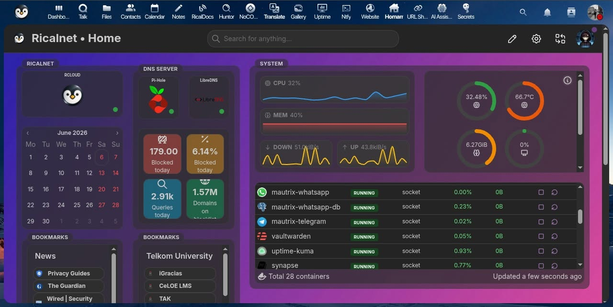

## Apa itu Homarr dan Mengapa Perlu?

### Konsep Dasar

Homarr adalah dashboard server modern yang menyediakan antarmuka terpusat untuk mengelola dan memantau semua layanan self-hosted Anda. Bayangkan Homarr sebagai "halaman beranda" untuk infrastruktur digital Anda.

```
┌────────────────────────────────────────────────────────┐
│                      HOMARR DASHBOARD                  │
├────────────────────────────────────────────────────────┤
│  ┌──────────────┐  ┌──────────────┐  ┌──────────────┐  │
│  │  Nextcloud   │  │  Jellyfin    │  │  Portainer   │  │
│  │  ● Online    │  │  ● Online    │  │  ● Online    │  │
│  └──────────────┘  └──────────────┘  └──────────────┘  │
│  ┌──────────────┐  ┌──────────────┐  ┌──────────────┐  │
│  │  Pi-Hole     │  │  Uptime      │  │  Authentik   │  │
│  │  ● Online    │  │  ● Online    │  │  ● Online    │  │
│  └──────────────┘  └──────────────┘  └──────────────┘  │
│                                                        │
│  [Search]  [Settings]  [Profile]                       │
└────────────────────────────────────────────────────────┘
```

### Keunggulan Homarr

| Keunggulan          | Penjelasan                                        |
| ------------------- | ------------------------------------------------- |
| Integrasi Sederhana | Menambahkan layanan cukup dengan URL dan icon     |
| Tampilan Modern     | Antarmuka bersih dengan dark mode support         |
| Real-time Status    | Monitoring status online/offline setiap layanan   |
| Search Bar          | Pencarian terintegrasi (Google, DuckDuckGo, dll.) |
| Widgets             | Cuaca, RSS feed, bookmark, dan lainnya            |
| Multi-user          | Dukungan multiple user dengan permission berbeda  |
| Docker Integration  | Monitoring container langsung dari dashboard      |

### Arsitektur dengan Podman

```
┌────────────────────────────────────────────────────────────┐
│                     Host System                            │
├────────────────────────────────────────────────────────────┤
│  ┌─────────────────────────────────────────────────────┐   │
│  │                    Container                        │   │
│  │  ┌──────────────────────────────────────────────┐   │   │
│  │  │           Homarr (Next.js App)               │   │   │
│  │  │           Port: 7575                         │   │   │
│  │  └──────────────────────────────────────────────┘   │   │
│  │                        │                            │   │
│  │  ┌──────────────────────────────────────────────┐   │   │
│  │  │           Redis (Session Store)              │   │   │
│  │  │           Port: 6379 (internal)              │   │   │
│  │  └──────────────────────────────────────────────┘   │   │
│  │                                                     │   │
│  │  Volumes:                                           │   │
│  │  - homarr_data:/appdata                             │   │
│  │  - homarr_nginx:/var/lib/nginx                      │   │
│  │  - homarr_nginx_conf:/etc/nginx                     │   │
│  │  - homarr_redis_data:/data                          │   │
│  └─────────────────────────────────────────────────────┘   │
│                            │                               │
│                    ┌───────▼───────┐                       │
│                    │  Port 7575    │                       │
│                    │  (Web UI)     │                       │
│                    └───────────────┘                       │
└────────────────────────────────────────────────────────────┘
```

## Prasyarat

### Spesifikasi Sistem

| Komponen | Minimum                    | Rekomendasi |
| -------- | -------------------------- | ----------- |
| Sistem   | Debian 11+ / Ubuntu 22.04+ | Debian 13+  |
| CPU      | 1 core                     | 2 core      |
| RAM      | 512 MB                     | 1+ GB       |
| Storage  | 500 MB                     | 2+ GB       |
| Podman   | 5.4+                       | Latest      |
| Port     | 7575 (Web UI)              | -           |

## 1. Clone Repository

```bash
git clone https://github.com/ricalnet/digital-independence.git
cd digital-independence
```

Repository ini berisi semua konfigurasi `podman-compose` yang sudah teruji untuk setiap layanan, termasuk Homarr dengan Redis untuk session management.

## 2. Instal Podman

### Instalasi Otomatis

```bash
./install-podman-on-debian.sh
```

Apa yang dilakukan script ini?
- Menginstal Podman dan podman-compose
- Mengkonfigurasi rootless podman
- Menyiapkan alias `dipen`

### Verifikasi Instalasi

```bash
podman --version
podman-compose --version
dipen version
```

## 3. Konfigurasi Homarr

### Membuat File `.env`

```bash
dipen env homarr
```

File `.env` akan terbuka di editor. Sesuaikan.

### Generate Redis Password

```bash
openssl rand --hex 32
# Contoh output: a1b2c3d4e5f6g7h8i9j0k1l2m3n4o5p6
```

> Redis digunakan untuk session storage. Password yang kuat mencegah akses tidak sah ke session data.
{: .prompt-tip}

## 4. Jalankan Homarr

### Start Container

```bash
dipen up homarr
```

Apa yang terjadi di balik layar:

1. Podman menarik image `ghcr.io/homarr-labs/homarr:latest`
2. Podman menarik image `redis:alpine`
3. Membuat volume: `homarr_data`, `homarr_redis_data`, `homarr_nginx`, `homarr_nginx_conf`
4. Membuat network: `homarr-network`
5. Menjalankan Redis terlebih dahulu (dependency)
6. Menjalankan Homarr dengan port mapping `127.0.0.1:7575:7575`

### Monitor Startup

```bash
dipen logs homarr
dipen ps homarr
```

Output yang diharapkan:

```
CONTAINER ID  IMAGE                              COMMAND               CREATED      STATUS                PORTS                     NAMES
56cdd3d09500  docker.io/library/redis:alpine     redis-server --ap...  7 hours ago  Up 7 hours (healthy)  6379/tcp                  homarr-redis
c9cb260694da  ghcr.io/homarr-labs/homarr:latest  sh run.sh             7 hours ago  Up 7 hours (healthy)  127.0.0.1:7575->7575/tcp  homarr
```

### Verifikasi Container Health

```bash
podman inspect homarr --format='{{.State.Health.Status}}'
# Output: healthy
```

## 5. Akses Homarr

### Buka Dashboard

Buka browser dan akses:

```
http://localhost:7575
```



## 6. Monitoring dan Maintenance

### Update Homarr

```bash
dipen update homarr
```

## Kesimpulan

### Manfaat yang Didapatkan

| Manfaat              | Penjelasan                             |
| -------------------- | -------------------------------------- |
| Akses Terpusat       | Semua layanan di satu halaman          |
| Monitoring Mudah     | Status online/offline terlihat sekilas |
| Tampilan Profesional | Dashboard modern dengan dark mode      |
| Integrasi Container  | Monitoring resource container          |
| Mudah Dikelola       | Tambah/hapus layanan dengan cepat      |

## Referensi dan Sumber Daya Tambahan

- [GitHub Repository: Digital Independence](https://github.com/ricalnet/digital-independence)
- [Dokumentasi Resmi Homarr](https://homarr.dev/docs/)
- [Podman Documentation](https://podman.io/docs/)
- [Redis Documentation](https://redis.io/docs/)