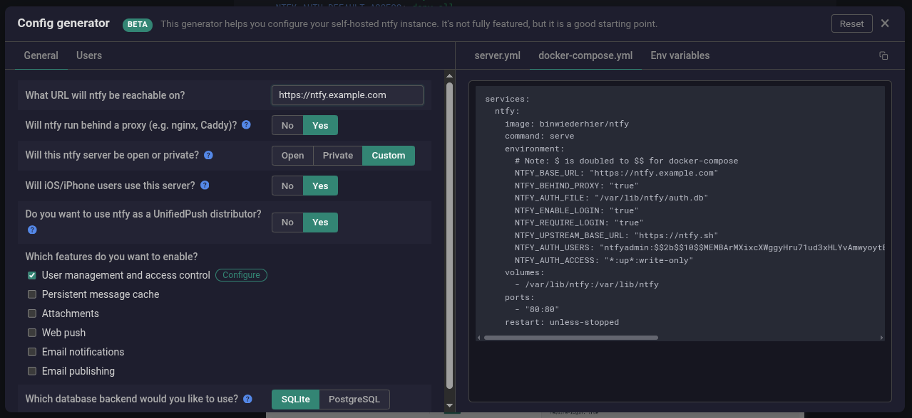
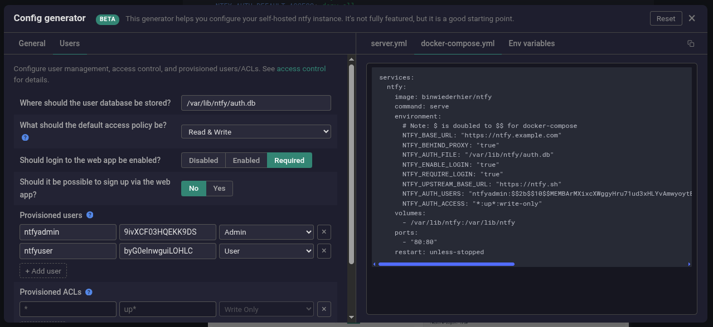

Ntfy adalah layanan notifikasi open-source yang memungkinkan Anda mengirim notifikasi push ke ponsel atau desktop dengan mudah. Dengan menjalankan server ntfy sendiri (**self-hosted**), Anda dapat memiliki kendali penuh atas data, privasi, dan keandalan layanan, tanpa bergantung pada penyedia pihak ketiga.

Artikel ini akan memandu Anda langkah demi langkah untuk memasang dan mengonfigurasi server ntfy menggunakan Docker dan Docker Compose. Tutorial ini dirancang untuk pengguna Linux dengan akses root, namun langkah-langkahnya dapat disesuaikan untuk sistem operasi lain.

## Prasyarat

Sebelum memulai, pastikan sistem Anda telah memenuhi persyaratan berikut:

- Server atau VPS dengan sistem operasi Linux (Ubuntu 20.04/22.04 direkomendasikan).
- Domain yang sudah diarahkan ke IP server (untuk akses HTTPS).
- Docker dan Docker Compose terinstal.

## 1. Instalasi Docker

Docker adalah prerequisite mutlak sebelum menjalankan Ntfy. Ricalnet menyediakan script instalasi otomatis yang telah teruji di berbagai distribusi Linux.

### Clone Repository dan Instalasi Otomatis

```bash
git clone https://github.com/ricalnet/digital-independence.git
cd digital-independence
```

### Instalasi Docker Engine

Untuk Debian:
```bash
./install-docker-engine-on-debian.sh
```

Untuk Ubuntu:
```bash
./install-docker-engine-on-ubuntu.sh
```

#### Apa yang Dilakukan Script Instalasi?
Script ini mengotomatiskan proses yang biasanya memakan waktu dan rawan kesalahan:
1. Update package repository sistem
2. Install dependencies (ca-certificates, curl, gnupg, lsb-release)
3. Tambahkan GPG key resmi Docker untuk verifikasi keamanan
4. Konfigurasi repository Docker agar menggunakan paket resmi
5. Install Docker Engine, CLI, dan Containerd
6. Tambahkan user saat ini ke group docker (menghindari penggunaan `sudo` setiap kali)

> Docker menyediakan isolasi lingkungan yang sempurna untuk SearXNG. Dengan kontainer, Anda mendapatkan:
- Berjalan identik di semua sistem
- Tidak ada konflik dengan aplikasi lain di server
- Cukup pull image baru dan restart kontainer untuk update
- Kembali ke versi sebelumnya dengan satu perintah
{: .prompt-info}

## 2. Memahami Konfigurasi Ntfy

Ntfy menyediakan konfigurator online yang memudahkan pembuatan file konfigurasi. Alat ini akan menghasilkan berkas `docker-compose.yml` yang siap pakai sesuai dengan kebutuhan Anda.

Kunjungi [halaman resmi config generator ntfy](https://docs.ntfy.sh/config/) dan sesuaikan opsi-opsi berikut:

### Konfigurasi Umum

Pada bagian **General Configuration**, atur parameter berikut:



| Parameter                                                 | Nilai yang Dipilih         | Keterangan                                                                                                                     |
| --------------------------------------------------------- | -------------------------- | ------------------------------------------------------------------------------------------------------------------------------ |
| **What URL will ntfy be reachable on?**                   | `https://ntfy.example.com` | Ganti `ntfy.example.com` dengan domain Anda.                                                                                   |
| **Will ntfy run behind a proxy (e.g. nginx, Caddy)?**     | `yes`                      | Pilih `yes` jika Anda akan menggunakan reverse proxy seperti Nginx atau Caddy untuk menangani HTTPS.                           |
| **Will this ntfy server be open or private?**             | `private`                  | `private` berarti hanya pengguna terdaftar yang dapat mengirim/menerima notifikasi.                                            |
| **Will iOS/iPhone users use this server?**                | `yes`                      | Mengaktifkan dukungan untuk perangkat iOS.                                                                                     |
| **Do you want to use ntfy as a UnifiedPush distributor?** | `yes`                      | Memungkinkan server berfungsi sebagai distributor UnifiedPush (berguna untuk aplikasi Android seperti Element, Forkgram, dll). |
| **Which database backend would you like to use?**         | `SQLite`                   | Untuk penggunaan sederhana, SQLite sudah cukup. Pilih PostgreSQL jika Anda menginginkan skalabilitas lebih tinggi.             |

### Konfigurasi Pengguna dan Akses

Selanjutnya, pada bagian **User Configuration**, isikan detail berikut:



| Parameter                                             | Nilai yang Dipilih      | Keterangan                                                                 |
| ----------------------------------------------------- | ----------------------- | -------------------------------------------------------------------------- |
| **Where should the user database be stored?**         | `/var/lib/ntfy/auth.db` | Lokasi penyimpanan database autentikasi di dalam kontainer.                |
| **What should the default access policy be?**         | `Read & Write`          | Kebijakan default untuk topik: pengguna dapat membaca dan menulis.         |
| **Should login to the web app be enabled?**           | `Required`              | Memaksa pengguna untuk login sebelum mengakses antarmuka web.              |
| **Should it be possible to sign up via the web app?** | `No`                    | Menonaktifkan pendaftaran mandiri; admin harus membuat akun secara manual. |

**Provisioned users**: Buat dua akun pengguna atau sesuai kebutuhan:

- **Username**: `ntfyadmin` — **Password**: `9ivXCF03HQEKK9DS` — **Role**: `admin`
- **Username**: `ntfyuser` — **Password**: `byG0eInwguiLOHLC` — **Role**: `user`

Peran `admin` memiliki hak akses penuh, sedangkan `user` hanya dapat mengirim/menerima notifikasi pada topik yang diizinkan.

Setelah mengisi semua opsi, generator akan menampilkan pratinjau file `docker-compose.yml` seperti contoh di bawah ini.

## 3. Masuk ke Direktori dan Environment

Masuk ke direktori `ntfy` dan sesuaikan variabel `.env`.

```bash
cd ntfy
cp .env.example .env
nano .env
```

Penjelasan variabel lingkungan:

- `NTFY_BASE_URL`: URL publik server ntfy.
- `NTFY_BEHIND_PROXY`: Beri tahu ntfy bahwa ia berjalan di belakang proxy (seperti Nginx).
- `NTFY_AUTH_FILE`: Lokasi file database autentikasi.
- `NTFY_ENABLE_LOGIN`: Mengaktifkan formulir login di antarmuka web.
- `NTFY_REQUIRE_LOGIN`: Memaksa autentikasi untuk semua permintaan.
- `NTFY_UPSTREAM_BASE_URL`: Sinkronisasi dengan server publik ntfy.sh (opsional).
- `NTFY_AUTH_USERS`: Daftar pengguna yang telah dibuat beserta hash password bcrypt-nya.
- `NTFY_AUTH_ACCESS`: Aturan akses ke topik. Contoh `*:up*:write-only` berarti semua topik yang diawali `up` hanya dapat ditulisi (write-only). Sesuaikan dengan kebijakan Anda.

## 4. Menjalankan Kontainer Ntfy

Masuk ke direktori yang berisi file `docker-compose.yml`, lalu jalankan:

```bash
docker compose up -d
```

Perintah ini akan mengunduh image ntfy (jika belum ada) dan menjalankan kontainer di latar belakang. Untuk memeriksa status, gunakan:

Log kontainer dapat dilihat dengan:

```bash
docker compose logs -f
```

Ntfy akan berjalan pada port 8010 di alamat IP server Anda. Buka browser dan akses:

```
http://127.0.0.1:8010
```

## 5. Menguji Server Ntfy

Coba kirim notifikasi sederhana menggunakan `curl`:

```bash
curl -u ntfyuser:byG0eInwguiLOHLC -d "Halo dunia" https://ntfy.example.com/topik_anda
```

Atau gunakan aplikasi ntfy di ponsel (tersedia di [F-Droid](https://f-droid.org/en/packages/io.heckel.ntfy/) dan [Play Store](https://play.google.com/store/apps/details?id=io.heckel.ntfy)) dengan menambahkan server khusus (custom server) ke URL `https://ntfy.example.com` dan mengatur protokol koneksi ke `WebSockets`.


## Kesimpulan

Dengan mengikuti panduan ini, Anda kini memiliki server notifikasi ntfy yang berjalan sendiri, aman, dan dapat diandalkan. Anda dapat menggunakannya untuk berbagai keperluan: notifikasi server, integrasi dengan aplikasi, atau sekadar pengingat pribadi.

Keuntungan utama self-hosted ntfy:
- Data notifikasi tidak dikirim ke server pihak ketiga.
- Bebas mengatur kebijakan akses, topik, dan pengguna.
- Gratis dan tidak terbatas kuota (tergantung kapasitas server).

## Referensi
- [Situs Resmi ntfy](https://ntfy.sh)
- [Dokumentasi Resmi ntfy](https://docs.ntfy.sh/)