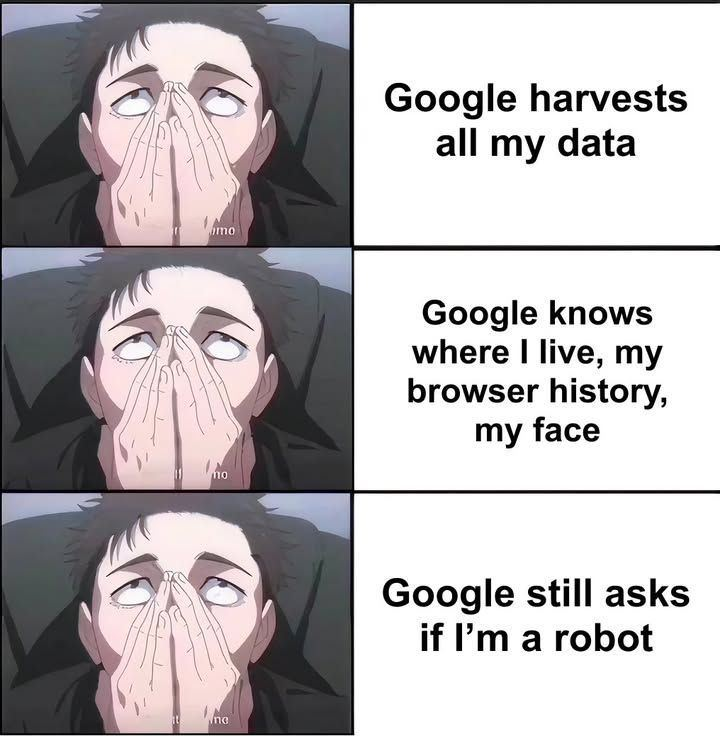

## Pernahkah Anda Bertanya-tanya, di Mana Sebenarnya Data Anda?

Bangun pagi. Cek Gmail. Balas pesan WhatsApp. Upload foto ke Google Drive. Biarkan Chrome menyimpan password. Nonton Netflix. Semua sebelum sarapan.

_Sumber: Proton_

Tanpa sadar, Anda sudah menitipkan seluruh kehidupan digital Anda ke segelintir perusahaan raksasa.

Mereka tahu:
- Siapa teman-teman Anda  
- Apa yang Anda tonton, baca, dan beli  
- Di mana Anda berada saat ini  
- Bahkan password-password paling rahasia sekalipun  

Dan semua itu mereka jadikan komoditas.

> *"Jika Anda tidak membayar untuk produknya, maka Andalah produknya."*

Ini bukan teori konspirasi. Ini adalah fakta bisnis dari setiap platform besar.

Tapi masih ada jalan keluar.

## Solusinya: Kemandirian Digital, Bukan Sekadar Privasi

Digital Independence by RICALNET adalah proyek sumber terbuka (open source) yang memungkinkan siapa pun – bahkan yang bukan ahli IT – membangun infrastruktur digital pribadi. Anggap saja sebagai cloud pribadi yang sepenuhnya di bawah kendali Anda.

Anda tidak perlu jadi administrator server atau programmer. Proyek ini menyediakan paket-paket aplikasi siap pakai (seperti "bumbu instan" untuk server Anda) yang bisa dijalankan di PC bekas, mini komputer, atau bahkan Raspberry Pi sekecil dompet.

### Prinsip Dasar

| Prinsip                | Makna                                                 |
| ---------------------- | ----------------------------------------------------- |
| Privasi adalah hak     | Data Anda milik Anda, bukan untuk dijual ke pengiklan |
| Bebas biaya langganan  | Bayar sekali untuk perangkat, gratis selamanya        |
| Kebebasan memilih      | Ganti layanan kapan saja, tidak terikat vendor        |
| Belajar sambil berdaya | Setiap langkah membangun adalah investasi pengetahuan |

## Apa Saja yang Bisa Anda Dapatkan?

Berikut cara mengganti layanan pihak ketiga dengan alternatif self-hosted yang berjalan di perangkat Anda sendiri.

### Keamanan & Otentikasi  
*Pengganti Google Password Manager, 1Password, atau SSO cloud...*

- **Vaultwarden** – Pengelola password yang kompatibel dengan Bitwarden (Anda pegang kuncinya)  
- **Authentik** – Sistem "Login dengan Google" versi Anda sendiri, tapi privat  
- **Pi-hole** – Pemblokir iklan & pelacak di seluruh jaringan rumah  
- **Wazuh** – Sistem deteksi intrusi untuk server rumahan Anda  

> Kenapa? Password adalah kunci kehidupan digital. Mempercayakannya pada orang lain sama dengan memberikan kunci rumah Anda pada orang asing.

### AI Pribadi – Tanpa Mengirim Data ke Luar Negeri  
*Pengganti ChatGPT, Gemini, atau Claude...*

- **Open WebUI + Ollama** – Jalankan LLM sepenuhnya di perangkat sendiri. Tidak ada data yang keluar dari jaringan Anda.

> Saat Anda bertanya pada AI tentang kesehatan, keuangan, atau pekerjaan, data sensitif itu tidak boleh mengendap di server perusahaan asing untuk latihan model mereka.

### Komunikasi Pribadi  
*Pengganti WhatsApp, Telegram, atau Signal (yang masih bergantung pada server pihak ketiga)...*

- **Matrix (Synapse + Element)** – Sistem pesan instan dan grup yang dihosting sendiri. Desentralisasi.  
- **Mautrix Bridges** – Hubungkan Matrix ke WhatsApp/Telegram, jadi Anda bisa chat dari satu aplikasi dengan data tetap privat

> Meta tahu dengan siapa Anda bicara dan kapan. Matrix membuat percakapan Anda tetap urusan Anda sendiri.

### Pencarian & Terjemahan – Tanpa Dilacak  
*Pengganti Google Search atau Google Translate...*

- **SearXNG** – Mesin pencari metasearch pribadi yang tidak mencatat riwayat Anda  
- **LibreTranslate** – Penerjemah otomatis yang tidak mengirim teks ke server luar

> Setiap kali Anda mencari di Google, satu entri lagi masuk ke profil digital Anda. SearXNG memutus rantai itu.

### Media & Konten  
*Pengganti Google Drive, Dropbox, Netflix, atau Spotify...*

- **Nextcloud** – Sinkronisasi file, kalender, kontak, dan tugas self-hosted  
- **Immich** – Alternatif Google Photos dengan backup otomatis, tanpa pemindaian data  
- **Jellyfin** – Netflix pribadi untuk koleksi film/musik Anda  
- **Navidrome** – Spotify pribadi, bebas iklan dan sepenuhnya milik Anda

> Foto keluarga, dokumen pribadi, dan koleksi media adalah aset berharga. Jangan simpan di tempat yang aksesnya bisa dicabut sewaktu-waktu.

### Pengetahuan & Publikasi  
*Pengganti Medium, WordPress.com, atau pemendek URL...*

- **MediaWiki** – Wikipedia versi Anda sendiri untuk pengetahuan pribadi atau tim  
- **YOURLS** – Pemendek URL pribadi tanpa pelacakan
- **LinkStack** – Alternatif LinkTree dengan kontrol penuh

> Publikasi Anda seharusnya menjadi aset Anda. Di platform sendiri, perubahan algoritma tidak bisa merugikan Anda.

## Bagaimana Cara Memulainya?

Bayangkan seperti memasak, jika harus meracik semua bumbu dari nol, itu melelahkan. Tapi dengan bumbu instan siap pakai, Anda tinggal mengikuti resep.

Digital Independence menyediakan paket-paket itu – setiap layanan sudah dalam file konfigurasi siap pakai.

1. Siapkan perangkat seperti PC bekas, mini-PC, atau Raspberry Pi  
2. Pasang Podman sebagai "mesin masak" untuk menjalankan aplikasi (skrip satu klik tersedia)  
3. Pilih layanan. Nextcloud? Jellyfin? Pilih sesuai kebutuhan  
4. Jalankan dengan satu perintah sederhana, dan layanan Anda langsung hidup  

Hasilnya? Server pribadi Anda sendiri, bisa diakses dari mana saja.

## Tapi… Apakah Ini Sulit?

Jujur, ada kurva belajar. Tapi proyek ini dirancang untuk meminimalkan kerumitan:

- Semua konfigurasi sudah ditulis  
- Skrip instalasi otomatis  
- Dokumentasi langkah demi langkah  

> *"Tujuan pendidikan adalah memerdekakan manusia seutuhnya."* – Ki Hajar Dewantara

Digital Independence bukan sekadar membangun server. Ini tentang memerdekakan diri dari ketergantungan digital.

## Mengapa Ini Penting untuk Indonesia?

| Isu                  | Dampak                                                                                                           |
| -------------------- | ---------------------------------------------------------------------------------------------------------------- |
| Kedaulatan data      | Data warga disimpan di luar negeri – risiko keamanan nasional. Self-hosting mengurangi ketergantungan asing.     |
| Ekonomi digital      | Cloud asing menguras devisa. Infrastruktur lokal menciptakan lapangan kerja dan membangun keahlian dalam negeri. |
| Perlindungan privasi | UU PDP sudah ada, tapi butuh partisipasi aktif. Self-hosting adalah bentuk perlindungan diri paling efektif.     |

## Mulai dari Mana?

| Langkah | Aksi                                                                                         |
| ------- | -------------------------------------------------------------------------------------------- |
| 1       | Kunjungi [Repositori Digital Independence](https://github.com/ricalnet/digital-independence) |
| 2       | Baca dokumentasi di [docs.ricalnet.my.id](https://docs.ricalnet.my.id/categories/)           |
| 3       | Siapkan perangkat (mulai dari yang sederhana)                                                |
| 4       | Ikuti panduan instalasi                                                                      |
| 5       | Pilih satu layanan untuk mulai (rekomendasi: Nextcloud atau Pi-hole)                         |

Jangan takut mencoba. Setiap langkah kecil adalah kemenangan untuk privasi dan kebebasan digital Anda.

## Akses Publik yang Aman untuk Infrastruktur Mandiri Anda

Setelah Anda membangun layanan self-hosted, tentu Anda ingin mengaksesnya dari mana saja. Namun, membuka port di router publik adalah risiko keamanan yang besar. Berikut adalah dua pendekatan yang kami rekomendasikan, dengan panduan langkah demi langkah:

| Metode             | Kapan Digunakan                         | Keunggulan Utama                                                                                           |
| ------------------ | --------------------------------------- | ---------------------------------------------------------------------------------------------------------- |
| Tor Hidden Service | Untuk privasi maksimum dan anonimitas   | - Menyembunyikan lokasi fisik server - Enkripsi end-to-end bawaan - Tidak memerlukan domain publik   |
| Cloudflare Tunnel  | Untuk akses cepat dengan domain pribadi | - Konfigurasi relatif sederhana - Manajemen DNS terpusat - Lapisan keamanan tambahan dari Cloudflare |

### Panduan Lengkapnya:

1.  Ingin mengakses layanan Anda secara anonim dan tanpa meninggalkan jejak?  
    Pelajari cara menyembunyikan server Anda di balik jaringan Tor dengan panduan berikut:  
    [Panduan Implementasi Hidden Service Tor](https://docs.ricalnet.my.id/posts/panduan-implementasi-hidden-service-tor/)

2.  Lebih suka menggunakan domain sendiri yang terintegrasi dengan Cloudflare?  
    Ikuti panduan ini untuk mengekspos layanan lokal tanpa membuka port firewall:  
    [Panduan Lengkap Mengonfigurasi Cloudflare Tunnel](https://docs.ricalnet.my.id/posts/panduan-lengkap-mengonfigurasi-cloudflare-tunnel-untuk-ekspos-layanan-lokal/)

Pilih metode yang paling sesuai dengan kebutuhan privasi dan kemudahan akses Anda. Keduanya adalah langkah maju untuk mewujudkan kemandirian digital yang sesungguhnya.

## Masa Depan Digital Ada di Tangan Anda

Kita hidup di era di mana data adalah kekayaan. Dan kekayaan itu saat ini dikelola oleh orang lain.

Digital Independence menawarkan jalan berbeda. Kelola kekayaan Anda sendiri.

Ini bukan tentang anti-teknologi. Justru sebaliknya, menguasai teknologi – bukan dikuasai olehnya.

> *"Kedaulatan digital bukanlah anugerah. Itu adalah perjuangan. Dan perjuangan itu bisa dimulai dari keyboard Anda sendiri."*

## Sumber Daya

- GitHub: [https://github.com/ricalnet/digital-independence](https://github.com/ricalnet/digital-independence)  
- Dokumentasi: [https://docs.ricalnet.my.id/categories/](https://docs.ricalnet.my.id/categories/)  
- Lisensi: MIT – Gunakan, modifikasi, dan sebarkan dengan bebas.

Sekarang, saat Google bertanya "Apakah Anda robot?", Anda bisa menjawab:  
"Bukan – karena robot tidak punya rumah digital sendiri. Saya punya." 😉