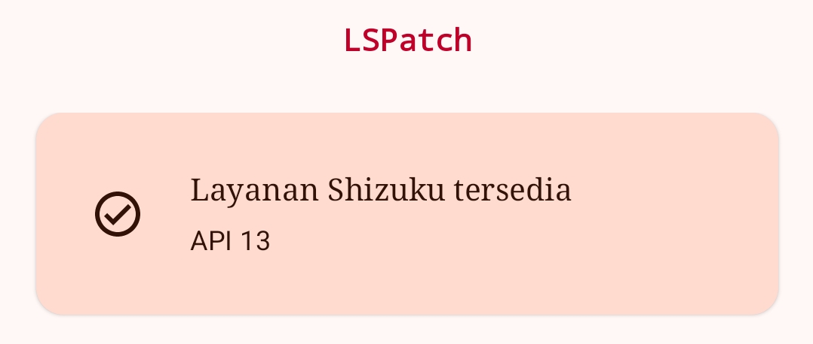
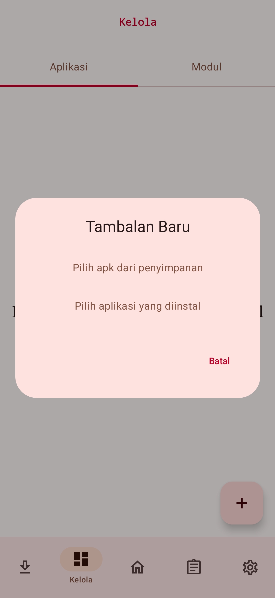
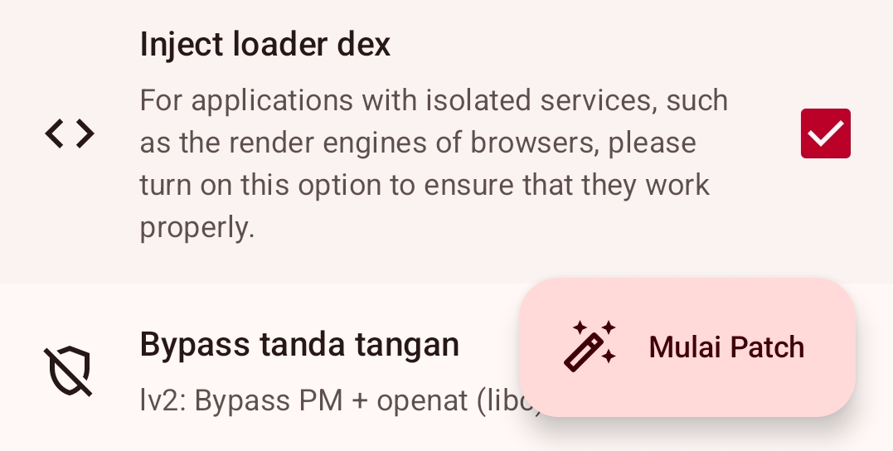
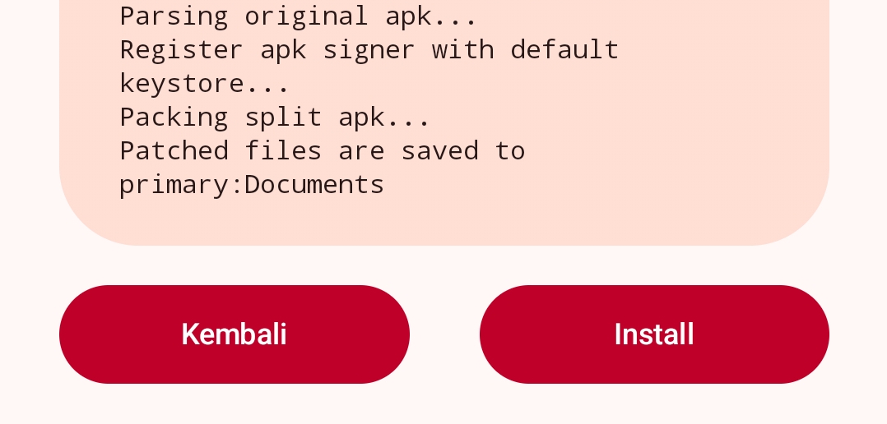
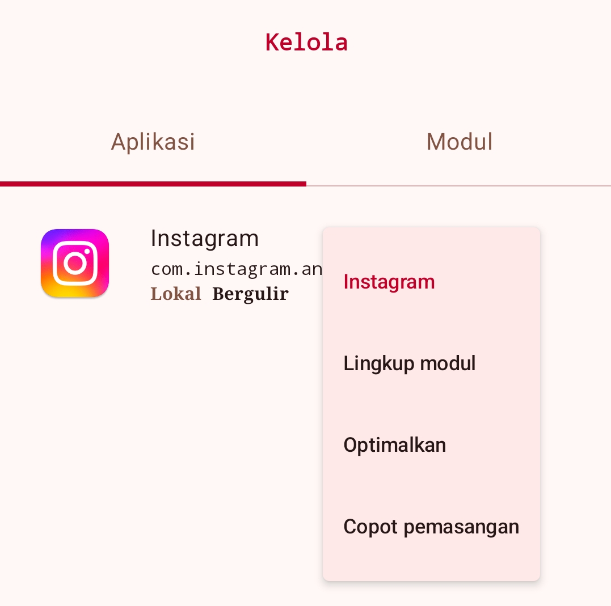
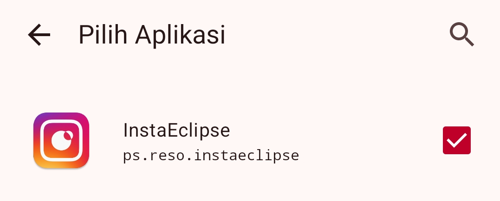
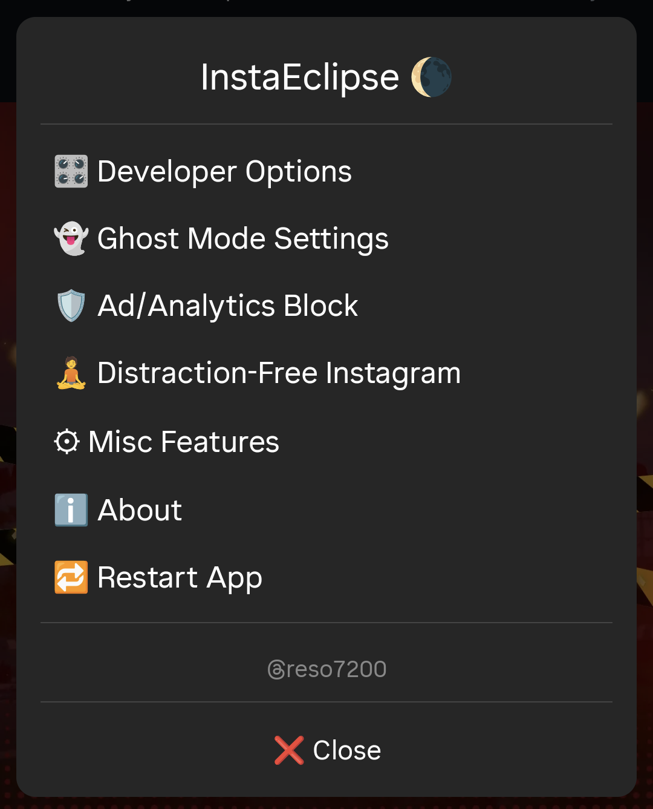

Apakah Anda ingin membaca pesan Instagram tanpa ketahuan, menonton Story secara diam-diam, atau menghilangkan gangguan seperti iklan dan reel? Di dunia teknis, ini disebut **Ghost Mode**. Dokumentasi ini akan memandu Anda menjadi "hantu" di Instagram, baik dengan perangkat **non-root** (tanpa akses superuser) maupun **root** (dengan akses penuh). Panduan ini mengutamakan alur perintah yang presisi dan telah diuji fungsionalitasnya.

## Prasyarat Umum

- **Perangkat**: Android 10 ke atas.
- **Aplikasi Target**: Instagram versi terbaru (disarankan dari [Aurora Store](https://f-droid.org/en/packages/com.aurora.store/)).
- **Cadangan data** Instagram (opsional, tapi disarankan karena proses patch akan menginstal ulang aplikasi).

> Modifikasi aplikasi pihak ketiga melanggar Ketentuan Layanan Instagram.
{: .prompt-info}

## Bagian 1: Metode Non-Root (Tanpa Akses Root)

Metode ini menggunakan **Shizuku** + **LSPatch** untuk menerapkan tambalan (patch) ke Instagram tanpa mengubah sistem. Panduan ini diuji pada perangkat **Tecno Pova 5** (thanks to Zidan Nazimudin).

### 1.1 Unduh dan Instal Aplikasi Pendukung

| Aplikasi            | Fungsi                                 | Sumber Resmi                                                         |
| ------------------- | -------------------------------------- | -------------------------------------------------------------------- |
| **Shizuku**         | Memberi izin tingkat sistem tanpa root | [GitHub RikkaApps](https://github.com/RikkaApps/Shizuku/releases)    |
| **LSPatch Manager** | Menerapkan patch ke aplikasi           | [GitHub JingMatrix](https://github.com/JingMatrix/LSPatch/releases)  |
| **InstaEclipse**    | Modul Ghost Mode untuk Instagram       | [GitHub ReSo7200](https://github.com/ReSo7200/InstaEclipse/releases) |

**Instalasi**:
1. Unduh ketiga berkas `.apk` di atas.
2. Instal satu per satu. Jika muncul peringatan "Unknown source", izinkan instalasi dari sumber tidak dikenal.
3. **Jangan buka Instagram dulu**.

### 1.2 Aktivasi Layanan Shizuku

Shizuku bertindak seperti "jembatan" administratif tanpa root. Pilih salah satu skenario:
- Skenario A: Hanya Menggunakan Smartphone (Wireless Debugging)
    

- Skenario B: Menggunakan PC (Kabel USB)
    

### 1.3 Patch Instagram dengan LSPatch

1. Buka aplikasi **LSPatch** (manager.apk yang sudah diinstal).
2. **Pastikan** di atas tertulis `Layanan Shizuku tersedia`.
    

3. Buka tab **Kelola** (Management).
4. Tekan ikon **`+`** (tambah) → pilih **`Pilih aplikasi yang diinstal`**.
5. Cari dan pilih **Instagram**.
    

6. Pada opsi `Tambalan Baru`, **centang** bagian **`Inject loader dex`**.
7. Klik tombol **`Mulai Patch`**.
    

8. Tunggu proses kompilasi selesai (biasanya 10–30 detik).
9. Setelah muncul notifikasi sukses, tekan **`Install`**.
    
    
    > Proses ini akan **mencopot** Instagram asli dan menggantinya dengan versi hasil patch (data login biasanya tetap aman).
    {: .prompt-info}

10. Tunggu hingga instalasi selesai.

### 1.4 Aktivasi Modul InstaEclipse

1. Buka **LSPatch** lagi.
2. Di tab **Kelola**, klik pada **Instagram** yang sudah ter-patch.
3. Pilih menu **`Lingkup modul`**.
    

4. **Centang** modul **`InstaEclipse`**.
    

5. Kembali ke layar utama.

### 1.5 Verifikasi dan Penggunaan

1. Buka aplikasi **Instagram** seperti biasa.
2. Di halaman utama, tekan ikon **Search** (kaca pembesar) di bawah.
   - **Maka akan muncul popup hitam "InstaEclipse"** — ini pertanda modul berhasil aktif.
     

3. Anda sekarang bisa mengakses semua fitur ghost mode.

## Fitur-Fitur InstaEclipse

### Ghost Mode Settings

| Fitur                            | Fungsi                                           |
| -------------------------------- | ------------------------------------------------ |
| **Hide Seen**                    | Mencegah status "Seen" pada DM                   |
| **Hide Typing**                  | Tidak menampilkan "typing..." saat Anda mengetik |
| **Disable Screenshot Detection** | Bisa screenshot/view once tanpa notifikasi       |
| **Hide View Once**               | Membuka foto/video view once tanpa terdeteksi    |
| **Hide Story Seen**              | Menonton Story tanpa masuk ke daftar penonton    |
| **Hide Live Seen**               | Menonton Live tanpa terlihat                     |

### Ad/Analytics Block

| Fitur                  | Fungsi                                                  |
| ---------------------- | ------------------------------------------------------- |
| **Ad/Analytics Block** | Memblokir semua iklan dan pelacakan analitik Instagram. |

### Distraction-Free Instagram

| Fitur                           | Fungsi                               |
| ------------------------------- | ------------------------------------ |
| **Disable Stories**             | Hilangkan baris Story di atas feed.  |
| **Disable Feed**                | Sembunyikan semua postingan feed.    |
| **Disable Reels**               | Nonaktifkan tab Reels.               |
| **Disable Reels Except in DMs** | Reels hanya muncul di pesan pribadi. |
| **Disable Explore**             | Hilangkan halaman Explore.           |
| **Disable Comments**            | Sembunyikan kolom komentar.          |

### Misc Features

| Fitur                        | Fungsi                                        |
| ---------------------------- | --------------------------------------------- |
| **Disable Story Auto-Swipe** | Story tidak berpindah otomatis.               |
| **Disable Repost**           | Nonaktifkan tombol repost.                    |
| **Disable Video Autoplay**   | Video hanya diputar saat ditekan.             |
| **Show Follower Toast**      | Notifikasi kecil saat ada follower baru.      |
| **Show Feature Toasts**      | Tampilkan notifikasi fitur yang sedang aktif. |

## Bagian 2: Metode Root (Dengan Akses Root)

Jika perangkat Anda sudah di-root (Magisk/KernelSU), prosesnya jauh lebih sederhana.

### Prasyarat Root
- **Magisk** atau **KernelSU** terinstal.
- **Vector Xposed Framework** (bukan LSPatch).

### Perintah Instalasi Root

1. **Instal Vector**:
   - Unduh dari [JingMatrix/Vecto](https://github.com/JingMatrix/Vector).
   - Flash melalui Magisk/KernelSU → reboot.

2. **Instal InstaEclipse**:
   - Unduh file `.apk` InstaEclipse (sama dari GitHub).
   - Instal seperti aplikasi biasa.

3. **Aktivasi Modul**:
   - Buka aplikasi **LSPosed**.
   - Masuk ke tab **Modules**.
   - **Centang InstaEclipse**.
   - Klik modul tersebut, lalu **centang Instagram**.
   - Restart paksa Instagram (force close).

4. **Selesai**. Buka Instagram → tekan ikon Search → popup InstaEclipse akan muncul.

> **Perbedaan utama root:** Tidak perlu proses patch ulang saat Instagram update. Cukup update Instagram dari Play Store, lalu tetap aktif di LSPosed.
{: .prompt-info}

## Kesimpulan

Dengan mengikuti alur perintah teknis di atas, Anda berhasil mengubah Instagram standar menjadi versi **Ghost Mode** yang:
- Tidak meninggalkan jejak baca (seen/typing/story)
- Bebas iklan dan gangguan
- Dapat dikustomisasi sesuai kebutuhan privasi

Metode non-root menggunakan **Shizuku + LSPatch** memberikan fleksibilitas tanpa perlu mengubah sistem. Metode **root + LSPosed** lebih permanen dan tahan update.

> 📌 **Catatan Etika**: Gunakan fitur ghost mode secara bertanggung jawab. Jangan gunakan untuk mengelabui orang dalam situasi penting atau melanggar hukum privasi yang berlaku.
{: .prompt-warning}