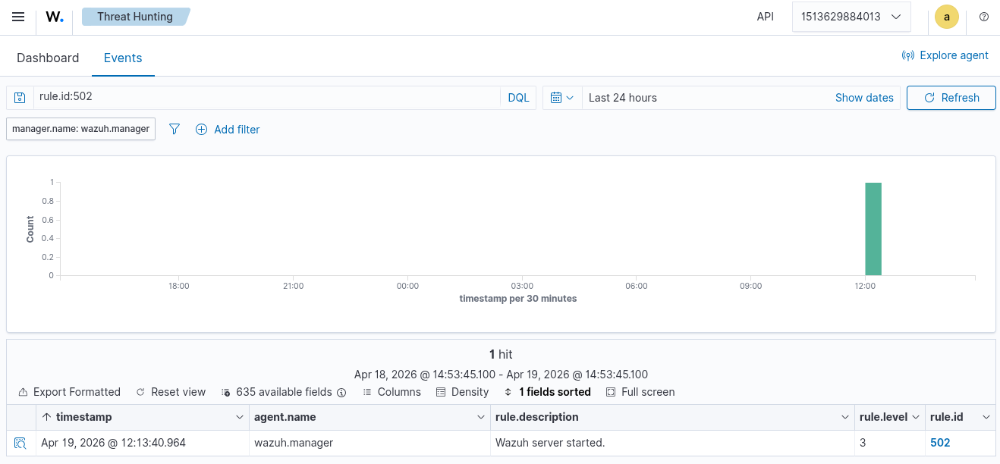
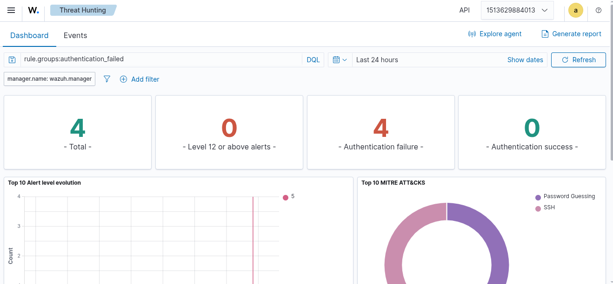
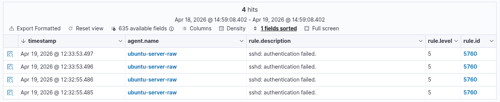
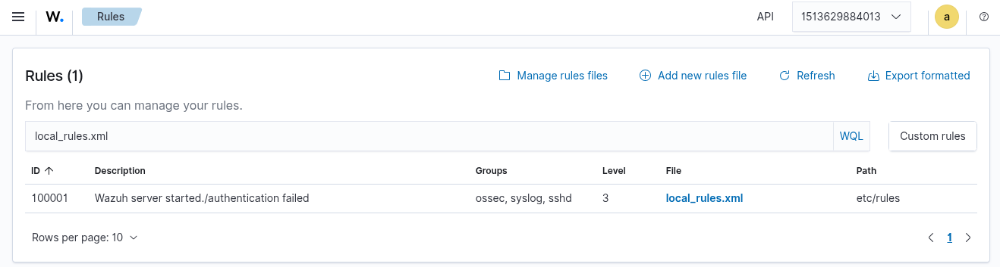
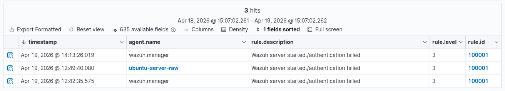

## Pendahuluan

Threat hunting (perburuan ancaman) adalah pendekatan proaktif dalam keamanan siber untuk mengidentifikasi indikator kompromi (IoC) dan aktivitas mencurigakan yang mungkin luput dari deteksi otomatis. Wazuh menyediakan antarmuka Threat Hunting yang memungkinkan analis keamanan untuk melakukan pencarian, filter, dan analisis event secara real-time.

Dokumen teknis ini akan memandu Anda dalam:
1. Mengakses dan menggunakan fitur Threat Hunting di Wazuh.
2. Melakukan simulasi serangan autentikasi SSH gagal.
3. Membuat dan menyesuaikan custom rule Wazuh untuk mengelompokkan berbagai event autentikasi.

## Prasyarat

Sebelum memulai, pastikan:
- Instalasi Wazuh (manager + indexer + dashboard) berjalan dengan baik (direferensikan pada [artikel sebelumnya](https://ricaldocs.github.io/posts/panduan-lengkap-instalasi-dan-konfigurasi-wazuh/)).
- [Agent Wazuh telah terpasang](https://ricaldocs.github.io/posts/panduan-lengkap-instalasi-dan-konfigurasi-wazuh/#deployment-wazuh-agent) pada endpoint Linux yang menjalankan layanan SSH.
- Anda memiliki akses ke Wazuh dashboard dengan peran administratif (misalnya, `administrator` atau `wazuh-admin`).

## Langkah 1: Mengakses Modul Threat Hunting

1. Buka Wazuh dashboard melalui browser.
2. Pada **panel navigasi kiri**, cari dan perluas menu **Threat Intelligence**.
3. Di bagian **Threat Hunting**, klik sub-tab **Events** untuk melihat daftar semua event keamanan yang terkumpul.
  

> Threat Hunting memungkinkan pencarian dengan sintaksis **query filter** (contoh: `rule.id:502`, `data.ssh.destination.ip:<IP>`), time range picker, serta field selector untuk memfilter kolom yang relevan.
{: .prompt-info}

## Langkah 2: Menguji Deteksi Awal dengan Event Startup Wazuh

Sebelum membuat simulasi serangan, pastikan event internal Wazuh terdeteksi dengan baik.

1. Di kolom pencarian Events, masukkan query:
   ```
   rule.id:502
   ```
   > Rule ID 502 adalah rule bawaan Wazuh dengan deskripsi "Wazuh server started." Rule ini mengindikasikan bahwa service Wazuh manager baru saja dijalankan ulang.
   {: .prompt-info}

2. Tekan **Enter** atau klik ikon pencarian. Anda akan melihat event dengan deskripsi "Wazuh server started." Hal ini menandakan bahwa pipeline deteksi bekerja normal.
  

## Langkah 3: Simulasi Autentikasi SSH Gagal

Untuk memicu event keamanan yang akan kita tangkap, lakukan percobaan login SSH dengan password yang salah dari mesin klien (bisa dari server lain atau dari mesin yang sama jika SSH service aktif).

**Contoh perintah simulasi dari klien:**
```bash
ssh user@<IP_WAZUH_AGENT>
```
Kemudian masukkan password yang salah sebanyak minimal 3 kali.

Setelah percobaan:

1. Kembali ke halaman **Threat Hunting > Events** pada Wazuh dashboard.
2. Hapus query sebelumnya, lalu cari dengan kata kunci: `authentication failure` atau filter dengan `rule.groups:authentication_failed`.
  

3. Gulir ke bawah daftar event, cari baris yang memiliki kolom **Description** berisi:
   ```
   sshd: authentication failed.
   ```
   

>  Wazuh agent membaca file log `/var/log/auth.log` (pada Debian/Ubuntu) atau `/var/log/secure` (pada RHEL/CentOS) milik syslog/sshd. Ketika ada percobaan login gagal, sshd menulis baris log yang kemudian diparsing oleh decoder Wazuh (decoder `sshd`) dan menghasilkan event dengan rule bawaan (biasanya 5760 – "sshd: authentication failed").
{: .prompt-info}

## Langkah 4: Membuat Custom Rule di `local_rules.xml`

Secara default, Wazuh menggunakan rule yang terpisah-pisah untuk berbagai jenis event autentikasi. Agar memudahkan threat hunting dan correlation, kita dapat membuat custom rule yang menggabungkan beberapa rule ID sekaligus dengan overwrite.

### 4.1 Buka Konfigurasi Rule Wazuh

1. Dari Wazuh dashboard, buka **Server management** (pada menu kiri).
2. Pilih **Rules** → **local_rules.xml**.
  

### 4.2 Edit `local_rules.xml`

Tempelkan konfigurasi berikut, atau modifikasi sesuai kebutuhan:

```xml
<!-- Local rules -->
<!-- Modify it at your will. -->
<!-- Copyright (C) 2015, Wazuh Inc. -->

<!--
  Tujuan: Menggabungkan deteksi untuk berbagai event autentikasi gagal/startup
  ke dalam satu rule custom dengan ID 100001.
  Sumber inspirasi: rule 502, 5760, 5762 (dari 0015-ossec_rules.xml) 
  dan aturan dari 0095-sshd_rules.xml.
-->
<group name="ossec,syslog,sshd,">
  <rule id="100001" level="3" overwrite="yes">
    <if_sid>502,5760,5762</if_sid>
    <match>Manager started|Failed password|Failed keyboard|authentication error|Connection reset</match>
    <description>Wazuh server started./authentication failed</description>
    <group>pci_dss_10.6.1,gpg13_10.1,gdpr_IV_35.7.d,hipaa_164.312.b,nist_800_53_AU.6,tsc_CC7.2,tsc_CC7.3,</group>
  </rule>
</group>
```

**Penjelasan parameter:**

| Parameter         | Deskripsi                                                                         |
| ----------------- | --------------------------------------------------------------------------------- |
| `id="100001"`     | ID custom rule (rentang 100000-199999 disarankan untuk local rules).              |
| `level="3"`       | Tingkat keparahan 3 (rendah). Dapat dinaikkan jika ingin eskalasi alert.          |
| `overwrite="yes"` | Menggantikan rule dengan ID yang sama jika ada konflik.                           |
| `<if_sid>`        | Memicu rule ini jika salah satu rule ID dari daftar (502, 5760, 5762) terdeteksi. |
| `<match>`         | Mencocokkan string dalam pesan log. Tanda `                                       | ` berarti OR logic. |
| `<description>`   | Deskripsi yang akan muncul di dashboard untuk event ini.                          |
| `<group>`         | Label untuk kepatuhan (compliance): PCI DSS, GDPR, HIPAA, NIST, TSC.              |

### 4.3 Simpan dan Restart Wazuh Manager

Setelah file `local_rules.xml` tersimpan:

- Jika menggunakan Docker (seperti instalasi referensi):
  ```bash
  docker compose restart
  ```

> Restart hanya diperlukan agar Wazuh manager membaca ulang konfigurasi rule. Tidak ada dampak pada data event yang sudah masuk.
{: .prompt-info}

## Langkah 5: Verifikasi Custom Rule

1. Lakukan simulasi ulang percobaan login SSH dengan password salah (minimal 1 kali percobaan baru setelah restart).
2. Buka kembali **Threat Hunting > Events**.
3. Filter event dengan `rule.id:100001`.
4. Anda seharusnya melihat event baru dengan deskripsi:
   ```
   Wazuh server started./authentication failed
   ```
   

**Indikator keberhasilan:**
- Waktu event sesuai dengan percobaan terbaru.
- Kolom Rule ID berisi `100001`.
- Kolom Description sesuai dengan `<description>` yang didefinisikan.

## Analisis Lebih Lanjut

Setelah custom rule aktif, Anda dapat melakukan:

1. Membuat alert real-time dengan mengaitkan rule ini ke **Wazuh-Integrator** (contoh: kirim notifikasi ke Slack, email, atau TheHive).
2. Membuat dashboard khusus yang menampilkan statistik `rule.id:100001` untuk memonitor tingkat percobaan autentikasi gagal dari waktu ke waktu.
3. Menambahkan level keparahan secara dinamis dengan `<same_source>` atau `<frequency>` untuk mendeteksi brute force.

**Contoh modifikasi rule agar lebih sensitif terhadap brute force:**
```xml
<rule id="100002" level="10" frequency="10" timeframe="120" ignore="60">
  <if_matched_sid>100001</if_matched_sid>
  <same_source_ip />
  <description>Multiple authentication failures (10 attempts in 2 minutes) from same IP.</description>
</rule>
```

## Pemecahan Masalah (Troubleshooting)

| Masalah                                                     | Kemungkinan Penyebab                                                               | Solusi                                                                                                                     |
| ----------------------------------------------------------- | ---------------------------------------------------------------------------------- | -------------------------------------------------------------------------------------------------------------------------- |
| Event tidak muncul setelah restart                          | Rule ID 100001 bentrok dengan rule bawaan dari file lain (misal `ossec_rules.xml`) | Pastikan `overwrite="yes"`. Cek log Wazuh manager: `docker compose logs wazuh-manager \| grep -i error`                    |
| Event dengan rule 100001 muncul tapi tanpa deskripsi kustom | Format XML tidak valid atau tag `<description>` tidak tertutup                     | Validasi XML: `xmllint --noout local_rules.xml`                                                                            |
| Simulasi login gagal tidak menghasilkan event di dashboard  | Agent tidak mengirim log SSH karena konfigurasi `ossec.conf`                       | Periksa file `/var/ossec/etc/ossec.conf` pada agent, pastikan ada `<location>/var/log/auth.log</location>` (atau `secure`) |

## Kesimpulan

Dengan mengikuti panduan ini, Anda telah berhasil:
- Menggunakan modul Threat Hunting Wazuh untuk menemukan event autentikasi.
- Mensimulasikan percobaan login SSH gagal sebagai sumber event nyata.
- Membuat dan menerapkan custom rule Wazuh yang menggabungkan beberapa event autentikasi menjadi satu ID rule terpusat (100001).

Pendekatan ini memudahkan analis keamanan dalam melakukan monitoring dan correlation terhadap aktivitas mencurigakan pada layanan SSH, sekaligus meningkatkan efisiensi dalam proses incident response.