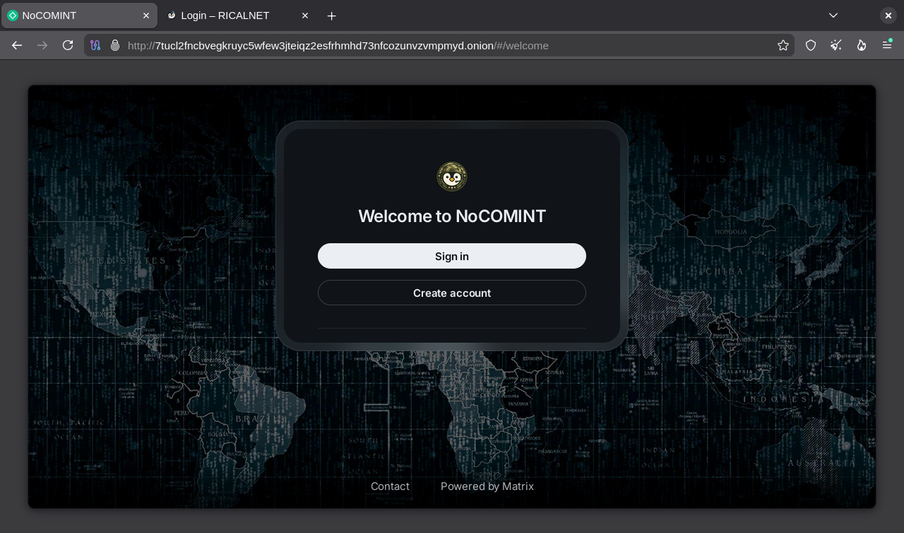

> Artikel ini disusun **semata-mata untuk tujuan pembelajaran dan penelitian privasi digital**. Teknologi hidden service Tor memiliki aplikasi legitimasi tinggi seperti melindungi whistleblower, aktivis hak asasi manusia, jurnalis di wilayah represif, serta mengamankan komunikasi sensitif.
{: .prompt-warning}

> **Penggunaan untuk aktivitas ilegal, penyebaran konten berbahaya, atau pelanggaran hukum lainnya sepenuhnya di luar tanggung jawab penulis.** Pahami dan patuhi hukum yang berlaku sebelum mengimplementasikan teknologi ini.
{: .prompt-danger}

## Pendahuluan

### Mengapa Hidden Service?

Tor hidden service memungkinkan untuk menyembunyikan lokasi fisik server sekaligus mengenkripsi seluruh lalu lintas data secara end-to-end. Berbeda dengan akses web biasa yang mengekspos IP address server, hidden service hanya dapat diakses melalui jaringan Tor menggunakan alamat `.onion`.

Ketika mengkonfigurasi hidden service, Tor daemon akan:
1. Membuat kunci publik-privat unik untuk layanan
2. Mendaftarkan deskriptor layanan ke Distributed Hash Table (DHT) Tor
3. Membuat rendezvous point yang bertindak sebagai perantara anonim
4. Client Tor kemudian dapat menemukan layanan tanpa mengetahui IP server

Kasus penggunaan legitimasi:
- Server internal perusahaan yang tidak ingin terekspos internet publik
- Platform berbagi dokumen untuk tim jurnalistik investigatif
- Sistem manajemen konten untuk organisasi nonprofit dengan kebutuhan privasi tinggi
- Backup server dengan autentikasi multi-lapis

## Prasyarat Sistem

Sebelum memulai, pastikan:

| Komponen                                                                                        | Spesifikasi                |
| ----------------------------------------------------------------------------------------------- | -------------------------- |
| OS                                                                                              | Debian 13+ / Ubuntu 26.04+ |
| Aplikasi Web (seperti [Digital Independence](https://github.com/ricalnet/digital-independence)) | Berjalan di localhost      |

> Penting untuk dipahami bahwa Hidden service Tor bukan pengganti keamanan aplikasi web. Autentikasi, validasi input, dan praktik keamanan standar tetap harus diterapkan pada aplikasi yang berjalan di belakang Tor.
{: .prompt-info}

## Langkah 1: Instalasi Tor

Menginstal melalui `apt` dengan repository resmi untuk mendapatkan versi stabil terbaru dengan patch keamanan terkini. Tor Project secara aktif merawat paket ini untuk berbagai distribusi Linux.

```bash
sudo apt update
sudo apt install -y tor
```

### Aktivasi Daemon
Enable dan start Tor daemon agar berjalan otomatis saat sistem boot:

```bash
enable tor@default.service
sudo systemctl start tor@default.service
```

Verifikasi status:

```bash
sudo systemctl status tor@default.service
# Output yang diharapkan: "active (running)"
```

Uji dengan `curl`:

```bash
curl --socks5-hostname 127.0.0.1:9050 https://check.torproject.org/api/ip
# Output yang diharapkan: {"IsTor":true,"IP":"<ip-address>"}%  
```

## Langkah 2: Backup Konfigurasi

Backup adalah tindakan pencegahan yang sering diabaikan namun krusial. Konfigurasi default Tor sebenarnya sudah berfungsi, tetapi kesalahan edit bisa menyebabkan Tor gagal start atau layanan tidak terdeteksi.

```bash
sudo cp /etc/tor/torrc /etc/tor/torrc.bak 
sudo cp /etc/tor/torsocks.conf /etc/tor/torsocks.conf.bak
```

File `torrc` adalah file konfigurasi utama. Jika terjadi error sintaks, Tor akan gagal start. Dengan backup, bisa dengan cepat memulihkan konfigurasi yang diketahui berfungsi tanpa harus menginstal ulang.

## Langkah 3: Konfigurasi Hidden Service

Buka file konfigurasi utama Tor:

```bash
sudo nano /etc/tor/torrc
```

File `/etc/tor/torrc`{: .filepath} dimiliki oleh root dan memerlukan hak akses administratif untuk dimodifikasi.

### Parameter Konfigurasi yang Perlu Dipahami

| Parameter           | Fungsi                                          | Contoh Nilai             |
| ------------------- | ----------------------------------------------- | ------------------------ |
| `HiddenServiceDir`  | Direktori penyimpanan kunci privat dan hostname | `/var/lib/tor/layanan1/` |
| `HiddenServicePort` | Pemetaan port virtual (.onion) ke port lokal    | `80 127.0.0.1:8009`      |

### Tambahkan Konfigurasi

Gulir ke bagian `############### This section is just for location-hidden services` atau tambahkan di akhir file:

```bash
# Layanan pertama - Aplikasi utama
HiddenServiceDir /var/lib/tor/aplikasi_utama/
HiddenServicePort 80 127.0.0.1:8009

# Layanan kedua - Nextcloud (contoh layanan tambahan)
HiddenServiceDir /var/lib/tor/nextcloud/
HiddenServicePort 80 127.0.0.1:5000
```

`HiddenServicePort 80` adalah port standar HTTP. Client Tor akan terhubung ke alamat `.onion` menggunakan port 80, lalu Tor akan meneruskan ke `127.0.0.1:8009` di server.

Anda bisa menggunakan port lain (misal `HiddenServicePort 443` untuk HTTPS), tetapi client harus menentukan port secara eksplisit (contoh: `http://xxxx.onion:443/`).

Setiap direktori `HiddenServiceDir` akan menghasilkan hostname `.onion` yang unik dan independen. Ini ideal untuk menjalankan beberapa aplikasi terisolasi.

Simpan file (nano: `Ctrl+O`, `Enter`, `Ctrl+X`).

## Langkah 4: Restart dan Verifikasi Tor

Restart daemon untuk menerapkan konfigurasi baru:

```bash
sudo systemctl restart tor@default.service
```

Periksa status dan cari error:

```bash
sudo systemctl status tor@default.service
```

Jika gagal gunakan perintah berikut untuk melihat log detail:

```bash
sudo journalctl -u tor --since "2 minutes ago" --no-pager
```

## Langkah 5: Mengambil Alamat .onion

Tunggu 5-10 detik setelah restart untuk memberi waktu Tor membuat kunci dan mendaftarkan layanan ke jaringan. Proses ini meliputi:
1. Generasi kunci ed25519 di versi baru
2. Upload deskriptor ke directory authority

```bash
sudo cat /var/lib/tor/aplikasi_utama/hostname
```

Output contoh:
```
abcdef1234567890abcdef1234567890abcdef1234567890abcdef1234.onion
```

> Hostname ini unik dan tidak bisa diubah. Jika kehilangan direktori `/var/lib/tor/aplikasi_utama/` (termasuk file `hs_ed25519_secret_key`), Anda akan mendapatkan hostname baru yang berbeda dan semua tautan lama akan rusak.
{: .prompt-info}

## Langkah 6: Troubleshooting - Izin Direktori

Jika setelah restart tidak mendapatkan file `hostname` atau Tor gagal mengakses direktori hidden service, masalahnya hampir pasti terkait izin.

### Mengapa masalah izin terjadi?
Tor daemon berjalan sebagai user `debian-tor` (atau `tor` di beberapa distribusi) untuk alasan keamanan - membatasi dampak jika terjadi kompromi. Direktori yang dibuat dengan `sudo mkdir` mungkin dimiliki oleh `root`.

### Solusi:

```bash
# Perbaiki kepemilikan direktori
sudo chown -R debian-tor:debian-tor /var/lib/tor/aplikasi_utama/

# Set izin yang benar (700 = hanya pemilik yang bisa baca/tulis/ekseskusi)
sudo chmod 700 /var/lib/tor/aplikasi_utama/

# Restart Tor
sudo systemctl restart tor@default.service

# Cek file hostname lagi
sudo cat /var/lib/tor/aplikasi_utama/hostname
```

Struktur izin yang benar di direktori `/var/lib/tor/aplikasi_utama/`:
```
drwx--S--- 3 debian-tor debian-tor 4096 Jun  4 20:32 .
drwx--S--- 5 debian-tor debian-tor 4096 Jun  4 21:27 ..
drwx--S--- 2 debian-tor debian-tor 4096 Jun  4 20:32 authorized_clients
-rw------- 1 debian-tor debian-tor   63 Jun  4 20:32 hostname
-rw------- 1 debian-tor debian-tor   64 Jun  4 20:32 hs_ed25519_public_key
-rw------- 1 debian-tor debian-tor   96 Jun  4 20:32 hs_ed25519_secret_key
```

## Verifikasi dan Pengujian

Untuk menguji hidden service:

1. Install Tor Browser (direkomendasikan) atau gunakan `torsocks`:
```bash
# Alternatif testing via command line
sudo apt install -y torsocks
torsocks curl http://xxxxxxxxxxxxxxxx.onion
```
1. Dari perangkat lain di jaringan berbeda (bukan server yang sama), akses alamat `.onion` melalui Tor Browser.
    
    _NoCOMINT by Ricalnet_

2. Periksa log akses aplikasi web untuk memastikan request masuk melalui localhost (127.0.0.1), bukan IP eksternal.

## Rekomendasi Keamanan Tambahan

1. Meskipun Tor sudah mengenkripsi, HTTPS menambah lapisan autentikasi dan mencegah serangan man-in-the-middle dari node Tor keluar.
2. Pastikan aplikasi web hanya listening di `127.0.0.1`, bukan `0.0.0.0`.
3. Aktifkan autentikasi klien (Tor v3):
```
HiddenServiceAuthorizeClient stealth client1
```
4. Update Tor secara berkala:
```bash
sudo apt update && sudo apt upgrade -y tor
```
5. Monitor log untuk aktivitas mencurigakan:
```bash
sudo tail -f /var/log/tor/log
```

## Kesimpulan

Dengan ini, Anda telah berhasil mengkonfigurasi hidden service Tor yang berjalan di atas aplikasi web lokal. Prinsip yang sama dapat diterapkan untuk berbagai layanan - mulai dari server SSH (`HiddenServicePort 22 127.0.0.1:22`) hingga server database.

> Ingatlah selalu bahwa kekuatan teknologi ini terletak pada penggunaannya yang bertanggung jawab. Gunakan untuk melindungi privasi, bukan untuk menyembunyikan aktivitas ilegal.
{: .prompt-warning}

## Referensi Lanjutan

- [Tor Project Official Documentation](https://community.torproject.org/onion-services/)
- [Tor Manual Page](https://manpages.debian.org/tor/torrc)
