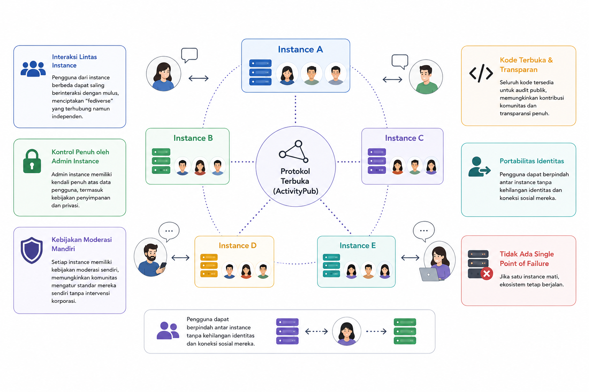

## Pendahuluan

Media sosial telah menjadi infrastruktur penting dalam kehidupan sehari-hari. Namun, platform tradisional seperti Twitter/X, Facebook, dan Instagram mengoperasikan model terpusat di mana satu entitas memiliki kontrol penuh atas data, algoritma, dan kebijakan moderasi. Model ini menimbulkan beberapa masalah kritis:

- Pengguna terikat pada satu platform dan tidak bisa membawa data serta koneksi sosial mereka
- Jika platform mati atau diakuisisi, seluruh komunitas hilang
- Algoritma dan kebijakan moderasi tidak terbuka untuk audit publik
- Data pengguna menjadi komoditas yang diperjualbelikan tanpa kontrol pengguna

Mastodon hadir sebagai solusi revolusioner dengan pendekatan desentralisasi yang mengembalikan kontrol kepada pengguna dan komunitas. 



Berbeda dengan platform sentralisasi, Mastodon menggunakan arsitektur terdesentralisasi berbasis protokol ActivityPub yang memungkinkan:

- Pengguna dari instance berbeda dapat saling berinteraksi dengan mulus, menciptakan "fediverse" (federated universe) yang terhubung namun independen
- Admin instance memiliki kendali penuh atas data pengguna, termasuk kebijakan penyimpanan dan privasi
- Setiap instance memiliki kebijakan moderasi sendiri, memungkinkan komunitas untuk mengatur standar mereka sendiri tanpa intervensi korporasi
- Seluruh kode tersedia untuk audit publik, memungkinkan kontribusi komunitas dan transparansi penuh
- Pengguna dapat berpindah antar instance tanpa kehilangan identitas dan koneksi sosial mereka
- Tidak ada single point of failure. Jika satu instance mati, ekosistem tetap berjalan

## 1. Persiapan Lingkungan

### 1.1 Clone Repository

```bash
git clone https://github.com/ricalnet/digital-independence.git
cd mastodon
```

Repository ini berisi konfigurasi Docker Compose yang sudah disesuaikan, menghemat waktu setup dibandingkan konfigurasi dari awal.

### 1.2 Membuat Direktori Volume

```bash
mkdir -p postgres14 redis public/system
```

## 2. Generasi Secret Keys

### 2.1 Menjalankan Generator

```bash
(
echo "═══════════════════════════════════════════════════════════════"
echo "🐘 MASTODON SECRETS - $(date '+%Y-%m-%d %H:%M:%S')"
echo "═══════════════════════════════════════════════════════════════"
echo ""
echo "🔑 SECRET_KEY_BASE:"
echo "───────────────────────────────────────────────────────────────"
docker run --rm ghcr.io/mastodon/mastodon:latest bundle exec rails secret
echo ""
echo "🔐 ENCRYPTION KEYS:"
echo "───────────────────────────────────────────────────────────────"
docker run --rm ghcr.io/mastodon/mastodon:latest bundle exec rails db:encryption:init
echo ""
echo "📨 VAPID KEYS:"
echo "───────────────────────────────────────────────────────────────"
docker run --rm ghcr.io/mastodon/mastodon:latest bundle exec rails mastodon:webpush:generate_vapid_key
echo ""
echo "═══════════════════════════════════════════════════════════════"
echo "✅ Done! Copy the values above to .env.production"
echo "═══════════════════════════════════════════════════════════════"
)
```

### 2.2 Memahami Setiap Secret

#### A. SECRET_KEY_BASE (64 karakter)
- Digunakan untuk session management dan cookie signing
- Melindungi session pengguna dari serangan cookie tampering
- Semua session aktif akan invalid dan pengguna harus login ulang

#### B. Encryption Keys (3 keys)

| Key                                            | Fungsi                                               |
| ---------------------------------------------- | ---------------------------------------------------- |
| `ACTIVE_RECORD_ENCRYPTION_PRIMARY_KEY`         | Enkripsi data sensitif di database                   |
| `ACTIVE_RECORD_ENCRYPTION_DETERMINISTIC_KEY`   | Enkripsi deterministic untuk field yang perlu dicari |
| `ACTIVE_RECORD_ENCRYPTION_KEY_DERIVATION_SALT` | Salt untuk turunan kunci                             |

#### C. VAPID Keys (Public & Private)
- Web Push Notifications
- Memungkinkan browser mengirim notifikasi real-time
- Memastikan hanya server authorized yang bisa mengirim push

## 3. Konfigurasi Database

### 3.1 Memulai Service Database

```bash
docker compose up -d db redis
```

Mengapa memulai db dan redis terpisah?
1. Database membutuhkan waktu inisialisasi
2. Memastikan database siap sebelum migrasi
3. Memisahkan start sequence untuk troubleshooting

### 3.2 Verifikasi Status Database

Cek log database:

```bash
docker compose logs db -f
```

Tanda database siap:

```
db-1  | 2026-06-27 19:22:13.445 UTC [1] LOG:  database system is ready to accept connections
```

### 3.3 Membuat Database

```bash
docker compose run --rm web bundle exec rails db:create
```

Rails akan membuat database `mastodon_production` dengan encoding UTF-8.

### 3.4 Migrasi Schema Database

```bash
docker compose run --rm web bundle exec rails db:migrate
```

Schema Migration:
- Membuat tabel-tabel utama (accounts, statuses, etc.)
- Menambahkan indeks untuk performance
- Setup foreign key constraints
- Menambahkan extensions PostgreSQL (pg_trgm, etc.)

### 3.5 Seeding Database

```bash
docker compose run --rm web bundle exec rails db:seed
```

Seed data mencakup:
- Konfigurasi default sistem
- User roles (User, Admin, Moderator, Owner)
- User admin pertama
- Emoji bawaan

## 4. Deployment dan Service Management

### 4.1 Menjalankan Semua Service

```bash
docker compose up -d
docker compose logs -f
```

#### Issue: Upload file gagal

```bash
# Fix permissions
docker compose exec --user=root web chown -R mastodon:mastodon /mastodon/public/system
```

## 5. Manajemen User Admin

### 5.1 Membuat Admin User

```bash
docker compose run --rm web bundle exec bin/tootctl accounts create \
  admin \
  --email admin@domain.com \
  --confirmed \
  --role Owner
```

Parameter Detail:
- `admin`: Username (harus unique)
- `--email`: Email untuk verifikasi
- `--confirmed`: Melewati proses konfirmasi email
- `--role Owner`: Role tertinggi dengan full privileges

Output yang diharapkan:
```
OK
New password: A1b2C3d4E5f6G7h8I9j0
```

### 5.2 Menyetujui Akun Admin

```bash
docker compose run --rm web bundle exec bin/tootctl accounts modify admin --approve
```

> Mastodon memiliki workflow approval untuk keamanan dan mencegah spam.
{: .prompt-info}

### 5.3 Role dan Privileges

| Role      | Privileges                       |
| --------- | -------------------------------- |
| User      | Basic post, follow, like         |
| Moderator | Delete content, mute/block users |
| Admin     | Manage users, settings, reports  |
| Owner     | Full system access (highest)     |

## 6. Menangani Upload Gambar

### 6.1 Permasalahan Permission

Kenapa permission error terjadi?
- Container berjalan dengan user `mastodon` (UID: 1000)
- Volume host memiliki ownership berbeda
- File baru yang diupload memiliki permission yang salah

#### Solusi Permanent

Di Host:
- Set ownership to mastodon user:
```bash
sudo chown -R 1000:1000 ./public/system
```

- Set directory permissions
```bash
sudo chmod 755 ./public/system
```

- Set file permissions (umask)
```bash
sudo find ./public/system -type f -exec chmod 644 {} \;
sudo find ./public/system -type d -exec chmod 755 {} \;
```

Di Container:
- Enter container as root:
```bash
docker compose exec --user=root web /bin/bash
```

- Inside container
```bash
chown -R mastodon:mastodon /mastodon/public/system
chmod -R 755 /mastodon/public/system
```

- Create necessary subdirectories
```bash
mkdir -p /mastodon/public/system/cache
mkdir -p /mastodon/public/system/tmp
```

- Set proper ownership
```bash
chown -R mastodon:mastodon /mastodon/public/system/cache
chown -R mastodon:mastodon /mastodon/public/system/tmp
```

## 7. Maintenance dan Operasional

### 7.1 Update Mastodon

Update Process:

```bash
# 1. Pull new images
docker compose pull

# 2. Stop services
docker compose down

# 3. Start with new images
docker compose up -d

# 4. Run database migrations if needed
docker compose run --rm web bundle exec rails db:migrate

# 5. Restart services
docker compose restart

# 6. Verify functionality
docker compose logs -f
```

## Penutup

Instalasi Mastodon dengan Docker Compose memberikan fleksibilitas dan kemudahan dalam deployment self-hosted social media.

Selamat, Anda sekarang memiliki platform social media yang terdesentralisasi dan berada di bawah kendali penuh Anda! 🐘