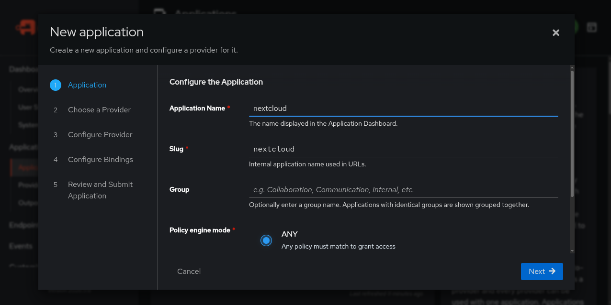
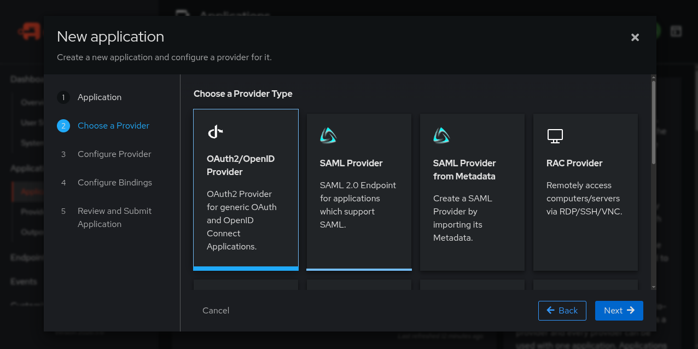
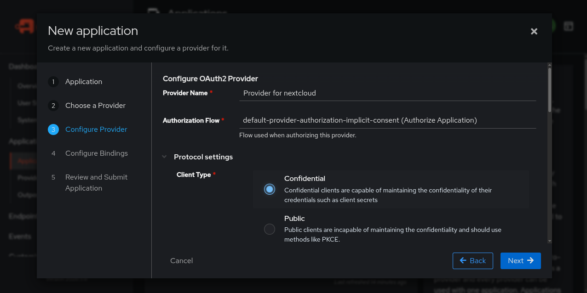
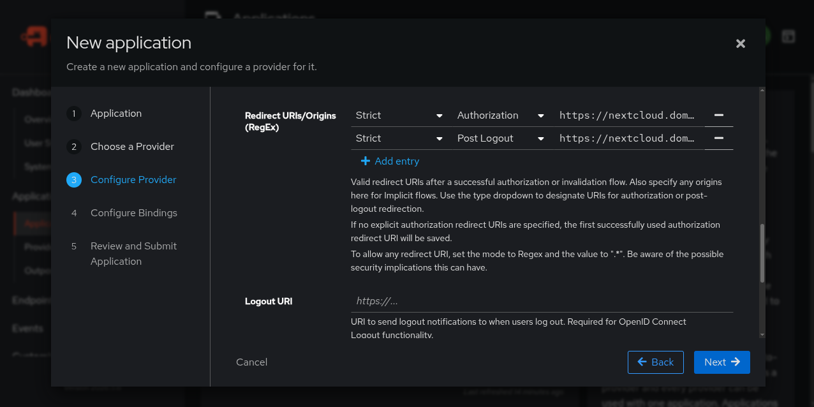
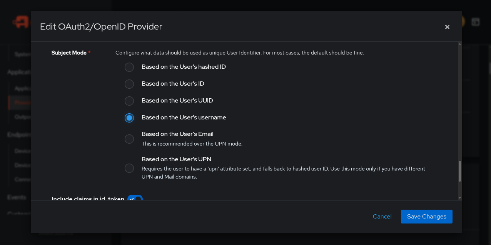
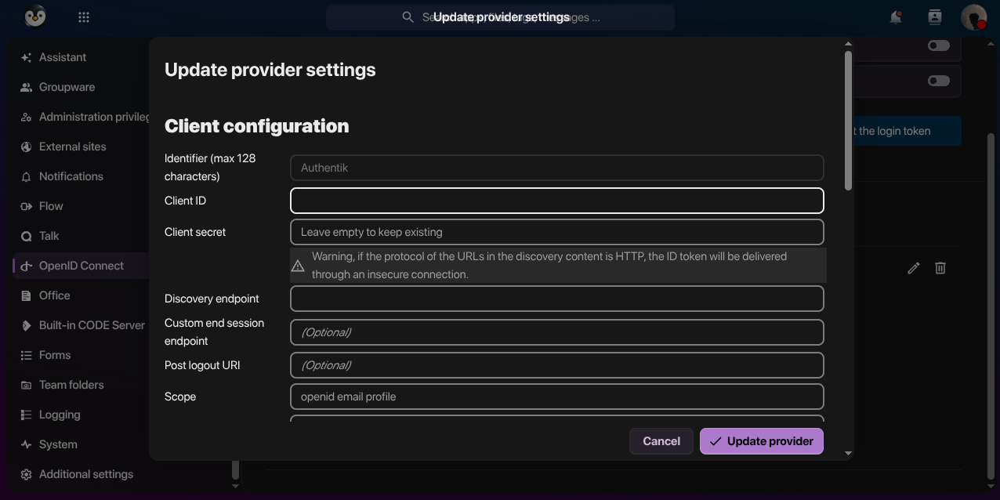
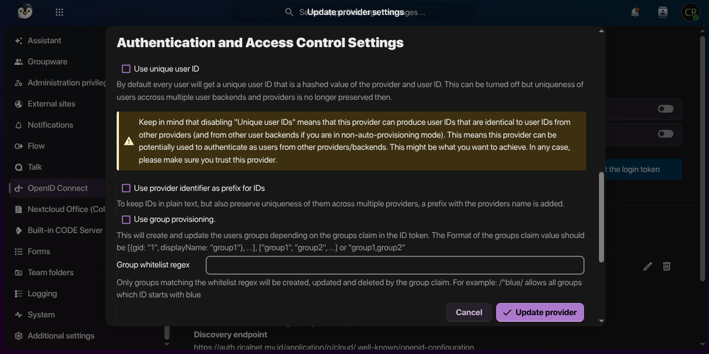
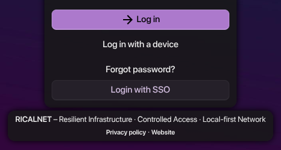

## Pendahuluan

Integrasi Nextcloud dengan Authentik melalui OIDC memberikan sentralisasi manajemen identitas dengan manfaat:

| Aspek           | Manfaat                                                          |
| --------------- | ---------------------------------------------------------------- |
| Keamanan        | 2FA terpusat, kebijakan password terpadu, audit log lengkap      |
| Efisiensi       | Satu perubahan akun berlaku untuk semua aplikasi terintegrasi    |
| User Experience | Pengurangan 70% beban helpdesk reset password                    |
| Kepatuhan       | Audit trail terpusat untuk investigasi dan regulasi (GDPR/HIPAA) |

### Arsitektur Sistem

```
┌─────────────┐      OIDC Auth Request      ┌─────────────┐
│             │ ───────────────────────────► │             │
│  Nextcloud  │                              │  Authentik  │
│  (SP)       │                              │  (IdP)      │
│             │ ◄─────────────────────────── │             │
└─────────────┘      Auth Response          └─────────────┘
      │                                                   │
      │      User Info & Claims                          │
      └───────────────────────────────────────────────────┘
```

Alur Autentikasi:
1. User login via Nextcloud → diarahkan ke Authentik
2. Authentik memverifikasi kredensial + 2FA
3. Authentik mengirim kode otorisasi ke Nextcloud
4. Nextcloud menukar kode dengan token di backend
5. Validasi token → pembuatan sesi lokal

### Prasyarat

| Komponen  | Persyaratan                        |
| --------- | ---------------------------------- |
| Nextcloud | Terinstal dan dapat diakses publik |
| Authentik | Terinstal dan dikonfigurasi        |
| Akses     | Administrator untuk kedua sistem   |

## Langkah 1: Membuat Aplikasi di Authentik

### Tujuan
Merepresentasikan Nextcloud sebagai klien terpercaya untuk mengatur kebijakan akses dan melacak aktivitas.

### Prosedur

1. Login ke dashboard Authentik sebagai admin
2. Navigasi: Applications → New Application
   

3. Isi konfigurasi aplikasi:

   | Field              | Value       | Keterangan                          |
   | ------------------ | ----------- | ----------------------------------- |
   | Name               | `nextcloud` | Nama tampilan di daftar aplikasi    |
   | Slug               | `nextcloud` | URL identifier, unik tanpa spasi    |
   | Policy Engine Mode | `Any`       | Fleksibel: cukup penuhi 1 kebijakan |

   > Policy Engine Mode:
     - `Any`: user memenuhi minimal 1 kebijakan (lebih fleksibel untuk awal)
     - `All`: user memenuhi semua kebijakan (lebih ketat)
   {: .prompt-info}

## Langkah 2: Konfigurasi OIDC Provider

OIDC adalah lapisan autentikasi di atas OAuth 2.0 dengan keunggulan:
- Token JWT berisi identitas pengguna
- Endpoint standar untuk profil
- Didukung luas oleh aplikasi modern

### Konfigurasi Provider

1. Di halaman aplikasi, bagian Provider:
   

   - Provider Type: `OAuth2/OIDC Provider`

2. Isi form provider:
   

   | Field              | Value                                             | Keterangan                  |
   | ------------------ | ------------------------------------------------- | --------------------------- |
   | Name               | `Provider for nextcloud`                          | Nama deskriptif             |
   | Authorization Flow | `default-provider-authorization-implicit-consent` | Persetujuan implisit user   |
   | Client Type        | `Confidential`                                    | Client dapat menjaga secret |

   > Client Type:
     - `Confidential`: Nextcloud di server backend, aman untuk secret
     - `Public`: Untuk SPA/mobile apps yang tidak bisa menjaga secret
   {: .prompt-info}

### Redirect URIs

Redirect URIs berfungsi sebagai Endpoint callback di Nextcloud untuk menerima response autentikasi.



| URI                                                | Keterangan              |
| -------------------------------------------------- | ----------------------- |
| `https://nextcloud.domain.com/apps/user_oidc/code` | Menerima kode otorisasi |
| `https://nextcloud.domain.com`                     | Redirect setelah logout |

> Strict Mode memastikan URI diterima persis sama, mencegah:
  - Open redirect
  - Code injection
  - Phishing
{: .prompt-info}

### Advanced Protocol Settings

Subject Mode:



| Mode        | Kelebihan                      | Kekurangan                   |
| ----------- | ------------------------------ | ---------------------------- |
| Username    | Mudah debug, migrasi sederhana | Rentan jika username berubah |
| User's UUID | Stabil, tidak berubah          | Kurang user-friendly         |

> Untuk production, gunakan `Based on the User's UUID` untuk stabilitas jangka panjang.
{: .prompt-tip}

### Scopes

Aktifkan scopes berikut:
- `openid` (wajib untuk OIDC)
- `profile` (profil dasar)
- `email` (alamat email)

Scope membatasi informasi yang dibagikan → prinsip minimal privilege.

## Langkah 3: Catat Informasi Provider

Data yang wajib disimpan:

| Informasi         | Contoh                                                                             | Fungsi                                         |
| ----------------- | ---------------------------------------------------------------------------------- | ---------------------------------------------- |
| Client ID         | `abc123xyz456...`                                                                  | Identifier Nextcloud ke Authentik              |
| Client Secret     | `xyz789...`                                                                        | Kunci rahasia (trim ke 64 karakter jika perlu) |
| OpenID Config URL | `https://auth.domain.com/application/o/nextcloud/.well-known/openid-configuration` | Discovery endpoint untuk konfigurasi otomatis  |

> Discovery Endpoint menyediakan otomatis:
  - `authorization_endpoint`
  - `token_endpoint`
  - `userinfo_endpoint`
  - `jwks_uri`
  - `issuer`
{: .prompt-info}

## Langkah 4: Instalasi Plugin OIDC di Nextcloud

### Eksekusi di Container

```bash
# Masuk ke container Nextcloud
docker exec -it nextcloud bash

# Install plugin
php occ app:install user_oidc

# Aktivasi plugin
php occ app:enable user_oidc

# Keluar
exit
```

## Langkah 5: Konfigurasi Web UI Nextcloud

### Registrasi Provider

1. Login admin ke Nextcloud
2. Navigasi: Settings → Administration settings → OpenID Connect
   

3. Klik Add provider

### Isi Form Registrasi

| Field              | Value                                                                                       | Keterangan                         |
| ------------------ | ------------------------------------------------------------------------------------------- | ---------------------------------- |
| Provider Name      | `Authentik`                                                                                 | Nama tombol di halaman login       |
| Client ID          | Dari catatan                                                                                | Client ID dari Authentik           |
| Client Secret      | Dari catatan                                                                                | Trim ke 64 karakter jika perlu     |
| Discovery Endpoint | `https://auth.domain.com/application/o/<application_slug>/.well-known/openid-configuration` | Auto-fill konfigurasi              |
| Scope              | `openid profile email`                                                                      | Tambah `groups` untuk sinkron grup |

> Jika error "invalid client", trim Client Secret ke 64 karakter.
{: .prompt-tip}

### User Mapping Configuration

Pada pengaturan default, Nextcloud memakai nilai `sub` (UUID dari Authentik) sebagai identifier. Jika Anda ingin memakai `preferred_username` agar lebih mudah saat melakukan debugging, caranya adalah dengan menghilangkan centang pada opsi "Use unique user ID".

| `sub`                 | `preferred_username`       |
| --------------------- | -------------------------- |
| Stabil, tidak berubah | Mudah debug dan admin      |
| Identitas konsisten   | Memudahkan migrasi         |
| Kurang user-friendly  | Sinkron dengan sistem lain |

> Backup database sebelum mengubah User Unique ID. Perubahan bersifat global dan mempengaruhi semua pengguna. Lakukan di luar jam operasional.
{: .prompt-warning}



### Attribute Mapping (Opsional)

| Field        | Attribute di Authentik |
| ------------ | ---------------------- |
| Display Name | `name`                 |
| Email        | `email`                |
| Groups       | `groups`               |
| Quota        | `quota`                |

## Langkah 6: Konfigurasi `config.php`

### Konfigurasi Dasar

Buka `/var/www/html/config/config.php`{: .filepath}:

```bash
docker exec -it nextcloud nano /var/www/html/config/config.php
```

Tambahkan di array `$CONFIG`:

```php
'allow_local_remote_servers' => true,
'user_oidc' => [
    'auto_provision' => true,
    'soft_auto_provision' => true,
    'disable_account_creation' => false,
    'update_userinfo' => true,
    'single_logout' => true,
],
```

### Penjelasan Parameter

| Parameter                    | Value   | Fungsi                                                              |
| ---------------------------- | ------- | ------------------------------------------------------------------- |
| `allow_local_remote_servers` | `true`  | Izinkan koneksi ke Authentik di lokal/internal                      |
| `auto_provision`             | `true`  | Buat akun otomatis untuk user baru                                  |
| `soft_auto_provision`        | `true`  | Sinkron atribut tanpa overwrite data lokal yang sudah diubah        |
| `disable_account_creation`   | `false` | Izinkan pembuatan akun baru                                         |
| `update_userinfo`            | `true`  | Update informasi user setiap login                                  |
| `single_logout`              | `true`  | Mengakhiri sesi pengguna secara serentak di Identity Provider (IdP) |

### Konfigurasi Lanjutan (Opsional)

```php
'user_oidc' => [
    // ... konfigurasi dasar
    
    'jwks_cache_time' => 86400,        // Cache JWKS 24 jam
    'default_provider' => 'Authentik', // Provider default
    'attribute_mapping' => [
        'displayname' => 'name',
        'email' => 'email',
        'quota' => 'quota',
    ],
],
```

## Verifikasi & Testing

### Langkah Uji

1. Clear cache:
   ```bash
   docker exec -it nextcloud php occ cache:clear
   ```

2. Logout dari Nextcloud
3. Di halaman login, klik Login with SSO
   

4. Login di Authentik (selesaikan 2FA jika ada)
5. Verifikasi data profil di Nextcloud

### Skenario Test

| Skenario       | Tindakan                                    | Hasil Diharapkan                    |
| -------------- | ------------------------------------------- | ----------------------------------- |
| User Baru      | Login dengan user baru di Authentik         | Akun Nextcloud terbuat otomatis     |
| User Eksisting | Login dengan user yang sudah ada            | Login berhasil, sesi terhubung      |
| Logout         | Logout dari Nextcloud                       | Logout dari Nextcloud dan Authentik |
| Update Data    | Ubah display name di Authentik, login ulang | Perubahan tercermin di Nextcloud    |

## Kesimpulan

### Ringkasan Pencapaian

1. Aplikasi dan provider di Authentik terkonfigurasi
2. Plugin OIDC di Nextcloud terinstal
3. Alur autentikasi & konfigurasi dipahami
4. Best practice keamanan diterapkan

### Manfaat Akhir

| Aspek        | Dampak                                                      |
| ------------ | ----------------------------------------------------------- |
| UX           | 1 kredensial untuk semua layanan                            |
| Keamanan     | MFA terpusat, audit log lengkap                             |
| Admin        | Manajemen terpusat, provisioning otomatis                   |
| Skalabilitas | Siap integrasi dengan aplikasi lain (GitLab, Grafana, Jira) |

Dengan fondasi ini, Anda memiliki infrastruktur identitas yang siap menghadapi tantangan keamanan dan skala di masa depan. 