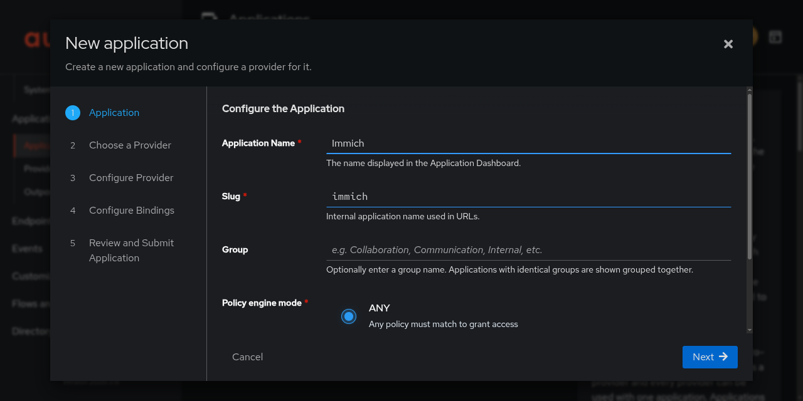
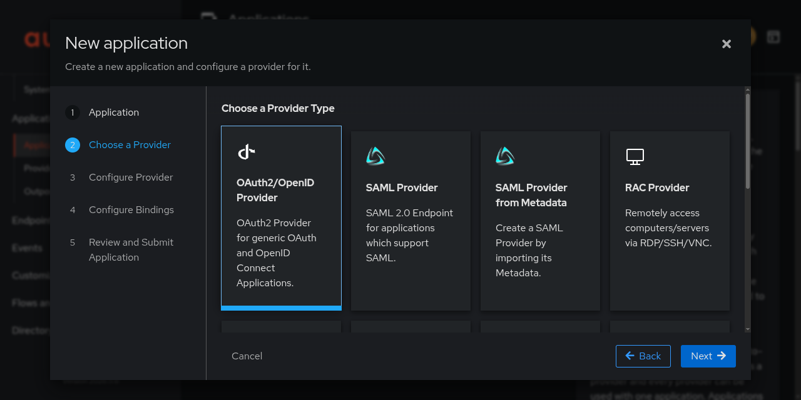
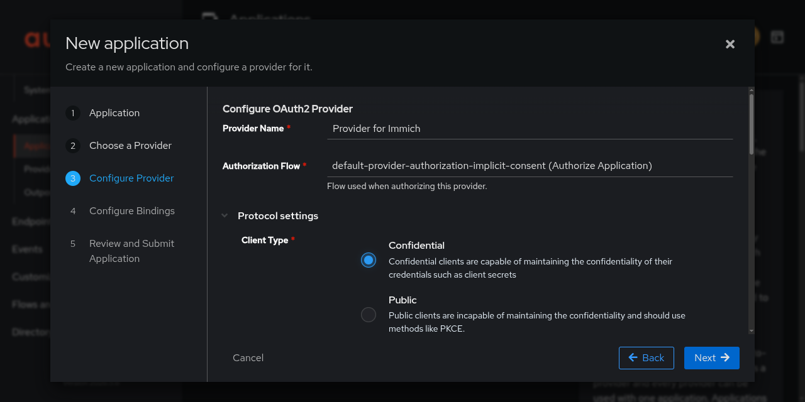
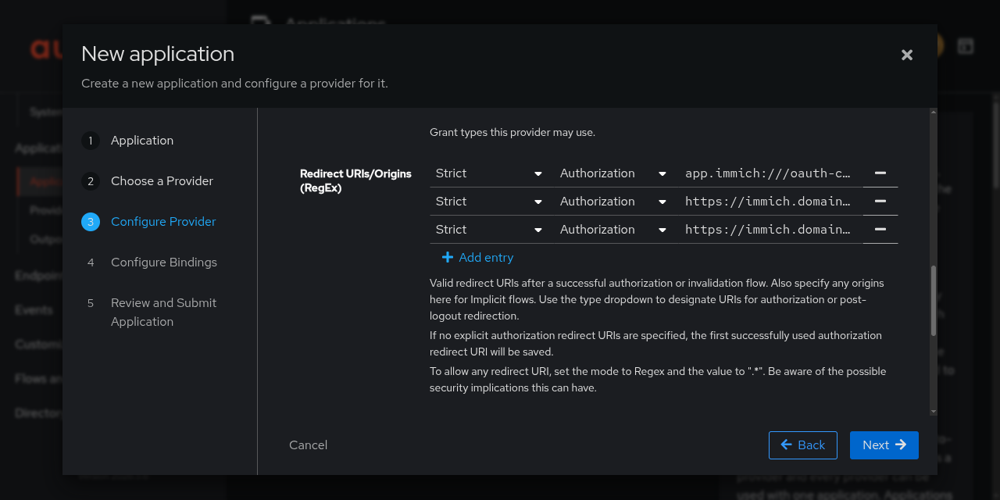
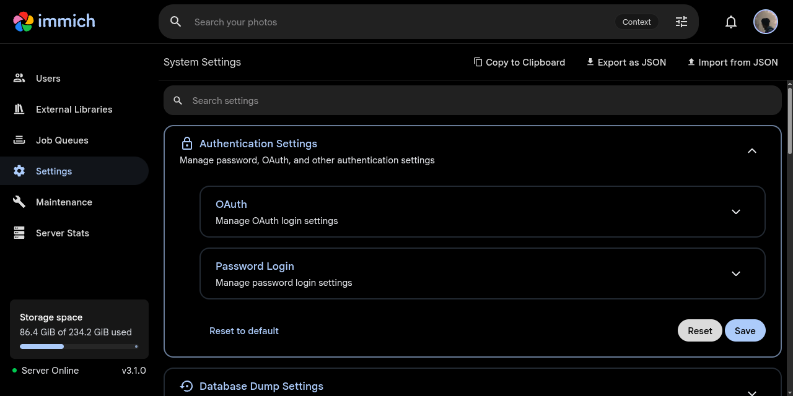
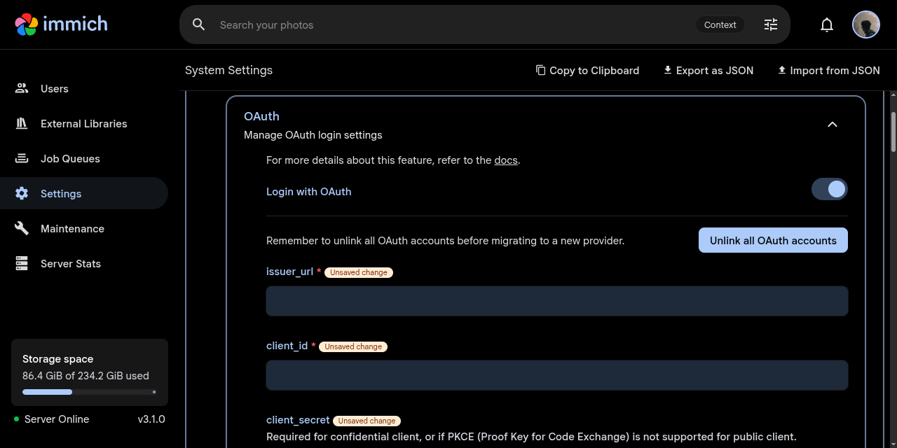
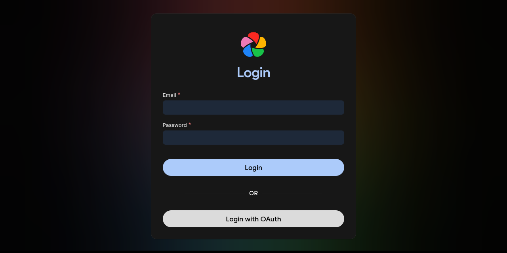

## Pendahuluan

Immich adalah solusi manajemen foto dan video self-hosted yang powerful, sering disebut sebagai alternatif open-source untuk Google Photos. Authentik adalah penyedia identitas (Identity Provider/IdP) yang fleksibel, mendukung berbagai protokol otentikasi termasuk OAuth2 dan OpenID Connect (OIDC).

Mengintegrasikan Immich dengan Authentik melalui SSO (Single Sign-On) memberikan sejumlah keuntungan strategis:
1. Seluruh pengguna dikelola dari satu tempat (Authentik), menyederhanakan proses pembuatan, penghapusan, dan pengaturan izin akun.
2. Mewarisi kebijakan keamanan dari Authentik, termasuk MFA (Multi-Factor Authentication) jika dikonfigurasi.
3. Pengguna cukup mengingat satu set kredensial untuk mengakses berbagai layanan dalam ekosistem self-hosted.
4. Dengan fitur Auto Register, akun Immich dibuat secara otomatis saat pengguna pertama kali login.

Dokumen ini memandu langkah demi langkah integrasi kedua layanan, dengan penjelasan mengapa setiap langkah diperlukan untuk pemahaman yang mendalam.

## Prasyarat

- Authentik terinstal dan dapat diakses (misal: `https://auth.domainanda.com`)
- Immich terinstal dan dapat diakses (misal: `https://immich.domainanda.com`)
- Kedua layanan menggunakan domain valid (bukan localhost)
- Akses administrator ke kedua platform
- Familiar dengan konsep OAuth2/OIDC, Client ID, dan Client Secret

> Redirect URI memerlukan protokol `https` untuk lingkungan produksi. Domain valid diperlukan untuk fungsi cookie dan keamanan.
{: .prompt-info}

## Bagian 1: Konfigurasi di Authentik

### 1.1 Buat Aplikasi Baru

1. Buka Admin Interface Authentik
2. Navigasi ke Applications → Applications
3. Klik New Application

### 1.2 Isi Detail Aplikasi



| Field              | Nilai    | Mengapa                                               |
| ------------------ | -------- | ----------------------------------------------------- |
| Name               | `Immich` | Nama deskriptif yang tampil di dashboard Authentik    |
| Slug               | `immich` | Pengidentifikasi unik; menjadi bagian dari URL Issuer |
| Policy engine mode | `any`    | Mode default; evaluasi kebijakan yang ada             |

> Slug adalah komponen penting karena menjadi bagian dari endpoint OIDC discovery URL.
{: .prompt-info}

### 1.3 Konfigurasi Provider OAuth2/OIDC



1. Pilih OAuth2/OpenID Provider
2. Klik Next untuk lanjut ke konfigurasi

#### Parameter Provider



| Field              | Nilai                                             | Mengapa                                                                                  |
| ------------------ | ------------------------------------------------- | ---------------------------------------------------------------------------------------- |
| Provider name      | `Provider for Immich`                             | Nama internal provider untuk identifikasi administrasi                                   |
| Authorization flow | `default-provider-authorization-implicit-consent` | Flow standar yang meminta persetujuan pengguna; penting untuk kepatuhan dan transparansi |
| Client type        | `Confidential`                                    | Aplikasi server-side yang menyimpan Client Secret; lebih aman daripada Public            |

> Client ID & Client Secret dibuat otomatis. Catat kedua nilai ini - ini adalah kredensial yang digunakan Immich untuk berkomunikasi dengan Authentik.
{: .prompt-tip}

### 1.4 Redirect URIs



Untuk mendukung login dari web dan mobile, tambahkan ketiga URL berikut (ganti `immich.domainanda.com` dengan domain Immich Anda):

```
app.immich:///oauth-callback
https://immich.domainanda.com/auth/login
https://immich.domainanda.com/user-settings
```

| URL                                           | Tujuan                        | Mengapa                                                                |
| --------------------------------------------- | ----------------------------- | ---------------------------------------------------------------------- |
| `app.immich:///oauth-callback`                | Aplikasi mobile (iOS/Android) | Custom scheme untuk membuka kembali aplikasi Immich setelah otentikasi |
| `https://immich.domainanda.com/auth/login`    | Login web                     | Endpoint utama untuk aliran login SSO                                  |
| `https://immich.domainanda.com/user-settings` | Pengaturan akun               | Digunakan saat menghubungkan akun OAuth dari halaman pengaturan Immich |

> Gunakan tipe `Strict` `Authorization` di Authentik versi 2026.5+ untuk kontrol lebih ketat. Jika versi lebih lama, tambahkan URL tanpa prefix.
{: .prompt-tip}

### 1.5 Submit Konfigurasi

1. Biarkan pengaturan lain (Signing Key, dll.) pada nilai default
2. Klik Submit
3. Catat Client ID dan Client Secret - akan digunakan di konfigurasi Immich

## Bagian 2: Konfigurasi di Immich

### 2.1 Akses Pengaturan OAuth

1. Buka Admin Interface Immich
2. Navigasi ke Administration → Settings
3. Pilih tab OAuth Authentication
    

### 2.2 Parameter OAuth Wajib



Aktifkan OAuth dengan toggle Enabled ke posisi ON, lalu isi:

| Parameter           | Nilai                                                         | Sumber & Penjelasan                                                   |
| ------------------- | ------------------------------------------------------------- | --------------------------------------------------------------------- |
| ****issuer_url** ** | `https://authentik.company/application/o/<application_slug>/` | URL discovery Authentik. Menyediakan metadata OpenID Connect otomatis |
| client_id           | [Client ID]                                                   | Dari provider Authentik; identitas publik untuk Immich                |
| client_secret       | [Client Secret]                                               | Dari provider Authentik; kunci rahasia autentikasi. Jaga kerahasiaan! |
| Scope               | `openid email profile`                                        | Data yang diminta; default ini sudah cukup untuk kebutuhan dasar      |

> Authentik menyediakan endpoint discovery (`/.well-known/openid-configuration`) di URL ini. Immich otomatis mengambil semua endpoint yang diperlukan (authorization, token, userinfo) dari sini.
{: .prompt-info}

### 2.3 Fitur Lanjutan

| Parameter           | Rekomendasi              | Mengapa                                                                               |
| ------------------- | ------------------------ | ------------------------------------------------------------------------------------- |
| Auto Register       | ✅ Aktifkan               | Akun Immich dibuat otomatis saat login pertama; hilangkan administrasi manual         |
| Auto Launch         | ❌ Nonaktifkan            | Memudahkan admin login secara lokal. Akses SSO via `?autoLaunch=1`                    |
| Button Text         | `Login dengan Authentik` | Sesuaikan branding jika diperlukan                                                    |
| Role Claim          | `immich_role`            | Klaim di token OIDC untuk peran (admin/user). Harus return string "admin" atau "user" |
| Storage Quota Claim | `immich_quota`           | Klaim untuk kuota penyimpanan (dalam GiB). Untuk kontrol alokasi per pengguna         |

### 2.4 Simpan Konfigurasi

Klik Save di bagian bawah halaman untuk menyimpan semua pengaturan.

## Verifikasi dan Pengujian

### Langkah Uji:

1. Keluar dari akun administrator Immich
2. Buka halaman login: `https://immich.domainanda.com/auth/login`
3. Klik tombol "Login dengan OAuth"
    

4. Anda diarahkan ke halaman login Authentik
5. Masukkan kredensial pengguna Authentik
6. Setelah berhasil, Anda kembali ke Immich

### Hasil yang Diharapkan:

- Auto Register aktif → akun Immich dibuat otomatis
- Auto Launch aktif → langsung dialihkan ke Authentik (akses via `?autoLaunch=0` untuk kembali ke halaman login Immich)
- Role & quota claims dihormati (jika dikonfigurasi)

## Kesimpulan

Integrasi Immich dengan Authentik selesai. Dengan konfigurasi ini, Anda mendapatkan:

- Seluruh pengguna dari Authentik dapat mengakses Immich
- Auto Register menghilangkan administrasi akun manual
- Mewarisi kebijakan keamanan Authentik (MFA, password policy)
- Tambah layanan lain dengan SSO yang sama

Konfigurasi ini memberikan fondasi kuat untuk ekosistem self-hosted, menggabungkan kemudahan pengelolaan media Immich dengan keamanan dan fleksibilitas Authentik sebagai pusat identitas.