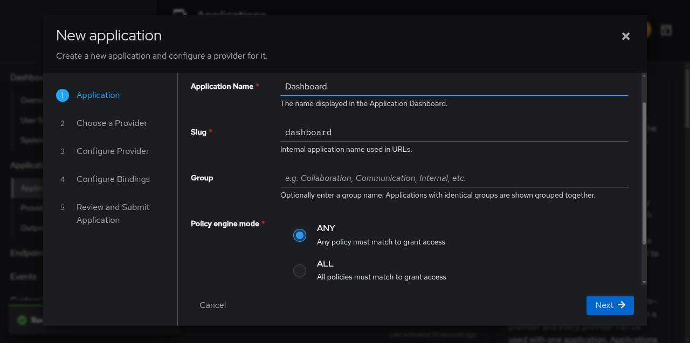
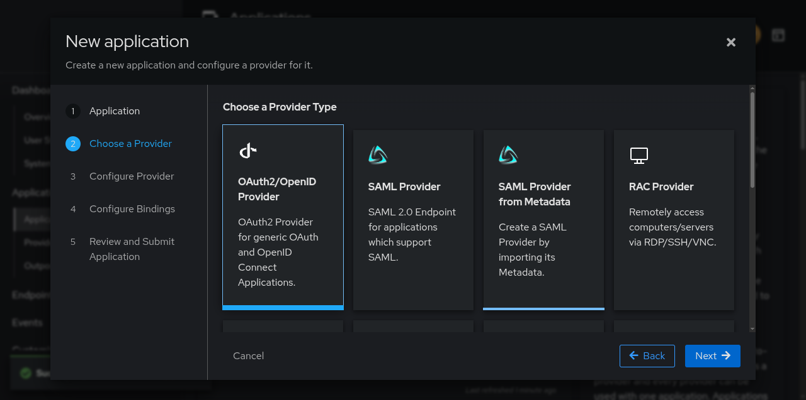
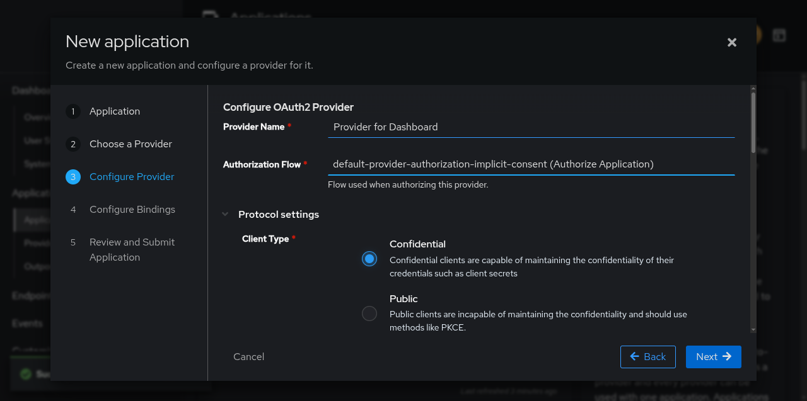
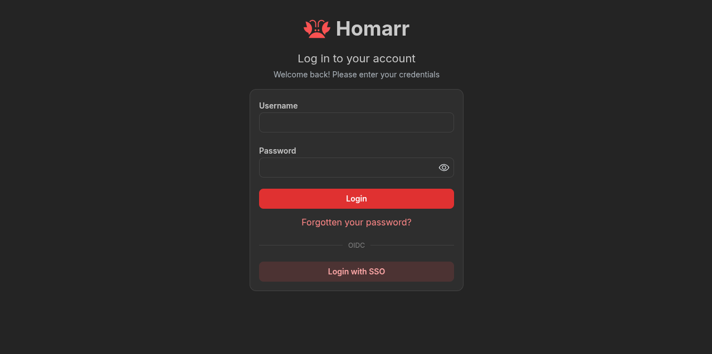

## Pendahuluan

Dalam arsitektur microservices modern, pengelolaan identitas dan akses menjadi tantangan kritis. Homarr, sebagai dashboard yang mengagregasi berbagai layanan, membutuhkan mekanisme autentikasi yang aman dan terpusat. Authentik hadir sebagai Identity Provider (IdP) open-source yang mendukung berbagai protokol autentikasi termasuk OpenID Connect (OIDC).

## Prasyarat
- Authentik terinstal dan berjalan
- Homarr terinstal dan berjalan
- Akses administrator ke kedua platform

## 1. Konfigurasi Provider di Authentik

### 1.1 Membuat Aplikasi

Tujuan: Mendaftarkan Homarr sebagai aplikasi yang terintegrasi dengan Authentik.

1. Login sebagai administrator ke Authentik Admin Interface
2. Navigasi ke Applications > Applications
3. Klik New Application
   

   Parameter Konfigurasi:

   | Field              | Nilai            | Keterangan                             |
   | ------------------ | ---------------- | -------------------------------------- |
   | Name               | `Dashboard`      | Nama deskriptif untuk identifikasi     |
   | Slug               | `dashboard`      | Opsional, untuk pengelompokan aplikasi |
   | Policy Engine Mode | `ANY`            | Modes: ANY/ALL untuk kontrol akses     |
   | UI Settings        | Sesuai kebutuhan | Pengaturan tampilan di dashboard       |

### 1.2 Konfigurasi Provider OIDC

Tujuan: Membuat dan mengkonfigurasi provider OIDC dengan parameter keamanan yang tepat.

1. Pilih tipe provider: OAuth2/OpenID Connect
   

3. Isi konfigurasi:
   

   | Parameter          | Nilai                                                                     | Keterangan                           |
   | ------------------ | ------------------------------------------------------------------------- | ------------------------------------ |
   | Name               | `Provider for Dashboard`                                                  | Nama provider                        |
   | Authorization Flow | `default-provider-authorization-implicit-consent (Authorize Application)` | Flow autentikasi yang akan digunakan |
   | Client Type        | `Confidential`                                                            | Untuk aplikasi server-side           |
   | Redirect URI       | `https://dashboard.domain.com/api/auth/callback/oidc`                     | Strict Authorization type            |

   Parameter Tambahan:

   ```
   Client ID: [akan digenerate otomatis]
   Client Secret: [akan digenerate otomatis]
   Signing Key: Pilih key yang tersedia
   ```

   > Simpan nilai Client ID dan Client Secret untuk konfigurasi Homarr.
   {: .prompt-tip}

## 2. Konfigurasi Homarr

Tujuan: Mengaktifkan dan mengkonfigurasi autentikasi OIDC di Homarr.

### 2.1 Environment Variables

Tambahkan variabel berikut ke file `.env` Homarr:

```
AUTH_PROVIDERS=oidc
AUTH_OIDC_CLIENT_ID=<Client ID dari Authentik>
AUTH_OIDC_CLIENT_SECRET=<Client Secret dari Authentik>
AUTH_OIDC_ISSUER=https://authentik.domain.com/application/o/dashboard/
AUTH_OIDC_CLIENT_NAME=SSO
AUTH_OIDC_GROUPS_LOCAL_MANAGEMENT=true
```

### 2.2 Opsi Lanjutan

| Variabel                                     | Nilai              | Fungsi                                                     |
| -------------------------------------------- | ------------------ | ---------------------------------------------------------- |
| `AUTH_PROVIDERS`                             | `oidc,credentials` | Menjaga akses login lokal tetap tersedia                   |
| `AUTH_OIDC_AUTO_LOGIN`                       | `true`             | Skip halaman login, redirect langsung ke Authentik         |
| `AUTH_OIDC_ENABLE_DANGEROUS_ACCOUNT_LINKING` | `true`             | Link akun existing berdasarkan email (hanya untuk migrasi) |

### 2.3 Restart Service
```bash
docker compose restart homarr
# atau
systemctl restart homarr
```

## 3. Verifikasi Konfigurasi

Tujuan: Memastikan integrasi berfungsi dengan benar.

### 3.1 Proses Verifikasi

1. Akses Homarr melalui browser
   
   

3. Login menggunakan Authentik
4. Harus terjadi redirect ke Authentik untuk autentikasi
5. Setelah berhasil, redirect kembali ke Homarr

### 3.2 Troubleshooting

Flow Autentikasi:
```
User → Homarr → Authentik (login) → Homarr (dashboard)
```

Penyebab Umum Kegagalan:
- Redirect URI tidak sesuai
- Client ID/Secret tidak cocok
- URL Issuer salah format
- Signing key tidak valid
- Firewall/Network blocking komunikasi

## 4. Referensi Teknis

### Endpoint yang Digunakan
```
/.well-known/openid-configuration
/application/o/<slug>/
/oauth2/authorize/
/oauth2/token/
/oauth2/userinfo/
```

### Scope yang Diperlukan
- `openid`: Standar OIDC
- `profile`: Untuk mendapatkan informasi profil
- `email`: Untuk mendapatkan alamat email

## Kesimpulan

Integrasi Homarr dengan Authentik menggunakan OIDC menyediakan:
- Sentralisasi autentikasi
- Manajemen pengguna terpusat
- Single Sign-On (SSO) untuk akses dashboard
- Grup synchronization untuk permission management
- Keamanan meningkat dengan token-based authentication