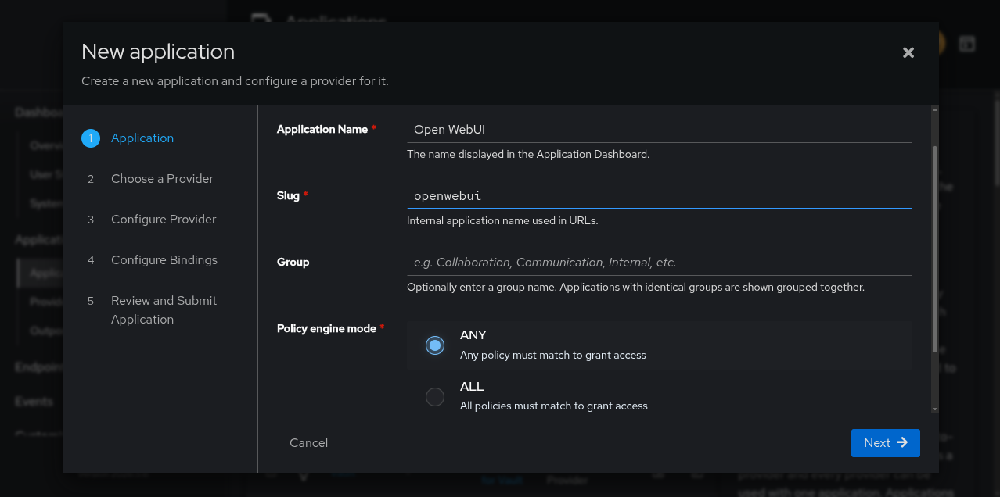
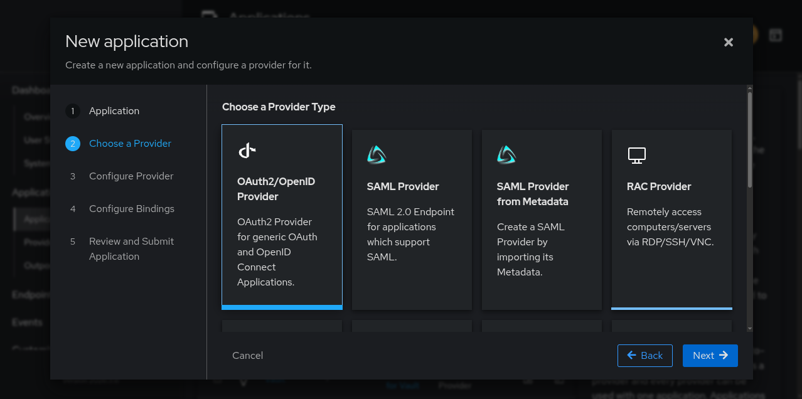
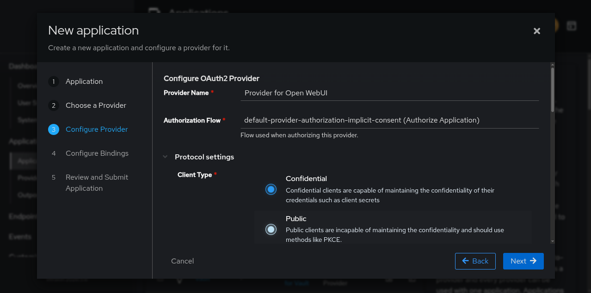
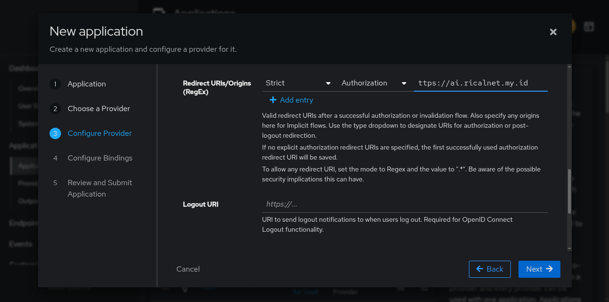
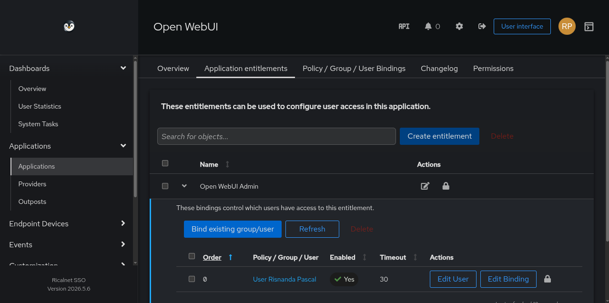
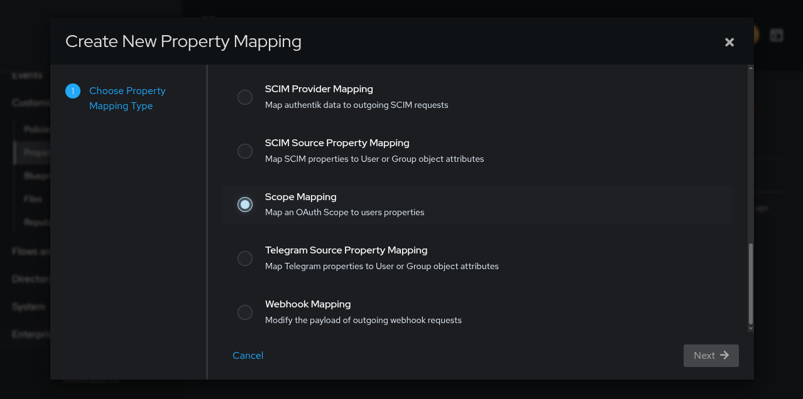
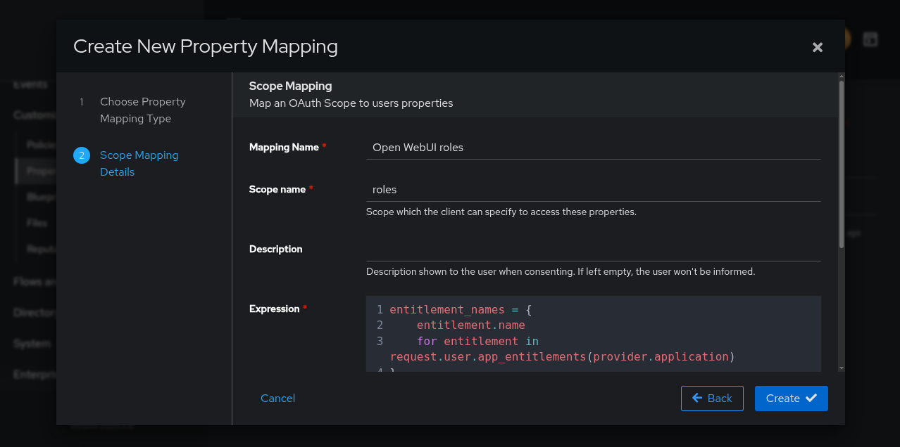
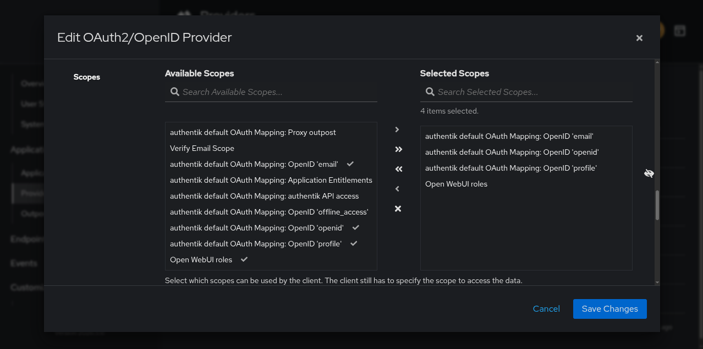
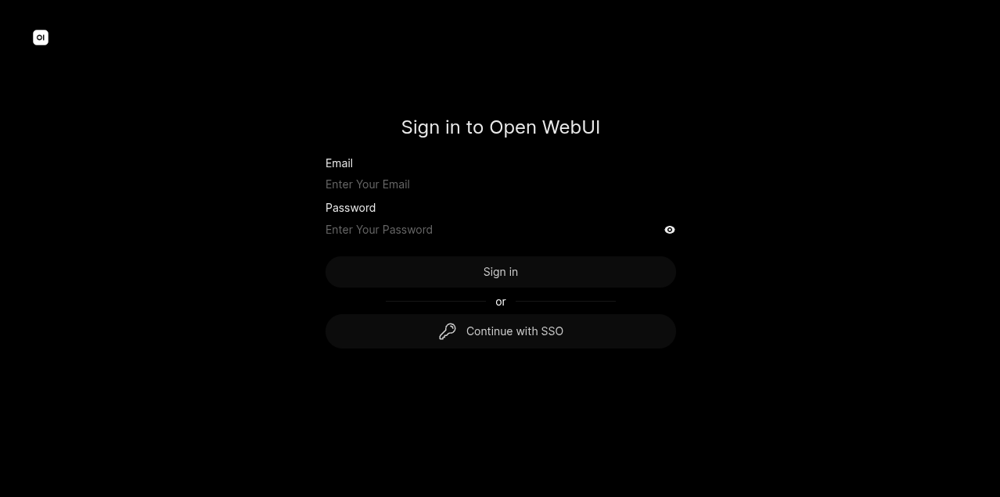

## Pendahuluan

Open WebUI adalah platform AI self-hosted yang beroperasi secara offline. Mendukung berbagai backend seperti Ollama dan API bergaya OpenAI, dilengkapi dengan mesin RAG (Retrieval-Augmented Generation) terintegrasi.

### Prasyarat
- Domain FQDN untuk Open WebUI: `openwebui.domain.com`
- Domain FQDN untuk authentik: `authentik.domain.com`
- Akses administrator ke kedua platform

## 1. Konfigurasi authentik

### 1.1 Membuat Aplikasi dan Provider

1. Login sebagai administrator ke authentik Admin Interface
2. Navigasi ke Applications > Applications → klik New Application

#### Konfigurasi Application:
- Name: `Open WebUI` (deskriptif)
- Slug: Catat nilai ini (contoh: `openwebui`)
- Group: Opsional
- Policy Engine Mode: Sesuai kebutuhan
  

#### Konfigurasi Provider (OAuth2/OpenID Connect):





- Name: `Provider for Open WebUI`
- Authorization Flow: `default-provider-authorization-implicit-consent (Authorize Application)`
- Client ID & Client Secret: Catat untuk konfigurasi Open WebUI
- Redirect URI: 
  - Tipe: `Strict` `Authorization`
  - URL: `https://openwebui.domain.com/oauth/oidc/callback`
    

- Signing Key: Pilih key yang tersedia
- Encryption Key: Biarkan kosong

#### Bindings (Opsional):
Tambahkan policy/group/user untuk manajemen akses dashboard aplikasi.

### 1.2 Konfigurasi Role

Open WebUI dapat menetapkan role `user` dan `admin` dari klaim OAuth.

#### Buat Entitlements:
1. Navigasi ke Applications > Applications → buka aplikasi Open WebUI
2. Klik tab Application entitlements
3. Buat entitlements:
   - `Open WebUI Users`
   - `Open WebUI Admins`
4. Bind users/groups ke masing-masing entitlement
   

#### Buat Scope Mapping:
1. Navigasi ke Customization > Property Mappings → klik Create
   

3. Pilih Scope Mapping dengan konfigurasi:
   

    | Field      | Value              |
    | ---------- | ------------------ |
    | Name       | `Open WebUI roles` |
    | Scope name | `roles`            |
    | Expression | (lihat di bawah)   |

    Expression:
    ```python
    entitlement_names = {
        entitlement.name
        for entitlement in request.user.app_entitlements(provider.application)
    }
    roles = []

    if "Open WebUI Users" in entitlement_names:
        roles.append("user")

    if "Open WebUI Admins" in entitlement_names:
        roles.append("admin")

    return {
        "roles": roles,
    }
    ```

3. Klik Finish

#### Tambahkan ke Provider:
1. Navigasi ke Applications > Providers → edit provider Open WebUI
2. Pada Advanced protocol settings > Selected Scopes, tambahkan `Open WebUI roles`
   

4. Klik Save Changes

## 2. Konfigurasi Open WebUI

### 2.1 Environment Variables

Tambahkan variabel berikut ke deployment Open WebUI:

#### Konfigurasi Dasar OAuth:
```
OAUTH_CLIENT_ID="<Client ID from authentik>"
OAUTH_CLIENT_SECRET="<Client Secret from authentik>"
OAUTH_PROVIDER_NAME="authentik"
OPENID_PROVIDER_URL="https://authentik.domain.com/application/o/<application_slug>/.well-known/openid-configuration"
OPENID_REDIRECT_URI="https://openwebui.domain.com/oauth/oidc/callback"
WEBUI_URL="https://openwebui.domain.com"
ENABLE_OAUTH_SIGNUP="true"
ENABLE_LOGIN_FORM="false"
ENABLE_PASSWORD_AUTH="false"
OAUTH_MERGE_ACCOUNTS_BY_EMAIL="true"
```

Keterangan:
- `<application_slug>`: Ganti dengan slug aplikasi dari authentik
- `ENABLE_LOGIN_FORM="false"`: Menonaktifkan login form default
- `ENABLE_PASSWORD_AUTH="false"`: Hanya mengizinkan SSO

#### Untuk Role Management:
```bash
OAUTH_SCOPES="openid email profile roles"
ENABLE_OAUTH_ROLE_MANAGEMENT="true"
```

### 2.2 Restart Service

Setelah menambahkan variabel, restart Open WebUI untuk menerapkan perubahan:

```bash
docker compose restart openwebui
# atau sesuai metode deployment yang digunakan
```

### 2.3 Fix Redirect Issue di Admin Panel

Jika setelah restart Open WebUI masih gagal redirect (misalnya redirect ke URL yang salah), perbaiki melalui admin panel:

1. Login ke Open WebUI sebagai admin
2. Buka Admin Panel (ikon gear/settings di sidebar)
3. Navigasi ke Settings > General
4. Cari opsi WebUI URL
5. Ubah nilai menjadi URL publik yang benar, contoh:
   ```
   https://openwebui.domain.com
   ```
6. Klik Save untuk menyimpan perubahan

> Pengaturan ini akan memperbaiki semua link redirect, termasuk setelah login, verifikasi email, dan pembuatan API key. Pastikan URL yang dimasukkan sesuai dengan domain yang digunakan untuk mengakses Open WebUI.
{: .prompt-info}

## 3. Verifikasi Konfigurasi

### 3.1 Test Login SSO
1. Buka Open WebUI di `https://openwebui.domain.com`
2. Pastikan logout dari session sebelumnya
   

3. Klik Continue with SSO
4. Login dengan kredensial authentik
5. Verifikasi redirect kembali ke Open WebUI

### 3.2 Verifikasi Role (Jika Dikonfigurasi)
1. Assign test user ke entitlement `Open WebUI Users` atau `Open WebUI Admins` di authentik
2. Login sebagai user tersebut
3. Login sebagai administrator Open WebUI
4. Klik foto profil → Admin Panel → buka halaman Users
5. Verifikasi role yang sesuai

## Troubleshooting Umum

| Masalah                 | Solusi                                                                    |
| ----------------------- | ------------------------------------------------------------------------- |
| Redirect URI mismatch   | Pastikan URL di authentik sama persis dengan `OPENID_REDIRECT_URI`        |
| Role tidak muncul       | Verifikasi Scope Mapping telah ditambahkan ke Selected Scopes             |
| Login form masih muncul | Set `ENABLE_LOGIN_FORM="false"` dan `ENABLE_PASSWORD_AUTH="false"`        |
| Error OIDC discovery    | Pastikan `OPENID_PROVIDER_URL` dapat diakses dan `application_slug` benar |