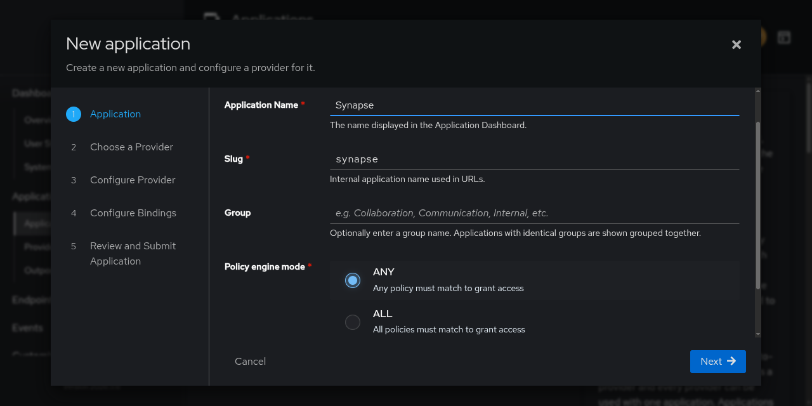
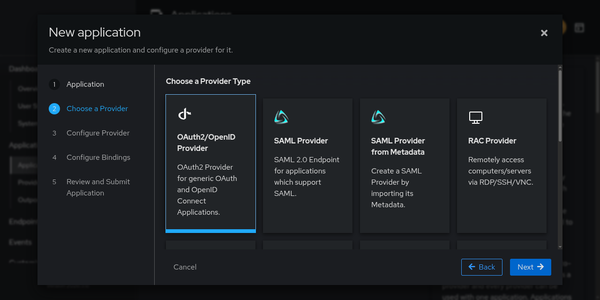
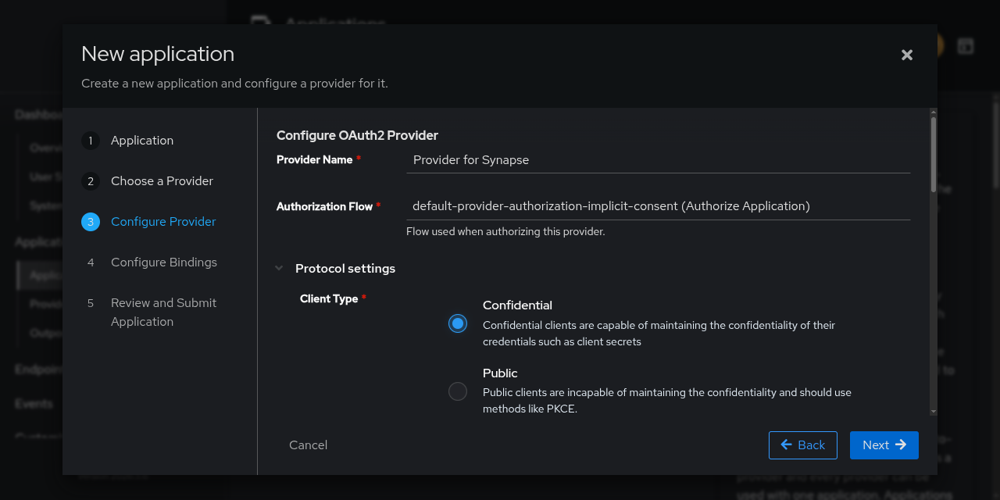
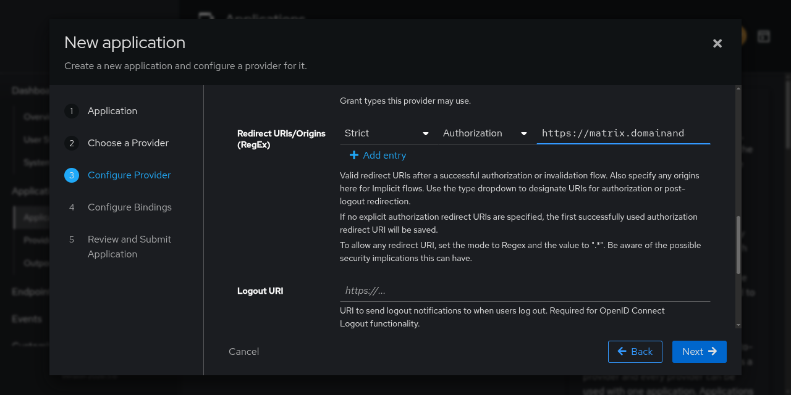
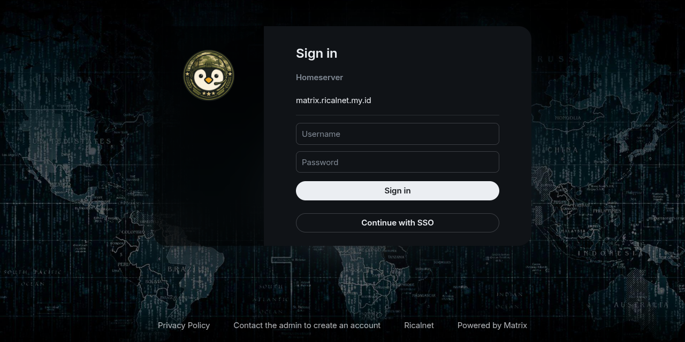

## Pendahuluan

Pengelolaan identitas dan akses merupakan pilar utama keamanan infrastruktur TI. Integrasi Matrix Synapse sebagai server komunikasi terdesentralisasi dengan Authentik sebagai Identity Provider (IdP) open-source menciptakan sistem komunikasi aman dengan kemampuan Single Sign-On (SSO) yang terpusat.

Mengimplementasikan autentikasi terpusat menggunakan protokol OpenID Connect (OIDC) untuk menghilangkan ketergantungan pada penyimpanan kredensial terpisah di setiap aplikasi.

## Arsitektur dan Konsep Dasar

### OpenID Connect (OIDC)
Lapisan identitas yang dibangun di atas OAuth 2.0 yang menyediakan mekanisme autentikasi terstandarisasi.

Keuntungan Implementasi:
- Password dikelola oleh Authentik dengan MFA, password policies, dan deteksi anomali
- Satu login untuk seluruh ekosistem (Element, Grafana, dll.)
- Pengguna, hak akses, dan kebijakan keamanan dari satu titik kendali
- Setiap permintaan akses diautentikasi secara independen

### Alur Kerja Integrasi
```
Pengguna (Element) → Authentik Login → Kode Otorisasi → Synapse 
→ Validasi Token → Akun Matrix → Akses Layanan
```

1. Pengguna memilih login SSO di klien Matrix (Element)
2. Authentik mengautentikasi pengguna (termasuk MFA jika dikonfigurasi)
3. Authentik mengembalikan kode otorisasi ke Synapse
4. Synapse menukar kode dengan token ID dan access token
5. Synapse membuat/memperbarui akun pengguna di Matrix
6. Pengguna berhasil login dan mengakses layanan

## Prasyarat

| Komponen       | Persyaratan                                    |
| -------------- | ---------------------------------------------- |
| Matrix Synapse | Server berjalan (latest version)               |
| Authentik      | Server terinstal dan berjalan (latest version) |
| Domain         | Terkonfigurasi untuk kedua layanan             |
| SSL/TLS        | Sertifikat valid untuk koneksi HTTPS           |
| Akses          | Administrator ke kedua sistem                  |

## Konfigurasi di Authentik

### 1. Membuat Aplikasi

Navigasi: Admin Interface → Applications → New Application



Isi Formulir:
- Name: `Synapse` (deskriptif untuk identifikasi)
- Slug: `synapse` (identifier unik untuk URL)
- Policy engine mode: `any` (fleksibilitas penerapan kebijakan)

> `any` memungkinkan akses jika salah satu kebijakan terpenuhi, memberikan fleksibilitas untuk skenario dengan multiple authentication methods.
{: .prompt-info}

### 2. Memilih Provider

Navigasi: New Application → Configure Provider → OAuth2/OpenID Provider



### 3. Konfigurasi Provider





Parameter Konfigurasi:

| Field              | Nilai                                                                   | Keterangan                                                                  |
| ------------------ | ----------------------------------------------------------------------- | --------------------------------------------------------------------------- |
| Name               | `Provider for Synapse`                                                  | Nama internal provider                                                      |
| Authorization Flow | `default-provider-authorization-implicit-consent`                       | Flow dengan persetujuan pengguna sebelum akses                              |
| Client Type        | `Confidential`                                                          | Synapse sebagai aplikasi server-side yang menjaga kerahasiaan client secret |
| Client ID          | Auto-generated                                                          | Identifier publik untuk Synapse                                             |
| Client Secret      | Auto-generated                                                          | Simpan dengan aman untuk autentikasi antara Synapse dan Authentik           |
| Redirect URIs      | `https://matrix.domainanda.com/_synapse/client/oidc/callback`           | URL penerima kode otorisasi setelah login                                   |
| Logout URI         | `https://matrix.domainanda.com/_synapse/client/oidc/backchannel_logout` | Endpoint logout back-channel dari Authentik ke Synapse                      |
| Logout Method      | `Back-channel`                                                          | Komunikasi langsung antara server OIDC dan aplikasi                         |

> Authentik hanya mengirimkan kode otorisasi ke URL terdaftar, mencegah serangan redirect injection dan melindungi kredensial.
{: .prompt-warning}

### 4. Scopes dan Claims

Scopes Minimal:
- `openid`: Scope dasar OIDC
- `profile`: Akses informasi profil pengguna
- `email`: Akses alamat email pengguna
  > Synapse menggunakan email sebagai identifier unik pengguna, memungkinkan konsistensi akun di seluruh layanan.
  {: .prompt-info}

## Konfigurasi di Synapse (`homeserver.yaml`)

### Struktur Konfigurasi OIDC

Tambahkan/modifikasi bagian `oidc_providers` dalam `homeserver.yaml`:

```yaml
oidc_providers:
    - idp_id: authentik
      idp_name: authentik
      discover: true
      backchannel_logout_enabled: true
      issuer: "https://auth.domain.com/application/o/<application_slug>/"
      client_id: "<Client ID from authentik>"
      client_secret: "<Client Secret from authentik>"
      scopes:
          - "openid"
          - "profile"
          - "email"
      user_mapping_provider:
          config:
              localpart_template: "{{ user.preferred_username }}"
              display_name_template: "{{ user.preferred_username|capitalize }}"

jwt_config:
    enabled: true
    secret: "<Client Secret from authentik>"
    algorithm: "RS256"
```

Parameter Penting:
- `discover: true` - Auto-detect OIDC endpoints menggunakan `.well-known/openid-configuration`
- `backchannel_logout_enabled: true` - Mendukung logout terpusat dari Authentik
- `user_mapping_provider` - Memetakan atribut Authentik ke akun Matrix

> Anda dapat menggunakan kombinasi atribut atau transformasi data sesuai kebutuhan
{: .prompt-tip}

### Konfigurasi Tambahan yang Direkomendasikan

```yaml
# Aktifkan registrasi melalui SSO
enable_registration: true
registration_requires_token: false

# Setel ulang session setelah logout
session_lifetime: 24h

# URL untuk custom logout redirect (opsional)
logout_redirect_uri: "https://authentik.anda.com/application/o/synapse/end-session/"
```

Parameter dan Fungsinya:
- `enable_registration: true` - Memungkinkan pengguna baru mendaftar via SSO
- `session_lifetime: 24h` - Membatasi durasi session untuk keamanan
- `logout_redirect_uri` - Mengarahkan pengguna setelah logout dari Synapse

## Verifikasi dan Testing

### Uji Coba Login

1. Buka Element atau klien Matrix lainnya
2. Pilih "Login dengan SSO" (atau sesuai `idp_name`)
   

3. Autentikasi di halaman login Authentik
4. Verifikasi redirect kembali ke klien Matrix
5. Cek akun yang berhasil dibuat/diupdate di Synapse

### Troubleshooting Umum

| Masalah                  | Penyebab              | Solusi                                          |
| ------------------------ | --------------------- | ----------------------------------------------- |
| "Invalid redirect_uri"   | Redirect URI mismatch | Verifikasi URL di Authentik dan homeserver.yaml |
| "Unauthorized"           | Client secret salah   | Cek client_secret di kedua konfigurasi          |
| "User not found"         | Email mapping error   | Periksa user_mapping_provider config            |
| Backchannel logout gagal | URL endpoint salah    | Verifikasi Logout URI di Authentik              |

## Kesimpulan

Integrasi Synapse dengan Authentik melalui OIDC memberikan solusi autentikasi yang aman, terpusat, dan user-friendly untuk ekosistem komunikasi digital yang independen.

### Manfaat yang Diperoleh:
1. Autentikasi Terpusat dengan fitur keamanan canggih (MFA, password policies)  
2. Single Sign-On untuk seluruh layanan dalam ekosistem  
3. Kemudahan Manajemen menambah/menghapus layanan  
4. Audit Log Terpusat untuk kepatuhan regulasi  
5. Zero Trust Architecture setiap akses diautentikasi independen  

Dengan implementasi ini, Anda tidak hanya mengintegrasikan dua sistem tetapi membangun fondasi Identity and Access Management (IAM) yang scalable dan siap menghadapi tantangan keamanan masa depan.