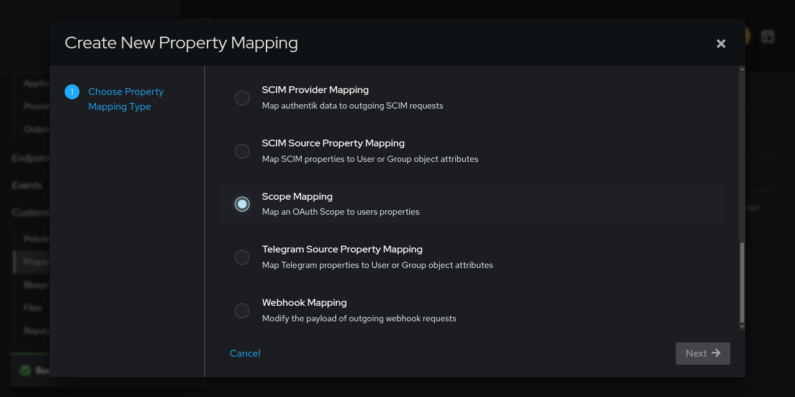
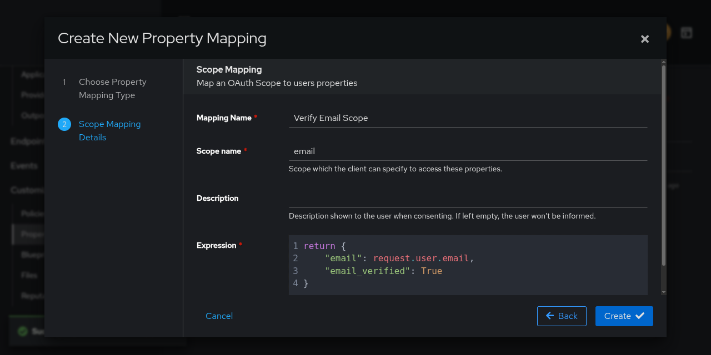
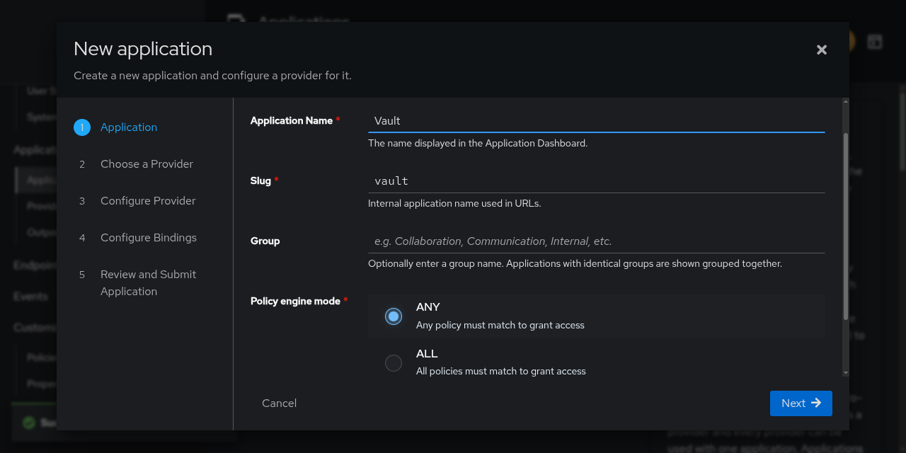
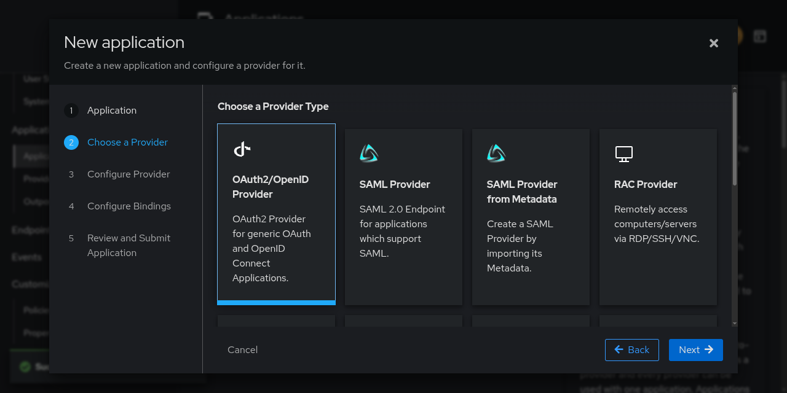
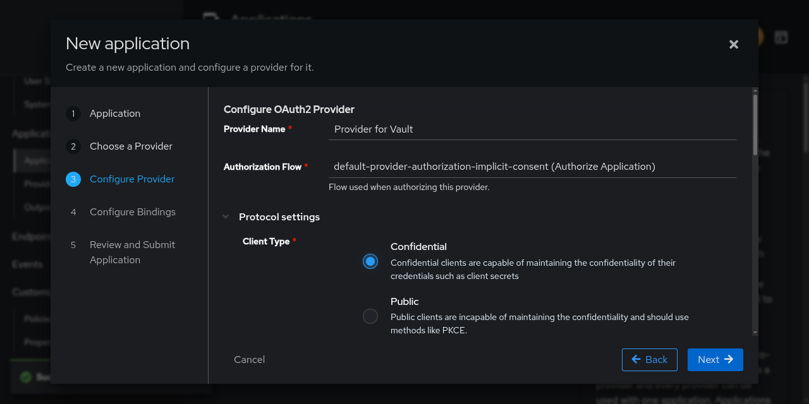
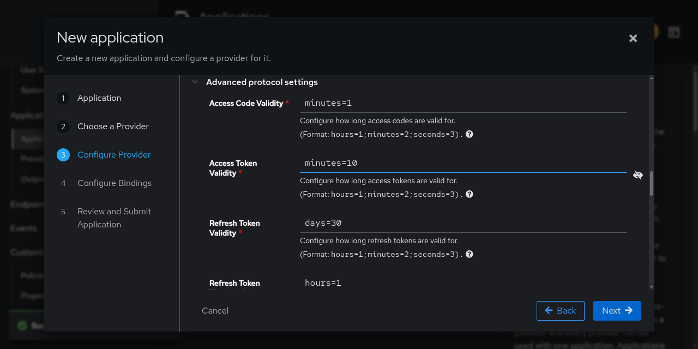
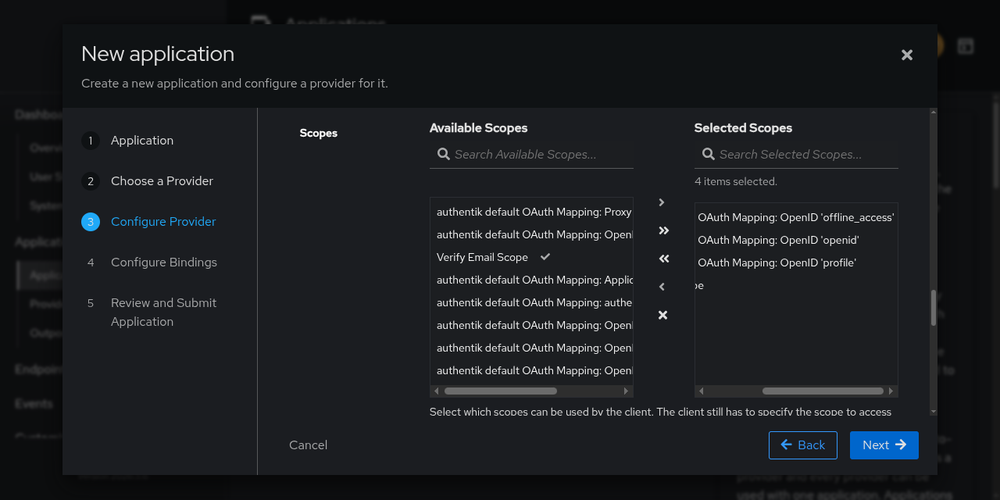
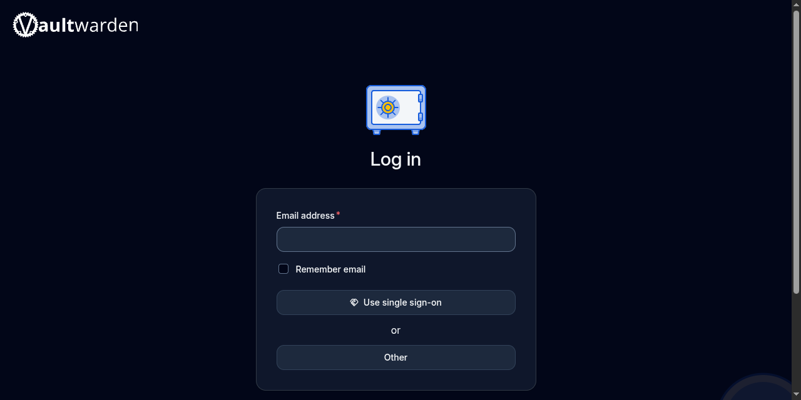

## Pendahuluan

Pengelolaan identitas dan akses menjadi fondasi penting dalam infrastruktur TI modern. Vaultwarden, sebagai alternatif open-source dari Bitwarden, menawarkan solusi password manager yang dapat di-self-host dengan fleksibilitas tinggi. Sementara itu, Authentik hadir sebagai Identity Provider (IdP) yang powerful untuk mengelola otentikasi terpusat.

Mengintegrasikan keduanya melalui protokol OpenID Connect (OIDC) memberikan keuntungan signifikan:
1. Pengguna hanya perlu satu akun untuk mengakses berbagai layanan
2. Menerapkan kebijakan keamanan terpusat seperti MFA (Multi-Factor Authentication)
3. Proses login yang seamless tanpa harus mengingat banyak kredensial
4. Semua aktivitas login tercatat di satu tempat

OIDC merupakan standar industri yang didukung luas, menyediakan lapisan identitas di atas OAuth 2.0, dan memungkinkan transfer atribut user secara terstruktur melalui ID Token (JWT).

## Prasyarat

Sebelum memulai, pastikan Anda telah memenuhi persyaratan berikut:
- Authentik terinstal dan berjalan dengan akses admin
- Vaultwarden terinstal dan berjalan dengan akses ke file konfigurasi (`.env`)
- Domain/subdomain yang sudah terkonfigurasi untuk kedua layanan (contoh: `authentik.domain.com` dan `vault.domain.com`)
- Sertifikat SSL/TLS yang valid untuk kedua domain (gunakan Let's Encrypt jika diperlukan)
- Akses administratif ke kedua sistem

## Bagian 1: Membuat Custom Scope Mapping di Authentik

Scope mapping adalah komponen krusial dalam implementasi OIDC yang sering diabaikan. Scope berfungsi sebagai "keranjang" informasi yang akan dikirim dari Authentik (sebagai IdP) ke Vaultwarden (sebagai Service Provider).

Analisis Kebutuhan:
- Scope default `email` yang disediakan Authentik hanya mengirim atribut email tanpa status verifikasi
- Vaultwarden memerlukan verifikasi email eksplisit untuk proses provisioning akun baru
- Custom scope memungkinkan kontrol presisi atas data yang ditransmisikan
- Tanpa `email_verified: True`, Vaultwarden akan menolak pembuatan akun baru melalui SSO

### Langkah Implementasi:

1. Buka dashboard admin Authentik
2. Navigasi ke Customization > Property Mappings
3. Klik "Create" dan pilih "Scope Mapping"
   

4. Isi form dengan detail berikut:
   

   | Field      | Value                 | Penjelasan Teknis                                                                                    |
   | ---------- | --------------------- | ---------------------------------------------------------------------------------------------------- |
   | Name       | `Verify Email Scope`  | Nama internal untuk identifikasi mapping ini dalam sistem Authentik                                  |
   | Scope Name | `email`               | Harus sesuai dengan standar OIDC (`email` scope); Vaultwarden akan request scope ini secara otomatis |
   | Expression | (lihat kode di bawah) | Script Python yang dieksekusi saat token dibuat; mengakses `request.user` object                     |

### Kode Expression:

```python
return {
    "email": request.user.email,
    "email_verified": True
}
```

Penjelasan Kode:
- `request.user.email` - Mengambil properti email dari objek user yang terautentikasi di Authentik
- `email_verified: True` - Flag boolean yang memberi sinyal eksplisit ke Vaultwarden bahwa email telah diverifikasi
- Vaultwarden menggunakan flag ini untuk menentukan kebijakan pembuatan akun (auto-provision vs require admin approval)

## Bagian 2: Membuat Aplikasi di Authentik

Di Authentik, "Aplikasi" merepresentasikan layanan yang akan menggunakan Authentik sebagai penyedia identitas. Dengan membuat aplikasi, kita mendefinisikan:
- Identitas unik untuk Vaultwarden dalam ekosistem Authentik
- Kebijakan akses yang akan diterapkan (dalam kasus ini menggunakan mode "any")
- Provider yang akan menangani protokol autentikasi

Mode Policy Engine:
- `any`: User yang memenuhi salah satu kebijakan akan diizinkan (memberikan fleksibilitas)
- `all`: User harus memenuhi semua kebijakan (lebih ketat, untuk kasus spesifik)

### Langkah Implementasi:

1. Buka Applications > Applications
2. Pilih "New Application"
3. Isi form:
   

   | Field              | Value                          | Penjelasan                                                                                      |
   | ------------------ | ------------------------------ | ----------------------------------------------------------------------------------------------- |
   | Application name   | `Vault`                        | Nama display untuk identifikasi di UI Authentik                                                 |
   | Slug               | `vault`                        | Digunakan dalam URL endpoint (`/application/o/vault/`); harus unik                              |
   | Policy engine mode | `any`                          | Mode "any" memberikan fleksibilitas maksimal; user dengan akses ke group manapun akan diizinkan |
   | Provider           | Pilih "OAuth2/OpenID Provider" | Kita akan mengkonfigurasi provider di langkah berikutnya                                        |

## Bagian 3: Konfigurasi Provider OAuth2/OpenID

### Arsitektur Provider



Provider adalah inti dari konfigurasi OIDC. Di sinilah kita mendefinisikan:
- Endpoint autentikasi yang akan digunakan Vaultwarden
- Parameter keamanan seperti client ID dan secret
- Scope yang tersedia
- Masa berlaku token

### Konfigurasi Dasar:



| Field              | Value                                                   | Penjelasan                                                                                                         |
| ------------------ | ------------------------------------------------------- | ------------------------------------------------------------------------------------------------------------------ |
| Provider name      | `Provider for Vault`                                    | Nama internal untuk identifikasi provider                                                                          |
| Authorization flow | `default-provider-authorization-implicit-consent`       | Flow ini meminta persetujuan pengguna secara implisit tanpa halaman consent terpisah; memberikan UX lebih seamless |
| Client type        | `confidential`                                          | Client dapat menjaga kerahasiaan client secret (Vaultwarden berjalan di server yang aman)                          |
| Client ID          | (auto-generated)                                        | Public identifier untuk aplikasi ini; tidak perlu dirahasiakan                                                     |
| Client Secret      | (auto-generated)                                        | Kunci rahasia untuk autentikasi server-to-server (backchannel); simpan dengan aman                                 |
| Redirect URL       | `https://vault.domain.com/identity/connect/oidc-signin` | Endpoint callback Vaultwarden yang menerima authorization code; harus sesuai dengan `SSO_AUTHORITY`                |

Catatan Penting:
- Gunakan mode `strict` untuk validasi redirect URI yang tepat
- URL harus persis sama dengan yang dikonfigurasi di Vaultwarden
- Jangan tambahkan trailing slash kecuali diperlukan

### Advanced Protocol Settings:



| Field                  | Value        | Penjelasan                                                                                  |
| ---------------------- | ------------ | ------------------------------------------------------------------------------------------- |
| Access token validity  | `minutes=10` | Token valid selama 10 menit; nilai ini harus cukup untuk menyelesaikan seluruh proses login |
| Refresh token validity | `days=30`    | Refresh token valid 30 hari; memungkinkan sesi panjang tanpa re-autentikasi                 |

Mengapa 10 menit? 
- Proses login meliputi: redirect ke Authentik → login user → consent → redirect ke Vaultwarden → pertukaran code → request userinfo
- Jika terjadi latency jaringan, proses bisa memakan waktu >5 menit
- Token expired akan menyebabkan error "Invalid grant" pada tahap penukaran code

### Konfigurasi Scopes:



Scope yang dipilih menentukan data apa yang akan dikirimkan dari Authentik ke Vaultwarden:

| Scope yang Dipilih                                           | Fungsi                                                                          |
| ------------------------------------------------------------ | ------------------------------------------------------------------------------- |
| ✅ `authentik default OAuth Mapping: OpenID 'offline_access'` | Memungkinkan refresh token tanpa interaksi pengguna; krusial untuk sesi panjang |
| ✅ `authentik default OAuth Mapping: OpenID 'openid'`         | Scope dasar untuk OIDC; selalu diperlukan untuk mengidentifikasi user           |
| ✅ `authentik default OAuth Mapping: OpenID 'profile'`        | Mengirim informasi profil (username, name, preferred_username)                  |
| ✅ `Verify Email Scope` (custom)                              | Mengirim email dengan status verifikasi (`email_verified: True`)                |
| ❌ `authentik default OAuth Mapping: OpenID 'email'`          | **Hapus** - diganti dengan custom scope kita                                    |

Mengapa menghapus scope default email?
- Scope default hanya mengirim atribut `email` tanpa status verifikasi
- Vaultwarden akan menganggap email belum terverifikasi
- Custom scope kita override dengan menambahkan `email_verified: True`
- Ini krusial untuk auto-provisioning akun Vaultwarden

## Bagian 4: Konfigurasi di Vaultwarden

### Environment Variables

Setelah semua konfigurasi selesai di Authentik, langkah selanjutnya adalah mengaktifkan dan mengkonfigurasi SSO di Vaultwarden. Konfigurasi ini dilakukan melalui file environment (`.env`) atau variabel lingkungan.

### Parameter Kunci dan Penjelasannya:

```bash
# Enable SSO (Single Sign-On) - Mengaktifkan modul SSO di Vaultwarden
SSO_ENABLED=true

# The issuer/authority URL from Authentik
SSO_AUTHORITY=https://authentik.domain.com/application/o/vault/
# Format: https://<authentik-domain>/application/o/<application-slug>/
# Vaultwarden akan mengambil konfigurasi OIDC (well-known endpoint) dari URL ini
# Path .well-known/openid-configuration akan diakses secara otomatis

# OAuth2 client credentials - Untuk autentikasi server-to-server
SSO_CLIENT_ID=<Client ID dari Authentik>
SSO_CLIENT_SECRET=<Client Secret dari Authentik>

# Scopes to request during authentication
SSO_SCOPES=email profile offline_access
# 'offline_access' penting untuk mendapatkan refresh token
# 'profile' untuk mendapatkan username dan nama

# Email verification handling
SSO_ALLOW_UNKNOWN_EMAIL_VERIFICATION=false
# false = hanya email yang sudah terverifikasi di Authentik yang diterima
# true = menerima semua email (risiko keamanan)

# Cache settings - Mengoptimalkan performa
SSO_CLIENT_CACHE_EXPIRATION=0
# 0 = cache tidak pernah expired
# Nilai positif = cache expired dalam detik

# SSO-only mode (optional)
SSO_ONLY=false
# true = hanya login via SSO, disable password login
# false = kedua metode login tersedia

# Auto-match existing accounts
SSO_SIGNUPS_MATCH_EMAIL=true
# true = auto-match akun Vaultwarden berdasarkan email
# false = selalu buat akun baru

# Signup policy
SSO_SIGNUPS_ALLOWED=true
# true = user baru bisa daftar via SSO
# false = hanya user yang sudah ada yang bisa login via SSO
```

### Proses Restart dan Verifikasi:

1. Simpan Konfigurasi:
   ```bash
   # Jika menggunakan docker-compose
   docker compose restart vaultwarden
   
   # Jika menggunakan systemd
   systemctl restart vaultwarden
   ```

2. Verifikasi SSO Identifier:
   - Buka halaman admin Vaultwarden
   - Cari bagian "Organization" - ini akan menjadi identifier untuk SSO
   - Pastikan Anda memiliki organization yang aktif

3. Cek Halaman Login:
   - Buka `https://vault.domain.com`
   - Seharusnya muncul tombol "Use Single Sign-On"
   - Ini menandakan konfigurasi SSO aktif
      

## Bagian 5: Proses Login dengan SSO

### Alur Autentikasi Lengkap

Setelah konfigurasi berhasil, berikut adalah alur login yang terjadi secara teknis:

```
1. User mengklik "Use Single Sign-On" di halaman login Vaultwarden
   ↓
2. Vaultwarden mengarahkan user ke Authentik dengan parameter OIDC
   URL: https://authentik.domain.com/application/o/vault/
   Params: client_id, redirect_uri, scope, response_type=code
   ↓
3. User diarahkan ke halaman login Authentik (jika belum login)
   ↓
4. Authentik meminta persetujuan (consent) untuk berbagi data
   ↓
5. Setelah disetujui, Authentik mengirimkan authorization code ke Vaultwarden
   Redirect ke: https://vault.domain.com/identity/connect/oidc-signin
   ↓
6. Vaultwarden menukar code dengan access token melalui backchannel
   POST ke: https://authentik.domain.com/application/o/token/
   ↓
7. Vaultwarden menerima access token dan refresh token
   ↓
8. Vaultwarden meminta userinfo dengan access token
   GET ke: https://authentik.domain.com/application/o/userinfo/
   ↓
9. Vaultwarden menerima data user (email, email_verified, username)
   ↓
10. Vaultwarden mencocokkan email dengan akun yang ada
    (jika SSO_SIGNUPS_MATCH_EMAIL=true)
    ↓
11. Jika akun belum ada dan SSO_SIGNUPS_ALLOWED=true:
    - Akun baru dibuat dengan email dari Authentik
    ↓
12. User berhasil login dan diarahkan ke dashboard Vaultwarden
```

### Flow Diagram:
```
[User] → [Vaultwarden] → [Authentik] → [User Login]
   ↑                           ↑
   |                           |
[Vaultwarden Dashboard] ← [Authentik Consent]
        ↑
        |
[Vaultwarden: Token Exchange & User Info]
```

## Tips Optimasi dan Troubleshooting

### Optimasi Keamanan:

1. Seluruh komunikasi harus melalui HTTPS
2. Gunakan cron job atau scheduler untuk regenerate secret
3. Implementasikan rate limiting di Authentik untuk mencegah brute force
4. Gunakan MFA di Authentik untuk lapisan keamanan tambahan
5. Monitor log secara teratur untuk mendeteksi aktivitas mencurigakan

### Optimasi Performa:

1. Set `SSO_CLIENT_CACHE_EXPIRATION` ke nilai optimal (misal 3600 detik)
2. Gunakan load balancer jika traffic tinggi
3. Optimasi database di Authentik untuk query user yang cepat

### Troubleshooting Umum:

| Masalah                      | Solusi                                                                                                              |
| ---------------------------- | ------------------------------------------------------------------------------------------------------------------- |
| Tombol SSO tidak muncul      | Pastikan `SSO_ENABLED=true` dan Vaultwarden sudah direstart; cek file .env sudah terbaca                            |
| Error "Invalid redirect_uri" | Periksa Redirect URL di Authentik harus persis sama dengan URL callback Vaultwarden; tidak boleh ada trailing slash |
| User tidak ditemukan         | Jika `SSO_SIGNUPS_MATCH_EMAIL=true`, pastikan email di Authentik sama dengan email di Vaultwarden                   |
| Token expired                | Periksa `access token validity` di Authentik, pastikan cukup lama (≥10 menit)                                       |
| Email tidak terverifikasi    | Pastikan custom scope mapping mengirim `email_verified: True`; cek di logs Authentik                                |
| Error "Invalid client"       | Cek Client ID dan Client Secret; pastikan tidak ada spasi atau karakter tersembunyi                                 |
| Redirect loop                | Periksa configuration di Vaultwarden; pastikan `SSO_AUTHORITY` benar                                                |

## Kesimpulan

Integrasi Vaultwarden dengan Authentik melalui OpenID Connect adalah implementasi yang elegan dari arsitektur identitas terpusat. Dengan mengikuti panduan ini, Anda telah membangun:
1. Mudah menambahkan aplikasi lain di masa depan
2. Menggunakan protokol OIDC yang telah teruji
3. Satu sumber kebenaran untuk data user
4. Login sekali, akses banyak layanan

Keuntungan jangka panjang:
- Mengurangi risiko keamanan dengan menghilangkan kebutuhan multiple password
- Memudahkan audit akses dengan logging terpusat
- Memungkinkan implementasi kebijakan keamanan yang konsisten
- Meningkatkan produktivitas dengan mengurangi friction saat login
- Memudahkan offboarding (cukup disable user di Authentik)

Best Practices yang diimplementasikan:
- Scope mapping untuk kontrol data yang ditransfer
- Confidential client untuk keamanan server-to-server
- Proper token validity untuk keseimbangan keamanan dan usability
- Auto-provisioning untuk pengalaman pengguna yang seamless