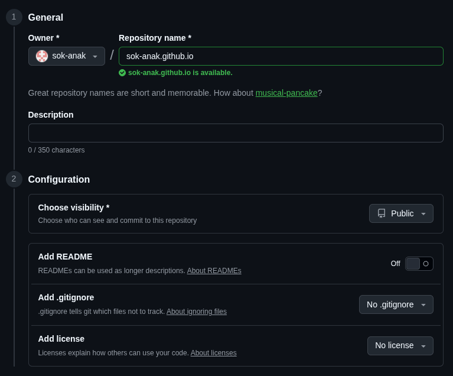
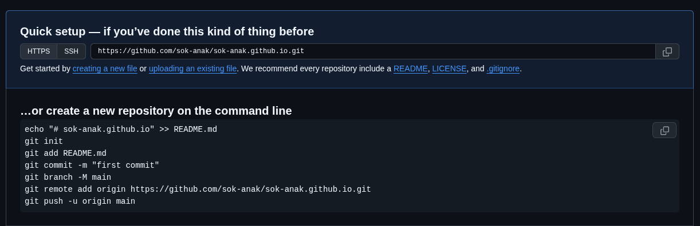
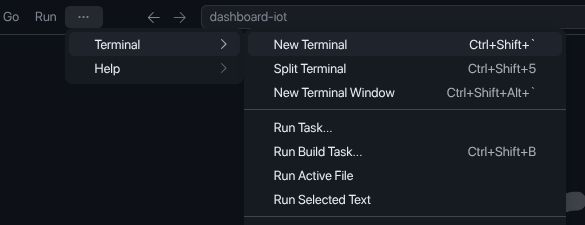
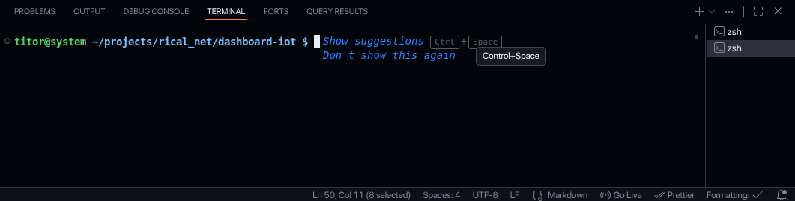
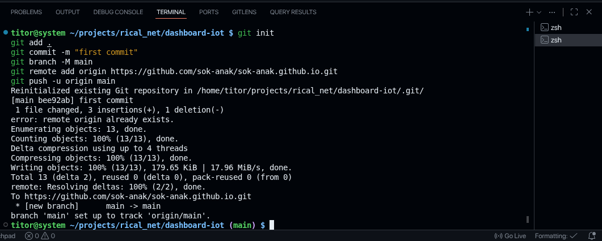
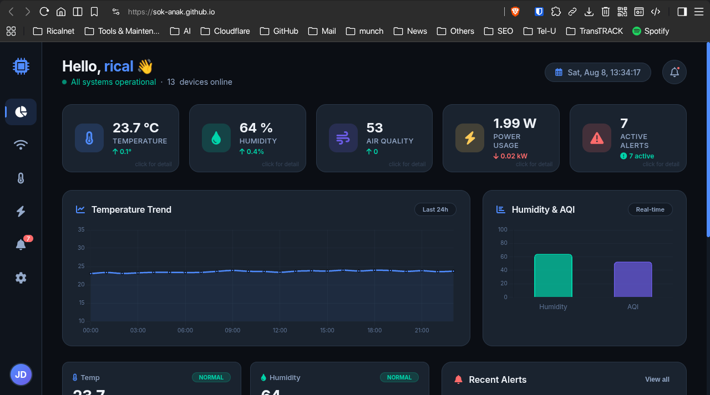

## Pendahuluan

Dalam pengembangan proyek Internet of Things (IoT), visualisasi data merupakan komponen krusial untuk memantau dan menganalisis informasi dari perangkat sensor. Namun, membangun infrastruktur backend yang kompleks seringkali menjadi penghalang bagi pemula. Solusi paling sederhana dan efektif adalah dengan membangun prototype dashboard berbasis web statis yang dihosting secara gratis menggunakan GitHub Pages.

Dashboard statis berarti antarmuka web yang hanya terdiri dari file HTML, CSS, dan JavaScript. Meskipun tidak memiliki backend sendiri, dashboard ini dapat menampilkan data secara real-time dengan terhubung ke berbagai sumber data seperti Firebase, Google Sheets, atau API pihak ketiga.

Mengapa memilih pendekatan ini?

1. GitHub Pages menyediakan hosting gratis selamanya untuk situs statis.
2. Setiap kali Anda melakukan `git push`, situs Anda akan otomatis diperbarui.
3. Dashboard dapat diakses langsung melalui URL `username.github.io`, sangat ideal untuk portofolio atau berbagi proyek.
4. Memungkinkan Anda untuk fokus pada pengembangan antarmuka pengguna dan logika visualisasi data tanpa terbebani oleh administrasi server.

Di sini Anda akan belajar tidak hanya bagaimana melakukan setiap langkah, tetapi juga mengapa langkah tersebut penting. Kita akan membangun fondasi yang kuat untuk proyek IoT Anda.

## Persiapan

Sebelum memulai, pastikan Anda telah menyiapkan beberapa alat penting. Persiapan yang matang akan memperlancar proses pengembangan.

### Prasyarat

| Prasyarat                       | Fungsi                                 | Mengapa Diperlukan                                                      |
| ------------------------------- | -------------------------------------- | ----------------------------------------------------------------------- |
| Akun GitHub                     | Platform hosting dan version control   | GitHub Pages adalah layanan dari GitHub; tanpa akun, tidak bisa hosting |
| Repository `username.github.io` | Wadah penyimpanan kode                 | Format khusus untuk user site di GitHub Pages                           |
| Git Bash                        | Antarmuka baris perintah untuk Git     | Untuk menjalankan perintah Git; wajib untuk upload kode                 |
| Editor Kode                     | Menulis dan mengedit file              | Untuk membuat file HTML, CSS, dan JavaScript                            |
| Tiga file inti                  | `index.html`, `style.css`, `script.js` | Struktur dasar setiap situs web statis                                  |

Detail Prasyarat:

1. Pastikan Anda sudah memiliki akun di [github.com](https://github.com). Ini adalah syarat mutlak karena kita akan menggunakan layanan hosting mereka.
2. Buat repository (repo) dengan format `username.github.io`. Ganti `username` dengan nama akun GitHub Anda. Ini adalah aturan baku untuk membuat situs pengguna (user site) di GitHub Pages.
3. Git Bash. Ini adalah antarmuka baris perintah (CLI) untuk berinteraksi dengan Git. Jika Anda menggunakan Windows, unduh dan instal dari [git-scm.com](https://git-scm.com/downloads). Pengguna Mac/Linux biasanya sudah memiliki terminal yang kompatibel.
4. Anda memerlukan editor kode untuk menulis file HTML, CSS, dan JS. Pilihan populer antara lain Visual Studio Code (VSCode), Sublime Text, atau Notepad++.
5. Anda akan membutuhkan tiga file utama: `index.html` (kerangka), `style.css` (tampilan), dan `script.js` (interaktivitas).

### Struktur Folder Proyek

Buat sebuah folder di komputer Anda, misalnya `dashboard-iot`. Di dalam folder ini, buat tiga file dengan struktur berikut:

```
dashboard-iot/
├── index.html  # Kerangka dan konten utama dashboard
├── script.js   # Logika interaktif, mengambil dan menampilkan data
└── style.css   # Aturan gaya untuk membuat tampilan menarik
```

Struktur ini adalah fondasi dari setiap situs web statis. `index.html` adalah pintu masuk utama, sementara `style.css` dan `script.js` bertugas mempercantik dan menghidupkan halaman.

### Membuat File Web Dasar

Anda dapat membuat dashboard sederhana dengan meminta bantuan AI: "Buatkan saya dashboard IoT dengan file HTML, CSS, dan JS untuk kebutuhan monitoring". Sesuaikan prompt dengan data yang ingin Anda tampilkan (misalnya: suhu, kelembaban, status perangkat).

Atau untuk referensi, Anda bisa melihat contoh file yang sudah tersedia di [sini](https://github.com/sok-anak/sok-anak.github.io/tree/main/dashboard-iot).

> File-file ini adalah satu-satunya yang Anda perlukan. Tidak ada bahasa pemrograman server-side (seperti PHP atau Python) yang terlibat. Semua logika berjalan di sisi klien (browser pengguna). Ini yang membuatnya "statis" dan sempurna untuk GitHub Pages.
{: .prompt-info}

---

## Panduan Deployment ke GitHub

Setelah file dashboard Anda siap, langkah selanjutnya adalah menghostingnya. Bagian ini akan memandu Anda melalui proses yang benar dan efisien.

### 1. Login dan Buat Repository di GitHub

1. Buka browser dan login ke akun GitHub Anda.
2. Klik tombol "New" atau ikon "+" di pojok kanan atas, lalu pilih "New repository".
3. Di kolom "Repository name", masukkan `username.github.io` (ganti `username` dengan nama pengguna GitHub Anda).
4. Pastikan repository diatur ke Public. Ini penting agar situs Anda dapat diakses publik.
5. Jangan centang opsi "Add a README file" atau lainnya. Kita akan menginisialisasi repository dari lokal.
6. Klik "Create repository".



> GitHub memiliki dua jenis situs Pages: **User Site** dan **Project Site**. Dengan menamai repositori `username.github.io`, Anda membuat User Site yang akan menjadi halaman utama Anda di `https://username.github.io`. Anda dapat memiliki banyak Project Site (dengan nama repo lain), tetapi hanya satu User Site per akun.
{: .prompt-info}

### 2. Hubungkan Repositori Lokal dengan GitHub

Setelah repository dibuat, GitHub akan menampilkan serangkaian perintah. Kita akan menggunakan Git Bash untuk menjalankannya.



Buka terminal di VSCode (Terminal > New Terminal) atau buka Git Bash di folder proyek Anda.



Pastikan terminal Anda sudah diatur untuk menggunakan Git Bash (pilih dari dropdown di sebelah kanan jika menggunakan VSCode).



> Pastikan di bagian kanan sudah set git bash. Pada contoh ini menggunakan zsh karena terminal Linux.
{: .prompt-info}

Salin dan jalankan perintah yang diberikan oleh GitHub satu per satu. Berikut penjelasan setiap perintah:

| Perintah                       | Fungsi                                    | Mengapa                                                                                       |
| ------------------------------ | ----------------------------------------- | --------------------------------------------------------------------------------------------- |
| `git init`                     | Menginisialisasi repositori Git lokal     | Membuat folder `.git` tersembunyi yang menyimpan seluruh riwayat versi proyek                 |
| `git add .`                    | Menambahkan semua file ke area "staging"  | Menandai file yang siap di-commit; tanda titik (.) berarti "semua file di folder ini"         |
| `git commit -m "first commit"` | Membuat snapshot permanen                 | Setiap commit adalah "checkpoint" untuk kembali ke versi sebelumnya                           |
| `git branch -M main`           | Mengganti nama cabang ke `main`           | Standar GitHub saat ini (sebelumnya `master`)                                                 |
| `git remote add origin [URL]`  | Menambahkan URL repository sebagai remote | `origin` adalah alamat tujuan untuk mengirimkan kode                                          |
| `git push -u origin main`      | Mengirimkan kode ke GitHub                | `-u` menyetel cabang lokal untuk melacak remote, sehingga `git push` saja cukup di masa depan |

```bash
git init
git add .
git commit -m "first commit"
git branch -M main
git remote add origin https://github.com/username/username.github.io.git
git push -u origin main
```

Ganti `username` dengan nama akun GitHub Anda.



### 3. Verifikasi Web

Setelah proses push selesai, tunggu sekitar 1-2 menit hingga GitHub Pages memproses dan mendeploy situs Anda. Buka browser Anda dan kunjungi URL: `https://username.github.io`.



GitHub Pages memiliki proses build dan deployment otomatis di balik layar:

1. GitHub membaca file-file di repository Anda
2. Membangun situs statis (khusus untuk situs dengan generator seperti Jekyll)
3. Mendeploy hasil build ke server publik mereka
4. Proses ini biasanya memakan waktu 1-2 menit, tergantung ukuran repository

> Secara default, GitHub Pages akan otomatis aktif untuk repository bernama `username.github.io`. Untuk repository lain, Anda perlu mengaktifkan GitHub Pages secara manual melalui Settings > Pages, pilih "Deploy from a branch", dan atur branch ke `main` dengan folder `/ (root)`.
{: .prompt-info}

## Kesimpulan

Selamat! Anda telah berhasil membuat prototype dashboard IoT dan menghostingnya secara gratis di GitHub Pages.

Apa yang telah Anda pelajari:

- Dashboard statis dengan HTML, CSS, dan JS adalah cara yang efektif dan sederhana untuk memvisualisasikan data IoT
- GitHub Pages menyediakan hosting gratis, otomatis, dan mudah digunakan untuk situs statis
- Proses deployment melibatkan inisialisasi Git, commit, dan push ke repository `username.github.io`

Langkah selanjutnya yang bisa dieksplorasi:

| Fitur Lanjutan       | Fungsi                                         |
| -------------------- | ---------------------------------------------- |
| Firebase / Supabase  | Database real-time untuk menyimpan data sensor |
| WebSocket            | Data streaming langsung dari perangkat IoT     |
| GitHub Actions       | Mengotomatiskan build dan deployment           |
| Autentikasi Pengguna | Membatasi akses dashboard                      |
| Responsive Design    | Dashboard yang nyaman di mobile                |

Ini adalah langkah pertama yang kuat dalam perjalanan Anda di dunia IoT dan pengembangan web. Selamat mencoba dan teruslah belajar!