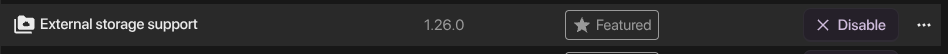
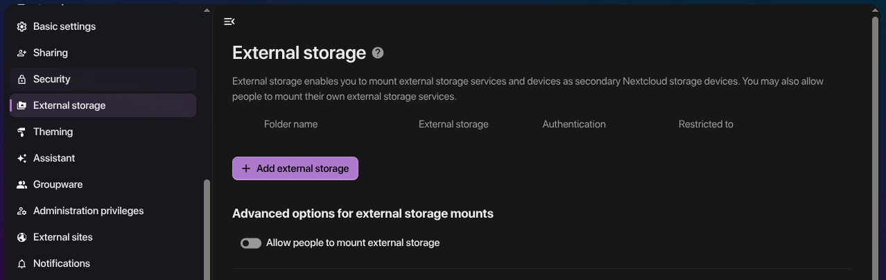
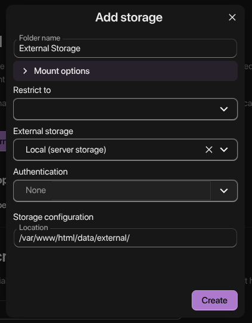

## 1. Pendahuluan dan Konsep Dasar

### Apa itu External Storage?

External storage di Nextcloud memungkinkan integrasi dengan sistem penyimpanan eksternal, memberikan fleksibilitas dalam manajemen data dan skalabilitas infrastruktur.

### Mengapa External Storage Penting?

| Alasan            | Penjelasan                                                                           |
| ----------------- | ------------------------------------------------------------------------------------ |
| Pemisahan Data    | Data terpisah dari aplikasi core—mudah backup dan restore tanpa mengganggu container |
| Skalabilitas      | Tambah kapasitas storage tanpa harus rebuild atau resize container                   |
| Performance       | Dedicated storage volume dengan filesystem yang dioptimasi untuk media tertentu      |
| Flexibilitas      | Gunakan berbagai jenis storage (NAS, NFS, SMB, local disk) sesuai kebutuhan          |
| Disaster Recovery | Backup storage terpisah dari container—recovery lebih cepat                          |

### Arsitektur External Storage

```
┌─────────────────────────────────────────────────────────────┐
│                     Host System                             │
├─────────────────────────────────────────────────────────────┤
│  ┌──────────────┐        ┌──────────────────────────────┐   │
│  │  Container   │        │   External Storage           │   │
│  │  Nextcloud   │───────▶│   /mnt/storage/nextcloud/    │   │
│  │              │  mount │   nextcloud/                 │   │
│  └──────────────┘        └──────────────────────────────┘   │
│         │                                                   │
│         ▼                                                   │
│  ┌──────────────────────────────────────────────────┐       │
│  │  Volume: nextcloud_nextcloud_data                │       │
│  │  /var/www/html/data/ (internal)                  │       │
│  │  /var/www/html/data/external/ (bind mount)       │       │
│  └──────────────────────────────────────────────────┘       │
└─────────────────────────────────────────────────────────────┘
```

## 2. Prasyarat dan Persiapan

### 2.1 Verifikasi Instalasi

Pastikan Nextcloud telah terinstal dari repository Digital Independence:

```bash
git clone https://github.com/ricalnet/digital-independence.git
cd digital-independence/nextcloud
```

### 2.2 Sistem File Host untuk Storage

Pilih lokasi storage eksternal di host system:

```bash
# Opsi 1: Local disk (direkomendasikan untuk performa)
sudo mkdir -p /mnt/storage/nextcloud

# Opsi 2: External USB drive
sudo mkdir -p /media/usb/nextcloud

# Opsi 3: Network storage (NFS/SMB) - mount terlebih dahulu
sudo mkdir -p /mnt/nfs/nextcloud
```

### 2.3 Setup Permission yang Tepat

Mengapa permission penting? File yang diakses harus memiliki permission yang sesuai agar container bisa membaca dan menulis data.

```bash
sudo chown -R 1000:1000 /mnt/storage/nextcloud
sudo chmod 755 /mnt/storage/nextcloud
sudo find /mnt/storage/nextcloud -type f -exec chmod 644 {} \;
```

Penjelasan Permission:

| Permission        | Directory | File | Penjelasan                                              |
| ----------------- | --------- | ---- | ------------------------------------------------------- |
| `755` (rwxr-xr-x) | ✅         | ❌    | Owner bisa baca/tulis/execute, group/other baca/execute |
| `644` (rw-r--r--) | ❌         | ✅    | Owner bisa baca/tulis, group/other hanya baca           |

Verifikasi Permission:

```bash
ls -la /mnt/storage/nextcloud
# Output: drwxr-xr-x 2 1000 1000 4096 Sep 22 10:00 nextcloud
```

## 3. Implementasi Teknis

### 3.1 Persiapan di Dalam Container

Masuk ke dalam container Nextcloud:

```bash
podman exec -it nextcloud_app bash
```

Buat direktori mount di dalam container:

```bash
mkdir -p /var/www/html/data/external
```

> Direktori ini akan menjadi titik mount untuk volume eksternal. Meskipun Podman akan membuat direktori otomatis saat volume dimount, pembuatan manual memastikan permission yang tepat dan struktur direktori yang konsisten.
{: .prompt-info}

Keluar dari container:

```bash
exit
```

### 3.2 Konfigurasi Environment Variables

Edit file `.env` di direktori Nextcloud:

```bash
dipen env nextcloud
```

Tambahkan atau sesuaikan konfigurasi berikut:

```bash
# ============================================
# EXTERNAL STORAGE CONFIGURATION
# ============================================

# Lokasi absolut direktori storage di host system
# Ganti dengan path yang sudah Anda buat di langkah 2.2
EXTERNAL_STORAGE_PATH=/mnt/storage/nextcloud

# Path mount di dalam container Nextcloud
EXTERNAL_STORAGE_MOUNT=/var/www/html/data/external/
```

Penjelasan Parameter:

| Parameter                | Fungsi                                   | Contoh                         |
| ------------------------ | ---------------------------------------- | ------------------------------ |
| `EXTERNAL_STORAGE_PATH`  | Path absolut di host untuk binding mount | `/mnt/storage/nextcloud`       |
| `EXTERNAL_STORAGE_MOUNT` | Target path di dalam container           | `/var/www/html/data/external/` |

### 3.4 Deploy dengan Podman

Restart stack untuk menerapkan konfigurasi volume baru:

```bash
dipen fresh nextcloud
```

Apa yang terjadi di balik layar:

1. Podman membaca ulang konfigurasi dari `.env` dan `compose.yaml`
2. Binding mount baru dibuat antara host path dan container path
3. Container direstart dengan volume tambahan
4. Direktori `/var/www/html/data/external` di container terhubung ke `/mnt/storage/nextcloud` di host

## 4. Konfigurasi di Nextcloud Web Interface

### 4.1 Aktivasi External Storage App

**Langkah 1:** Login ke Nextcloud sebagai admin

**Langkah 2:** Navigasi ke Settings → Apps

**Langkah 3:** Cari aplikasi "External storage support"



**Langkah 4:** Klik Enable atau Download and Enable untuk mengaktifkan aplikasi.

Mengapa perlu aktivasi? External Storage bukan bagian dari core Nextcloud. Ini adalah aplikasi opsional yang harus diaktifkan terlebih dahulu.

### 4.2 Konfigurasi External Storage

**Langkah 1:** Buka Settings → Administration → External Storage



**Langkah 2:** Tambahkan External Storage

Klik Add external storage atau ikon `+` untuk menambahkan konfigurasi baru:

| Field            | Value                          | Penjelasan                                 |
| ---------------- | ------------------------------ | ------------------------------------------ |
| Folder name      | `External Storage`             | Nama yang muncul di Files app user         |
| External storage | `Local`                        | Tipe storage yang digunakan (server local) |
| Location         | `/var/www/html/data/external/` | Path absolut di dalam container            |



**Langkah 3:** Klik Create untuk menyimpan konfigurasi.

### 4.3 Verifikasi di Files App

1. Buka Files → All files atau Dashboard
2. Seharusnya muncul folder baru bernama `External Storage`
   

3. Klik folder tersebut untuk melihat isinya

## 5. Manajemen Permission dan Security

### 5.1 Permission Sistem untuk External Storage

Permission yang benar adalah fondasi keamanan external storage.

```bash
podman exec -it nextcloud_app chown -R www-data:www-data /var/www/html/data/external
```

## 6. Validasi dan Testing

### 6.1 Test Upload via CLI

Buat file test dari host:

```bash
# Buat file test
echo "Hello Nextcloud External Storage" | sudo tee /mnt/storage/nextcloud/test.txt

# Verifikasi file terbuat
ls -la /mnt/storage/nextcloud/
```

Cek dari dalam container:

```bash
podman exec -it nextcloud_app ls -la /var/www/html/data/external/
```

### 6.2 Test Upload via Web Interface

1. Login sebagai user biasa (bukan admin)
2. Navigasi ke Files → External Storage
3. Upload file baru (drag & drop atau klik upload)
4. Verifikasi file muncul di host:

```bash
ls -la /mnt/storage/nextcloud/
# File yang diupload seharusnya muncul
```

### 6.3 Test Permission dan Akses

```bash
# Test akses read
podman exec -it nextcloud_app cat /var/www/html/data/external/test.txt
# Output: Hello Nextcloud External Storage

# Test akses write
podman exec -it nextcloud_app touch /var/www/html/data/external/test-write.txt

# Verifikasi di host
ls -la /mnt/storage/nextcloud/test-write.txt
# Output: -rw-r--r-- 1 1000 1000 0 ... test-write.txt
```

## 7. Enkripsi Server-Side untuk External Storage

### 7.1 Latar Belakang dan Konsep

Setelah berhasil mengkonfigurasi external storage, langkah selanjutnya yang krusial adalah memastikan keamanan data saat at-rest.

> Secara default, file yang disimpan melalui external storage tidak terenkripsi dan dapat diakses langsung dari filesystem host. Siapa pun yang memiliki akses ke direktori `/mnt/storage/nextcloud`{: .filepath} dapat membaca file secara langsung.
{: .prompt-info}

> Nextcloud menyediakan fitur Server-Side Encryption (SSE) yang mengenkripsi setiap file sebelum ditulis ke storage.
{: .prompt-tip}

Bagaimana SSE Bekerja:

```
┌──────────────┐     ┌──────────────┐     ┌──────────────┐
│  User Upload │────▶│  Nextcloud   │────▶│  Encryption  │
│  (Plaintext) │     │  Server      │     │  Engine      │
└──────────────┘     └──────────────┘     └──────┬───────┘
                                                 │
                                                 ▼
                                          ┌──────────────┐
                                          │  Encrypted   │
                                          │  File        │
                                          │  (External   │
                                          │  Storage)    │
                                          └──────────────┘
```

### 7.2 Prasyarat Aktivasi Enkripsi

| Prasyarat         | Keterangan                                                                                   |
| ----------------- | -------------------------------------------------------------------------------------------- |
| Mode Maintenance  | Nextcloud harus dalam mode pemeliharaan untuk mencegah perubahan data selama proses enkripsi |
| Backup Data       | Backup penuh direktori data dan database sebelum memulai untuk mitigasi risiko               |
| Koneksi Stabil    | Pastikan koneksi antara container dan storage tidak terputus selama proses                   |
| Kapasitas Storage | Proses enkripsi membutuhkan ruang tambahan (proses copy-on-write)                            |

### 7.3 Aktivasi Modul Enkripsi

Via Web Interface:

1. Login sebagai admin Nextcloud
2. Navigasi ke Settings → Administration → Server-side encryption
3. Centang opsi Enable server-side encryption
4. Klik Save untuk menyimpan konfigurasi

Via Command Line (Alternatif):

```bash
podman exec -it nextcloud_app php /var/www/html/occ encryption:enable
```

### 7.4 Menjalankan Proses Enkripsi

> Proses ini akan mengenkripsi SEMUA file yang sudah ada. Waktu yang dibutuhkan tergantung jumlah dan ukuran file.
{: .prompt-warning}

Masuk ke container:
```bash
podman exec -it nextcloud_app bash
```

```bash
# Aktifkan maintenance mode (mencegah perubahan data)
php occ maintenance:mode --on

# Jalankan proses enkripsi untuk semua file (termasuk external storage)
php occ encryption:encrypt-all

# Nonaktifkan maintenance mode setelah selesai
php occ maintenance:mode --off

# Keluar dari container
exit
```

Mengapa maintenance mode diperlukan? Selama enkripsi berjalan, file diubah secara massal. Maintenance mode mencegah user melakukan perubahan yang bisa menyebabkan inkonsistensi data.

### 7.5 Verifikasi Status Enkripsi

```bash
podman exec -it nextcloud_app php /var/www/html/occ encryption:status

# Output yang diharapkan:
# - enabled: true
# - defaultModule: OC_DEFAULT_MODULE
```

### 7.6 Verifikasi Enkripsi di Storage

Bandingkan file sebelum dan sesudah enkripsi:

```bash
# Sebelum enkripsi (plaintext)
sudo cat /mnt/storage/nextcloud/test.txt
# Output: Hello Nextcloud External Storage

# Setelah enkripsi (binary/encrypted)
sudo cat /mnt/storage/nextcloud/test.txt
# Output: [binary garbage] - tidak terbaca
```

## Kesimpulan

### Value Proposition

Dengan implementasi external storage, Anda mendapatkan:

| Keuntungan      | Dampak                                       |
| --------------- | -------------------------------------------- |
| Skalabilitas    | Tambah kapasitas tanpa downtime              |
| Keamanan        | Data terenkripsi, permission terisolasi      |
| Flexibilitas    | Gunakan berbagai jenis storage               |
| Maintainability | Backup dan restore lebih mudah               |
| Performance     | Dedicated storage untuk beban kerja spesifik |

## Referensi dan Sumber Daya Tambahan

- [Panduan Lengkap Instalasi Nextcloud untuk Digital Independence](https://docs.ricalnet.my.id/posts/panduan-lengkap-instalasi-nextcloud-untuk-digital-independence/)
- [GitHub Repository: Digital Independence](https://github.com/ricalnet/digital-independence)
- [Nextcloud External Storage Documentation](https://docs.nextcloud.com/server/latest/admin_manual/configuration_files/external_storage_configuration_gui.html)
- [Server-side Encryption Documentation](https://docs.nextcloud.com/server/latest/admin_manual/configuration_files/encryption_configuration.html)