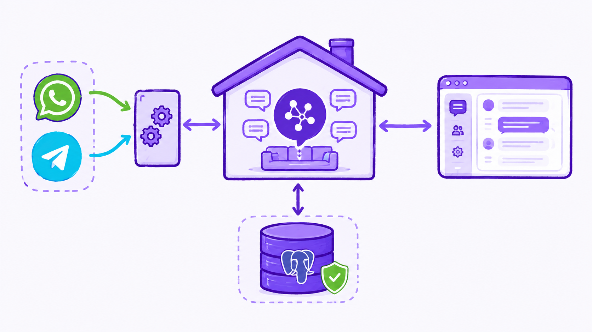
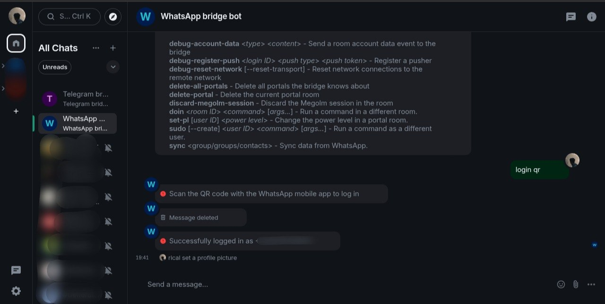
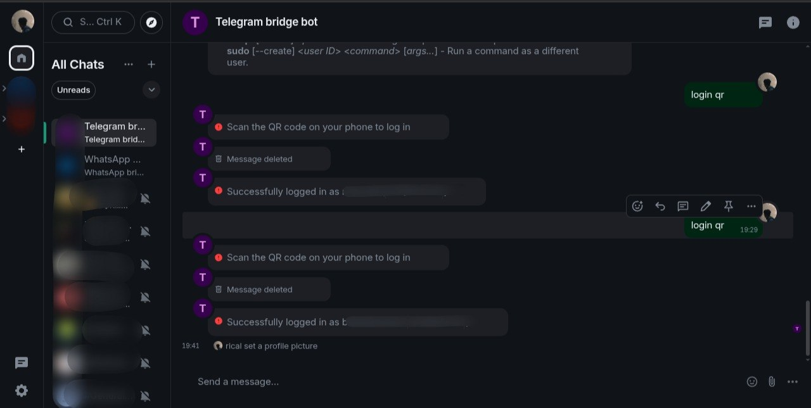

## Membangun Infrastruktur Komunikasi Terdesentralisasi dan Mengapa Ini Penting

Komunikasi kita seringkali bergantung pada platform terpusat yang mengontrol data, metadata, dan akses kita. WhatsApp, Telegram, dan platform pesan lainnya memiliki kebijakan privasi yang berubah-ubah dan akses terbatas terhadap data kita. Panduan ini membangun fondasi untuk kemandirian digital, yaitu kemampuan untuk memiliki dan mengontrol infrastruktur komunikasi Anda sendiri.

### Apa yang Akan Anda Capai?

Dengan menyelesaikan panduan ini, Anda akan memiliki:

1. Matrix Synapse Homeserver untuk server komunikasi yang sepenuhnya di bawah kendali Anda, dengan federasi ke jaringan Matrix global
2. Mautrix Bridges sebagai jembatan yang menghubungkan server Anda ke WhatsApp dan Telegram, memungkinkan Anda mengakses kedua platform dari satu antarmuka
3. Element Web untuk antarmuka pengguna yang elegan untuk mengakses semua komunikasi Anda

### Arsitektur yang Dibangun



Bayangkan Anda membangun rumah komunikasi digital:

- Synapse adalah "ruang keluarga" utama tempat semua percakapan terjadi dan data disimpan
- PostgreSQL adalah "lemari arsip" yang menyimpan semua riwayat percakapan dengan aman
- Mautrix Bridges adalah "pintu penghubung" ke lingkungan tetangga (WhatsApp dan Telegram)
- Element Web adalah "jendela" tempat Anda melihat dan berinteraksi dengan semua yang terjadi

### Untuk Siapa Panduan Ini?

Panduan ini dirancang untuk dua kelompok audiens:

Untuk Newbie (Pemula):
- Anda akan memahami konsep dasar komunikasi terdesentralisasi
- Setiap perintah dijelaskan dengan analogi dan alasan di baliknya
- Anda akan belajar tidak hanya bagaimana tetapi mengapa setiap langkah dilakukan

Untuk Profesional (SysAdmin/DevOps):
- Anda mendapatkan arsitektur production-grade dengan konfigurasi yang dapat disesuaikan
- Penjelasan teknis mendalam tentang parameter dan optimasi
- Struktur yang siap untuk ditingkatkan ke deployment produksi dengan domain dan TLS

### Prasyarat Sistem

Sebelum memulai, pastikan Anda memiliki:

| Komponen    | Minimum                 | Rekomendasi                       |
| ----------- | ----------------------- | --------------------------------- |
| CPU     | 2 core                  | 4+ core                           |
| RAM     | 4 GB                    | 8+ GB                             |
| Storage | 20 GB                   | 50+ GB SSD                        |
| OS      | Debian 11/12            | Debian 12 atau Ubuntu 22.04 LTS   |
| Network | Koneksi internet stabil | Koneksi dengan bandwidth simetris |

### Konsep Kunci yang Perlu Dipahami

**Matrix Protocol** - Protokol komunikasi open-source yang menggunakan arsitektur federated (seperti email). Setiap server (homeserver) dapat berkomunikasi dengan server lain secara terdesentralisasi.

**Application Services (Bridges)** - Aplikasi yang bertindak sebagai "penerjemah" antara protocol Matrix dan platform lain (WhatsApp, Telegram). Mereka mengubah pesan dari satu format ke format lainnya secara real-time.

**Containerization (Podman/Docker)** - Teknologi yang membungkus setiap layanan dalam lingkungan yang terisolasi (container). Ini memastikan:
- Setiap layanan berjalan konsisten terlepas dari sistem host
- Konfigurasi dan data dapat dipindahkan dengan mudah
- Layanan tidak saling mengganggu

**Persistent Volumes** - Penyimpanan data yang tetap ada meskipun container di-restart. Inilah yang menyimpan:
- Pesan dan riwayat percakapan
- Konfigurasi layanan
- Media file yang diupload

### Struktur Direktori yang Akan Dibangun

```
~/digital-independence/synapse/
├── compose.yaml
├── mautrix/
│   ├── compose.yaml
│   ├── mautrix-telegram-data/                 # Konfigurasi Telegram bridge
│   └── mautrix-whatsapp-data/                 # Konfigurasi WhatsApp bridge
├── synapse-data/                              # Data persisten Synapse
│   ├── homeserver.db
│   ├── homeserver.yaml                        # Konfigurasi utama
│   ├── matrix.ricalnet.my.id.log.config
│   ├── matrix.ricalnet.my.id.signing.key
│   ├── mautrix-telegram-registration.yaml     # File registrasi bridge
│   ├── mautrix-whatsapp-registration.yaml     # File registrasi bridge
│   └── media_store/                           # File yang diupload
```

### Pertimbangan Keamanan Sebelum Memulai

> Peringatan Penting:
> 1. Semua password dalam panduan ini (`CHANGE_ME_POSTGRES_PASSWORD`, `changeme`, dll.) HARUS diganti dengan password yang kuat
> 2. Panduan ini menggunakan `127.0.0.1` untuk pengujian lokal. Untuk produksi, gunakan domain dan aktifkan TLS
> 3. Buat backup `synapse-data/` dan `postgres-data/` secara rutin
> 4. Pastikan hanya port yang diperlukan yang terbuka (8008 untuk Synapse, 8009 untuk Element Web)
{: .prompt-warning}

### Waktu yang Dibutuhkan

- Persiapan: 10-15 menit
- Deployment Synapse: 15-20 menit
- Konfigurasi Bridges: 20-30 menit
- Element Web: 5-10 menit
- Total: ~1-2 jam (tergantung kecepatan internet dan familiaritas dengan CLI)

### Yang Perlu Disiapkan

1. Akun WhatsApp untuk login melalui QR code
2. Akun Telegram untuk login melalui QR code atau nomor telepon
3. [Token API Telegram](https://my.telegram.org/apps)

### Setelah Panduan Selesai

Anda akan memiliki:
- [x] Homeserver Matrix yang berjalan dengan database PostgreSQL
- [x] Akses admin untuk mengelola pengguna dan ruang
- [x] WhatsApp terintegrasi - semua chat WhatsApp di satu tempat
- [x] Telegram terintegrasi - semua chat Telegram di satu tempat
- [x] Antarmuka web yang indah untuk mengakses semuanya

### Prinsip yang Dianut

Panduan ini dibangun di atas tiga pilar:

1. Kemandirian Digital - Anda memiliki kendali penuh atas data dan komunikasi Anda
2. Privasi by Design - Tidak ada pihak ketiga yang dapat mengakses percakapan Anda
3. Interoperabilitas - Terhubung dengan platform lain tanpa kehilangan kendali

Setelah selesai, Anda akan memiliki platform komunikasi yang dapat dikembangkan lebih lanjut dengan menambahkan bridge untuk Signal, IRC, Discord, atau mengintegrasikan dengan sistem otomatisasi dan bot. Yang terpenting, Anda memulai perjalanan menuju kemandirian digital yang sesungguhnya.

Sekarang, mari kita mulai membangun! 🚀

## Mulai Deployment

## 1. Persiapan Awal dan Kloning Repository

Clone repository dari GitHub yang berisi konfigurasi lengkap untuk deployment.

```bash
git clone https://github.com/ricalnet/digital-independence.git ~/digital-independence
cd ~/digital-independence
./install-podman-on-debian.sh
```

Repository ini menyediakan struktur direktori yang telah diorganisir, termasuk `compose.yaml` untuk setiap layanan, file `.env.example`, dan konfigurasi default. Pendekatan ini memastikan konsistensi dan mengurangi kesalahan manual.

## 2. Deployment Matrix Synapse

### 2.1 Setup Jaringan dan Direktori

```bash
cd ~/digital-independence/synapse/
```

Bridge network diperlukan untuk komunikasi antar container dalam environment Podman.

```bash
podman network create matrix-network
```

Network `matrix-network` memungkinkan container-container berkomunikasi melalui hostname yang didefinisikan dalam compose file. Tanpa network custom, container hanya dapat berkomunikasi melalui IP dinamis yang tidak dapat diprediksi.

Setup Direktori Data:
```bash
mkdir -p synapse-data
```

Direktori `synapse-data` akan di-mount sebagai volume persisten untuk menyimpan:
- File konfigurasi `homeserver.yaml`
- Database SQLite (sebelum migrasi ke PostgreSQL)
- Media file yang diupload pengguna
- Kunci dan sertifikat

### 2.2 Generate Konfigurasi Awal

Generate konfigurasi awal Synapse dengan container sementara:

```bash
podman run -it --rm \
  -v "$(pwd)/synapse-data:/data" \
  -e SYNAPSE_SERVER_NAME=127.0.0.1 \
  -e SYNAPSE_REPORT_STATS=no \
  docker.io/matrixdotorg/synapse:latest generate
```

Penjelasan:
- `--rm`: Container dihapus setelah selesai, hanya menyisakan file di volume
- `-v "$(pwd)/synapse-data:/data"`: Mount direktori lokal ke `/data` dalam container
- `SYNAPSE_SERVER_NAME=127.0.0.1`: Server name untuk environment lokal (akan diubah nanti)

### 2.3 Startup Awal dan Konfigurasi Database

```bash
podman-compose up -d
sleep 30
```

Mengapa sleep 30 detik? Memberikan waktu bagi container PostgreSQL untuk inisialisasi dan Synapse untuk melakukan koneksi pertama.

Konfigurasi Database PostgreSQL:
```bash
sudo nano synapse-data/homeserver.yaml
```

Tambahkan atau modifikasi bagian `database` menjadi:

```yaml
database:
  name: psycopg2
  args:
    user: synapse
    password: CHANGE_ME_POSTGRES_PASSWORD
    database: synapse
    host: postgres
    port: 5432
    cp_min: 5
    cp_max: 10
```

Penjelasan Parameter Database:

| Parameter        | Fungsi                                                                          |
| ---------------- | ------------------------------------------------------------------------------- |
| `name: psycopg2` | Driver PostgreSQL untuk Python, lebih performan dibanding SQLite untuk produksi |
| `host: postgres` | Hostname container PostgreSQL dalam network `matrix-network`                    |
| `cp_min: 5`      | Minimum connection pool untuk menghindari overhead koneksi                      |
| `cp_max: 10`     | Maximum connection pool untuk mencegah overload database                        |

### 2.4 Restart Synapse dengan PostgreSQL

```bash
podman-compose down
podman-compose up -d
podman-compose logs -f
```

Setelah mengganti konfigurasi database dari SQLite ke PostgreSQL, Synapse akan secara otomatis membuat skema database yang diperlukan di PostgreSQL. Password `CHANGE_ME_POSTGRES_PASSWORD` harus sesuai dengan password yang terdefinisi di `.env` file.

Verifikasi file yang dihasilkan:
```bash
ls -la synapse-data/
```

### 2.5 Membuat Pengguna Admin

```bash
podman exec -it synapse register_new_matrix_user \
  -c /data/homeserver.yaml \
  http://localhost:8008 \
  -u admin -p changeme -a
```

Penjelasan:
- `register_new_matrix_user`: Script utilitas bawaan Synapse untuk registrasi
- `-c /data/homeserver.yaml`: Path ke file konfigurasi di dalam container
- `-a` flag: Memberikan privilege admin (hapus flag untuk user biasa)
- Kredensial: username `admin` dengan password `passwordadmin`

Buka `http://127.0.0.1:8008` untuk verifikasi homeserver berjalan.


## 3. Deployment Mautrix Bridges

### 3.1 Persiapan Environment

```bash
cd ~/digital-independence/synapse/mautrix
cp .env.example .env
nano .env
```

`.env` file berisi variabel environment yang digunakan oleh semua service Mautrix. Pastikan `POSTGRES_PASSWORD` konsisten dengan yang digunakan di Synapse.

### 3.2 Initial Bridge Configuration

```bash
podman-compose up -d
sleep 10 
podman-compose down
```

Mengapa up-down cycle? Proses ini membuat container generate konfigurasi default dan file `registration.yaml` yang diperlukan untuk registrasi bridge sebagai Application Service di Synapse.

### 3.3 Konfigurasi Bridge

WhatsApp Bridge Configuration:
```bash
nano mautrix-whatsapp-data/config.yaml
```

Parameter yang perlu disesuaikan tersedia di repositori GitHub Digital Independence: [config.mautrix-whatsapp.yaml](https://github.com/ricalnet/digital-independence/blob/main/synapse/templates/config.mautrix-whatsapp.yaml)

Telegram Bridge Configuration:
```bash
nano mautrix-telegram-data/config.yaml
```

Parameter yang perlu disesuaikan tersedia di repositori GitHub Digital Independence: [config.mautrix-telegram.yaml](https://github.com/ricalnet/digital-independence/blob/main/synapse/templates/config.mautrix-telegram.yaml)

### 3.4 Generate Registration Files

Generate file registrasi dengan menjalankan bridge:

```bash
podman-compose up -d
sleep 10
podman-compose down
```

Bridge akan mengenerate `registration.yaml` yang berisi informasi Application Service seperti:
- `id`: Identitas unik bridge
- `url`: Endpoint untuk callback
- `as_token`: Token untuk autentikasi dari bridge ke Synapse
- `hs_token`: Token untuk autentikasi dari Synapse ke bridge
- `namespaces`: Definisi room alias dan user ID yang dihandle bridge

### 3.5 Registrasi Bridge ke Synapse

```bash
sudo cp mautrix-whatsapp-data/registration.yaml ~/digital-independence/synapse/synapse-data/mautrix-whatsapp-registration.yaml

sudo cp mautrix-telegram-data/registration.yaml ~/digital-independence/synapse/synapse-data/mautrix-telegram-registration.yaml

sudo chown -R 100990:100990 ~/digital-independence/synapse/synapse-data/mautrix-whatsapp-registration.yaml

sudo chown -R 100990:100990 ~/digital-independence/synapse/synapse-data/mautrix-telegram-registration.yaml

ls -la ~/digital-independence/synapse/synapse-data/
```

UID 100990 adalah UID dari user `synapse` dalam container. Perubahan kepemilikan diperlukan agar Synapse dapat membaca file registration.

### 3.6 Integrasi ke Synapse

Tambahkan ke homeserver.yaml:
```bash
sudo nano ~/digital-independence/synapse/synapse-data/homeserver.yaml
```

Tambahkan di bagian `app_service_config_files`:

```yaml
app_service_config_files: 
  # Telegram bridge
  - /data/mautrix-telegram-registration.yaml
  # WhatsApp bridge
  - /data/mautrix-whatsapp-registration.yaml
```

Synapse akan membaca semua registration file di direktori yang ditentukan dan memuat bridge sebagai Application Service. Setiap bridge akan memiliki ruang nama sendiri untuk user dan room alias.

### 3.7 Restart Mautrix Services

```bash
podman-compose up -d
podman-compose logs -f
```

Verifikasi:
- Pastikan bridge terhubung ke Synapse
- Periksa apakah `registration.yaml` terbaca oleh Synapse

### 3.8 Pembuatan Database Terpisah

Buat database terpisah untuk setiap bridge:

```bash
podman exec -it mautrix-postgres psql -U mautrix -d mautrix
```

```sql
CREATE DATABASE mautrix_telegram;
CREATE DATABASE mautrix_whatsapp;
\q
```

Memisahkan database per bridge memberikan isolasi data yang lebih baik, memudahkan backup dan restore individual, serta mencegah tabel yang bertabrakan. Masing-masing bridge akan memiliki schema sendiri.

Restart Services:
```bash
podman-compose down
podman-compose up -d
```

## 4. Deployment Element Web

Element Web adalah client Matrix yang paling umum digunakan, menyediakan antarmuka pengguna untuk mengakses homeserver.

```bash
cd ~/digital-independence/element-web/
cp config/element-web-config-example.json config/element-web-config.json
nano config/element-web-config.json
```

Konfigurasi yang perlu disesuaikan:
- `default_server_config`: URL homeserver (biasanya `http://localhost:8008`)
- `branding`: Nama dan logo custom
- `features`: Enable/disable fitur tertentu (contoh: `feature_pinning`)

```bash
podman-compose up -d 
podman-compose logs -f
```

Buka `http://127.0.0.1:8009` di browser.


## 5. Verifikasi dan Troubleshooting

### 5.1 Cek Status Container
```bash
podman ps -a
podman network ls
```

### 5.3 Masalah Umum

| Masalah                           | Solusi                                                             |
| --------------------------------- | ------------------------------------------------------------------ |
| Bridge tidak terhubung ke Synapse | Periksa `homeserver.address` dan network connectivity              |
| Registration file tidak terbaca   | Periksa permission file (UID 100990) dan path di `homeserver.yaml` |
| Database connection error         | Verifikasi password PostgreSQL di `.env` dan konfigurasi bridge    |
| Enkripsi tidak berfungsi          | Pastikan `encryption.require: true` di bridge config               |

### 5.4 Test Bridge
1. Login ke Element Web dengan akun admin
2. Start chat `@telegrambot:matrix.yourdomain.com` dan `@whatsappbot:matrix.yourdomain.com` 
3. Kirim `help` untuk melihat perintah bridge
4. Login ke WhatsApp dengan `login qr`
   

6. Login ke Telegram dengan `login qr`
   

## Ringkasan Arsitektur

```
┌────────────────────────────────────────────────────────────┐
│                    Client (Element Web)                    │
│                    http://127.0.0.1:8009                   │
└─────────────────────────────┬──────────────────────────────┘
                              │
                              ▼
┌────────────────────────────────────────────────────────────┐
│                Matrix Synapse (Port 8008)                  │
│             http://synapse:8008 (internal)                 │
│          homeserver.yaml, PostgreSQL (synapse)             │
└─────────────┬──────────────────────┬───────────────────────┘
              │                      │
              ▼                      ▼
  ┌─────────────────────┐  ┌─────────────────────┐
  │ Mautrix-WhatsApp    │  │ Mautrix-Telegram    │
  │ (Port 29318)        │  │ (Port 29317)        │
  │ Database:           │  │ Database:           │
  │ mautrix_whatsapp    │  │ mautrix_telegram    │
  └─────────┬───────────┘  └──────────┬──────────┘
            │                         │
            ▼                         ▼
  ┌─────────────────────┐  ┌─────────────────────┐
  │   WhatsApp Network  │  │  Telegram Network   │
  │   (External API)    │  │  (MTProto API)      │
  └─────────────────────┘  └─────────────────────┘
```

Konfigurasi ini menggunakan `127.0.0.1` untuk jaringan lokal. Untuk deployment produksi, ganti dengan domain yang valid, aktifkan TLS/HTTPS (gunakan reverse proxy seperti Caddy atau Nginx), dan ubah password default dengan password yang kuat.