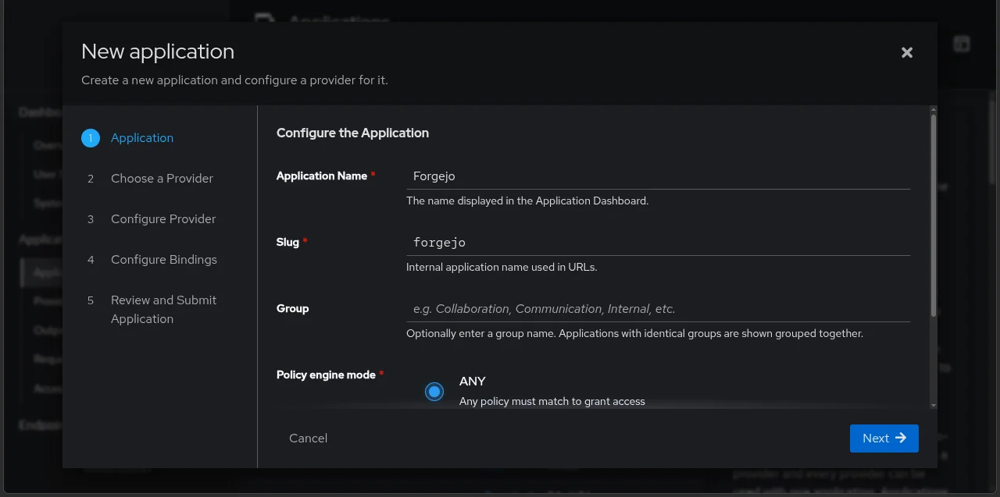

## Ringkasan Teknis

Dokumen ini menjelaskan langkah-langkah konfigurasi Single Sign-On (SSO) antara Authentik (Identity Provider/IdP) dan Forgejo (Service Provider/SP) menggunakan protokol OAuth2/OpenID Connect (OIDC).

Mengapa OIDC? OIDC adalah lapisan autentikasi di atas OAuth2 yang menyediakan verifikasi identitas terstandarisasi melalui ID Token (JWT). Dibanding SAML, OIDC lebih ringan, berbasis JSON, dan native untuk aplikasi modern.

Alur autentikasi:
1. User mengakses Forgejo → diarahkan ke Authentik
2. Authentik memverifikasi kredensial → mengirim Authorization Code
3. Forgejo menukar code dengan Access Token + ID Token
4. Forgejo memvalidasi token → membuat sesi lokal

## Prasyarat

| Komponen         | Nilai Contoh               |
| ---------------- | -------------------------- |
| Domain Authentik | `authentik.domain.com`     |
| Domain Forgejo   | `forgejo.domain.com`       |
| Protokol         | HTTPS (wajib untuk OAuth2) |

## Bagian 1: Konfigurasi Provider di Authentik

Authentik berperan sebagai IdP — pihak yang memverifikasi identitas user.

### Langkah 1.1 — Buat Application

Navigasi: Applications → Applications → New Application



Isi konfigurasi:

| Field              | Nilai     | Alasan Teknis                                                 |
| ------------------ | --------- | ------------------------------------------------------------- |
| Application name   | `Forgejo` | Label human-readable untuk identifikasi                       |
| Slug               | `forgejo` | Identifier URL-safe; dipakai di endpoint OIDC                 |
| Policy engine mode | `ANY`     | User lolos jika memenuhi *salah satu* policy yang dilampirkan |

> Slug menjadi bagian dari discovery URL: `/application/o/<slug>/.well-known/openid-configuration`. Forgejo akan fetch metadata OIDC dari sini.
{: .prompt-info}

### Langkah 1.2 — Pilih Provider Type

Pilih: OAuth2/OpenID Provider


> OAuth2/OIDC Provider menghasilkan Client ID/Secret untuk aplikasi eksternal. Proxy Provider digunakan untuk aplikasi tanpa dukungan OAuth native.
{: .prompt-info}

### Langkah 1.3 — Konfigurasi OAuth2 Provider


| Field              | Nilai                                                       | Penjelasan                                                                     |
| ------------------ | ----------------------------------------------------------- | ------------------------------------------------------------------------------ |
| Provider name      | `Provider for Forgejo`                                      | Nama internal provider                                                         |
| Authorization Flow | `default-provider-authorization-implicit-consent`           | User tidak perlu klik "Authorize" setiap login (implicit consent)              |
| Client type        | `Confidential`                                              | Wajib karena Forgejo berjalan di server dan mampu menyimpan secret dengan aman |
| Client ID / Secret | Auto-generated                                              | Kredensial untuk autentikasi Forgejo ke Authentik                              |
| Redirect URI       | `https://forgejo.domain.com/user/oauth2/authentik/callback` | Endpoint callback Forgejo; harus exact match                                   |
| Redirect URI type  | `Strict Authorization`                                      | Hanya izinkan redirect ke URI terdaftar (mencegah open redirect attack)        |

> Mengapa Confidential, bukan Public? Client Public (SPA/mobile) tidak bisa menyimpan secret. Forgejo adalah aplikasi server-side, sehingga bisa menjaga kerahasiaan Client Secret.
{: .prompt-info}

> Mengapa Redirect URI harus exact match? Untuk mencegah Authorization Code Interception Attack — penyerang mengarahkan callback ke domain mereka sendiri.
{: .prompt-info}

Klik Create Application.

> Catat Client ID dan Client Secret — akan dipakai di Bagian 2.
{: .prompt-tip}

## Bagian 2: Konfigurasi Authentication Source di Forgejo

Forgejo berperan sebagai SP/Relying Party — pihak yang mempercayai identitas dari IdP.

### Langkah 2.1 — Tambah Authentication Source

Navigasi: Site Administration → Identity & Access → Authentication Sources → Add Authentication Source


| Field               | Nilai                                                                                 | Penjelasan Teknis                                                                  |
| ------------------- | ------------------------------------------------------------------------------------- | ---------------------------------------------------------------------------------- |
| Authentication type | `OAuth2`                                                                              | Protokol yang digunakan                                                            |
| Authentication name | `authentik`                                                                           | Label internal; harus cocok dengan path callback `/user/oauth2/authentik/callback` |
| OAuth2 Provider     | `OpenID Connect`                                                                      | Mengaktifkan validasi ID Token + discovery                                         |
| Client ID           | (dari Authentik)                                                                      | Identitas aplikasi                                                                 |
| Client Secret       | (dari Authentik)                                                                      | Kunci autentikasi                                                                  |
| Auto Discovery URL  | `https://authentik.domain.com/application/o/forgejo/.well-known/openid-configuration` | Endpoint metadata OIDC                                                             |
| Additional Scopes   | `email profile`                                                                       | Meminta claim email dan profile dari ID Token                                      |

> Mengapa pakai Auto Discovery? Forgejo otomatis fetch endpoint authorization, token, JWKS, dan userinfo dari satu URL. Mengurangi kesalahan konfigurasi manual.
{: .prompt-info}

> Mengapa scope `email profile`? Tanpa scope ini, ID Token tidak berisi klaim `email` dan `name` — Forgejo gagal membuat/mencocokkan akun lokal.
{: .prompt-info}

Klik Add Authentication Source.

## Bagian 3: Verifikasi

1. Logout dari Forgejo.
2. Halaman login akan menampilkan tombol authentik.
   

## Ringkasan Arsitektur

```
[User] → [Forgejo SP] → (redirect) → [Authentik IdP]
                ↑                          │
                └──── Authorization Code ──┘
                └──── ID Token (JWT) ──────┘
```

Authentik memegang otoritas identitas; Forgejo hanya mengonsumsi token dan memetakan klaim ke user lokal. Pemisahan ini memungkinkan centralized access control, MFA, dan audit terpusat tanpa mengubah Forgejo.